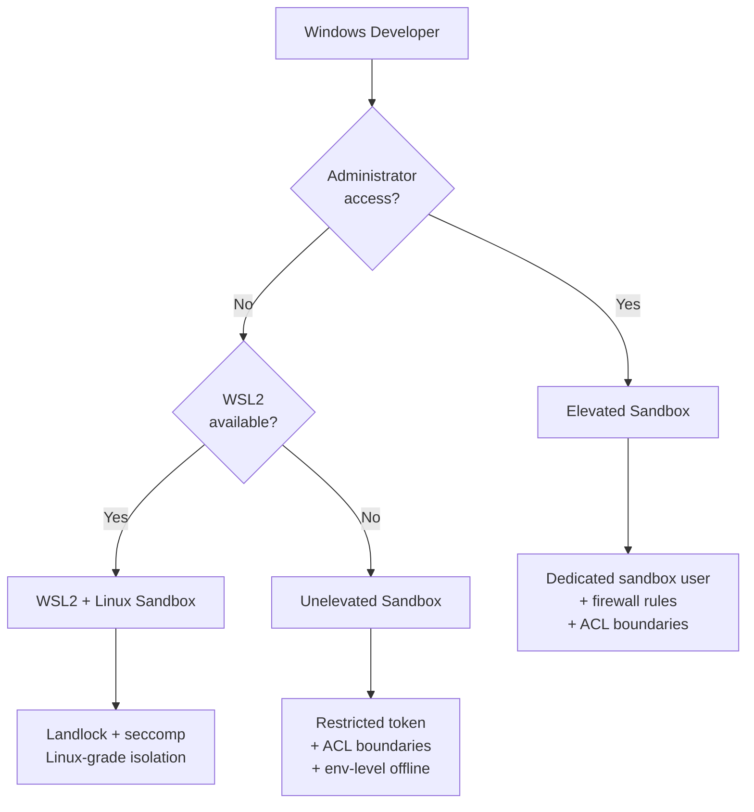
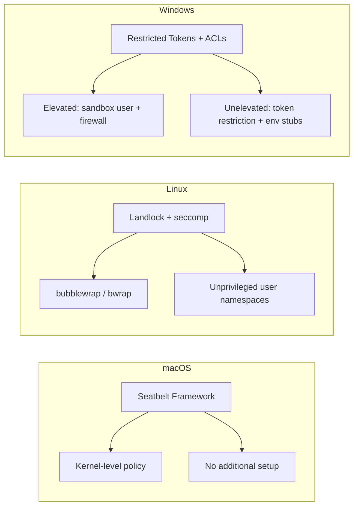

# Codex CLI on Windows: Native Sandbox, WSL Integration, and the Elevated Security Model


---

Windows developers have long been second-class citizens in the agentic coding tool ecosystem. Most tools shipped with macOS and Linux support first, bolting on Windows compatibility months later — often with significant caveats. Codex CLI's Windows story has matured rapidly in early 2026, arriving with a native sandbox architecture, Microsoft Store distribution, and three distinct installation paths that each target different security profiles. This article dissects the Windows sandbox model, compares it with the Linux/macOS equivalents, and provides practical guidance for choosing the right approach.

## The Three Paths to Codex on Windows

Codex CLI on Windows offers three fundamentally different execution environments[^1]:

1. **Native PowerShell with elevated sandbox** — the strongest Windows-native isolation
2. **Native PowerShell with unelevated sandbox** — a fallback for restricted corporate environments
3. **WSL2** — Linux-grade Landlock/seccomp isolation running inside Windows



### Installation

For npm-based installation (requires Node.js 22+)[^2]:

```bash
npm i -g @openai/codex
codex
```

Alternatively, download the pre-built Rust binary from [GitHub Releases](https://github.com/openai/codex/releases)[^3] — a zero-dependency option that avoids the Node.js requirement entirely. The Codex App is also available from the [Microsoft Store](https://apps.microsoft.com/detail/9plm9xgg6vks)[^4].

**Platform requirements**: Windows 11 is the recommended baseline. Recent Windows 10 builds (October 2018 update or later) receive best-effort support. Older Windows 10 versions are not recommended[^1].

## The Elevated Sandbox: How It Works

The elevated sandbox is the preferred native Windows mode. It implements defence in depth through four layers[^1][^5]:

1. **Dedicated sandbox user** — a lower-privilege Windows account (`CodexSandboxUsers` group) that runs agent commands, preventing lateral movement from the agent process to the developer's session
2. **Filesystem ACLs** — permission boundaries restricting write access to the project working directory
3. **Windows Firewall rules** — blocking outbound network access from the sandbox user unless explicitly approved
4. **Local policy changes** — granting the sandbox user only the minimum logon rights needed for command execution

```toml
# config.toml — enable the elevated sandbox
[windows]
sandbox = "elevated"
```

The elevated mode requires administrator-approved setup on first run. Codex provisions the sandbox user, configures firewall rules, and grants write ACEs to the working directory[^6]. Once provisioned, subsequent sessions reuse the existing configuration.

### Private Desktop Isolation

Both sandbox modes default to running on a private Windows desktop for UI isolation — preventing the agent from interacting with the developer's desktop windows[^1]:

```toml
# Disable only if you need legacy Winsta0\Default behaviour
[windows]
sandbox_private_desktop = false
```

## The Unelevated Sandbox: Corporate Fallback

When IT policy blocks administrator access or local user creation, the unelevated sandbox provides a workable alternative[^1]:

```toml
[windows]
sandbox = "unelevated"
```

This mode runs commands with a restricted Windows token derived from the current user rather than a separate account. It still applies ACL-based filesystem boundaries, but trades the dedicated sandbox-user firewall rules for environment-level offline controls — overriding proxy-related environment variables and inserting stub executables for common network tools[^5].

| Capability | Elevated | Unelevated |
|---|---|---|
| Dedicated sandbox user | ✅ | ❌ |
| Filesystem ACL boundaries | ✅ | ✅ |
| Firewall-based network blocking | ✅ | ❌ (env-level stubs) |
| Private desktop isolation | ✅ (default) | ✅ (default) |
| Administrator required | ✅ | ❌ |
| Enterprise policy compatible | Varies | ✅ |

**Key limitation**: neither mode can prevent file writes to directories where the `Everyone` SID already has write permissions[^6]. If your project lives in a broadly permissioned directory, the sandbox boundary is weaker. Codex will warn you about this during setup.

## WSL2: The Production-Grade Alternative

WSL2 remains the recommended approach for teams who need production-grade isolation[^1][^5]. It provides the same Landlock/seccomp sandbox as native Linux — matching the environment where Codex models were primarily trained.

### Setup

```powershell
# Elevated PowerShell
wsl --install
```

Then inside the WSL distribution:

```bash
curl -o- https://raw.githubusercontent.com/nvm-sh/nvm/master/install.sh | bash
source ~/.bashrc
nvm install 22
npm i -g @openai/codex
codex
```

### Performance Guidance

File I/O performance differs dramatically between the Linux filesystem and the Windows mount[^7]:

```bash
# ✅ Fast — native Linux filesystem
~/code/myproject

# ❌ Slow — cross-filesystem mount
/mnt/c/Users/daniel/code/myproject
```

Keep repositories inside the Linux filesystem (`~/code/`) for acceptable I/O performance and clean path semantics. The `/mnt/c/` bridge is functional but introduces latency that compounds during agentic sessions where Codex reads and writes hundreds of files.

### Authentication in WSL

Codex authentication works seamlessly in WSL. Running `codex` interactively prompts a browser-based sign-in that opens the default Windows browser automatically[^1]. For API key authentication:

```bash
export CODEX_API_KEY="sk-..."
```

## The Codex App: GUI Alternative

The Codex App (available from the Microsoft Store[^4]) provides a windowed interface supporting parallel agent threads, an integrated review pane, and configurable terminal selection:

- PowerShell (default)
- Command Prompt
- Git Bash
- WSL

For WSL project access, the app can work with projects via `\\wsl$\` paths, though some limitations remain[^8]. The recommended pattern for mixed Windows/WSL workflows is to store projects on the Windows filesystem and access them via `/mnt/<drive>/...` from within WSL[^4].

### VS Code Integration

The VS Code extension supports WSL execution natively[^4]:

```json
{
  "chatgpt.runCodexInWindowsSubsystemForLinux": true
}
```

For shared configuration between the app and WSL:

```bash
# In WSL — point to the Windows Codex home
export CODEX_HOME=/mnt/c/Users/<windows-user>/.codex
```

## Sandbox Comparison Across Platforms

The Windows sandbox architecture differs fundamentally from the macOS and Linux implementations[^9]:



| Platform | Mechanism | Network Blocking | Setup Required |
|---|---|---|---|
| macOS | Seatbelt (kernel) | ✅ Built-in | None |
| Linux | Landlock + seccomp | ✅ Kernel-level | `bubblewrap` package |
| Windows (elevated) | ACLs + firewall + sandbox user | ✅ Firewall rules | Administrator approval |
| Windows (unelevated) | ACLs + env stubs | ⚠️ Environment-level only | None |
| WSL2 | Landlock + seccomp (via Linux) | ✅ Kernel-level | WSL2 + `bubblewrap` |

The macOS Seatbelt framework provides the smoothest experience — zero-configuration, kernel-enforced isolation[^9]. Linux's Landlock/seccomp combination offers equivalent strength with a one-time `bubblewrap` install. The Windows elevated sandbox is architecturally solid but requires more setup and carries the `Everyone` SID caveat.

## Troubleshooting Common Issues

### Error 1385: Logon Rights Denied

```
CreateProcessAsUserW failed: 5
```

This occurs when Windows denies the logon type the sandbox user needs[^10]. Check group policy settings or fall back to `unelevated` mode:

```toml
[windows]
sandbox = "unelevated"
```

### Missing C++ Build Tools

The VS Code extension may become unresponsive without C++ build tools[^1]:

```powershell
winget install --id Microsoft.VisualStudio.2022.BuildTools -e
```

### PowerShell Execution Policy

Scripts blocked by default policy:

```powershell
Set-ExecutionPolicy -ExecutionPolicy RemoteSigned
```

### Diagnostic Collection

For bug reports, include `CODEX_HOME/.sandbox/sandbox.log` along with your Windows version and sandbox mode. **Never share** `CODEX_HOME/.sandbox-secrets/`[^1].

## Choosing Your Path: A Decision Framework

For most Windows developers, the decision reduces to two questions:

1. **Do you already work in WSL?** If yes, use WSL2 — you get Linux-grade isolation with no compromises.
2. **Can you get administrator access?** If yes, use the elevated sandbox for the strongest native Windows isolation. If no, use the unelevated sandbox as a pragmatic fallback.

⚠️ Windows support remains labelled as experimental by OpenAI as of March 2026. The core sandbox architecture is implemented, but OpenAI continues hardening and testing before removing the experimental label[^6].

For enterprise teams deploying Codex across Windows fleets, the elevated sandbox combined with group policy configuration provides a defensible security posture. Teams running mixed macOS/Linux/Windows environments should standardise on WSL2 for Windows machines to ensure consistent sandbox behaviour across the estate.

## Citations

[^1]: [Windows — Codex CLI | OpenAI Developers](https://developers.openai.com/codex/windows)

[^2]: [CLI — Codex | OpenAI Developers](https://developers.openai.com/codex/cli)

[^3]: [Releases — openai/codex | GitHub](https://github.com/openai/codex/releases)

[^4]: [Windows — Codex App | OpenAI Developers](https://developers.openai.com/codex/app/windows)

[^5]: [OpenAI Codex Arrives on Windows with Native Sandbox and Agentic Workflows | Windows Forum](https://windowsforum.com/threads/openai-codex-arrives-on-windows-with-native-sandbox-and-agentic-workflows.404026/)

[^6]: [Help test experimental Windows sandbox — openai/codex Discussion #6065 | GitHub](https://github.com/openai/codex/discussions/6065)

[^7]: [How to Run OpenAI Codex in Windows with WSL | Apidog](https://apidog.com/blog/codex-on-windows-wsl/)

[^8]: [Better WSL compatibility in Codex App for Windows — Issue #14468 | GitHub](https://github.com/openai/codex/issues/14468)

[^9]: [Sandboxing — Codex | OpenAI Developers](https://developers.openai.com/codex/concepts/sandboxing)

[^10]: [elevated_windows_sandbox causing all agent commands to fail — Issue #10090 | GitHub](https://github.com/openai/codex/issues/10090)
