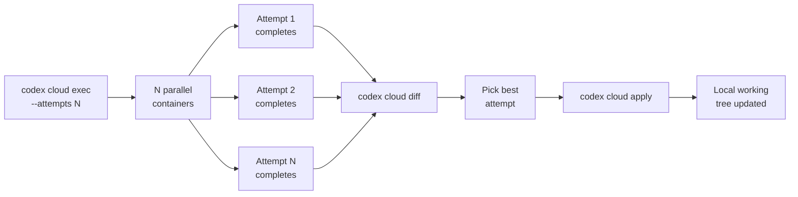
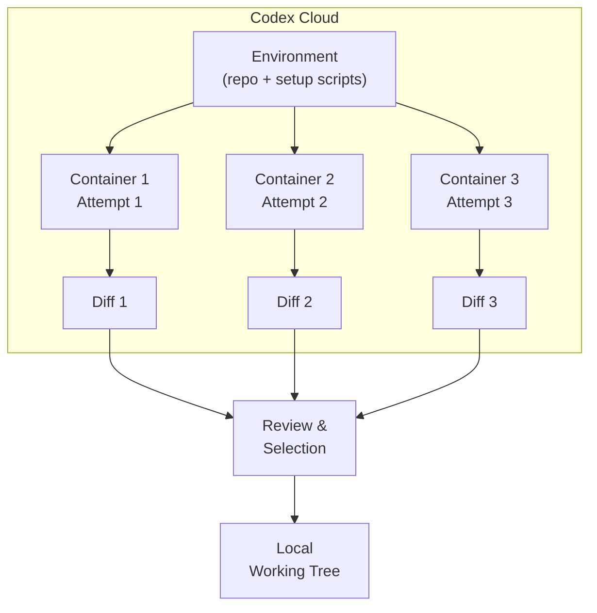

# Codex Cloud Exec Best-of-N: Running Multiple Solution Attempts and Picking the Winner


---

One of the quieter but most impactful features in Codex CLI's cloud offering is the `--attempts` flag on `codex cloud exec`. First shipped in the June 2025 batch of cloud upgrades[^1], it lets you ask Codex Cloud to run two, three, or four independent solution attempts for a single prompt — then pick the best result. Think of it as best-of-N sampling applied to entire agentic coding sessions, not just token generation.

This article covers the mechanics, the CLI workflow, the architecture behind parallel attempts, and practical patterns for integrating best-of-N into your development and CI/CD pipelines.

## Why Best-of-N Matters for Agentic Coding

LLM-driven code generation is inherently stochastic. The same prompt can produce a clean, idiomatic refactor on one run and an over-engineered mess on the next. In interactive sessions you can steer the agent; in cloud exec — where you fire and forget — you cannot. Best-of-N addresses this directly: run the task multiple times in parallel, then select the attempt that best fits your criteria[^2].

The approach is well-established in ML inference (rejection sampling, best-of-N RLHF reward scoring)[^3], but Codex Cloud applies it at the *session* level. Each attempt gets its own containerised environment, its own agent loop, and its own independent chain of tool calls. The results are genuinely independent, not just resampled final tokens.

## The `--attempts` Flag

The syntax is straightforward[^4]:

```bash
codex cloud exec --env ENV_ID --attempts 3 "Refactor the auth middleware to use JWTs"
```

| Flag | Range | Default | Description |
|------|-------|---------|-------------|
| `--attempts` | 1–4 | 1 | Number of independent solution attempts |
| `--env` | string | — | Target Codex Cloud environment identifier (required) |

Each attempt runs in an isolated container based on your environment configuration — Ubuntu 24.04 by default, with support for Python, Node.js, Rust, Go, Java, and a dozen other runtimes[^5]. Your setup scripts execute independently in each container, so all attempts start from the same clean baseline.

The task metadata returned by `codex cloud list --json` includes an `attempt_total` field alongside the familiar `id`, `status`, `url`, and `summary` fields[^4].

## The Review Workflow

After the attempts complete, you compare results using Codex Cloud's diff and review commands:



### Step 1 — Check Status

```bash
codex cloud list --env $ENV_ID --limit 5
```

Or for scripting:

```bash
codex cloud list --env $ENV_ID --json | jq '.tasks[] | {id, status, attempt_total, summary}'
```

### Step 2 — Preview Each Diff

```bash
codex cloud diff <TASK_ID>
```

This previews the patch generated by a specific attempt before you apply anything locally[^6]. For multi-attempt tasks, each attempt produces its own diff. You can review them in the web dashboard or via the CLI.

### Step 3 — Apply the Winner

Once you have identified the best attempt:

```bash
codex cloud apply <TASK_ID>
```

There is also a top-level shortcut:

```bash
codex apply <TASK_ID>
```

This applies the selected diff to your local working tree[^6], letting you run your own test suite, linters, and integration checks before committing.

## Architecture: Parallel Containerised Execution

Each attempt spins up an independent container in Codex Cloud's infrastructure. The key architectural properties are:

- **Isolation**: Attempts share no state. Each gets a fresh clone of your repository at the environment's configured ref, with setup scripts run independently[^5].
- **Concurrency**: Codex Cloud supports concurrent agent threads — currently up to six per environment[^7] — so multiple attempts can run in parallel rather than sequentially.
- **Deterministic baseline**: All attempts start from the same commit and environment configuration, making the diffs genuinely comparable.
- **Independent agent loops**: Each attempt runs its own full agent loop — reading files, executing shell commands, calling tools — so the approaches can diverge significantly[^2].



## Practical Patterns

### Pattern 1: Exploratory Refactoring

When you are unsure which approach is best for a non-trivial refactor, use `--attempts 3` and let the agent explore different decompositions:

```bash
codex cloud exec --env $ENV_ID --attempts 3 \
  "Refactor the payment processing module to separate Stripe and PayPal into strategy classes. Ensure all existing tests pass."
```

Each attempt may choose different class hierarchies, different levels of abstraction, or different approaches to backwards compatibility. Review all three diffs, pick the cleanest one, apply it, and run your local test suite.

### Pattern 2: CI Gate with Automated Selection

For CI/CD pipelines, you can script attempt selection based on objective criteria:

```bash
#!/usr/bin/env bash
set -euo pipefail

TASK_ID=$(codex cloud exec --env "$ENV_ID" --attempts 4 \
  "Fix the failing integration tests in tests/integration/" \
  --json | jq -r '.id')

# Wait for completion
while true; do
  STATUS=$(codex cloud status "$TASK_ID" --json | jq -r '.status')
  [ "$STATUS" = "completed" ] && break
  sleep 30
done

# Apply and test each attempt, keep the one that passes
codex cloud apply "$TASK_ID"
if make test-integration; then
  echo "Attempt passed integration tests"
  git add -A && git commit -m "fix: integration tests (cloud exec best-of-N)"
else
  echo "No passing attempt found"
  exit 1
fi
```

### Pattern 3: Morning Batch with Best-of-N

Zack Proser's workflow of queuing 3–5 Codex tasks before morning coffee[^2] becomes more powerful with `--attempts`. For each task, request two attempts. By the time you are reviewing PRs, you have a choice of approaches for each:

```bash
# Queue morning batch
for task in "Update CHANGELOG for v3.2" "Add rate limiting to /api/users" "Migrate user table to new schema"; do
  codex cloud exec --env "$ENV_ID" --attempts 2 "$task" &
done
wait
echo "All tasks submitted — review after coffee"
```

### Pattern 4: Plan Locally, Execute with Attempts in Cloud

The official Codex workflow documentation recommends a local-then-cloud pattern[^8]: design and negotiate the plan interactively in your IDE, then delegate execution to the cloud. Adding `--attempts` to this pattern gives you insurance against poor execution of a good plan:

1. Open Codex locally in plan mode (`/plan` or `Shift+Tab`)
2. Negotiate the implementation approach until satisfied
3. Click the cloud icon or use `codex cloud exec` with the refined prompt
4. Add `--attempts 2` so you get a backup if the first execution stumbles

## Cost Considerations

Each attempt consumes its own compute and token budget. With `--attempts 4`, you are paying roughly four times the cloud cost of a single attempt. ⚠️ OpenAI has not published granular per-attempt pricing at the time of writing — costs are bundled into your Codex Cloud credit consumption, which varies by model (GPT-5.4 is recommended for most tasks)[^9] and task duration.

The trade-off is straightforward: for low-stakes tasks, a single attempt suffices. For high-value refactors or reliability-critical CI gates, the cost of two or three extra attempts is trivial compared to the developer time saved reviewing and manually fixing a poor first attempt.

## Comparison with Other Approaches

| Feature | Codex Cloud Best-of-N | Claude Code | Cursor |
|---------|----------------------|-------------|--------|
| Parallel independent attempts | `--attempts 1-4` | Not available | Not available |
| Cloud-delegated execution | Yes — fire and forget | No (local only) | No (local only) |
| Diff preview before apply | `codex cloud diff` | N/A | N/A |
| Scriptable selection | JSON output + `jq` | N/A | N/A |
| Isolation level | Per-container | N/A | N/A |

⚠️ This comparison reflects the state as of April 2026. Other tools may add similar capabilities.

## Limitations and Known Issues

- **Maximum four attempts**: The `--attempts` flag caps at 4[^4]. For tasks where you want more diversity, you would need to submit multiple separate tasks.
- **No automatic ranking**: Codex Cloud does not currently score or rank attempts for you — selection is manual (or scripted by you). The preview system in the Codex web dashboard surfaces all attempts side by side, but there is no built-in "pick the best" heuristic[^2].
- **Environment warmup**: Each attempt runs setup scripts independently, which can add latency for environments with heavy dependency installation. ⚠️ It is unclear whether Codex Cloud caches environment layers across attempts within the same task.
- **Model selection**: You cannot currently choose which model handles your cloud task — Codex picks internally based on task complexity[^2]. The recommended model is GPT-5.4[^9].

## Conclusion

Best-of-N via `codex cloud exec --attempts` is one of those features that quietly changes how you think about delegating work to an AI agent. It shifts the model from "hope the agent gets it right" to "let the agent explore and I will curate." For senior developers already comfortable reviewing diffs, the workflow is natural: submit, compare, pick, apply. Combined with `codex cloud diff` and `codex cloud apply`, it integrates cleanly into existing development and CI/CD workflows without requiring changes to your local tooling.

The cap of four attempts keeps costs bounded, while the parallel containerised execution ensures you get genuinely independent approaches rather than minor variations. If you are using Codex Cloud for anything beyond trivial tasks, `--attempts 2` should probably be your default.

## Citations

[^1]: OpenAI, "Introducing upgrades to Codex" (June 2025), [openai.com/index/introducing-upgrades-to-codex](https://openai.com/index/introducing-upgrades-to-codex/)
[^2]: Zack Proser, "OpenAI Codex Review 2026 — Updated from Daily Use", [zackproser.com/blog/openai-codex-review-2026](https://zackproser.com/blog/openai-codex-review-2026)
[^3]: Nakano et al., "WebGPT: Browser-assisted question-answering with human feedback" (2022), demonstrating best-of-N sampling for reward model selection
[^4]: OpenAI, "Command line options – Codex CLI", [developers.openai.com/codex/cli/reference](https://developers.openai.com/codex/cli/reference)
[^5]: OpenAI, "CLI – Codex", [developers.openai.com/codex/cli](https://developers.openai.com/codex/cli)
[^6]: Blake Crosley, "Codex CLI: The Definitive Technical Reference", [blakecrosley.com/guides/codex](https://blakecrosley.com/guides/codex); Toolsbase, "Codex CLI Cheat Sheet 2026", [toolsbase.dev/en/reference/codex-commands](https://toolsbase.dev/en/reference/codex-commands)
[^7]: OpenAI, "Features – Codex CLI", [developers.openai.com/codex/cli/features](https://developers.openai.com/codex/cli/features)
[^8]: OpenAI, "Workflows – Codex", [developers.openai.com/codex/workflows](https://developers.openai.com/codex/workflows)
[^9]: OpenAI, "Models – Codex", [developers.openai.com/codex/models](https://developers.openai.com/codex/models)
