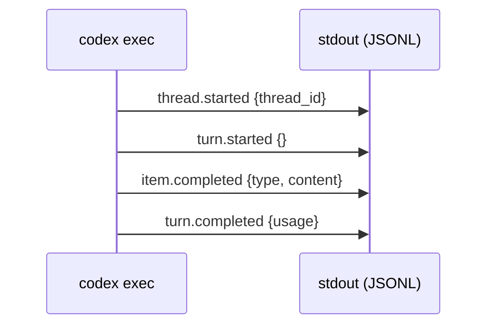

# Codex CLI as a Unix Pipeline Citizen: stdin, JSONL Streams, and Structured Output


---

Most coverage of Codex CLI focuses on the interactive TUI — the conversational loop where you type a prompt and watch the agent work. But `codex exec` turns the CLI into something far more composable: a Unix-native tool that reads from stdin, writes structured output to stdout, and slots into shell pipelines alongside `jq`, `grep`, and `xargs`. This article covers the full surface area of `codex exec` as a pipeline citizen, from basic piping through JSONL event streams to schema-constrained structured output.

## The exec Execution Model

When you run `codex exec`, the agent completes its task and exits — no interactive loop, no TUI chrome. The output contract is simple [^1]:

- **stderr**: progress indicators and diagnostic messages
- **stdout**: the final agent message (plain text by default, JSONL with `--json`)

This separation follows the Unix convention where progress/logging goes to stderr and usable output goes to stdout, making piping safe by default.

```bash
# Final message only — progress hidden
codex exec "list all TODO comments in src/" 2>/dev/null

# Progress visible, output captured
codex exec "summarise recent commits" 2>/dev/tty > summary.md
```

## Reading from stdin

### The `-` Prompt Argument

The `PROMPT` positional argument accepts `-` to read from stdin [^2]. This was a community feature request (issue #1123) that shipped as the prompt-plus-stdin workflow in March 2026 (PR #15525) [^3].

```bash
# Pipe a file as context
cat README.md | codex exec -

# Pipe command output
git log --oneline -20 | codex exec -

# Heredoc for multi-line prompts
codex exec - <<'EOF'
Review the following diff for security issues.
Focus on SQL injection and path traversal.
EOF
```

### Prompt-Plus-Stdin: Separate Prompt and Piped Context

The key innovation of PR #15525 is that you can now provide *both* a prompt argument and piped stdin [^3]. The prompt becomes the instruction; stdin becomes the context:

```bash
# Prompt as argument, diff as stdin context
git diff HEAD~3 | codex exec "Review these changes for breaking API changes" -

# Pipe test output, prompt explains what to do with it
npm test 2>&1 | codex exec "Analyse these test failures and suggest fixes" -

# Pipe a schema, ask for validation
cat api-schema.json | codex exec "Find backwards-incompatible changes vs the previous version" -
```

This pattern is powerful because it separates *what you want done* (the prompt) from *what you want it done to* (the stdin data), mirroring how tools like `sed` and `awk` work.

### Input Methods Comparison

All of these produce identical results [^4]:

| Method | Example |
|--------|---------|
| Direct argument | `codex exec "prompt"` |
| Stdin with `-` | `echo "prompt" \| codex exec -` |
| Heredoc | `codex exec - <<'EOF' ... EOF` |
| File redirection | `codex exec - < prompt.txt` |

## JSONL Event Streams

### Enabling JSON Output

The `--json` flag (also `--experimental-json`) switches stdout from plain text to a newline-delimited JSON event stream [^1]:

```bash
codex exec --json "count lines of code by language" 2>/dev/null | jq .
```

### Event Lifecycle

A typical exec session emits four sequential events [^4]:



1. **`thread.started`** — includes `thread_id` for session resumption
2. **`turn.started`** — marks the beginning of agent work
3. **`item.completed`** — one per output item (agent message, reasoning trace, command execution, file change, MCP tool call, web search result, plan update) [^1]
4. **`turn.completed`** — includes `usage` object with token counts

### Extracting Data with jq

```bash
# Extract just the final message text
codex exec --json "summarise this repo" 2>/dev/null \
  | jq -r 'select(.type == "item.completed") | .content'

# Get token usage
codex exec --json "refactor auth module" 2>/dev/null \
  | jq 'select(.type == "turn.completed") | .usage'

# Extract thread ID for later resumption
THREAD_ID=$(codex exec --json "start migration" 2>/dev/null \
  | jq -r 'select(.type == "thread.started") | .thread_id')
```

### Combining --json and -o

Both flags work simultaneously [^4]: `--json` streams JSONL events to stdout while `-o` writes the final plain-text message to a file. This lets you capture structured events for programmatic processing while also saving a human-readable summary:

```bash
codex exec --json -o summary.md "generate release notes" 2>/dev/null \
  | jq 'select(.type == "turn.completed") | .usage' > token-usage.json
```

## Structured Output with --output-schema

### The Schema Contract

The `--output-schema` flag accepts a path to a JSON Schema file [^2]. Codex constrains its final response to match the schema, making the output machine-parseable:

```json
{
  "$schema": "https://json-schema.org/draft/2020-12/schema",
  "type": "object",
  "properties": {
    "risk_level": {
      "type": "string",
      "enum": ["low", "medium", "high", "critical"]
    },
    "findings": {
      "type": "array",
      "items": {
        "type": "object",
        "properties": {
          "file": { "type": "string" },
          "line": { "type": "integer" },
          "description": { "type": "string" },
          "severity": { "type": "string" }
        },
        "required": ["file", "line", "description", "severity"],
        "additionalProperties": false
      }
    },
    "summary": { "type": "string" }
  },
  "required": ["risk_level", "findings", "summary"],
  "additionalProperties": false
}
```

### Schema Requirements

Two constraints are non-negotiable [^4]:

1. **`additionalProperties: false`** must be set on all object types
2. **All properties must appear in the `required` array**

Schema violations produce clear API error messages rather than silently malformed output. This strictness is inherited from the Responses API structured output specification [^5].

### Practical Examples

```bash
# Security audit with structured findings
codex exec --full-auto \
  --output-schema ./security-schema.json \
  -o ./security-report.json \
  "Audit src/ for common security vulnerabilities"

# Extract project metadata for a dashboard
codex exec --ephemeral \
  --output-schema ./metadata-schema.json \
  -o ./project-metadata.json \
  "Extract project metadata: name, version, dependencies count, test coverage"

# PR review bot output
git diff origin/main...HEAD | codex exec \
  --output-schema ./review-schema.json \
  -o ./review.json \
  "Review these changes. Rate risk, list concerns, suggest improvements." -
```

### Schema Independence from --json

`--output-schema` and `--json` are independent features [^4]. You can use either, both, or neither:

| Flags | stdout | -o file |
|-------|--------|---------|
| Neither | Plain text message | Plain text message |
| `--json` only | JSONL event stream | Plain text message |
| `--output-schema` only | Schema-conformant JSON | Schema-conformant JSON |
| Both | JSONL events (final item is schema-conformant) | Schema-conformant JSON |

## Pipeline Composition Patterns

### Pattern 1: Code Review Pipeline

```bash
#!/usr/bin/env bash
# Review all changed files, output structured JSON, post as PR comment

git diff origin/main...HEAD | codex exec \
  --full-auto --ephemeral \
  --output-schema ./review-schema.json \
  -o /tmp/review.json \
  "Review these changes for correctness, security, and style" - \
  2>/dev/null

# Post to GitHub if there are findings
RISK=$(jq -r '.risk_level' /tmp/review.json)
if [ "$RISK" != "low" ]; then
  jq -r '.findings[] | "- **\(.severity)** `\(.file):\(.line)` — \(.description)"' \
    /tmp/review.json | gh pr comment --body-file -
fi
```

### Pattern 2: Batch File Processing

```bash
# Process each Python file through Codex for docstring generation
find src/ -name "*.py" | while read -r file; do
  cat "$file" | codex exec --ephemeral \
    "Add Google-style docstrings to all public functions. Return the complete file." - \
    2>/dev/null > "/tmp/$(basename "$file")"
  cp "/tmp/$(basename "$file")" "$file"
done
```

### Pattern 3: Multi-Stage Pipeline with Session Resumption

```bash
# Stage 1: Analyse
THREAD_ID=$(codex exec --json --full-auto \
  "Analyse the test suite and identify flaky tests" 2>/dev/null \
  | jq -r 'select(.type == "thread.started") | .thread_id')

# Stage 2: Fix (resuming context from stage 1)
codex exec resume "$THREAD_ID" --full-auto \
  "Now fix the top 3 flakiest tests you identified" 2>/dev/null
```

The resumed session preserves the original model, reasoning effort, and sandbox mode [^4]. Input tokens accumulate across resumed turns as conversation history persists.

### Pattern 4: Fan-Out with xargs

```bash
# Review multiple PRs in parallel
gh pr list --json number -q '.[].number' \
  | xargs -P4 -I{} bash -c '
    gh pr diff {} | codex exec --ephemeral \
      --output-schema review-schema.json \
      -o "reviews/pr-{}.json" \
      "Review this PR diff" - 2>/dev/null
  '
```

## Configuration for Automation

### Essential Flags

| Flag | Purpose | When to Use |
|------|---------|-------------|
| `--ephemeral` | Skip session persistence | CI jobs, one-off scripts |
| `--full-auto` | `workspace-write` sandbox + no approvals | Trusted pipelines |
| `--skip-git-repo-check` | Run outside Git repos | Document generation, standalone scripts |
| `--yolo` | `danger-full-access` + bypass approvals | Isolated containers only |
| `-C <path>` | Set workspace root | Multi-repo scripts |

### Inline Configuration with -c

The `-c key=value` flag overrides config.toml settings per-invocation without modifying files [^4]:

```bash
# Use a specific model with high reasoning
codex exec -c model=gpt-5.4 -c model_reasoning_effort=high \
  "Design the database schema for user authentication"

# Enable live web search
codex exec -c web_search=live "What CVEs were published this week for Node.js?"

# Disable the shell tool for read-only analysis
codex exec -c features.shell_tool=false "Review src/ for code smells"
```

### Authentication in CI

Set `CODEX_API_KEY` as a secret environment variable [^1]. Note that `OPENAI_API_KEY` is intentionally deprioritised — Codex uses its own key variable [^4]. For ChatGPT account authentication in CI, seed `~/.codex/auth.json` from secure storage; Codex refreshes the token in place [^1].

Use `CODEX_HOME` to redirect all configuration and session storage away from `~/.codex` when running in containers [^4]:

```bash
export CODEX_HOME=/tmp/codex-ci
export CODEX_API_KEY="$SECRET_API_KEY"
codex exec --ephemeral --full-auto "run the migration"
```

### Feature Flag Impact on Tokens

Enabling `multi_agent` via `-c features.multi_agent=true` increases system prompt tokens by approximately 1,984 (a 24% overhead), while disabling `shell_tool` reduces them by approximately 440 [^4]. In high-volume automation, these token costs compound — disable features you don't need.

## Ordering Gotchas

Several argument-ordering issues have bitten pipeline authors [^4]:

1. **Image attachment**: `codex exec "prompt" -i image.png` works; `-i image.png "prompt"` fails
2. **Global flags before subcommand**: `-a on-request` must precede `exec`, not follow it
3. **Approval downgrade**: exec mode always downgrades approval policy to `never` regardless of flags — there's no interactive prompt to answer

⚠️ The approval downgrade means `--full-auto` is functionally the only meaningful exec approval mode. Setting `-a on-request` is silently ignored.

## Comparison with Claude Code

Claude Code's non-interactive mode (`claude -p "prompt"`) follows a similar stdin/stdout contract but lacks several Codex exec features [^6]:

| Feature | `codex exec` | `claude -p` |
|---------|-------------|-------------|
| Stdin piping | `codex exec - < file` | `cat file \| claude -p "prompt"` |
| JSONL event stream | `--json` | `--output-format stream-json` |
| Schema-constrained output | `--output-schema` | Not available |
| Session resumption | `resume --last` | `--continue` / `--resume` |
| Structured output | JSON Schema enforcement | Best-effort JSON |

The schema enforcement gap is significant for CI/CD — downstream tools need deterministic structure, not best-effort JSON that might occasionally emit prose instead [^7].

## Citations

[^1]: [OpenAI Developer Docs — Non-interactive mode](https://developers.openai.com/codex/noninteractive)
[^2]: [OpenAI Developer Docs — CLI Reference](https://developers.openai.com/codex/cli/reference)
[^3]: [OpenAI Codex Changelog — prompt-plus-stdin, PR #15525](https://developers.openai.com/codex/changelog)
[^4]: [Alex Fazio — Codex exec mode experiments: 81 flag/feature tests](https://gist.github.com/alexfazio/359c17d84cb6a5af12bac88fa1db9770)
[^5]: [OpenAI Developer Docs — Structured model outputs](https://developers.openai.com/api/docs/guides/structured-outputs)
[^6]: [NxCode — Claude Code vs Codex CLI 2026](https://www.nxcode.io/resources/news/claude-code-vs-codex-cli-terminal-coding-comparison-2026)
[^7]: [GitHub Issue #10456 — OpenCode schema-constrained structured outputs feature request](https://github.com/anomalyco/opencode/issues/10456)
