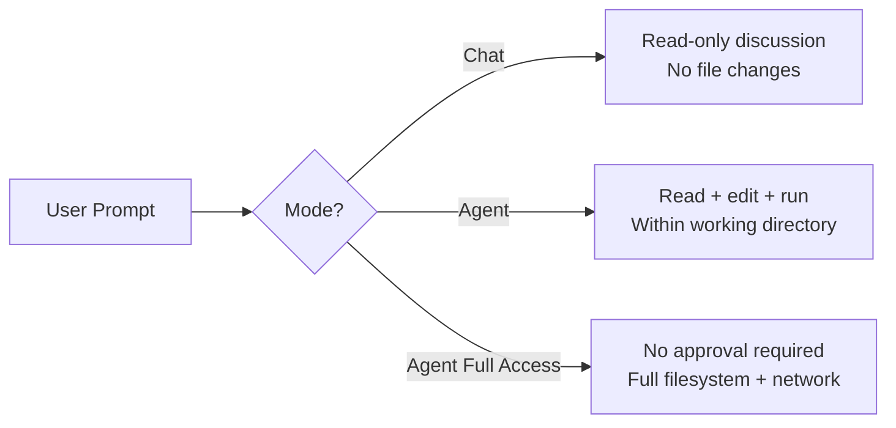
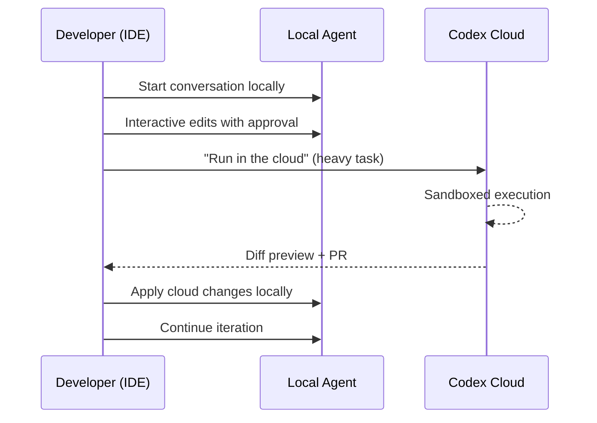

# The Codex IDE Extension: VS Code, JetBrains, and the Hybrid Cloud-Local Workflow


---

## The Extension Landscape

OpenAI ships Codex across four surfaces: the CLI, the standalone macOS app, Codex Cloud on the web, and the IDE extension. Of these, the IDE extension is the one most developers encounter first — and it is also the least documented in technical depth. This article covers the VS Code extension, the JetBrains integration, and the hybrid cloud-local workflow that makes the extension more than just a chat sidebar.

## Installation and Compatibility

### VS Code and Forks

The Codex extension is available from the Visual Studio Marketplace under the publisher `openai` [^1]. It works with VS Code itself and with forks including Cursor and Windsurf. Platform support covers macOS and Linux natively; Windows is experimental, and OpenAI recommends running Codex in a WSL workspace for the best Windows experience [^1].

```bash
# Install via the VS Code CLI
code --install-extension openai.chatgpt
```

After installation, Codex appears in the right sidebar. If it does not, restart the editor. The extension prompts for authentication via either a ChatGPT account or an OpenAI API key. ChatGPT Plus, Pro, Business, Edu, and Enterprise plans all include Codex usage credits [^2].

### JetBrains Integration

Since January 2026, Codex is natively integrated into JetBrains IDEs — IntelliJ IDEA, PyCharm, WebStorm, Rider, and others — starting with version 2025.3 [^3]. Three authentication methods are supported: a JetBrains AI subscription, a ChatGPT account, or an OpenAI API key [^4].

The JetBrains integration embeds Codex within the existing JetBrains AI chat interface rather than shipping as a standalone sidebar. This means it shares the UI with other JetBrains AI providers, which trades some Codex-specific UX for consistency with the JetBrains ecosystem.

⚠️ The JetBrains integration was initially powered by GPT-5.2-Codex [^4]. Confirm your model selection is current — GPT-5.4 is now the recommended default [^5].

## The Three Agent Modes

The extension's most important UX decision is the mode switcher beneath the chat input [^6]:



### Chat Mode

Pure conversation. Codex can read files for context but makes no changes. Use this for planning, architecture discussion, or understanding unfamiliar code before committing to edits.

### Agent Mode (Default)

Codex can read files, make edits, and execute commands within the working directory. Tool calls require approval by default — the extension shows a diff preview before applying changes. This maps to `approval_policy = "on-failure"` in `config.toml` [^7].

### Agent (Full Access)

Equivalent to `--full-auto` or `approval_policy = "never"` in the CLI. Codex runs without stopping for approval, with full filesystem and network access. The official documentation explicitly warns to exercise caution [^6].

## Configuration: Shared with the CLI

The IDE extension and CLI share the same `~/.codex/config.toml` file [^7]. This is a critical architectural decision — any model, sandbox, or approval configuration you set for the CLI applies identically in the IDE, and vice versa.

```toml
# ~/.codex/config.toml — shared between CLI and IDE extension
model = "gpt-5.4"
approval_policy = "on-failure"
sandbox_mode = "workspace-write"

[profiles.deep]
model = "gpt-5.3-codex"
model_reasoning_effort = "high"

[profiles.fast]
model = "gpt-5.3-codex-spark"
model_reasoning_effort = "medium"
```

⚠️ One limitation: profiles (`--profile`) are not currently supported in the IDE extension [^7]. You must switch models manually via the model selector or change the top-level `model` key in `config.toml`. This is a known gap — the CLI's profile system is still marked experimental.

### Extension-Specific Settings

The IDE extension exposes a small set of VS Code-specific settings beyond `config.toml` [^8]:

| Setting | Purpose |
|---|---|
| `chat.fontSize` | Controls text size in the Codex sidebar |
| `chat.editor.fontSize` | Controls code/diff font size in conversations |
| `chatgpt.commentCodeLensEnabled` | Enables CodeLens indicators above TODO comments |
| `chatgpt.openOnStartup` | Focus the Codex sidebar on editor launch |
| `chatgpt.runCodexInWindowsSubsystemForLinux` | Route execution through WSL on Windows |
| `chatgpt.localeOverride` | Override UI language (auto-detects if empty) |
| `chatgpt.cliExecutable` | Custom CLI binary path (development use only) |

The `chatgpt.cliExecutable` setting exists for contributors actively developing the Codex CLI. Changing it in production may cause instability [^8].

## Commands and Keyboard Shortcuts

The extension registers six commands with VS Code [^9]:

| Command | Default Shortcut | Action |
|---|---|---|
| `chatgpt.newChat` | `Cmd+N` / `Ctrl+N` | Create a new thread |
| `chatgpt.addToThread` | — | Add selected text as context |
| `chatgpt.addFileToThread` | — | Add entire file as context |
| `chatgpt.implementTodo` | — | Address a selected TODO comment |
| `chatgpt.newCodexPanel` | — | Open an additional Codex panel |
| `chatgpt.openSidebar` | — | Open the Codex sidebar |

Customise shortcuts via `Preferences: Open Keyboard Shortcuts` (⌘⇧P → search for the command ID). The `chatgpt.addToThread` command is particularly useful when bound to a shortcut — select a code region, trigger the binding, and the selection becomes context for your next prompt without needing to type `@filename`.

### File References

Tag files directly in prompts using `@filename.tsx` syntax [^6]. The extension resolves these against your workspace, providing the model with full file contents as context. This is more reliable than hoping the agent will find the right file — explicit references reduce hallucination risk.

## Cloud Delegation: The Hybrid Workflow

The IDE extension's most distinctive capability is seamless delegation between local and cloud execution [^1][^10].



### How It Works

1. **Start locally** — chat, explore, make small edits with agent mode
2. **Delegate to cloud** — click "Run in the cloud" for longer tasks. Choose whether the cloud environment runs from `main` (new ideas) or from your local changes (continuing work) [^6]
3. **Cloud executes in isolation** — sandboxed containers, parallel execution, full network access
4. **Review and apply** — preview the cloud diff in the IDE, ask follow-up questions, then apply locally

Context is preserved across the local-to-cloud handoff [^6]. When you continue locally after a cloud task, Codex remembers the full conversation history.

### When to Delegate to Cloud

Cloud delegation is worth the context switch when:

- The task will take more than a few minutes of agent time
- You need full network access (npm install, API calls, database migrations)
- You want parallel execution across multiple tasks
- The local sandbox restrictions would block the work

For quick edits, file exploration, and interactive pair-programming, local execution is faster and more responsive.

## Web Search

The extension ships with integrated web search, enabled by default for local tasks [^6]. Two modes are available:

```toml
# ~/.codex/config.toml
web_search = "cached"  # Default — uses OpenAI's pre-indexed cache
# web_search = "live"  # Fetches live results (requires full-access sandbox)
```

The cached mode returns results from an OpenAI-maintained index rather than fetching live pages [^6]. This is faster and works within sandboxed sessions, but results may be hours or days behind. Live mode requires `Agent (Full Access)` or the equivalent `sandbox_mode` in `config.toml`.

## Image Support

Drag and drop images into the prompt composer while holding `Shift` [^6]. VS Code normally intercepts drag events for its own file handling — the Shift modifier overrides this to pass the image to the Codex extension. This supports screenshots, design mockups, and error screenshots as context for prompts.

## The TODO CodeLens Feature

When `chatgpt.commentCodeLensEnabled` is active, the extension adds CodeLens indicators above TODO comments in your code [^8]. Clicking the indicator triggers `chatgpt.implementTodo`, which sends the TODO and its surrounding context to Codex for implementation.

This creates a lightweight task-driven workflow: scatter TODOs as specifications, then let Codex resolve them one at a time with full file context.

## VS Code as Multi-Agent Hub

Since February 2026, VS Code supports running multiple agentic extensions simultaneously [^11]. You can have Codex, Claude Code, and GitHub Copilot all active in the same editor, choosing between them per task. VS Code's third-party agent API treats each extension as a separate agent with its own context and approval flow [^12].

This multi-agent setup creates an interesting billing split: GitHub-hosted agents (Copilot) bill through your Copilot subscription, while provider extensions (Codex, Claude Code) bill through their respective subscriptions [^12].

### Marketplace Competition

As of early 2026, Claude Code leads Codex in VS Code Marketplace adoption — 5.2 million installs versus 4.9 million, with a higher average rating (4.0 vs 3.4 out of 5) [^13]. The competitive pressure has driven both teams to ship faster: Codex's JetBrains integration, cloud delegation, and Spark model support all arrived in rapid succession.

## Practical Configuration for Teams

A production team configuration combining the IDE extension with shared standards:

```toml
# .codex/config.toml (project-scoped)
model = "gpt-5.4"
approval_policy = "on-failure"
sandbox_mode = "workspace-write"
web_search = "cached"

[agents]
max_threads = 4
max_depth = 1
```

Combined with a well-structured `AGENTS.md` in the repository root, this gives every team member — whether they use the CLI, IDE extension, or cloud — the same agent behaviour with the same guardrails.

## Limitations

Several CLI features do not yet work in the IDE extension:

- **Profiles** — `--profile` flag is CLI-only; the IDE uses the top-level config only [^7]
- **Hooks** — the experimental hooks engine fires in CLI sessions but not IDE sessions
- **Realtime/voice** — the `[realtime]` audio pair-programming feature is CLI-only
- **Mid-turn steering** — the CLI's Enter-to-inject and Tab-to-queue features have no IDE equivalent
- **`codex exec`** — non-interactive pipeline mode is a CLI concept; the IDE is inherently interactive

These gaps reflect the different interaction models: the CLI is a terminal-native tool with rich keyboard shortcuts, while the IDE extension integrates into VS Code's panel-based UI.

---

## Citations

[^1]: OpenAI Developers, "IDE extension – Codex", 2026 — <https://developers.openai.com/codex/ide>

[^2]: OpenAI Help Center, "Using Codex with your ChatGPT plan", 2026 — <https://help.openai.com/en/articles/11369540-using-codex-with-your-chatgpt-plan>

[^3]: JetBrains AI Blog, "Codex Is Now Integrated Into JetBrains IDEs", January 2026 — <https://blog.jetbrains.com/ai/2026/01/codex-in-jetbrains-ides/>

[^4]: Neowin, "OpenAI's Codex extension is now available for JetBrains IDEs", January 2026 — <https://www.neowin.net/news/openais-codex-extension-is-now-available-for-jetbrains-ides/>

[^5]: OpenAI Developers, "Models – Codex", 2026 — <https://developers.openai.com/codex/models>

[^6]: OpenAI Developers, "Features – Codex IDE", 2026 — <https://developers.openai.com/codex/ide/features>

[^7]: OpenAI Developers, "Configuration Reference – Codex", 2026 — <https://developers.openai.com/codex/config-reference>

[^8]: OpenAI Developers, "Settings – Codex IDE", 2026 — <https://developers.openai.com/codex/ide/settings>

[^9]: OpenAI Developers, "Commands – Codex IDE", 2026 — <https://developers.openai.com/codex/ide/commands>

[^10]: LaoZhang AI Blog, "Claude Code vs Codex in 2026: Steer Live or Delegate Async?", 2026 — <https://blog.laozhang.ai/en/posts/claude-code-vs-codex>

[^11]: Visual Studio Code Blog, "Your Home for Multi-Agent Development", February 2026 — <https://code.visualstudio.com/blogs/2026/02/05/multi-agent-development>

[^12]: Visual Studio Code Docs, "Third-party agents in Visual Studio Code", 2026 — <https://code.visualstudio.com/docs/copilot/agents/third-party-agents>

[^13]: Visual Studio Magazine, "Claude Code Edges OpenAI's Codex in VS Code's Agentic AI Marketplace Leaderboard", February 2026 — <https://visualstudiomagazine.com/articles/2026/02/26/claude-code-edges-openais-codex-in-vs-codes-agentic-ai-marketplace-leaderboard.aspx>
