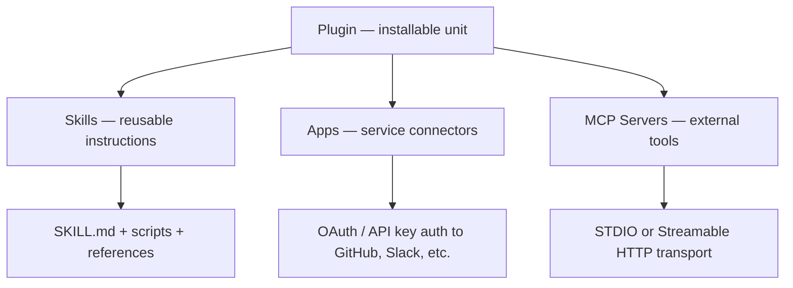
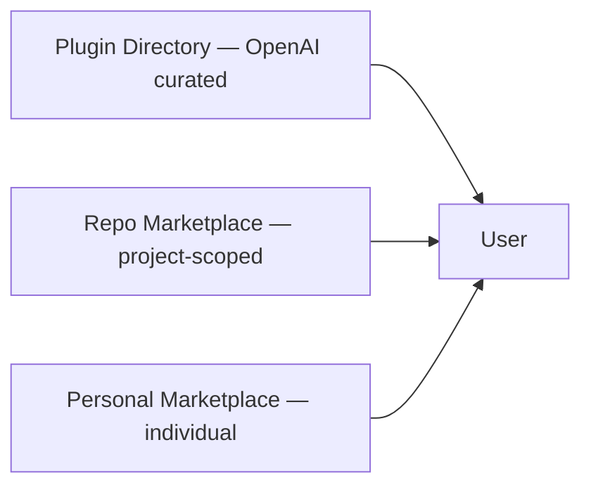

# Codex Plugins: Skills, MCP Servers, and Building Distributable Agent Workflows

**Date:** 2026-04-01
**Tags:** `plugins`, `skills`, `mcp`, `plugin-json`, `marketplace`, `authoring`, `distribution`, `config-toml`

---

On 26 March 2026, OpenAI launched the Codex plugin system with over 20 integrations — including Figma, Notion, Slack, Gmail, Sentry, and Linear — available across the Codex app, CLI, and VS Code extension[^1]. Plugins solve a problem that skills alone could not: **distributable, versioned agent workflows** that bundle instructions, service connectors, and tool servers into a single installable unit.

This article dissects the plugin architecture, walks through skill and plugin authoring from scratch, and covers the MCP wiring that connects plugins to external systems.

---

## The Three-Layer Architecture

A Codex plugin is a packaging shell around three capability layers[^2]:



| Layer | Purpose | Example |
|-------|---------|---------|
| **Skills** | Reusable step-by-step instructions Codex follows for specific tasks | A `deploy-preview` skill that runs lint, builds a container, and pushes to staging |
| **Apps** | Authenticated connectors to third-party services | Reading Slack threads, creating Linear issues, browsing Google Drive |
| **MCP Servers** | Model Context Protocol endpoints providing tools or shared context | A Figma MCP server exposing design tokens, a Sentry server exposing error traces |

The key distinction: **skills are the authoring format; plugins are the distribution format**[^3]. You design a workflow as a skill, then wrap it in a plugin when you want others to install it.

---

## Skills: The Authoring Primitive

### Directory Structure

A skill is a directory with a required `SKILL.md` and optional supporting files[^4]:

```
my-skill/
├── SKILL.md           # Required — instructions + YAML front matter
├── scripts/           # Optional — executable helpers
│   └── validate.sh
├── references/        # Optional — documentation Codex can consult
│   └── api-spec.yaml
├── assets/            # Optional — templates, fixtures
│   └── template.hbs
└── agents/
    └── openai.yaml    # Optional — appearance + MCP dependencies
```

### SKILL.md Format

The front matter requires `name` and `description`. The body contains imperative instructions:

```markdown
---
name: deploy-preview
description: >
  Build and deploy a preview environment for the current branch.
  Trigger when the user asks to deploy, preview, or stage changes.
---

## Steps

1. Run `scripts/validate.sh` to check prerequisites.
2. Build the container image using the project's Dockerfile.
3. Push to the preview registry at `$PREVIEW_REGISTRY`.
4. Output the preview URL.

## Constraints

- Never deploy to production.
- Always run validation before building.
```

The `description` field is critical — Codex uses it for **implicit invocation**, matching incoming tasks against skill descriptions to decide which skill to load[^4].

### Progressive Disclosure

Codex uses a two-phase loading strategy to manage context efficiently[^4]:

1. **Metadata phase** — Codex reads only `name`, `description`, file path, and optional `agents/openai.yaml` for all discovered skills.
2. **Full load phase** — When Codex decides a skill matches the current task, it loads the complete `SKILL.md` instructions.

This means a repository with fifty skills does not consume fifty skills' worth of context tokens — only the metadata is loaded until a skill is actually needed.

### Discovery Locations

Codex scans these paths in priority order[^4]:

```
$CWD/.agents/skills          # Current directory
$CWD/../.agents/skills       # Parent directory
$REPO_ROOT/.agents/skills    # Repository root
$HOME/.agents/skills         # User home
/etc/codex/skills            # System admin
Built-in skills              # OpenAI bundled
```

### Invocation

Two modes[^4]:

- **Explicit** — Type `$skill-name` in the prompt, or use `/skills` in the TUI to browse.
- **Implicit** — Codex matches the task description against skill `description` fields and selects automatically.

### Optional Metadata: `agents/openai.yaml`

For richer integration, add appearance and dependency metadata:

```yaml
interface:
  display_name: "Deploy Preview"
  short_description: "Build and deploy preview environments"
  icon_small: "./assets/icon.svg"
  brand_color: "#3B82F6"
  default_prompt: "Deploy a preview of the current branch"

policy:
  allow_implicit_invocation: true

dependencies:
  tools:
    - type: "mcp"
      value: "container-registry"
```

The `dependencies.tools` block tells Codex which MCP servers the skill needs — Codex can install and wire them automatically when the skill is invoked[^5].

---

## From Skill to Plugin: The `plugin.json` Manifest

### Directory Structure

A plugin wraps skills and configuration into a distributable package[^6]:

```
my-plugin/
├── .codex-plugin/
│   └── plugin.json      # Required — manifest
├── skills/
│   └── deploy-preview/
│       └── SKILL.md
├── .app.json            # Optional — app connectors
├── .mcp.json            # Optional — MCP server config
└── assets/
    ├── icon.png
    └── screenshot.png
```

### Minimal Manifest

```json
{
  "name": "deploy-preview-plugin",
  "version": "1.0.0",
  "description": "Preview deployment workflow with container registry integration",
  "skills": "./skills/"
}
```

### Full Manifest

```json
{
  "name": "deploy-preview-plugin",
  "version": "1.0.0",
  "description": "Preview deployment workflow with container registry integration",
  "author": {
    "name": "Platform Team",
    "email": "platform@example.com",
    "url": "https://example.com"
  },
  "homepage": "https://example.com/plugins/deploy-preview",
  "repository": "https://github.com/example/deploy-preview-plugin",
  "license": "MIT",
  "keywords": ["deployment", "preview", "containers"],
  "skills": "./skills/",
  "mcpServers": "./.mcp.json",
  "apps": "./.app.json",
  "interface": {
    "displayName": "Deploy Preview",
    "shortDescription": "Build and deploy preview environments",
    "longDescription": "Automates preview deployments with container builds and registry push.",
    "developerName": "Platform Team",
    "category": "DevOps",
    "capabilities": ["Read", "Write"],
    "defaultPrompt": [
      "Deploy a preview of the current branch",
      "Build and stage my latest changes"
    ],
    "brandColor": "#10A37F",
    "composerIcon": "./assets/icon.png",
    "logo": "./assets/icon.png",
    "screenshots": ["./assets/screenshot.png"]
  }
}
```

All paths must be relative to the plugin root and prefixed with `./`[^6].

### Scaffolding with `$plugin-creator`

Rather than writing the manifest by hand, use the built-in scaffolding skill[^6]:

```
$plugin-creator
```

This generates the `.codex-plugin/plugin.json` manifest and can also create a local marketplace entry for testing.

---

## MCP Server Configuration

MCP (Model Context Protocol) is the bridge between plugins and external systems. Codex supports two transport types[^7]:

### STDIO Servers (Local Process)

```toml
[mcp_servers.context7]
command = "npx"
args = ["-y", "@upstash/context7-mcp"]
startup_timeout_sec = 15
tool_timeout_sec = 120

[mcp_servers.context7.env]
API_KEY = "sk-..."
```

### Streamable HTTP Servers (Remote)

```toml
[mcp_servers.figma]
url = "https://mcp.figma.com/mcp"
bearer_token_env_var = "FIGMA_OAUTH_TOKEN"
http_headers = { "X-Figma-Region" = "us-east-1" }
```

### Universal Server Options

These apply to both transport types[^7]:

| Key | Default | Purpose |
|-----|---------|---------|
| `startup_timeout_sec` | 10 | Server initialisation timeout |
| `tool_timeout_sec` | 60 | Tool execution timeout |
| `enabled` | true | Enable/disable without deletion |
| `required` | false | Fail startup if server cannot initialise |
| `enabled_tools` | all | Tool allowlist |
| `disabled_tools` | none | Tool denylist (applied after allowlist) |

### OAuth for MCP

For servers requiring OAuth authentication[^7]:

```toml
mcp_oauth_callback_port = 5555
mcp_oauth_callback_url = "https://devbox.example.internal/callback"
```

Authenticate with:

```bash
codex mcp login <server-name>
```

Codex uses server-advertised scopes when available. The custom callback URL supports remote devbox scenarios where `localhost` is not reachable.

### CLI Management

```bash
# Add a server
codex mcp add sentry --env SENTRY_TOKEN=sk-... -- npx @sentry/mcp-server

# View active servers in TUI
/mcp
```

---

## Marketplace Distribution

Plugins reach users through three distribution channels[^6]:



### Repo-Scoped Marketplace

Place a `marketplace.json` at your repository root:

```
$REPO_ROOT/.agents/plugins/marketplace.json
```

```json
{
  "name": "acme-platform-plugins",
  "interface": {
    "displayName": "Acme Platform Plugins"
  },
  "plugins": [
    {
      "name": "deploy-preview-plugin",
      "source": {
        "source": "local",
        "path": "./plugins/deploy-preview-plugin"
      },
      "policy": {
        "installation": "INSTALLED_BY_DEFAULT",
        "authentication": "ON_INSTALL"
      },
      "category": "DevOps"
    }
  ]
}
```

The `policy.installation` field controls default behaviour[^6]:

- `AVAILABLE` — Listed but not installed by default
- `INSTALLED_BY_DEFAULT` — Active on first use
- `NOT_AVAILABLE` — Hidden from the directory

### Personal Marketplace

For individual use, place the marketplace at `~/.agents/plugins/marketplace.json` with plugins stored under `~/.codex/plugins/`.

### Plugin Cache

Codex installs plugins to a local cache at[^6]:

```
~/.codex/plugins/cache/$MARKETPLACE_NAME/$PLUGIN_NAME/$VERSION/
```

### Disabling Installed Plugins

Toggle a plugin off without uninstalling in `config.toml`[^2]:

```toml
[plugins."gmail@openai-curated"]
enabled = false
```

---

## End-to-End Example: A Sentry Triage Plugin

Combining all three layers into a practical plugin:

```
sentry-triage/
├── .codex-plugin/
│   └── plugin.json
├── skills/
│   └── triage-errors/
│       ├── SKILL.md
│       └── scripts/
│           └── format-report.sh
├── .mcp.json
└── assets/
    └── icon.png
```

**`.mcp.json`** — wires the Sentry MCP server:

```json
{
  "sentry": {
    "command": "npx",
    "args": ["-y", "@sentry/mcp-server"],
    "env": {
      "SENTRY_TOKEN": "${SENTRY_AUTH_TOKEN}"
    }
  }
}
```

**`skills/triage-errors/SKILL.md`**:

```markdown
---
name: triage-errors
description: >
  Fetch recent unresolved Sentry errors, group by root cause,
  and generate a prioritised triage report.
---

1. Use the Sentry MCP tool to fetch unresolved issues from the last 24 hours.
2. Group issues by stack trace similarity.
3. For each group, identify the likely root cause from the code.
4. Run `scripts/format-report.sh` to produce a markdown report.
5. Present the report sorted by frequency × severity.
```

**`agents/openai.yaml`**:

```yaml
dependencies:
  tools:
    - type: "mcp"
      value: "sentry"
```

This plugin gives any team member a one-command Sentry triage workflow — install the plugin, and `$triage-errors` or even "check today's errors" triggers the full pipeline.

---

## Cross-Platform Compatibility

The skill format is converging across vendors. The same `SKILL.md` file works with Codex, Gemini CLI, and Claude Code's equivalent system[^8]. MCP is the shared protocol standard that Anthropic championed and OpenAI has now adopted[^7]. Building on these standards means your plugin investments are not locked to a single vendor's ecosystem.

---

## Current Limitations

- **Self-serve publishing** to the official Plugin Directory is not yet available — OpenAI currently curates submissions[^6].
- **Plugin discovery in the CLI** is functional but less polished than the app experience — use `/plugins` to browse[^2].
- **Hooks are not yet Windows-compatible** — skills relying on hook-based pre/post processing may not work on Windows installations[^9]. ⚠️
- **No version pinning** for marketplace plugins — teams relying on stability should use repo-scoped local marketplaces with vendored plugin directories. ⚠️

---

## Citations

[^1]: gHacks, "OpenAI Adds Codex Plugins to Automate Workflows and Expand Beyond Coding," 29 March 2026. [https://www.ghacks.net/2026/03/29/openai-adds-codex-plugins-to-automate-workflows-and-expand-beyond-coding/](https://www.ghacks.net/2026/03/29/openai-adds-codex-plugins-to-automate-workflows-and-expand-beyond-coding/)

[^2]: OpenAI, "Plugins – Codex," March 2026. [https://developers.openai.com/codex/plugins](https://developers.openai.com/codex/plugins)

[^3]: PAS7 Studio, "Codex Plugins, Explained," 2026. [https://pas7.com.ua/blog/en/codex-plugins-explained-2026](https://pas7.com.ua/blog/en/codex-plugins-explained-2026)

[^4]: OpenAI, "Agent Skills – Codex," March 2026. [https://developers.openai.com/codex/skills](https://developers.openai.com/codex/skills)

[^5]: OpenAI, "Customization – Codex," 2026. [https://developers.openai.com/codex/concepts/customization](https://developers.openai.com/codex/concepts/customization)

[^6]: OpenAI, "Build plugins – Codex," March 2026. [https://developers.openai.com/codex/plugins/build](https://developers.openai.com/codex/plugins/build)

[^7]: OpenAI, "Model Context Protocol – Codex," 2026. [https://developers.openai.com/codex/mcp](https://developers.openai.com/codex/mcp)

[^8]: Morph LLM, "Claude Code Skills vs MCP vs Plugins: Complete Guide 2026." [https://www.morphllm.com/claude-code-skills-mcp-plugins](https://www.morphllm.com/claude-code-skills-mcp-plugins)

[^9]: Augment Code, "OpenAI Codex CLI ships v0.116.0 with enterprise features," March 2026. [https://www.augmentcode.com/learn/openai-codex-cli-enterprise](https://www.augmentcode.com/learn/openai-codex-cli-enterprise)
