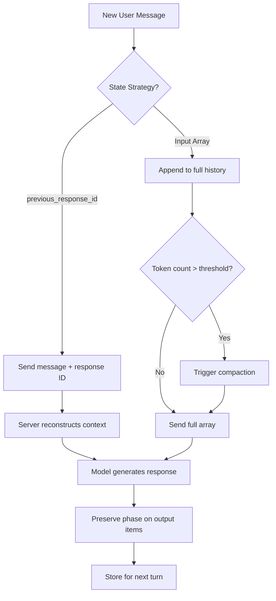

# Building Custom Harnesses with the Codex Responses API: Phase, Compaction, and Conversation State


---

The Codex CLI, TypeScript SDK, and Python SDK all abstract away the Responses API. But when you need a custom agent harness — an internal tool, a CI orchestrator, or a domain-specific coding agent — you must integrate with the Responses API directly. Three mechanisms are critical to get right: the `phase` parameter, conversation state management, and server-side compaction. Getting any of them wrong degrades output quality in ways that are difficult to diagnose.

## The Responses API as the Foundation

Every Codex interaction — whether through the CLI, the desktop app, or the VS Code extension — flows through OpenAI's Responses API[^1]. Unlike the deprecated Chat Completions endpoint, Responses treats conversation turns as structured **input items** and **output items**, with first-class support for tool calls, reasoning traces, and now metadata like `phase`[^2].

The key mental model shift: you send an array of input items (system instructions, user messages, prior assistant outputs, tool results) and receive an array of output items. There is no implicit "messages" array — you control exactly what the model sees.

```python
from openai import OpenAI

client = OpenAI()

response = client.responses.create(
    model="gpt-5.3-codex",
    instructions="You are Codex, a senior software engineer.",
    input=[
        {"role": "user", "content": "Refactor the auth module to use JWT."}
    ],
    tools=[{"type": "apply_patch"}, shell_tool],
)
```

## The Phase Parameter: Why It Matters

Introduced alongside `gpt-5.3-codex` in February 2026[^3], the `phase` parameter labels assistant output items to distinguish intermediate commentary from final answers. It takes three values:

| Value | Meaning |
|---|---|
| `null` | Unclassified (default for older models) |
| `"commentary"` | Preamble, status update, or intermediate reasoning |
| `"final_answer"` | The model's closing response for the current turn |

### Why This Exists

In long-running, tool-heavy agent sessions, a Codex model may emit several assistant messages within a single turn — a preamble explaining its approach, followed by tool calls, followed by another commentary message, and finally a closing summary. Without `phase`, downstream systems cannot reliably determine which message constitutes the "answer"[^4]. The model itself also struggles: if prior assistant items are replayed without their `phase` metadata, it may treat old commentary as completed work and stop early.

### Integration Rules

The rules are strict and the consequences of violating them are significant[^3][^5]:

1. **Persist `phase` on every assistant output item.** When you store conversation history, include the `phase` field exactly as returned by the API.
2. **Replay `phase` in subsequent requests.** When sending prior assistant items back as input, preserve their original `phase` values.
3. **Never add `phase` to user messages.** The field is exclusively for assistant output items.
4. **Dropping `phase` causes degradation.** OpenAI's official guidance states that missing or dropped `phase` metadata causes "significant performance degradation" for `gpt-5.3-codex`[^3], with preambles being interpreted as final answers in multi-step tasks.

```python
# Correct: preserving phase when replaying history
next_input = []
for item in response.output:
    replayed = {
        "role": "assistant",
        "content": item.content,
    }
    if hasattr(item, "phase") and item.phase is not None:
        replayed["phase"] = item.phase
    next_input.append(replayed)

next_input.append({"role": "user", "content": "Now add unit tests."})
```

For `gpt-5.4`, `phase` is optional at the API level but "highly recommended" for robust behaviour[^5]. The server performs best-effort inference when `phase` is absent, but explicit round-tripping is strictly better.

## Conversation State: Two Strategies

The Responses API offers two patterns for maintaining multi-turn context, each with distinct trade-offs[^6].

### Strategy 1: `previous_response_id` Chaining

Pass the ID of the last response and only the new user message. The server reconstructs the full conversation history server-side.

```python
response_2 = client.responses.create(
    model="gpt-5.3-codex",
    input=[{"role": "user", "content": "Add error handling."}],
    previous_response_id=response.id,
    store=True,
)
```

**Advantages:** Minimal client-side state, automatic `phase` preservation, simpler implementation.
**Limitations:** Requires `store=True` (responses must be persisted server-side), which may conflict with Zero Data Retention (ZDR) policies[^7]. Azure OpenAI had known issues with this feature as of early 2026[^8].

### Strategy 2: Input Array Replay

Manually reconstruct the full conversation in each request by appending all prior output items to the input array.

```python
conversation = [
    {"role": "user", "content": "Refactor auth to JWT."},
]
conversation.extend(format_output_items(response.output))
conversation.append({"role": "user", "content": "Add error handling."})

response_2 = client.responses.create(
    model="gpt-5.3-codex",
    input=conversation,
    store=False,
)
```

**Advantages:** Full control over context, ZDR-compatible with `store=False`, works with any provider.
**Limitations:** You must preserve `phase`, reasoning items, and tool call results manually. OpenAI recommends including "all reasoning items between the latest function call and the previous user message" at minimum[^6].



## Server-Side Compaction

Released on 11 February 2026[^7], server-side compaction solves the context window problem for long-running sessions without requiring external truncation logic.

### How It Works

Add a `context_management` parameter to your Responses API call. When the rendered token count exceeds `compact_threshold`, the server automatically compresses prior context before continuing inference[^7]:

```python
response = client.responses.create(
    model="gpt-5.3-codex",
    input=conversation,
    store=False,
    context_management=[
        {"type": "compaction", "compact_threshold": 200000}
    ],
)
```

The response stream includes an **encrypted compaction item** — an opaque blob carrying forward key state and reasoning. This item replaces everything before it in the context window[^7].

### Post-Compaction Housekeeping

After receiving a compaction item, drop all pre-compaction items from your conversation array. The compaction item is the canonical representation of prior context[^7]:

```python
for item in response.output:
    conversation.append(item)

# After compaction, prune pre-compaction items for latency
# The compaction item carries necessary context forward
```

### Standalone Compact Endpoint

For explicit compaction control — useful in CI harnesses or batch processing — call `/responses/compact` directly[^7]:

```python
compacted = client.responses.compact(
    model="gpt-5.3-codex",
    input=full_conversation,
)
# compacted.output is the new canonical context window
```

This endpoint is fully stateless and ZDR-friendly. Do not prune its output — the returned window is the canonical next context window[^7].

## The Codex System Prompt Architecture

When building a custom harness, you need a system prompt. The official Codex Prompting Guide[^3] (February 2026) documents the structure used internally, originally developed as the GPT-5.1-Codex-Max default prompt[^9].

Key sections to include in your own harness:

| Section | Purpose |
|---|---|
| **Identity** | "You are Codex, based on GPT-5" — establishes agent persona |
| **Autonomy** | Directs senior-engineer behaviour: complete tasks end-to-end |
| **Tool preferences** | Prefer `rg` over `grep`, dedicated tools over shell commands |
| **Code implementation** | Correctness, conventions, error handling expectations |
| **Exploration** | Batch file reads, parallelise searches |
| **Plan tool** | Skip plans for simple tasks, update after subtasks |

The guide recommends starting with this prompt as a base and making "tactical additions" rather than writing from scratch[^3]. For `gpt-5.3-codex`, OpenAI recommends `"medium"` reasoning effort as the default, with `"high"` or `"xhigh"` reserved for complex tasks[^3].

## The Shell Tool Definition

The Codex prompting guide reveals a preference for string-based command parameters over arrays[^3]:

```python
shell_tool = {
    "type": "function",
    "name": "shell",
    "description": "Execute a shell command",
    "parameters": {
        "type": "object",
        "properties": {
            "command": {"type": "string"},
            "workdir": {"type": "string"},
            "timeout_ms": {"type": "integer"},
        },
        "required": ["command"],
    },
}
```

Always set `workdir` rather than using `cd` within commands. On Windows, commands are invoked via PowerShell (`pwsh -NoLogo -NoProfile -Command "<cmd>"`)[^3].

## Putting It Together: A Minimal Custom Harness

```python
from openai import OpenAI

client = OpenAI()

def run_codex_session(task: str, max_turns: int = 20):
    conversation = [{"role": "user", "content": task}]

    for turn in range(max_turns):
        response = client.responses.create(
            model="gpt-5.3-codex",
            instructions=SYSTEM_PROMPT,
            input=conversation,
            tools=[{"type": "apply_patch"}, shell_tool],
            reasoning={"effort": "medium", "summary": "auto"},
            store=False,
            context_management=[
                {"type": "compaction", "compact_threshold": 180000}
            ],
        )

        # Preserve phase and reasoning items
        for item in response.output:
            conversation.append(item)

        # Execute tool calls, append results
        tool_results = execute_tools(response.output)
        if not tool_results:
            break  # No tool calls = task complete
        conversation.extend(tool_results)

    return conversation
```

This harness handles compaction automatically, preserves `phase` by appending raw output items, and supports ZDR with `store=False`.

## Common Pitfalls

⚠️ **Stripping metadata during serialisation.** JSON serialisation libraries may silently drop `null` fields or unknown keys like `phase`. Validate your serialisation pipeline round-trips all fields.

⚠️ **Mixing `previous_response_id` with manual history.** Choose one strategy per session. Combining both leads to duplicate context and unpredictable behaviour.

⚠️ **Ignoring reasoning items.** When replaying history, include reasoning items between tool calls. Dropping them forces the model to restart its reasoning chain, increasing token usage and reducing quality[^6].

⚠️ **Setting `compact_threshold` too low.** The minimum is 1,000 tokens[^10], but aggressive compaction loses important context. Start with 60-80% of your model's context window.

## Citations

[^1]: [Codex CLI Features — OpenAI Developers](https://developers.openai.com/codex/cli/features)

[^2]: [Migrate to the Responses API — OpenAI Developers](https://developers.openai.com/api/docs/guides/migrate-to-responses)

[^3]: [Codex Prompting Guide — OpenAI Cookbook](https://developers.openai.com/cookbook/examples/gpt-5/codex_prompting_guide)

[^4]: [Prompt Guidance for GPT-5.4 — OpenAI API Docs](https://developers.openai.com/api/docs/guides/prompt-guidance)

[^5]: [GPT-5.4 Prompt Guidance: Phase Parameter — OpenAI API](https://developers.openai.com/api/docs/guides/prompt-guidance)

[^6]: [Conversation State — OpenAI API Docs](https://developers.openai.com/api/docs/guides/conversation-state)

[^7]: [Compaction — OpenAI API Docs](https://developers.openai.com/api/docs/guides/compaction)

[^8]: [Missing previous_response_id support on Azure — GitHub Issue #3841](https://github.com/openai/codex/issues/3841)

[^9]: [GPT-5.1-Codex-Max Prompting Guide — OpenAI Cookbook](https://cookbook.openai.com/examples/gpt-5/gpt-5-1-codex-max_prompting_guide)

[^10]: [LiteLLM Responses API Documentation](https://docs.litellm.ai/docs/response_api)
