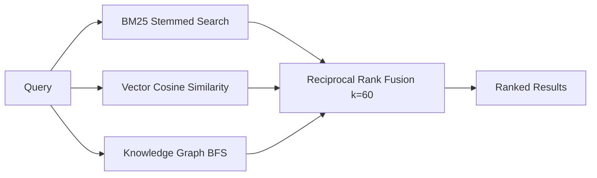
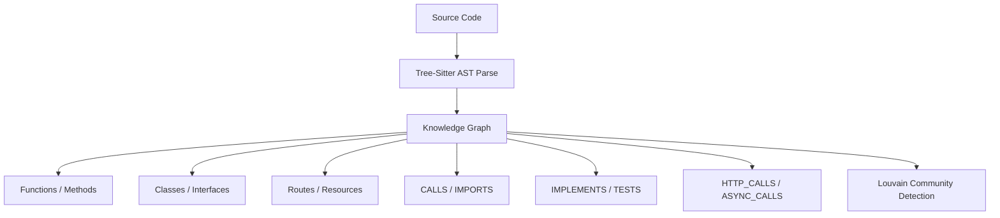
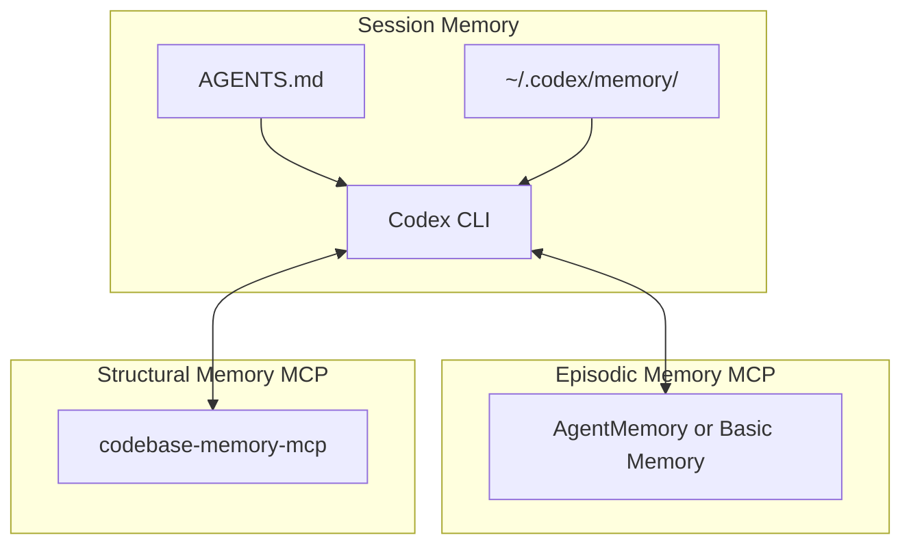

# Persistent Memory for Codex CLI: MCP Memory Servers, Cross-Session Context, and the Memory Layer Ecosystem


---

Every developer who has used Codex CLI for more than a day hits the same wall: the agent forgets everything between sessions. You spend forty minutes guiding it through your domain model, your team's conventions, your deployment quirks — and the next morning it starts from zero. AGENTS.md helps, but it is static, manually maintained, and constrained to 32 KiB by default[^1]. Context compaction preserves in-session continuity[^2], but once the session ends, that compacted state is gone.

A new category of MCP memory servers has emerged to solve this problem. These tools give Codex CLI a persistent, searchable memory layer that survives session boundaries, shares context across agents, and in some cases builds structural knowledge graphs of your entire codebase. This article surveys the landscape, compares the leading options, and shows how to configure them.

## The Memory Gap in Codex CLI

Codex CLI's built-in memory has three layers:

1. **AGENTS.md** — static Markdown files loaded at session start, merged hierarchically from `~/.codex/AGENTS.md` → repo root → current directory[^1]. Effective for conventions and commands, but manually maintained and size-limited.
2. **`~/.codex/memory/`** — persistent memory stored as Markdown files, introduced around v0.100.0[^3]. Codex stores facts, preferences, and project context here, loading them at session start. Recent improvements include CWD-aware project-specific recall, diff-based forgetting for stale facts, and usage-aware selection[^3].
3. **Session rollout files** — JSONL transcripts under `~/.codex/sessions/` that enable `codex resume` and `/fork`[^4], but these are replay logs, not searchable knowledge.

The gap is clear: there is no built-in mechanism for **intelligent retrieval** across sessions. The `~/.codex/memory/` system stores facts but uses simple loading rather than semantic search. When your project spans thousands of decisions, architectural trade-offs, and debugging discoveries across months of work, flat file loading breaks down. The community recognised this early — issue #4655 requested a structured memory bank akin to Cline's, and was subsequently closed as completed[^5].

MCP memory servers fill this gap by providing searchable, structured, and often semantically indexed persistent memory through the Model Context Protocol.

## The MCP Memory Server Landscape

Five projects currently dominate the Codex CLI memory ecosystem. Each takes a different architectural approach.

### AgentMemory: The Full-Stack Option

AgentMemory[^6] is the most feature-rich option, offering 41 MCP tools, 6 resources, and 3 prompts. Its architecture centres on **triple-stream retrieval**:



Key technical details:

- **4-tier memory consolidation**: working → episodic → semantic → procedural, with strength decay over time[^6]
- **12 auto-capture hooks**: tool usage, file edits, test runs, and errors are captured without manual intervention[^6]
- **Token efficiency**: 92% reduction versus dumping entire memory into context (1,571 tokens/query vs 19,462 for all-in-context), with 64.1% Recall@10 and 100.0% MRR on a 240-observation benchmark[^6]
- **Cascading staleness**: when a memory is superseded, related graph nodes are automatically flagged[^6]
- **Privacy**: strips API keys, secrets, and `<private>` tags before storage[^6]

Installation for Codex CLI:

```bash
npx @agentmemory/agentmemory
```

The MCP server starts on port 3111, with a real-time viewer on port 3113. For embedding, the local Xenova provider (all-MiniLM-L6-v2, 384 dimensions) is free and runs offline[^6].

### Basic Memory: The Markdown-First Approach

Basic Memory[^7] takes a deliberately simple approach: plain Markdown files as the foundational storage, with semantic search layered on top. This means your memories are readable, editable, and portable across any MCP client.

```bash
codex mcp add basic-memory bash -c 'uvx basic-memory mcp'
```

For cloud-hosted memory across machines, configure `~/.codex/config.toml`:

```toml
[mcp_servers.basic-memory]
type = "url"
url = "https://cloud.basicmemory.com/mcp"

[mcp_servers.basic-memory.env]
BASIC_MEMORY_API_KEY = "${BASIC_MEMORY_API_KEY}"
```

Basic Memory uses `memory://` URL addressing (e.g., `memory://architecture/auth-decision`) for loading specific notes[^7]. Its cross-client interoperability is its strongest selling point — notes created in Codex are available in Claude Code, Cursor, or any MCP client[^7].

### Codebase-Memory-MCP: The Structural Intelligence Option

Where AgentMemory and Basic Memory store what you *tell* the agent, codebase-memory-mcp[^8] indexes what the code *is*. It builds a persistent knowledge graph from Tree-Sitter AST analysis across 66 languages, providing structural understanding that survives session restarts and context compaction.

The accompanying research paper (arXiv:2603.27277)[^9] demonstrates 83% answer quality versus 92% for a file-exploration agent, at **10× fewer tokens** and 2.1× fewer tool calls.



Key capabilities through its 14 MCP tools:

- **`trace_call_path`** — BFS traversal of caller/callee relationships[^8]
- **`detect_changes`** — maps git diffs to affected symbols with risk classification[^8]
- **`get_architecture`** — single-call overview returning languages, packages, routes, and hotspots[^8]
- **`query_graph`** — Cypher-like read-only graph queries[^8]

Performance is remarkable: the Linux kernel (28M LOC, 75K files) indexes in 3 minutes, with Cypher queries completing in under 1ms[^8].

```bash
# One-line install — auto-detects Codex CLI
curl -fsSL https://raw.githubusercontent.com/DeusData/codebase-memory-mcp/main/install.sh | bash
```

The installer updates `.codex/config.toml` and populates `.codex/AGENTS.md` automatically[^8].

### Memorix: The Cross-Agent Memory Layer

Memorix[^10] focuses on a specific problem: sharing memory across *different* AI coding agents. If your team uses Codex CLI for terminal work, Cursor for IDE tasks, and Claude Code for exploration, Memorix gives all three agents access to the same memory pool.

It distinguishes three memory types:

- **Observation memory** — what changed, gotchas, solutions[^10]
- **Reasoning memory** — why decisions were made, trade-offs considered[^10]
- **Git memory** — immutable facts extracted from commits with noise filtering[^10]

```bash
npm install -g memorix
memorix init
memorix serve  # stdio mode for Codex CLI
```

MCP tools include `memorix_store`, `memorix_search`, `memorix_detail`, `memorix_timeline`, and `memorix_resolve`[^10]. The HTTP control plane on port 3211 supports team collaboration with a dashboard[^10].

### Memsearch: The OpenClaw-Inspired Option

Memsearch[^11], built by Zilliz (the company behind Milvus), takes a Markdown-first approach inspired by OpenClaw's memory system. Each project stores memory under `<project>/.memsearch/memory/` as date-organised Markdown files, with Milvus providing a rebuildable vector index on top[^11].

The hybrid search combines BM25 and dense vector retrieval with Reciprocal Rank Fusion[^11]. Markdown files are always the source of truth — the vector store is a derived index, rebuildable at any time[^11].

The Codex plugin uses shell hooks and requires `--yolo` mode (full access)[^11]. ⚠️ This security requirement may be unacceptable for enterprise environments.

## Choosing the Right Memory Server

The decision depends on what kind of memory you need:

| Need | Best Option | Why |
|------|-------------|-----|
| Full-stack intelligent memory with auto-capture | AgentMemory | 41 tools, 4-tier consolidation, 92% token reduction[^6] |
| Simple, portable, human-readable memories | Basic Memory | Plain Markdown, cloud sync, cross-client[^7] |
| Structural code understanding | codebase-memory-mcp | AST-based knowledge graph, 66 languages, sub-ms queries[^8] |
| Cross-agent shared memory | Memorix | Agent-agnostic, 10 supported agents, team dashboard[^10] |
| Markdown-first with vector search | Memsearch | Milvus-backed, OpenClaw-compatible, date-organised[^11] |

For most teams, the optimal setup combines two complementary layers:



The episodic layer captures *decisions and discoveries*. The structural layer provides *code intelligence*. Together, they give the agent both "what we decided" and "how the code actually works" — without burning context tokens on redundant file exploration.

## Configuration: Running Multiple Memory Servers

Codex CLI supports multiple simultaneous MCP servers. Here is a `config.toml` fragment running both AgentMemory and codebase-memory-mcp:

```toml
[mcp_servers.agentmemory]
type = "command"
command = ["npx", "@agentmemory/agentmemory", "--mcp"]

[mcp_servers.codebase-memory]
type = "command"
command = ["codebase-memory-mcp", "serve"]
```

Pair this with AGENTS.md instructions that tell the agent *when* to use each:

```markdown
## Memory Usage

- Before starting any task, search AgentMemory for relevant prior decisions
- Use codebase-memory `get_architecture` before making structural changes
- After completing a task, store key decisions and trade-offs in AgentMemory
- Use `trace_call_path` before refactoring to understand blast radius
```

## Performance and Token Impact

Memory servers add MCP tool schemas to the system prompt, consuming tokens. The impact varies:

| Server | Tool Count | Estimated Schema Tokens |
|--------|-----------|------------------------|
| AgentMemory | 41 | ~3,200 |
| Basic Memory | 5 | ~400 |
| codebase-memory-mcp | 14 | ~1,100 |
| Memorix | 5 | ~400 |

⚠️ Running all four simultaneously would consume approximately 5,100 tokens just for tool schemas. The v0.117.0 tool search deferred loading feature[^12] mitigates this by lazy-loading tool definitions, but memory tools are typically needed early in a session and will be loaded regardless.

The trade-off is straightforward: a few thousand schema tokens in exchange for avoiding tens of thousands of tokens in redundant file reads and re-discovery. AgentMemory's benchmark shows 1,571 tokens per query versus 19,462 for the all-in-context baseline[^6] — a 12× improvement.

## Limitations and Open Questions

The MCP memory ecosystem is young, and several issues remain unresolved:

- **No standard memory protocol**: each server defines its own tool names and semantics, making migration between servers difficult
- **Embedding model drift**: if you change embedding providers mid-project, vector similarity scores shift and older memories may rank incorrectly
- **Multi-agent memory conflicts**: when parallel subagents write to the same memory store simultaneously, conflict resolution is left to the individual server implementation
- **Privacy in team settings**: shared memory layers like Memorix's team mode require careful governance to avoid leaking sensitive decisions across team boundaries
- **Codex CLI's built-in memory interaction**: the `~/.codex/memory/` system may store facts that overlap with or contradict MCP memory server contents, and there is no deduplication mechanism

## What's Next

The memory server ecosystem is converging on common patterns: Markdown as source of truth, hybrid BM25+vector retrieval, and MCP as the transport layer. The remaining gap is standardisation — a common memory protocol would allow agents to switch memory backends without rewriting AGENTS.md instructions or losing existing memories.

For now, the practical advice is simple: if your sessions regularly exceed 30 minutes or you find yourself re-explaining context to Codex, add a memory server. Start with Basic Memory for simplicity, graduate to AgentMemory for intelligent retrieval, and add codebase-memory-mcp when structural code navigation matters more than conversation recall.

---

## Citations

[^1]: [Custom instructions with AGENTS.md – Codex CLI | OpenAI Developers](https://developers.openai.com/codex/guides/agents-md)
[^2]: [Codex CLI Context Compaction — codex-resources](https://danielvaughan.github.io/codex-resources/articles/2026-03-31-codex-cli-context-compaction-architecture/)
[^3]: [OpenAI Codex CLI Memory — Deep Dive — Mervin Praison](https://mer.vin/2025/12/openai-codex-cli-memory-deep-dive/)
[^4]: [Codex CLI Thread Management: Forking, Resuming and Context Lifecycle — codex-resources](https://danielvaughan.github.io/codex-resources/articles/2026-03-28-codex-cli-thread-management-fork-resume/)
[^5]: [Add Memory bank feature similar to Cline memory bank — Issue #4655 — openai/codex](https://github.com/openai/codex/issues/4655)
[^6]: [AgentMemory: Persistent Memory for AI Coding Agents — GitHub](https://github.com/rohitg00/agentmemory)
[^7]: [Add Memory to OpenAI Codex — Persistent Development Context — Basic Memory](https://docs.basicmemory.com/integrations/codex)
[^8]: [codebase-memory-mcp — High-performance code intelligence MCP server — GitHub](https://github.com/DeusData/codebase-memory-mcp)
[^9]: [Codebase-Memory: Tree-Sitter-Based Knowledge Graphs for LLM Code Exploration via MCP — arXiv:2603.27277](https://arxiv.org/abs/2603.27277)
[^10]: [Memorix: Open-source cross-agent memory layer — GitHub](https://github.com/AVIDS2/memorix)
[^11]: [Memsearch: A Markdown-first memory system — GitHub](https://github.com/zilliztech/memsearch)
[^12]: [GPT-5.4 Computer Use and Tool Search in Codex CLI — codex-resources](https://danielvaughan.github.io/codex-resources/articles/2026-03-31-gpt54-computer-use-tool-search-codex-cli/)
