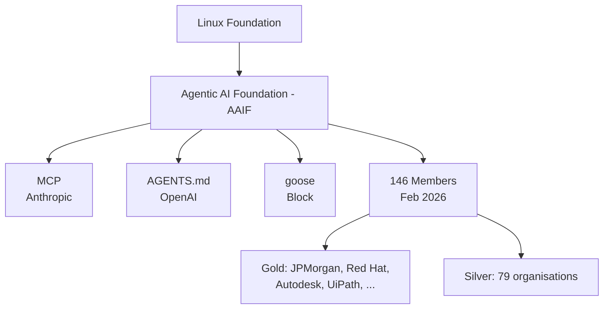
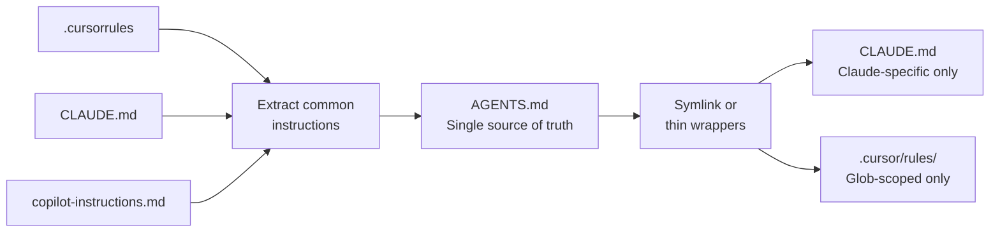

# AGENTS.md as an Open Standard: Cross-Tool Portability Under Linux Foundation Governance


---

The AGENTS.md file that sits in your repository root has quietly become the most consequential configuration standard in agentic coding. What began as an OpenAI-originated convention for guiding Codex CLI is now a Linux Foundation project supported by over 25 tools and adopted by more than 60,000 open-source repositories[^1]. If you are maintaining separate instruction files for each AI coding tool, you are doing unnecessary work. Here is what has changed and how to consolidate.

## The Fragmentation Problem

By mid-2025, every major AI coding tool had invented its own instruction format:

- **Codex CLI**: `AGENTS.md`
- **Claude Code**: `CLAUDE.md`
- **Cursor**: `.cursorrules` and `.cursor/rules/`
- **GitHub Copilot**: `.github/copilot-instructions.md`
- **Gemini CLI**: `GEMINI.md`
- **Windsurf**: `.windsurfrules`

Teams using more than one tool — which is most teams — ended up maintaining multiple files with 80% overlapping content[^2]. Worse, instructions would drift between files, producing inconsistent agent behaviour across tools.

## The Agentic AI Foundation

On 9 December 2025, the Linux Foundation announced the Agentic AI Foundation (AAIF), co-founded by OpenAI, Anthropic, and Block[^3]. Three founding projects were contributed:

- **Model Context Protocol (MCP)** — Anthropic's universal tool integration standard
- **goose** — Block's open-source local-first AI agent framework
- **AGENTS.md** — OpenAI's specification for repository-level agent instructions

By February 2026, AAIF had grown to 146 members including JPMorgan Chase, American Express, Red Hat, Autodesk, Huawei, and UiPath, with David Nalley (AWS) appointed as governing board chair[^4].



## Who Supports AGENTS.md Today

As of April 2026, over 25 tools read AGENTS.md natively[^1]:

| Tool | Native Support | Auto-Loads | Tool-Specific File |
|------|:---:|:---:|---|
| **Codex CLI** | ✅ | ✅ | — |
| **GitHub Copilot** | ✅ | Config-dependent | `copilot-instructions.md` |
| **Cursor** | ✅ | ✅ | `.cursor/rules/` |
| **Gemini CLI / Jules** | ✅ | ✅ | `GEMINI.md` |
| **Windsurf** | ✅ | ✅ | `.windsurfrules` |
| **Amp** | ✅ | ✅ | — |
| **Devin** | ✅ | ✅ | — |
| **Aider** | ✅ | ✅ | — |
| **OpenCode** | ✅ | ✅ | — |
| **goose** | ✅ | ✅ | — |
| **JetBrains Junie** | ✅ | ✅ | — |
| **Zed** | ✅ | ✅ | — |
| **Warp** | ✅ | ✅ | — |
| **Factory** | ✅ | ✅ | — |

Claude Code remains the notable exception: it auto-loads `CLAUDE.md` but does not natively read `AGENTS.md`[^5]. A symlink or include workaround is required (see below).

## The Specification

AGENTS.md is deliberately minimal. It is a plain Markdown file with no required YAML front matter, no version field, and no schema[^1]. This simplicity is the point — it lowers the adoption barrier and ensures every Markdown-capable tool can parse it.

### Recommended Sections

```markdown
# Project Overview
Brief description of the codebase and its architecture.

## Build and Test Commands
- `npm run build` — production build
- `npm test` — unit tests via Vitest
- `npm run lint` — ESLint + Prettier

## Code Style
- TypeScript strict mode, no `any`
- Prefer `interface` over `type` for object shapes
- Use named exports

## Security Boundaries
- Never commit `.env` files
- All SQL must use parameterised queries
- No shell command construction from user input

## Git Workflow
- Branch naming: `feat/`, `fix/`, `chore/`
- Squash merges to main
- Conventional Commits format
```

### Hierarchy Rules

AGENTS.md supports nested placement in monorepos. The agent reads the file closest to the file being edited, with explicit user prompts overriding everything[^1]:

```
repo-root/
├── AGENTS.md                  # Global rules
├── packages/
│   ├── api/
│   │   └── AGENTS.md          # API-specific overrides
│   └── web/
│       └── AGENTS.md          # Frontend-specific overrides
```

Codex CLI additionally supports a global `~/.codex/AGENTS.md` for personal defaults that apply across all repositories[^6].

## The Cross-Tool Strategy

The practical recommendation from the community is the **80/20 rule**: write 80% of your instructions in `AGENTS.md`, then maintain tool-specific files only for features that require them[^2].

### What Goes in AGENTS.md

Everything that is tool-agnostic:

- Build, test, and lint commands
- Code style and conventions
- Architecture overview
- Security boundaries
- Git workflow rules
- Domain vocabulary

### What Stays in Tool-Specific Files

Features unique to a specific tool:

- **CLAUDE.md**: MCP server configuration, Claude-specific slash commands
- **.cursor/rules/**: MDC-format files with YAML front matter for glob-based activation scoping[^5]
- **Codex `config.toml`**: Sandbox modes, approval policies, model selection, hooks — these are runtime configuration, not agent instructions

### Claude Code Workaround

Since Claude Code does not yet read `AGENTS.md` natively, the cleanest approach is a symlink:

```bash
ln -s AGENTS.md CLAUDE.md
```

Or, if you need Claude-specific additions, create a `CLAUDE.md` that references the shared file:

```markdown
# Claude Code Instructions

See AGENTS.md for project conventions. Additional Claude-specific notes below.

## MCP Servers
- Use the `filesystem` MCP server for large directory traversals
```

## Practical Migration: Consolidating Your Files

If your repository currently maintains multiple instruction files, here is the migration path:



1. **Audit** existing files and highlight overlapping instructions
2. **Extract** common content into a single `AGENTS.md` at the repository root
3. **Reduce** tool-specific files to only their unique features
4. **Symlink** where possible — `CLAUDE.md → AGENTS.md` works well when content is 90%+ shared
5. **Test** by running each tool against the same task and comparing output quality

### Size Guidelines

Keep `AGENTS.md` under 500 lines[^2]. Beyond that, you hit context window consumption issues — the file is injected into every prompt. For larger projects, use the monorepo hierarchy pattern rather than a single enormous root file. This aligns with the findings in the ETH Zurich study on context pollution, where oversized instruction files degraded agent performance[^7].

## Enterprise Considerations

For organisations adopting AGENTS.md as a cross-team standard:

- **Version control**: `AGENTS.md` should be committed and never `.gitignore`d — it is a team artefact, not a personal preference file[^2]
- **CI validation**: Lint your `AGENTS.md` in CI to catch formatting issues, overly long files, or missing sections. A simple `wc -l AGENTS.md | awk '{if ($1 > 500) exit 1}'` check suffices
- **Signed manifests**: GitHub Copilot Enterprise supports GPG-signed context files to prevent tampering[^8] — ⚠️ this is an enterprise-only feature and not part of the AGENTS.md specification itself
- **Audit logging**: Enterprise tools increasingly log which context files were loaded per session, useful for compliance

## What This Means for Codex CLI Users

If you are already using Codex CLI with `AGENTS.md`, you are already on the standard. The key takeaway is that your `AGENTS.md` now works across the entire ecosystem — there is no Codex-specific dialect. When a colleague opens the same repository in Cursor, Gemini CLI, or Copilot, they get the same baseline instructions.

The Codex-specific configuration — sandbox modes, approval policies, model selection, hooks, profiles — belongs in `config.toml` and `.codex/agents/` TOML files, not in `AGENTS.md`. This separation is clean: `AGENTS.md` is the *what* (project conventions), `config.toml` is the *how* (runtime behaviour).

## Looking Ahead

With 146 member organisations and adoption across 60,000+ repositories, AGENTS.md has crossed the threshold from convention to standard. The AAIF governance model — the same structure that governs Kubernetes, Node.js, and Linux itself — provides the stability that enterprise teams require before committing to a specification[^3].

The remaining gap is Claude Code's lack of native support. Given that Anthropic co-founded AAIF, native `AGENTS.md` reading in Claude Code seems likely — but until it ships, the symlink workaround remains necessary.

For senior developers managing multi-tool workflows, the action is straightforward: consolidate into a single `AGENTS.md`, keep it under 500 lines, and let the tools converge around you.

## Citations

[^1]: [AGENTS.md — Official specification site](https://agents.md/), accessed April 2026. Lists 25+ supported tools and 60,000+ project adoption.

[^2]: [AGENTS.md Cross-Tool Unified Management Guide — SmartScope](https://smartscope.blog/en/generative-ai/github-copilot/github-copilot-agents-md-guide/), February 2026. Recommends the 80/20 shared-base approach and 500-line maximum.

[^3]: [Linux Foundation Announces the Formation of the Agentic AI Foundation (AAIF)](https://www.linuxfoundation.org/press/linux-foundation-announces-the-formation-of-the-agentic-ai-foundation), 9 December 2025. Co-founded by OpenAI, Anthropic, and Block with MCP, goose, and AGENTS.md as founding projects.

[^4]: [Agentic AI Foundation Welcomes 97 New Members — Linux Foundation](https://www.linuxfoundation.org/press/agentic-ai-foundation-welcomes-97-new-members), 24 February 2026. Total membership reached 146; David Nalley appointed governing board chair.

[^5]: [AGENTS.md vs CLAUDE.md: A Practical Guide — The Prompt Shelf](https://thepromptshelf.dev/blog/agents-md-vs-claude-md/), 2026. Details cross-tool behaviour differences and Claude Code's AGENTS.md gap.

[^6]: [Custom instructions with AGENTS.md — Codex CLI official documentation](https://developers.openai.com/codex/guides/agents-md), accessed April 2026. Documents hierarchy: global → repo root → subdirectory.

[^7]: [The AGENTS.md Bloat Problem — Codex Resources](https://danielvaughan.github.io/codex-resources/articles/2026-03-27-agents-md-bloat-problem/), 27 March 2026. ETH Zurich study findings on context pollution from oversized instruction files.

[^8]: [AI CLI Standardization: From Tool Lock-in to Portability — msbiro.net](https://www.msbiro.net/posts/ai-cli-standardization-guidelines/), 2026. Covers signed manifests, enterprise security features, and audit logging for context files.
