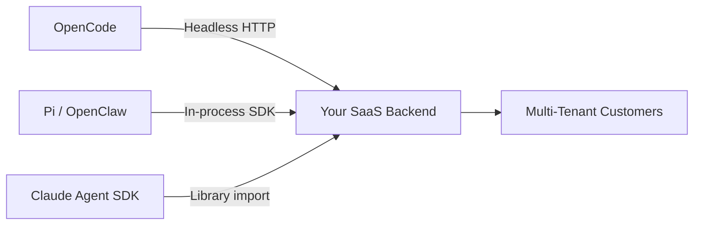
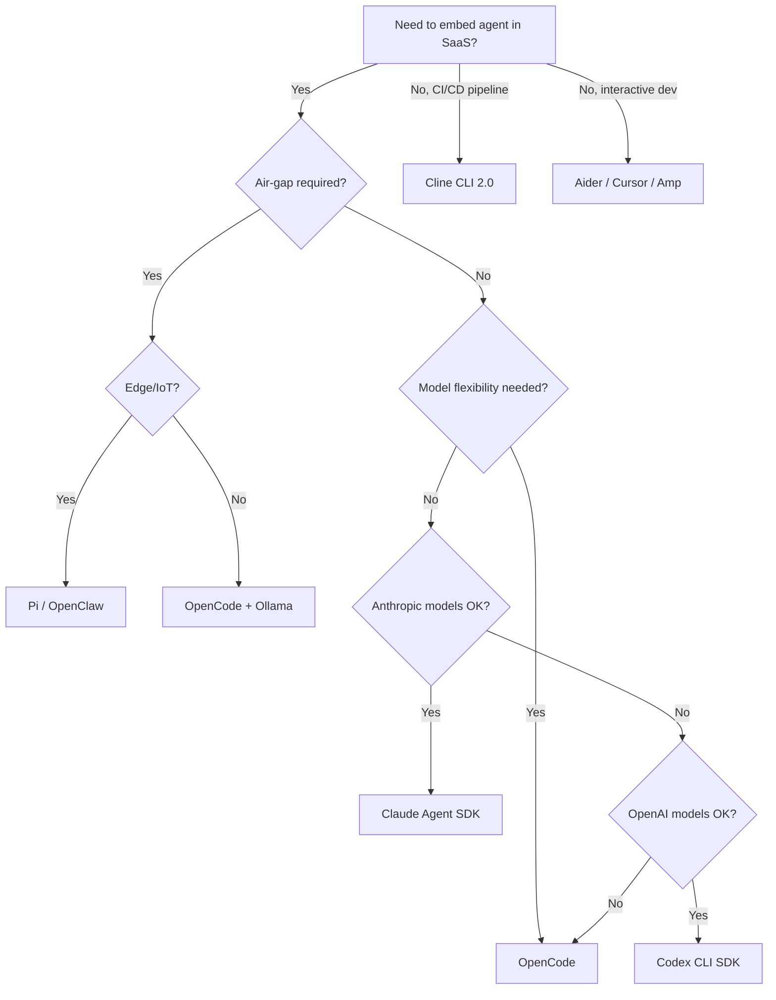

# The 2026 CLI Agent SaaS Readiness Matrix: 11 Tools Compared for Production Embedding

---

The CLI agent landscape has fragmented into eleven serious contenders, each with a different theory of how an AI coding agent should be embedded inside a production SaaS product. Choosing wrong means months of rework. This article presents a structured readiness matrix — heavily informed by the Kleinloog/VIA Research evaluation framework [^1] — scoring every tool across six dimensions that matter when you are building a multi-tenant harness, not just running prompts in a terminal.

## Why a Readiness Matrix?

Most comparison articles benchmark agents on SWE-bench scores and leave it there. That tells you how well the model solves isolated bugs; it tells you nothing about whether you can embed the agent in your own backend, isolate tenant data, run it air-gapped behind a corporate firewall, or stream structured events into your observability pipeline. The matrix below focuses on *production embedding* — the concerns that surface after the demo but before the SOC 2 audit.

## Evaluation Dimensions

Each tool is scored across six axes on a three-point scale: **●** (strong/production-ready), **◐** (partial/preview), **○** (absent/not applicable).

| Dimension | What We Measure |
|---|---|
| **Architecture** | Headless mode, subprocess/library embedding, event streaming |
| **SDK Availability** | Official SDK in ≥1 language, programmatic API surface |
| **Session Management** | Persistent sessions, forking, multi-tenant isolation |
| **MCP & Extensibility** | Model Context Protocol support, plugin/skill systems |
| **Deployment & Air-Gap** | Self-hosted models, offline operation, container support |
| **Licensing & Governance** | OSS licence, foundation backing, enterprise terms |

## The Matrix

| # | Tool | Architecture | SDK | Sessions | MCP | Air-Gap | Licence | Notes |
|---|---|---|---|---|---|---|---|---|
| 1 | **OpenCode** | ● | ● | ● | ● | ● | ● | Headless HTTP server, Go binary, SQLite sessions, 75+ providers [^2] |
| 2 | **Codex CLI** | ● | ● | ◐ | ● | ◐ | ○ | Rust monolith, TypeScript/Python SDK, JSONL streaming, Landlock sandbox [^3] |
| 3 | **Claude Code / Agent SDK** | ● | ● | ● | ● | ○ | ○ | Renamed to Agent SDK late 2025; Python v0.1.48, TS v0.2.71 [^4] |
| 4 | **Aider** | ◐ | ○ | ◐ | ○ | ● | ● | Git-native, Ollama local models, no official SDK, Apache 2.0 [^5] |
| 5 | **Goose (Block)** | ● | ◐ | ◐ | ● | ◐ | ● | MCP-native, AAIF governance, mid-air extension loading, Apache 2.0 [^6] |
| 6 | **Gemini CLI** | ● | ● | ◐ | ● | ○ | ● | `@google/gemini-cli-sdk` (Node), Rust SDK via JSON-RPC, container isolation [^7] |
| 7 | **Sourcegraph Amp** | ◐ | ◐ | ● | ● | ○ | ○ | Cloud-persistent threads, npm SDK, Java/Spring integration, multi-repo [^8] |
| 8 | **Cline CLI 2.0** | ● | ◐ | ● | ● | ◐ | ● | YOLO mode (`-y`), nd-JSON `--json`, gRPC API, tmux pane isolation, Apache 2.0 [^9] |
| 9 | **Cursor CLI** | ◐ | ○ | ◐ | ● | ○ | ○ | Cloud handoff (`&` prefix), plan/ask modes, hooks API, proprietary [^10] |
| 10 | **GitHub Copilot CLI** | ● | ● | ◐ | ● | ○ | ○ | Copilot SDK (public preview Apr 2026), Node/Python/Go/.NET, BYOK [^11] |
| 11 | **Pi (OpenClaw)** | ● | ● | ● | ● | ● | ● | In-memory `AgentSession`, zero-IPC, edge-optimised (RPi), MIT [^12] |

## Tier Rankings

Based on the matrix scores, the tools cluster into three readiness tiers for SaaS embedding.

### Tier 1 — Production-Ready Embedding

**OpenCode** leads the field with its headless HTTP server architecture. You spawn it as a sidecar, hit its REST endpoints, and get SQLite-backed session persistence with fork semantics out of the box [^2]. GitHub's January 2026 partnership with OpenCode means Copilot subscribers authenticate without a separate licence [^2], which simplifies enterprise procurement.

**Pi (OpenClaw Engine)** takes the opposite approach: no subprocess, no RPC. You call `createAgentSession()` directly inside your process [^12]. This zero-IPC architecture makes it the fastest option for edge deployments — it runs on a Raspberry Pi 4 with 8GB RAM [^12]. The MIT licence removes any embedding friction.

**Claude Agent SDK** ships the exact tool suite that powers Claude Code (Read, Write, Edit, Bash, Glob, Grep, WebSearch) as importable library functions [^4]. The `ClaudeSDKClient` supports bidirectional conversations, custom tool callbacks, and lifecycle hooks. The constraint: you are locked to Anthropic's models and API, with no air-gap story.

### Tier 2 — Embedding-Capable with Caveats

**Codex CLI** provides a solid TypeScript SDK (`@openai/codex-sdk`) that wraps the Rust binary and exchanges JSONL events over stdin/stdout [^3]. The Python SDK and app-server extend this to CI pipelines. Model options include GPT-5-Codex (default), codex-mini-latest, and GPT-5.4-mini [^3]. The caveat: session management is less mature than OpenCode's SQLite approach, and the licence is not OSS.

**Cline CLI 2.0** is purpose-built for CI/CD pipelines. The `-y` (YOLO) flag auto-approves all actions, `--json` emits nd-JSON for machine parsing, and the gRPC API supports parallel agent instances isolated in tmux panes [^9]. Apache 2.0 licensing is clean. The limitation is that the SDK surface is still maturing — you are mostly shelling out to the CLI binary.

**GitHub Copilot SDK** entered public preview on 2 April 2026 [^11]. Multi-language support (Node.js, Python, Go, .NET), MCP server integration, OpenTelemetry tracing, and a permission framework make it enterprise-friendly. The risk: it is preview-quality, and cloud-dependent with no air-gap path.

**Gemini CLI** offers both a Node.js SDK (`@google/gemini-cli-sdk`) and a community Rust SDK communicating via JSON-RPC 2.0 [^7]. Container-based tool isolation is a strong security story. However, it is tightly coupled to Google's model ecosystem.

### Tier 3 — Interactive-First, Embedding Secondary

**Goose**, **Sourcegraph Amp**, **Aider**, and **Cursor CLI** are excellent interactive tools but present significant embedding challenges.

**Goose** is architecturally interesting — it was the first public MCP client and supports mid-air extension loading [^6] — but its SDK story is incomplete and its benchmark scores for backend tasks are poor (3.1% on backend, 10.0% on frontend) [^1].

**Aider** remains the gold standard for Git-native workflows with local model support via Ollama [^5], but it has no official SDK and no headless mode, making programmatic embedding a wrapper-script exercise.

**Sourcegraph Amp** excels at multi-repo orchestration with cloud-persistent threads and sub-agent routing (Oracle, Librarian, Painter) [^8], but its architecture assumes a cloud backend — you cannot self-host the orchestration layer.

**Cursor CLI** introduced cloud handoff and plan/ask modes in January 2026 [^10], but remains proprietary with no embedding SDK.

## Decision Framework

## Key Observations

**The SDK gap is closing fast.** Six months ago, only Claude Code had a real embedding SDK. Today, OpenCode, Codex CLI, Gemini CLI, Copilot, and Pi all offer programmatic APIs. The competitive moat has shifted from "can it be embedded?" to "how mature is the session management?"

**Air-gap capability is the enterprise differentiator.** OpenCode and Pi support fully offline operation with local models [^2][^12]. Codex CLI and Goose offer partial stories (local model config, stale cache fallback). Claude Code, Gemini CLI, Amp, Cursor, and Copilot CLI remain cloud-dependent — a non-starter for defence, healthcare, and financial services environments.

**Licensing matters more than benchmarks.** OpenCode (MIT), Pi (MIT), Goose (Apache 2.0), Aider (Apache 2.0), Cline (Apache 2.0), and Gemini CLI (Apache 2.0) can be embedded without legal review [^1]. Codex CLI, Claude Code, Cursor, Amp, and Copilot carry proprietary or restrictive licences that require procurement cycles.

**Session management is the hidden battleground.** OpenCode's SQLite-backed sessions with fork semantics [^2] and Pi's in-memory `AgentSession` [^12] are architecturally clean for multi-tenancy. Codex CLI's JSONL-over-stdio approach works but requires you to build your own persistence layer. Amp's cloud-persistent threads are elegant but not self-hostable.

## Production Checklist

Before embedding any agent in your SaaS, validate these items:

- [ ] **Subprocess vs library** — Does the SDK import in-process, or does it spawn a child process? The former is faster; the latter is easier to sandbox.
- [ ] **Structured event stream** — Can you consume tool calls, file changes, and completion events as typed objects? JSONL (Codex CLI) and nd-JSON (Cline) are parseable; plain text stdout is not.
- [ ] **Tenant isolation** — Can you run concurrent sessions for different tenants without shared state leaking? Test with parallel requests.
- [ ] **Model BYOK** — Can your customers bring their own API keys, or are you locked to a single provider's billing?
- [ ] **Sandbox escape** — Does the agent's file/network access respect your container boundaries? Codex CLI's Landlock/Seatbelt sandbox [^3] and Gemini CLI's container isolation [^7] are strong; others vary.
- [ ] **Graceful degradation** — What happens when the model API is unreachable? Goose's stale cache fallback [^6] is the only agent that handles this gracefully today.

## What This Means for Codex CLI

Codex CLI sits comfortably in Tier 2, with the SDK and model ecosystem to move into Tier 1. The gaps to close are:

1. **Session persistence** — Ship a built-in session store (SQLite or equivalent) rather than requiring harness authors to build their own.
2. **OSS licensing** — The proprietary licence is a friction point against MIT/Apache competitors.
3. **Offline model support** — First-class local model configuration (not just `--model` flag experimentation) would open air-gapped enterprise markets.

The Codex CLI SDK's architecture — wrapping the Rust binary with JSONL event exchange — is sound engineering [^3]. The TypeScript and Python SDKs give harness authors the language choice they need. With session persistence and licensing addressed, Codex CLI could match OpenCode's embedding story while retaining its superior benchmark performance (67.7% overall, 56.8% SWE-bench Pro) [^1].

## Citations

[^1]: Kleinloog/VIA Research, "The Complete Landscape of CLI-Based AI Coding Agents," 2026. <https://www.kleinloog.ch/articles/the-5-ai-coding-agents-worth-embedding-in-your-saas/the-complete-landscape-of-cli-based-ai-coding-agents.pdf>

[^2]: OpenCode documentation & GitHub repository. <https://github.com/opencode-ai/opencode>; Deep Dive: <https://sanj.dev/post/opencode-deep-dive-2026>

[^3]: OpenAI Codex CLI SDK documentation. <https://www.npmjs.com/package/@openai/codex-sdk>; Enterprise features: <https://www.augmentcode.com/learn/openai-codex-cli-enterprise>

[^4]: Anthropic Claude Agent SDK. <https://platform.claude.com/docs/en/agent-sdk/overview>; Python SDK: <https://github.com/anthropics/claude-agent-sdk-python>

[^5]: Aider documentation. <https://aider.chat/docs/>; Comparison: <https://sanj.dev/post/comparing-ai-cli-coding-assistants>

[^6]: Block Goose, Linux Foundation AAIF. <https://github.com/block/goose>; MCP history: <https://www.arcade.dev/blog/goose-the-open-source-agent-that-shaped-mcp>

[^7]: Gemini CLI SDK. <https://deepwiki.com/google-gemini/gemini-cli/5.9-sdk-and-programmatic-api>; Rust SDK: <https://docs.rs/gemini-cli-sdk/latest/gemini_cli_sdk/>

[^8]: Sourcegraph Amp. <https://sourcegraph.com/amp>; npm SDK: <https://www.npmjs.com/package/@sourcegraph/amp>; Spring SDK: <https://spring-ai-community.github.io/agent-client/api/amp-cli-sdk.html>

[^9]: Cline CLI 2.0. <https://cline.bot/blog/introducing-cline-cli-2-0>; Headless mode: <https://deepwiki.com/cline/cline/12.4-cli-headless-mode-and-cicd>

[^10]: Cursor CLI agent modes. <https://cursor.com/changelog/cli-jan-16-2026>

[^11]: GitHub Copilot SDK public preview. <https://github.blog/changelog/2026-04-02-copilot-sdk-in-public-preview/>; Copilot SDK repo: <https://github.com/github/copilot-sdk>

[^12]: Pi / OpenClaw architecture. <https://docs.openclaw.ai/pi>; Armin Ronacher on Pi: <https://lucumr.pocoo.org/2026/1/31/pi/>; Raspberry Pi deployment: <https://www.raspberrypi.com/news/turn-your-raspberry-pi-into-an-ai-agent-with-openclaw/>
