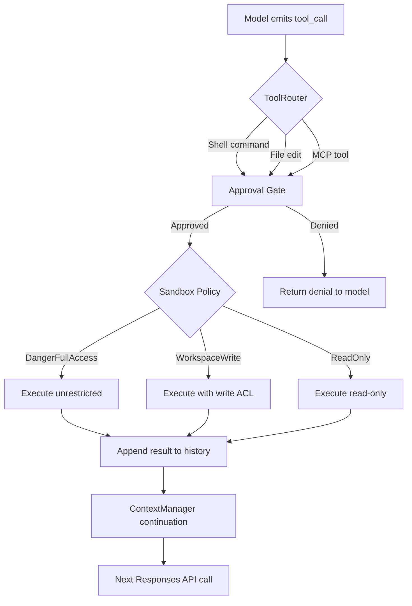
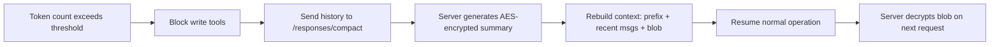

# How the Codex CLI Agentic Loop Works in Detail to the Code Level

**Date:** 2026-04-07
**Tags:** agentic-loop, internals, source-code, event-loop, tool-dispatch, approval-gates, sandbox, architecture, deep-dive

---

Every time you type a prompt into Codex CLI, a carefully orchestrated machinery of Rust async tasks, streaming API calls, tool dispatchers, and OS-level sandboxes springs into action. This article traces the complete lifecycle of a single turn through the Codex CLI codebase — from keystroke to committed code — referencing the actual crate structure, key source files, and design decisions that make it work.

## The Cargo Workspace at a Glance

Codex CLI ships as a single binary compiled from a Cargo workspace of approximately 84 member crates[^1]. The crates that matter most for understanding the agentic loop are:

| Crate | Responsibility |
|---|---|
| `codex-core` | Session management, model API communication, tool orchestration |
| `codex-protocol` | Shared wire types (`Op`, `EventMsg`, items) |
| `codex-tui` | Interactive terminal UI (Ratatui-based) |
| `codex-exec` | Headless non-interactive execution (`codex exec`) |
| `codex-cli` | Multitool dispatcher routing subcommands |
| `codex-config` | Layered configuration with validation |

The binary entry point lives in `codex-cli`, which delegates to either `codex-tui` (interactive) or `codex-exec` (headless) after parsing arguments[^1].

## The Submission/Event Architecture

Codex decouples its user interface from the agent engine using an **asynchronous submission/event queue pattern**[^1]. Two primitives define the contract:

- **`Codex::submit(Op)`** — clients push operations (user turns, approvals, interrupts) wrapped in `Submission` envelopes carrying unique IDs and optional W3C trace context for distributed tracing.
- **`Codex::next_event()`** — the engine emits `EventMsg` notifications (message deltas, tool status updates, approval requests) back to the UI.

This separation means the TUI, the exec harness, and the app-server for IDE integration all consume the same event stream. The `submission_loop` runs as a dedicated Tokio task, ensuring linearised state changes whilst supporting concurrent event processing across multiple client connections[^1].

```mermaid
sequenceDiagram
    participant User as User / IDE
    participant Sub as Codex::submit()
    participant Loop as submission_loop (Tokio task)
    participant Ctx as ContextManager
    participant API as Responses API (SSE)
    participant Tools as ToolRouter
    participant Evt as Codex::next_event()

    User->>Sub: Op::UserTurn(prompt)
    Sub->>Loop: Submission { id, op, trace_ctx }
    Loop->>Ctx: Record user input, build prompt
    Ctx->>API: POST /v1/responses (streaming)
    API-->>Loop: SSE: response.output_text.delta
    Loop-->>Evt: EventMsg::TextDelta
    API-->>Loop: SSE: response.output_item.added (tool_call)
    Loop->>Tools: Dispatch tool call
    Tools-->>Loop: Tool result
    Loop->>Ctx: Append result to history
    Ctx->>API: POST /v1/responses (continuation)
    API-->>Loop: SSE: response.completed
    Loop-->>Evt: EventMsg::TurnComplete
    Evt-->>User: Render final output
```

## Thread and Turn Semantics

Codex models conversations as a hierarchy of **Threads** and **Turns**[^1]:

- A **Thread** is a persistent conversation backed by SQLite (`StateDB`). Threads survive process restarts and can be resumed, forked, archived, or rolled back.
- A **Turn** is one round-trip cycle: user input triggers model inference, which may produce tool calls whose results feed back into the model until a final assistant message appears.
- **Items** are granular events within a turn — agent messages, shell output, file edits, reasoning traces.

The `ThreadManager` orchestrates multiple `CodexThread` instances (a primary agent plus any sub-agents), each maintaining its own `ContextManager` for message history and token accounting[^1].

## Prompt Assembly and the Responses API

Each turn begins with the `ContextManager` assembling a prompt for the OpenAI Responses API. The prompt structure follows a strict ordering to maximise cache hits[^2]:

1. **System message** — general rules, coding standards
2. **Tools** — conforming to the Responses API tool schema
3. **Developer instructions** — from `config.toml`, `AGENTS.md`, `AGENTS.override.md`, and skill-based instructions (subject to a 32 KiB default limit)[^2]
4. **Input sequence** — the full conversation history (text, images, file inputs, tool results)

Codex deliberately avoids the `previous_response_id` parameter despite the apparent inefficiency of resending the full history each time. This design choice ensures every request is **stateless**, enabling Zero Data Retention (ZDR) compliance for enterprise customers who reject server-side data storage[^2].

The API is called via one of three endpoints depending on authentication[^2]:

| Auth Method | Endpoint |
|---|---|
| ChatGPT login | `chatgpt.com/backend-api/codex/responses` |
| API key | `api.openai.com/v1/responses` |
| Local/OSS models | `localhost:11434/v1/responses` (with `--oss`) |

Responses stream back as **Server-Sent Events (SSE)**: `response.output_text.delta` events drive incremental UI rendering, whilst `response.output_item.added` events signal tool call requests requiring dispatch[^2].

## Tool Dispatch: The ToolRouter

When the model emits a tool call, the `ToolRouter` (in `codex-core`) classifies and dispatches it to one of three execution backends[^1]:

### Built-in Shell Tools

Shell commands route through the `UnifiedExecProcessManager`, which manages PTY allocation and long-running process lifecycle. The system prompt teaches a **shell-first toolkit** — `cat` for reading, `grep`/`find` for searching, test runners and linters for verification — reserving file mutation for the dedicated `apply_patch` envelope[^3].

### The apply_patch System

File modifications use a structured patch format rather than raw shell writes. The binary supports a special invocation mode: when `arg1` is `--codex-run-as-apply-patch`, the process acts as a virtual patch CLI[^4]. This ensures all file edits pass through a validated, diffable pathway rather than unconstrained shell writes.

### MCP Server Integration

External tools (database queries, API calls, custom integrations) are accessed via the Model Context Protocol. The `McpConnectionManager` maintains lifecycle management for MCP servers over stdio or HTTP bridges, routing tool calls through the same approval and sandbox policy as built-in tools[^1].



## The Approval Gate State Machine

Before any tool executes, it passes through an approval gate governed by the `AskForApproval` enum[^1][^5]:

| Mode | Behaviour |
|---|---|
| `UnlessTrusted` | Auto-approves safe read-only operations; prompts for writes and network access |
| `OnRequest` | The model itself decides when to request user consent |
| `Never` | No prompts — used in non-interactive `codex exec` modes |

These map to the user-facing approval modes[^5]:

- **Auto** (default) — reads and workspace-scoped edits proceed; out-of-scope writes and network access require confirmation.
- **Read-only** — consultative mode; all mutations require explicit approval.
- **Full Access** — unrestricted; use sparingly with trusted repositories.

Approval state persists across session resumption via SQLite `StateDB`, so resuming a thread retains the user's previous policy decisions[^1].

## Sandbox Lifecycle: Landlock, Seatbelt, and arg0 Dispatch

The sandbox is Codex CLI's most distinctive architectural feature — enforcement happens at the **kernel level**, not the application layer[^6].

### Platform-Specific Backends

| Platform | Mechanism | Implementation |
|---|---|---|
| Linux | Landlock LSM (+ optional Bubblewrap pipeline) | `codex-linux-sandbox` binary alias |
| macOS | Seatbelt sandbox profiles | Confined mode via `sandbox-exec` |
| Windows | Restricted token elevation | Via WSL2 |

### The arg0 Dispatch Pattern

The entry point wraps the main function in `arg0_dispatch_or_else()`[^4]. This function inspects the binary name at invocation time:

- If invoked as **`codex-linux-sandbox`**, it immediately executes a sandboxed command using Landlock restrictions without parsing regular CLI arguments.
- Otherwise, it loads environment variables, patches `PATH`, and proceeds to normal CLI logic — but crucially, it passes the sandbox executable path downstream so `codex-core` can re-invoke itself with restrictions when executing tool calls.

This self-referential dispatch pattern means the sandbox helper is embedded within the same binary rather than requiring a separate sidecar process[^4].

### Sandbox Policies

Three policy levels control what the sandbox permits[^1]:

- **`DangerFullAccess`** — unrestricted filesystem and network access.
- **`WorkspaceWrite`** — write access limited to the current working directory and explicitly specified roots.
- **`ReadOnly`** — filesystem read-only to allowed directory roots.

Every tool call flows through a centralised execution system in the `ToolOrchestrator` that selects the appropriate sandbox based on the current approval mode and the tool's risk classification[^4]. You can test sandbox behaviour directly using `codex debug seatbelt` or `codex debug landlock`[^4].

## Context Window Management and Compaction

With GPT-5.4's 1M token context window[^7], Codex can sustain long sessions — but history still grows, and the entire conversation is included in every request[^2]. Two strategies keep this manageable:

### Prompt Caching

Codex structures prompts so that static content (system instructions, tool definitions) occupies the prefix and variable content (conversation history) appends to the end. With cache hits, sampling cost becomes **linear rather than quadratic**[^2]. Empirical measurements show[^8]:

| Scenario | Cache Hit Rate | Median TTFT | Cost per Request |
|---|---|---|---|
| Stable prefixes | 85% | 953 ms | $0.009 |
| Perturbed prefixes | 0% | 2,727 ms | $0.033 |

That is a **65% latency reduction and 71% cost reduction** from prefix consistency alone.

Cache misses are triggered by mid-conversation configuration changes: tool availability modifications, model switching, sandbox reconfiguration, approval mode changes, or working directory updates[^2].

### Automatic Compaction

Token tracking lives in `codex-rs/core/src/context_manager/history.rs`. The `estimate_response_item_model_visible_bytes()` function serialises items and applies byte-to-token heuristics, with `Session::recompute_token_usage()` in `codex.rs` calling `ContextManager::estimate_token_count()` to maintain running totals[^9].

When usage exceeds `model_auto_compact_token_limit` (approximately 95% of the effective window — around 180K–244K tokens depending on the model), auto-compaction triggers[^9]. The process, implemented in `codex-rs/core/src/compact.rs`[^10]:

1. The full conversation history is sent to the `/responses/compact` endpoint with a dedicated summarisation prompt.
2. The server generates a structured summary and returns it **AES-encrypted**[^8]. The encryption keys remain server-side, preventing clients from inspecting or tampering with summaries.
3. Write tools are **blocked before compaction** triggers to prevent mid-refactoring conflicts[^8].
4. The session rebuilds context as: initial prompt + recent user messages (~20K tokens) + the encrypted summary blob.
5. On subsequent requests, OpenAI's servers decrypt the blob and inject it with a handoff prompt before feeding context to the model.

The implementation includes retry logic with exponential backoff for failed compactions, and warns that "long conversations and multiple compactions can cause the model to be less accurate"[^10]. Users can also trigger compaction manually via the `/compact` slash command.



## The App Server: JSON-RPC for IDE Integration

For IDE integration (VS Code, Cursor, JetBrains), the `codex-api` crate exposes a **JSON-RPC 2.0 interface over stdio (JSONL)**[^1][^11]. The server comprises four main components:

1. **Stdio reader** — parses incoming JSON-RPC calls
2. **CodexMessageProcessor** — translates between wire protocol and internal types
3. **Thread manager** — creates, resumes, and forks threads
4. **Core threads** — the actual `CodexThread` instances running the agentic loop

The `EventMsg` notifications from the core are translated into JSON-RPC notifications, enabling IDEs to render streaming output, display approval prompts, and show tool execution status in real time[^11].

## Session Persistence and Rollout Files

Every session is persisted as compressed JSONL (`.jsonl.zst`) files in `~/.codex/sessions/` organised by date[^1]. The `RolloutRecorder` filters events based on persistence mode and writes timestamped files enabling:

- **Resumption** — replay events to restore conversation state
- **Forking** — branch a conversation at any point
- **Audit trail** — complete operational history for compliance

Each rollout file contains session metadata and serialised event items sufficient for full reconstruction[^1].

## Error Recovery

When tool execution fails, the error output is appended to the conversation history and fed back to the model as a tool result. The model then reasons about the failure and decides whether to retry with a modified approach, try an alternative strategy, or report the failure to the user. This is not explicit retry logic in the orchestrator — rather, the model's own reasoning drives recovery, consistent with the ReAct pattern[^2].

Compaction failures are the exception: `compact.rs` implements explicit retry with exponential backoff before falling back to continued operation with the uncompacted history[^10].

## Comparative Architecture: Claude Code

For context, Claude Code takes a fundamentally different approach to several of these concerns[^7]:

- **Sandbox**: Application-layer hooks with 17 lifecycle event types (e.g., `PreToolUse` on Bash) rather than kernel-level enforcement.
- **Context**: 200K token window (vs. Codex's 1M) compensated by codebase retrieval and cascading `CLAUDE.md` hierarchy.
- **Multi-agent**: Interactive subagent spawning via Task tool with real-time synthesis, versus Codex's fire-and-forget cloud delegation supporting up to 6 concurrent threads.

Both approaches are valid — Codex optimises for security-first isolation and large-context reasoning; Claude Code optimises for flexible programmable hooks and retrieval-augmented generation.

## Key Takeaways

The Codex CLI agentic loop is not a simple prompt-response cycle. It is a production-grade async runtime with kernel-level sandboxing, encrypted context compaction, stateless API design for ZDR compliance, and a self-referential binary that re-invokes itself to enforce sandbox restrictions. Understanding these internals is essential for anyone building custom harnesses, debugging unexpected behaviour, or extending Codex through MCP servers and skills.

---

## Citations

[^1]: [Architecture Overview — openai/codex — DeepWiki](https://deepwiki.com/openai/codex)
[^2]: [Building Production-Ready AI Agents: OpenAI Codex CLI Architecture and Agent Loop Design — ZenML](https://www.zenml.io/llmops-database/building-production-ready-ai-agents-openai-codex-cli-architecture-and-agent-loop-design)
[^3]: [Codex CLI: The Definitive Technical Reference — Blake Crosley](https://blakecrosley.com/guides/codex)
[^4]: [Sandboxing and Security Policies — openai/codex — DeepWiki](https://deepwiki.com/openai/codex/6.3-configuration-management)
[^5]: [Agent approvals & security — Codex — OpenAI Developers](https://developers.openai.com/codex/agent-approvals-security)
[^6]: [A deep dive on agent sandboxes — Pierce Freeman](https://pierce.dev/notes/a-deep-dive-on-agent-sandboxes)
[^7]: [Codex CLI vs Claude Code in 2026: Architecture Deep Dive — Blake Crosley](https://blakecrosley.com/blog/codex-vs-claude-code-2026)
[^8]: [How Codex Solves the Compaction Problem Differently — Tony Lee](https://tonylee.im/en/blog/codex-compaction-encrypted-summary-session-handover/)
[^9]: [Context Compaction Research: Claude Code, Codex CLI, OpenCode, Amp — GitHub Gist](https://gist.github.com/badlogic/cd2ef65b0697c4dbe2d13fbecb0a0a5f)
[^10]: [Automatically compacting context — OpenAI Developer Community](https://community.openai.com/t/automatically-compacting-context/1376290)
[^11]: [Unlocking the Codex harness: how we built the App Server — OpenAI](https://openai.com/index/unlocking-the-codex-harness/)
