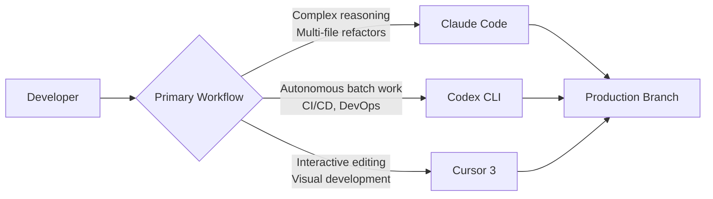
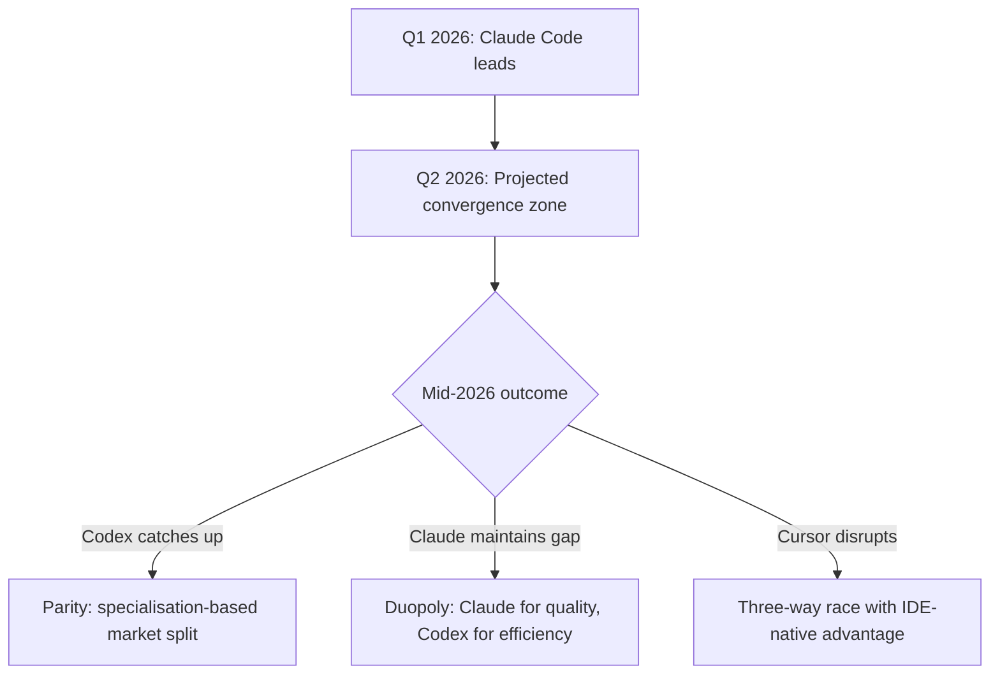

# Codex CLI Competitive Position April 2026: The Road to Parity with Claude Code

**Date:** 2026-04-07
**Tags:** competitive-analysis, claude-code, cursor, market-position, adoption, strengths-weaknesses, trajectory

---

The AI coding agent market has consolidated rapidly. Three products — Claude Code, GitHub Copilot, and Cursor — now control over 70% of a market worth an estimated $4 billion annually[^1]. Codex CLI, backed by GPT-5.3-Codex and a thriving open-source community, sits firmly in Tier 1 alongside Claude Code. This article examines where Codex CLI stands in April 2026, where it leads, where it trails, and whether the parity trajectory holds.

## Market Landscape: The April 2026 Tier List

TokenCalculator's April 2026 ranking divides the field into three tiers[^2]:

| Tier | Tool | Positioning |
|------|------|-------------|
| **Tier 1 — Leaders** | Claude Code (Anthropic) | Best agentic reasoning, largest context window |
| | OpenAI Codex (CLI + App) | Best sandbox, background agents, open-source CLI |
| **Tier 2 — Strong Contenders** | Cursor 3 | Best interactive IDE experience |
| | GitHub Copilot | Enterprise distribution, Microsoft integration |
| **Tier 3 — Falling Behind** | Google Antigravity | Promising launch, stalled roadmap |
| | Windsurf (Cognition) | Niche positioning |

Claude Code dominates developer sentiment with a 46% "most loved" rating versus 19% for Cursor and just 9% for Copilot[^3]. It has captured 41% market share among professional developers, overtaking Copilot's 38% in barely eight months since launch[^3]. In the agentic coding subcategory specifically, 71% of developers who regularly use AI agents use Claude Code[^3].

Codex, meanwhile, has grown to over 2 million weekly active users as of March 2026, with token throughput up fivefold since the GPT-5.3-Codex launch in February[^4]. Enterprise adoption includes Cisco, Nvidia, Ramp, Rakuten, and Harvey[^4].

## Benchmark Comparison: Specialisation, Not Supremacy

The benchmarks tell a nuanced story of specialisation rather than outright dominance by either tool[^5]:

| Benchmark | GPT-5.3-Codex | Opus 4.6 (Claude) | Winner |
|-----------|---------------|---------------------|--------|
| SWE-Bench Pro | 56.8% | — | — |
| SWE-Bench Verified | 80.0% (GPT-5.2) | 80.8% | Claude (marginal) |
| Terminal-Bench 2.0 (model) | 75.1% | 65.4% | **Codex** |
| Terminal-Bench 2.0 (framework) | 77.3% | 69.9% | **Codex** |
| OSWorld-Verified | 64.7% | 72.7% | Claude |
| GDPval-AA (knowledge work) | — | +144 Elo | Claude |

GPT-5.3-Codex leads decisively on terminal and CLI automation tasks — the bread and butter of Codex CLI's design philosophy[^5][^6]. Opus 4.6 leads on GUI automation, knowledge work, and the headline SWE-Bench Verified metric[^5]. The gap on SWE-Bench Verified is vanishingly small (0.8 percentage points), but Claude Code's advantage on complex reasoning tasks remains meaningful.

Direct comparison is complicated by reporting differences: OpenAI publishes SWE-Bench Pro scores whilst Anthropic reports Verified scores, making like-for-like analysis difficult[^5].

## Where Codex CLI Leads

### Kernel-Level Sandboxing

Codex CLI's security model is architecturally distinct. On Linux, it uses bubblewrap with seccomp filters and Landlock LSM for filesystem isolation. On macOS, it enforces Seatbelt policies via `sandbox-exec`[^7]. Network access is disabled by default, significantly reducing prompt injection and data exfiltration risks[^7].

```bash
# Full-auto mode with kernel sandbox — no approval gates
codex --full-auto "refactor auth module to use JWT"

# The sandbox restricts:
# - Network access (disabled by default)
# - Filesystem access (workspace only)
# - Process spawning (filtered by seccomp)
```

Claude Code, by contrast, relies on application-layer hooks for security[^8]. For regulated industries and CI/CD pipelines, Codex CLI's OS-enforced isolation is a genuine differentiator.

### Token Efficiency

GPT-5.3-Codex uses approximately 4x fewer tokens than Claude Code for equivalent tasks[^8]. At scale, this translates directly to cost savings. For the 80% of solo developers doing moderate daily work, Codex CLI at $20/month is better value per dollar[^2].

### Background Agents and Cloud Execution

Codex's background agent model — define a task, hand it off, review the branch later — is a genuine workflow innovation[^2]. The sandboxed cloud execution environment produces PR-ready output that is polished and production-ready[^2].

### Open-Source Community

Codex CLI is Apache 2.0 licensed with 67,000+ GitHub stars and 400+ contributors[^8]. This has spawned a healthy fork ecosystem, most notably **Every Code** (`just-every/code`, 3,700+ stars), which adds multi-model orchestration across OpenAI, Claude, and Gemini providers, browser integration, Auto Drive multi-agent automation, and background auto-review via ghost-commit watchers[^9].

## Where Claude Code Leads

### Context Window and Multi-File Reasoning

Opus 4.6 offers a 200K standard context window with a 1M-token beta, compared to GPT-5.3-Codex's 400K standard[^5]. ⚠️ Effective context utilisation varies by task, and raw window size is not always the binding constraint. However, for large monorepo refactoring — where changes cascade across frontend, backend, database, and test layers — Claude Code's ability to hold more context and reason about complex interactions gives it a measurable edge[^10].

### Implicit Convention Understanding

Claude Code demonstrates stronger understanding of implicit project conventions — coding styles, architectural patterns, and team-specific idioms that are not explicitly documented[^2]. This "naturalness" in tool usage patterns makes it feel more like a senior pair programmer and less like a script executor.

### Agent Coordination

Claude Code's Agent Teams feature enables direct agent-to-agent communication for parallel task execution[^10]. Codex CLI supports subagents for task parallelisation but lacks equivalent cross-agent coordination[^10]. For orchestrating complex, multi-step workflows that require handoffs between specialised agents, Claude Code is ahead.

## The Cursor 3 Factor

Cursor 3 launched on 2 April 2026 with a fundamental architectural pivot from IDE-with-AI to agent-first workspace[^11]. The new Agents Window provides a centralised command hub for managing multi-step, autonomous tasks. Key capabilities include:

- Parallel cloud agents for simultaneous task execution
- Multi-repo support with seamless local/cloud handoff
- Design Mode for visual development workflows
- Integrated browsing, plugin, and PR tooling[^11]



The strategic significance is that Cursor's pivot validates the agentic model that Claude Code and Codex CLI pioneered. Cursor 3 comes as Claude Code reportedly holds 54% of the agentic coding market[^12], suggesting Cursor is playing catch-up in this segment whilst leveraging its IDE-native advantage.

## The Parity Trajectory

TokenCalculator's analysis suggests Codex could pull even with Claude Code by mid-2026 if current trends continue[^2]. Several factors support this:

1. **Model velocity**: GPT-5.3-Codex is 25% faster than its predecessor with fewer tokens consumed[^6]. GPT-5.4 has already been announced[^13], suggesting rapid iteration continues.
2. **Adoption momentum**: From 1 million downloads to 2 million weekly active users in under two months[^4].
3. **Enterprise traction**: Named enterprise deployments at Cisco, Nvidia, and others signal institutional confidence[^4].
4. **Open-source moat**: The fork ecosystem (Every Code, Open Codex, and others) creates a gravitational pull that proprietary tools cannot replicate.

Against parity, several structural advantages favour Claude Code:

1. **Reasoning depth**: The GDPval-AA Elo gap (+144) reflects genuine architectural differences in reasoning capability[^5].
2. **Market momentum**: 41% market share and $2.5 billion ARR provide resources for rapid iteration[^3].
3. **Developer love**: A 46% "most loved" rating creates retention that is difficult to overcome[^3].



## Practical Guidance

For teams choosing today, the data supports a multi-tool strategy:

| Workflow | Recommended Tool | Rationale |
|----------|-----------------|-----------|
| Autonomous background tasks | Codex CLI (`--full-auto`) | Kernel sandbox, token efficiency, PR-ready output |
| Complex multi-file refactors | Claude Code | Larger context, stronger cross-file reasoning |
| Interactive development | Cursor 3 | IDE-native experience, parallel agents |
| CI/CD pipeline integration | Codex CLI (`codex exec`) | OS-level isolation, deterministic execution |
| Enterprise with Microsoft stack | GitHub Copilot | Distribution, compliance, SSO integration |

The "best developers use both" pattern identified by multiple analysts[^8] is not a hedge — it reflects genuine specialisation in the tools. Codex CLI's Unix-philosophy approach (do one thing well, in a sandbox, with maximum efficiency) complements Claude Code's deep-reasoning, convention-aware approach.

## What to Watch

- **GPT-5.4's coding benchmarks**: Will the next model close the SWE-Bench Verified and OSWorld gaps?
- **Codex CLI Agent Teams equivalent**: Cross-agent coordination is the most significant feature gap.
- **Every Code's trajectory**: If the fork ecosystem consolidates around multi-model orchestration, it could reshape the competitive dynamics entirely.
- **Google Antigravity**: Three months of silence after a promising January launch. Either a pivot is coming or the product is being deprioritised.

---

## Citations

[^1]: [The $4 Billion Coding Agent Market Just Consolidated — Seven Olives](https://sevenolives.com/blog/ai-coding-agents-4-billion-market-consolidation-2026)
[^2]: [Best AI IDE & CLI Tools April 2026 — TokenCalculator](https://tokencalculator.com/blog/best-ai-ide-cli-tools-april-2026-claude-code-wins)
[^3]: [Claude Code Hits 41% Share, Overtakes Copilot's 38% — byteiota](https://byteiota.com/claude-code-hits-41-share-overtakes-copilots-38/)
[^4]: [OpenAI sees Codex users spike to 1.6 million — Fortune](https://fortune.com/2026/03/04/openai-codex-growth-enterprise-ai-agents/)
[^5]: [Codex CLI vs Claude Code 2026: Opus 4.6 vs GPT-5.3-Codex Compared — SmartScope](https://smartscope.blog/en/generative-ai/chatgpt/codex-vs-claude-code-2026-benchmark/)
[^6]: [Introducing GPT-5.3-Codex — OpenAI](https://openai.com/index/introducing-gpt-5-3-codex/)
[^7]: [Agent approvals & security — Codex CLI OpenAI Developers](https://developers.openai.com/codex/agent-approvals-security)
[^8]: [Claude Code vs Codex CLI 2026: Which Terminal AI Coding Agent Wins? — NxCode](https://www.nxcode.io/resources/news/claude-code-vs-codex-cli-terminal-coding-comparison-2026)
[^9]: [Every Code — GitHub](https://github.com/just-every/code)
[^10]: [Codex vs Claude Code: Which CLI Agent Wins for Your Workflow — Particula](https://particula.tech/blog/codex-vs-claude-code-cli-agent-comparison)
[^11]: [Cursor Launches Agent-First Cursor 3 Interface — Creati.ai](https://creati.ai/ai-news/2026-04-06/cursor-3-agent-first-interface-claude-code-codex/)
[^12]: [Cursor 3 Shifts to Agent Orchestration Amid Market Pressure — Implicator](https://www.implicator.ai/cursor-3-shifts-to-agent-orchestration-as-claude-code-claims-54-of-coding-market/)
[^13]: [Introducing GPT-5.4 — OpenAI](https://openai.com/index/introducing-gpt-5-4/)
