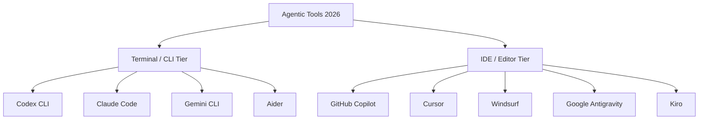
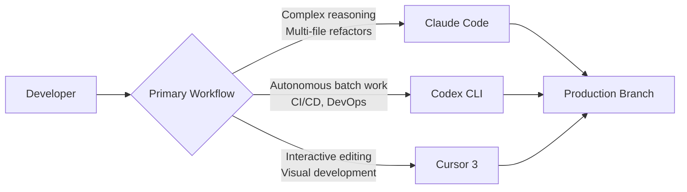
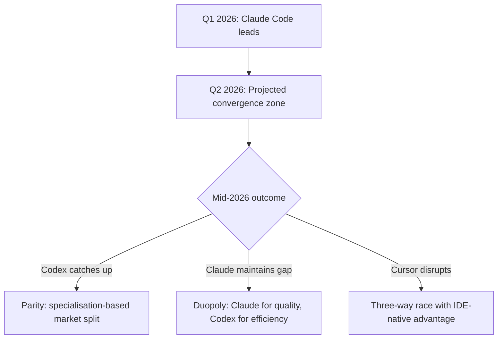
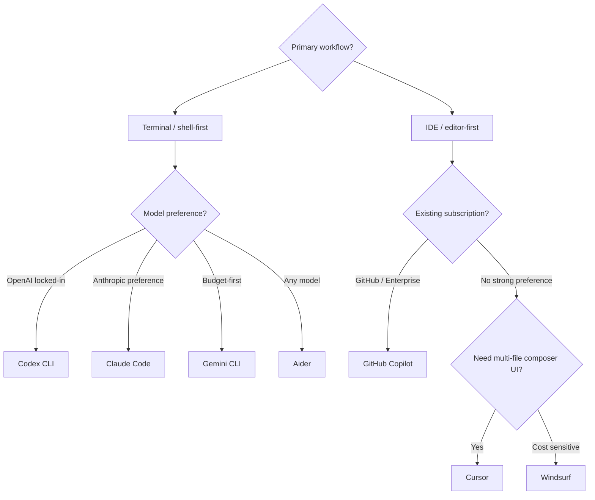

# Codex CLI Competitive Position April 2026: The Road to Parity with Claude Code


---

The AI coding agent market has consolidated rapidly. Three products — Claude Code, GitHub Copilot, and Cursor — now control over 70% of a market worth an estimated $4 billion annually[^1]. Codex CLI, backed by GPT-5.3-Codex and a thriving open-source community, sits firmly in Tier 1 alongside Claude Code. This article is a consolidated reference covering the full competitive landscape: where Codex CLI stands in April 2026, where it leads, where it trails, and how every serious contender — including Google Antigravity and Kiro — fits into the picture.

## The Two-Tier Framework

The first structural split in the landscape is between **terminal agents** (tools invoked from the shell, operating on the filesystem and running commands) and **IDE agents** (tools embedded inside an editor, offering completions, multi-file edits, and agent sessions). Some tools straddle both, but primary design philosophy determines which tier they belong to[^14].



## Market Landscape: The April 2026 Tier List

TokenCalculator's April 2026 ranking divides the field into three tiers[^2]:

| Tier | Tool | Positioning |
|------|------|-------------|
| **Tier 1 — Leaders** | Claude Code (Anthropic) | Best agentic reasoning, largest context window |
| | OpenAI Codex (CLI + App) | Best sandbox, background agents, open-source CLI |
| **Tier 2 — Strong Contenders** | Cursor 3 | Best interactive IDE experience |
| | GitHub Copilot | Enterprise distribution, Microsoft integration |
| **Tier 3 — Falling Behind** | Google Antigravity | Promising launch, stalled roadmap |
| | Windsurf (Cognition) | Niche positioning |

Claude Code dominates developer sentiment with a 46% "most loved" rating versus 19% for Cursor and just 9% for Copilot[^3]. It has captured 41% market share among professional developers, overtaking Copilot's 38% in barely eight months since launch[^3]. In the agentic coding subcategory specifically, 71% of developers who regularly use AI agents use Claude Code[^3].

Codex, meanwhile, has grown to over 2 million weekly active users as of March 2026, with token throughput up fivefold since the GPT-5.3-Codex launch in February[^4]. Enterprise adoption includes Cisco, Nvidia, Ramp, Rakuten, and Harvey[^4].

### The Full Seven Contenders

Beyond the Tier 1 leaders, the complete landscape includes seven serious tools[^14][^15]:

| Tool | Paradigm | Best For | Price |
|------|---------|---------|-------|
| **OpenAI Codex CLI** | Terminal agent | Throughput, CI/CD, precision tasks | Included with ChatGPT Plus+ |
| **Claude Code** | Terminal agent | Architectural reasoning, hard problems | $20/mo (Pro); $100–$200 (Max) |
| **Google Antigravity** | IDE + Manager + Browser | Multi-agent orchestration experiments | Free (public preview) |
| **Kiro** | Spec-driven IDE | Structure-first development, AWS teams | ~$20/month |
| **Cursor** | IDE agent | Daily IDE use, stability, SOC 2 | Various |
| **Windsurf** | IDE agent | Budget-conscious IDE-first teams | $15/month |
| **GitHub Copilot / Agent HQ** | Issue-to-PR agent | GitHub-native async workflows | Part of Copilot subscription |

## Benchmark Comparison: Specialisation, Not Supremacy

The benchmarks tell a nuanced story of specialisation rather than outright dominance by either tool[^5]:

| Benchmark | GPT-5.3-Codex | Opus 4.6 (Claude) | Winner |
|-----------|---------------|---------------------|--------|
| SWE-Bench Pro | 56.8% | — | — |
| SWE-Bench Verified | 80.0% (GPT-5.2) | 80.8% | Claude (marginal) |
| Terminal-Bench 2.0 (model) | 75.1% | 65.4% | **Codex** |
| Terminal-Bench 2.0 (framework) | 77.3% | 69.9% | **Codex** |
| OSWorld-Verified | 64.7% | 72.7% | Claude |
| GDPval-AA (knowledge work) | — | +144 Elo | Claude |

GPT-5.3-Codex leads decisively on terminal and CLI automation tasks — the bread and butter of Codex CLI's design philosophy[^5][^6]. Opus 4.6 leads on GUI automation, knowledge work, and the headline SWE-Bench Verified metric[^5]. The gap on SWE-Bench Verified is vanishingly small (0.8 percentage points), but Claude Code's advantage on complex reasoning tasks remains meaningful.

Direct comparison is complicated by reporting differences: OpenAI publishes SWE-Bench Pro scores whilst Anthropic reports Verified scores, making like-for-like analysis difficult[^5].

### Wider Benchmark Context

Including the broader field provides additional reference points[^15][^16]:

| Tool | SWE-bench Verified | Notes |
|------|--------------------|-------|
| Codex CLI (GPT-5.4) | ~74% | Best throughput per dollar |
| Claude Code (Opus 4.6) | ~77% | Best absolute performance |
| Google Antigravity (Gemini 3 Pro) | 76.2% | Free (throttled) |
| Kiro (Claude Sonnet 4.5) | ~72% | Spec-driven, structured |
| Cursor | Not published | Best IDE UX |

Benchmarks are directional — contamination concerns apply. SWE-bench Verified is the cleanest public benchmark but still imperfect.

## Where Codex CLI Leads

### Kernel-Level Sandboxing

Codex CLI's security model is architecturally distinct. On Linux, it uses bubblewrap with seccomp filters and Landlock LSM for filesystem isolation. On macOS, it enforces Seatbelt policies via `sandbox-exec`[^7]. Network access is disabled by default, significantly reducing prompt injection and data exfiltration risks[^7].

Three approval modes map to distinct autonomy levels[^17]:

- **Suggest** — reads files freely, requires explicit approval before any write or command
- **Auto Edit** — applies file changes automatically, still prompts before executing shell commands
- **Full Auto** — runs without interruption; intended for CI pipelines and trusted environments

```bash
# Full-auto mode with kernel sandbox — no approval gates
codex --full-auto "refactor auth module to use JWT"

# The sandbox restricts:
# - Network access (disabled by default)
# - Filesystem access (workspace only)
# - Process spawning (filtered by seccomp)
```

Claude Code, by contrast, relies on application-layer hooks for security[^8]. For regulated industries and CI/CD pipelines, Codex CLI's OS-enforced isolation is a genuine differentiator.

### Token Efficiency

GPT-5.3-Codex uses approximately 4x fewer tokens than Claude Code for equivalent tasks[^8]. Independent testing on a Figma plugin task measured Codex at 1.5M tokens versus Claude Code's 6.2M[^18]. At scale, this translates directly to cost savings. For the 80% of solo developers doing moderate daily work, Codex CLI at $20/month is better value per dollar[^2].

### Background Agents and Cloud Execution

Codex's background agent model — define a task, hand it off, review the branch later — is a genuine workflow innovation[^2]. The sandboxed cloud execution environment produces PR-ready output that is polished and production-ready[^2].

### Open-Source Community

Codex CLI is Apache 2.0 licensed with 67,000+ GitHub stars and 400+ contributors[^8]. This has spawned a healthy fork ecosystem, most notably **Every Code** (`just-every/code`, 3,700+ stars), which adds multi-model orchestration across OpenAI, Claude, and Gemini providers, browser integration, Auto Drive multi-agent automation, and background auto-review via ghost-commit watchers[^9].

## Where Claude Code Leads

### Context Window and Multi-File Reasoning

Opus 4.6 offers a 200K standard context window with a 1M-token beta, compared to GPT-5.3-Codex's 400K standard[^5]. Effective context utilisation varies by task, and raw window size is not always the binding constraint. However, for large monorepo refactoring — where changes cascade across frontend, backend, database, and test layers — Claude Code's ability to hold more context and reason about complex interactions gives it a measurable edge[^10].

### Programmable Hooks and Policy Logic

Claude Code exposes 17 programmable hook events (`PreToolUse`, `PostToolUse`, `SessionStart`, `Stop`, `userpromptsubmit`, and others) that encode arbitrarily complex policy logic in shell scripts or any executable[^19]. Dangerous `rm -rf` patterns can be blocked, naming conventions enforced, linters run before any commit, or audit webhooks fired. Hooks are programs, not config — a fundamentally different extensibility model from Codex CLI's TOML-based configuration[^18][^19].

### Implicit Convention Understanding

Claude Code demonstrates stronger understanding of implicit project conventions — coding styles, architectural patterns, and team-specific idioms that are not explicitly documented[^2]. This "naturalness" in tool usage patterns makes it feel more like a senior pair programmer and less like a script executor.

### Agent Coordination

Claude Code's Agent Teams feature enables direct agent-to-agent communication for parallel task execution[^10]. Codex CLI supports subagents for task parallelisation but lacks equivalent cross-agent coordination[^10]. For orchestrating complex, multi-step workflows that require handoffs between specialised agents, Claude Code is ahead.

## The Cursor 3 Factor

Cursor 3 launched on 2 April 2026 with a fundamental architectural pivot from IDE-with-AI to agent-first workspace[^11]. Cursor is the dominant IDE agent by revenue — reportedly $2B ARR with a $50B valuation[^20]. The new Agents Window provides a centralised command hub for managing multi-step, autonomous tasks. Key capabilities include:

- Parallel cloud agents for simultaneous task execution
- Multi-repo support with seamless local/cloud handoff
- Design Mode for visual development workflows
- Integrated browsing, plugin, and PR tooling[^11]

Independent testing found Claude Code uses 5.5x fewer tokens than Cursor for identical tasks (33K vs 188K), but Cursor's visual feedback loop is more comfortable for developers who prefer to see exactly what the agent is doing before it lands[^18].



The strategic significance is that Cursor's pivot validates the agentic model that Claude Code and Codex CLI pioneered. Cursor 3 comes as Claude Code reportedly holds 54% of the agentic coding market[^12], suggesting Cursor is playing catch-up in this segment whilst leveraging its IDE-native advantage.

## Google Antigravity: Ambitious but Stalled

Google's agentic IDE, announced November 2025 alongside Gemini 3, represents the most architecturally ambitious entry in the field. It is not just an editor with AI features — it is a full agentic development platform with three distinct surfaces[^15][^21]:

1. **Editor Surface** — A standard VSCode-fork IDE with AI completions and inline commands
2. **Manager Surface** — "Mission control" for spawning and orchestrating multiple agents asynchronously, with auditable artifacts (screenshots, task lists, browser recordings)
3. **Browser Sub-Agent** — A built-in headless Chromium agent that can "see" web apps via Gemini 3's multimodal vision — write code, run it, see the UI, verify it, all in one loop

**AgentKit 2.0** (shipped March 2026): 16 specialized agents, 40+ domain-specific skills, 11 pre-configured command sets covering frontend, backend, testing, and more[^15].

**Models supported:** Gemini 3.1 Pro (High/Low), Gemini 3 Flash, Claude Sonnet 4.6, Claude Opus 4.6, GPT-OSS-120B[^15].

**Free during public preview** — download at antigravity.google[^21].

### The Controversy

Rate limit controversy dominates community discussion. Credits reset weekly rather than every 5 hours as advertised. High-reasoning models (Gemini 3 Pro, Claude Opus) feel throttled. Community verdict: *"a tool for experimentation, not production reliance"* (Vibecoding.app, 3.5/5)[^22].

### Antigravity vs Codex CLI

Antigravity does not directly compete with Codex CLI — different paradigms entirely. But it raises the bar on what "free" multi-agent tooling looks like[^15]:

- **Antigravity's Manager Surface vs Codex's git-worktree approach:** Both enable parallel agents, but Antigravity's UI makes orchestration *visible* in a way the CLI (by design) does not. Engineers who want observability may prefer Antigravity for experimental workflows; engineers who want reproducibility and CI-native automation will stick with Codex.
- **Browser-native verification:** Antigravity's built-in browser agent (write, run, see, verify) is a genuine capability gap vs Codex, which requires external Playwright MCP or skills for browser interaction.
- **Free access to frontier models:** Antigravity offers Claude Opus 4.6 access in its free tier (when not throttled), which is cheaper than running Claude Code on the Max plan.

Three months of relative silence since launch suggest either a pivot is coming or the product is being deprioritised.

## Kiro: AWS's Spec-First IDE

Amazon's entry into agentic coding — formerly **Amazon Q Developer CLI**, rebranded as **Kiro** on November 17, 2025 — takes a fundamentally different approach: spec-driven development[^15].

**Core philosophy:** Convert natural language prompts to structured requirements (EARS notation) before writing a single line of code. Then architecture, then implementation.

**Three-step workflow:**
1. Natural language prompt → structured EARS requirements
2. Requirements → architecture plan
3. Architecture → implementation with automated agent hooks

**Agent hooks** automate follow-up actions (e.g., run tests whenever files are saved). Similar in spirit to Codex hooks, but baked into the IDE workflow rather than configured in `config.toml`[^15].

**Model:** Claude Sonnet 4.5 with an "Auto" mode that blends frontier models with intent detection and prompt caching.

**AWS native:** Integrates with IAM, Bedrock, CodeWhisperer. For AWS-heavy teams, it is a natural fit[^15].

**Price:** ~$20/month flat. No credits system.

### Kiro vs Codex CLI

Use Kiro when the team struggles with AI-generated code that drifts from specifications, when building on AWS with native IAM/Bedrock integration requirements, when a structured and auditable requirements trail from prompt to PR is needed, or when a flat $20/month is preferable to usage-based pricing[^15].

Use Codex CLI when throughput and speed matter more than structured planning, when integrating agents into CI/CD pipelines (`codex exec`), when terminal-native workflows are preferred over an IDE, or when multi-agent parallel execution via git worktrees is required.

## The Remaining Field

### GitHub Copilot

Copilot has undergone the most significant architectural evolution of any tool in this list. What began as autocomplete is now a multi-component platform[^23]:

- **Agent Mode** (VS Code, JetBrains GA — March 2026[^24]): the AI autonomously edits multi-file changes, runs terminal commands, and iterates on failures within the IDE session
- **Copilot Coding Agent** (GA September 2025[^23]): assigns GitHub issues directly to Copilot, which spins up a GitHub Actions sandbox, pushes commits to a draft PR, and requests review when done — fully asynchronous
- **Copilot CLI** (GA March 2026[^25]): agentic terminal mode with Plan mode (overseen) and Autopilot mode (autonomous end-to-end)

Multi-model support is the headline enterprise feature: GPT-4o, GPT-5.1-Codex-Max, Claude Opus 4.5, or Gemini 2.0 Flash per task, or Auto mode for the model picker to choose based on real-time performance[^23]. Individual plan pricing of $10/mo makes Copilot the cheapest capable option[^14].

### Gemini CLI

Google's terminal entry offers the most generous free tier — 60 requests per minute — and a 1M token context window[^26]. It is the logical choice when budget is the binding constraint and there is no deep commitment to either the OpenAI or Anthropic ecosystem.

### Aider

Aider is the model-agnostic option, supporting 500+ LLM providers including every major hosted API and local models via Ollama[^27]. If an organisation mandates a specific model for data residency reasons, or wants to experiment across providers without switching tools, Aider removes that constraint entirely. The trade-off is the absence of an opinionated configuration system (AGENTS.md, profiles, hooks) that makes Codex and Claude Code ergonomic at team scale.

### Windsurf

Windsurf (formerly Codeium) ships Cascade, a fully agentic flow within the IDE. Its primary differentiator is deep context awareness across the repository at lower cost than Cursor's Pro tier[^14].

## The Parity Trajectory

TokenCalculator's analysis suggests Codex could pull even with Claude Code by mid-2026 if current trends continue[^2]. Several factors support this:

1. **Model velocity**: GPT-5.3-Codex is 25% faster than its predecessor with fewer tokens consumed[^6]. GPT-5.4 has already been announced[^13], suggesting rapid iteration continues.
2. **Adoption momentum**: From 1 million downloads to 2 million weekly active users in under two months[^4].
3. **Enterprise traction**: Named enterprise deployments at Cisco, Nvidia, and others signal institutional confidence[^4].
4. **Open-source moat**: The fork ecosystem (Every Code, Open Codex, and others) creates a gravitational pull that proprietary tools cannot replicate.

Against parity, several structural advantages favour Claude Code:

1. **Reasoning depth**: The GDPval-AA Elo gap (+144) reflects genuine architectural differences in reasoning capability[^5].
2. **Market momentum**: 41% market share and $2.5 billion ARR provide resources for rapid iteration[^3].
3. **Developer love**: A 46% "most loved" rating creates retention that is difficult to overcome[^3].



## Decision Framework

The false premise in most comparison articles is the assumption that one tool must be chosen. The pattern that emerges from practitioners in 2026 is layered[^14]:



### Quick-Reference Decision Table

| Decision Point | Tool Wins |
|---|---|
| Kernel-level sandbox, hard boundaries | **Codex CLI** |
| Programmable hooks, complex policy logic | **Claude Code** |
| Async PR generation from a GitHub Issue | **GitHub Copilot Coding Agent** |
| Multi-file edits with visual diffs | **Cursor** |
| Multi-model flexibility in IDE | **GitHub Copilot** or **Cursor** |
| Model-agnostic, 500+ providers | **Aider** |
| Largest free tier | **Gemini CLI** |
| Spec-driven development, AWS-native | **Kiro** |
| Multi-agent orchestration experiments | **Google Antigravity** |
| Terminal-Bench 2.0 best score (77.3%) | **Codex / GPT-5.3-Codex**[^5] |
| SWE-bench Verified leader (80.8%) | **Claude Code / Opus 4.6**[^5] |

### Practical Workflow Recommendations

For teams choosing today, the data supports a multi-tool strategy:

| Workflow | Recommended Tool | Rationale |
|----------|-----------------|-----------|
| Autonomous background tasks | Codex CLI (`--full-auto`) | Kernel sandbox, token efficiency, PR-ready output |
| Complex multi-file refactors | Claude Code | Larger context, stronger cross-file reasoning |
| Interactive development | Cursor 3 | IDE-native experience, parallel agents |
| CI/CD pipeline integration | Codex CLI (`codex exec`) | OS-level isolation, deterministic execution |
| Enterprise with Microsoft stack | GitHub Copilot | Distribution, compliance, SSO integration |
| Async issue resolution | GitHub Copilot Coding Agent | Delegate, walk away, review the PR |
| Spec-driven AWS projects | Kiro | Structured requirements trail, IAM/Bedrock integration |
| Multi-agent experimentation | Google Antigravity | Manager Surface, browser agent (free tier) |

The "best developers use both" pattern identified by multiple analysts[^8] is not a hedge — it reflects genuine specialisation in the tools. Codex CLI's Unix-philosophy approach (do one thing well, in a sandbox, with maximum efficiency) complements Claude Code's deep-reasoning, convention-aware approach.

## What to Watch

- **GPT-5.4's coding benchmarks**: Will the next model close the SWE-Bench Verified and OSWorld gaps?
- **Codex CLI Agent Teams equivalent**: Cross-agent coordination is the most significant feature gap.
- **Every Code's trajectory**: If the fork ecosystem consolidates around multi-model orchestration, it could reshape the competitive dynamics entirely.
- **Google Antigravity**: Three months of silence after a promising launch. Either a pivot is coming or the product is being deprioritised.
- **Kiro adoption curves**: Whether spec-driven development gains traction outside AWS-native teams will determine if Kiro remains niche or enters Tier 2.
- **Copilot CLI maturation**: The March 2026 GA of Copilot CLI introduces a terminal agent with GitHub-native distribution — a potential disruptor if it gains community adoption.

---

## Citations

[^1]: [The $4 Billion Coding Agent Market Just Consolidated — Seven Olives](https://sevenolives.com/blog/ai-coding-agents-4-billion-market-consolidation-2026)
[^2]: [Best AI IDE & CLI Tools April 2026 — TokenCalculator](https://tokencalculator.com/blog/best-ai-ide-cli-tools-april-2026-claude-code-wins)
[^3]: [Claude Code Hits 41% Share, Overtakes Copilot's 38% — byteiota](https://byteiota.com/claude-code-hits-41-share-overtakes-copilots-38/)
[^4]: [OpenAI sees Codex users spike to 1.6 million — Fortune](https://fortune.com/2026/03/04/openai-codex-growth-enterprise-ai-agents/)
[^5]: [Codex CLI vs Claude Code 2026: Opus 4.6 vs GPT-5.3-Codex Compared — SmartScope](https://smartscope.blog/en/generative-ai/chatgpt/codex-vs-claude-code-2026-benchmark/)
[^6]: [Introducing GPT-5.3-Codex — OpenAI](https://openai.com/index/introducing-gpt-5-3-codex/)
[^7]: [Agent approvals & security — Codex CLI OpenAI Developers](https://developers.openai.com/codex/agent-approvals-security)
[^8]: [Claude Code vs Codex CLI 2026: Which Terminal AI Coding Agent Wins? — NxCode](https://www.nxcode.io/resources/news/claude-code-vs-codex-cli-terminal-coding-comparison-2026)
[^9]: [Every Code — GitHub](https://github.com/just-every/code)
[^10]: [Codex vs Claude Code: Which CLI Agent Wins for Your Workflow — Particula](https://particula.tech/blog/codex-vs-claude-code-cli-agent-comparison)
[^11]: [Cursor Launches Agent-First Cursor 3 Interface — Creati.ai](https://creati.ai/ai-news/2026-04-06/cursor-3-agent-first-interface-claude-code-codex/)
[^12]: [Cursor 3 Shifts to Agent Orchestration Amid Market Pressure — Implicator](https://www.implicator.ai/cursor-3-shifts-to-agent-orchestration-as-claude-code-claims-54-of-coding-market/)
[^13]: [Introducing GPT-5.4 — OpenAI](https://openai.com/index/introducing-gpt-5-4/)
[^14]: [AI Coding Agents 2026: Claude Code vs Antigravity vs Codex vs Cursor vs Kiro vs Copilot vs Windsurf — Lushbinary](https://lushbinary.com/blog/ai-coding-agents-comparison-cursor-windsurf-claude-copilot-kiro-2026/)
[^15]: [The 2026 Guide to Coding CLI Tools: 15 AI Agents Compared — Tembo](https://www.tembo.io/blog/coding-cli-tools-comparison)
[^16]: [Google Antigravity vs Gemini CLI — Augment Code](https://www.augmentcode.com/tools/google-antigravity-vs-gemini-cli)
[^17]: [Using Codex with your ChatGPT plan — OpenAI Help Center](https://help.openai.com/en/articles/11369540-using-codex-with-your-chatgpt-plan)
[^18]: [Codex vs Claude Code 2026: Benchmarks, Agent Teams & Limits Compared — MorphLLM](https://www.morphllm.com/comparisons/codex-vs-claude-code)
[^19]: [Hooks reference — Claude Code Docs](https://code.claude.com/docs/en/hooks)
[^20]: [Claude Code vs Cursor vs GitHub Copilot: Honest Comparison 2026 — DEV Community](https://dev.to/_d7eb1c1703182e3ce1782/claude-code-vs-cursor-vs-github-copilot-honest-comparison-2026-1ah6)
[^21]: [Google Antigravity — Google Developers Blog](https://developers.googleblog.com/build-with-google-antigravity-our-new-agentic-development-platform/)
[^22]: [Google AntiGravity Review — Vibecoding.app](https://vibecoding.app/blog/google-antigravity-review)
[^23]: [About GitHub Copilot coding agent — GitHub Docs](https://docs.github.com/en/copilot/concepts/agents/coding-agent/about-coding-agent)
[^24]: [Major agentic capabilities improvements in GitHub Copilot for JetBrains IDEs — GitHub Changelog, March 2026](https://github.blog/changelog/2026-03-11-major-agentic-capabilities-improvements-in-github-copilot-for-jetbrains-ides/)
[^25]: [GitHub Copilot CLI Reaches General Availability — Visual Studio Magazine, March 2026](https://visualstudiomagazine.com/articles/2026/03/02/github-copilot-cli-reaches-general-availability-bringing-agentic-coding-to-the-terminal.aspx)
[^26]: [Gemini CLI — Google Gemini CLI Docs](https://google-gemini.github.io/gemini-cli/)
[^27]: [Connecting to LLMs — Aider Docs](https://aider.chat/docs/llms.html)
