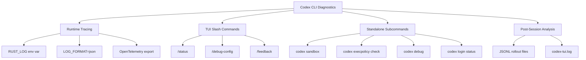
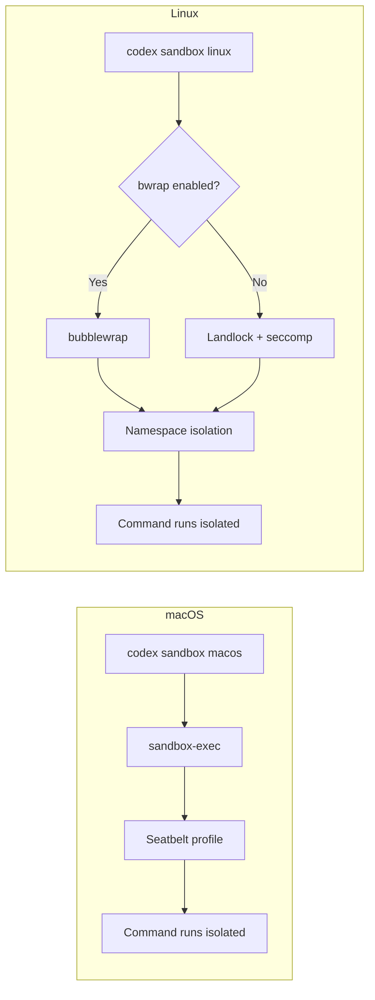

# Codex CLI Diagnostic Toolkit: Tracing, Sandbox Testing, and the Built-In Debugging Commands


Codex CLI ships with a surprisingly deep set of diagnostic tools that most developers never discover. When an agent session stalls, a sandbox blocks a legitimate command, or a config key silently fails to take effect, knowing how to reach for `RUST_LOG`, `codex sandbox`, or `/debug-config` can save hours of guesswork. This article is a systematic reference to every built-in diagnostic surface in Codex CLI as of v0.118.0.

## The Diagnostic Surface Area

Codex CLI's diagnostic capabilities span four layers: runtime tracing via environment variables, interactive slash commands inside the TUI, standalone CLI subcommands for offline testing, and post-session analysis via JSONL rollout files.



## Runtime Tracing with RUST_LOG

Since Codex CLI is built in Rust atop the standard `tracing` crate[^1], the `RUST_LOG` environment variable controls verbosity at module granularity. The default level for Codex crates is `info`[^2].

### Basic Usage

```bash
# Global debug logging
RUST_LOG=debug codex

# Trace-level logging (extremely verbose)
RUST_LOG=trace codex

# Debug logging in non-interactive mode
RUST_LOG=debug codex exec "refactor the auth module"
```

### Module-Targeted Tracing

The real power lies in per-module targeting. Codex's Rust workspace exposes several key tracing targets[^2]:

```bash
# Debug the core agent loop while keeping everything else at info
RUST_LOG=info,codex_core=debug codex

# Trace shell command execution specifically
RUST_LOG=codex_exec=trace,codex_core=debug codex

# Debug sandbox behaviour
RUST_LOG=codex_sandbox=debug,codex_process_hardening=debug codex

# Trace API request/response details
RUST_LOG=codex_core::api=trace codex

# Debug MCP server connections
RUST_LOG=codex_core::mcp=debug codex

# Trace configuration resolution
RUST_LOG=codex_core::config=trace codex

# Trace authentication flows
RUST_LOG=codex_core::auth=trace codex
```

### Structured Log Output

For machine-parseable logs — useful when piping into log aggregation — set the format to JSON[^2]:

```bash
RUST_LOG=debug LOG_FORMAT=json codex exec "run tests" 2>&1 | tee codex-debug.log
```

The compact format is also available via `RUST_LOG_FORMAT=compact`[^2].

### Log File Locations

Codex writes TUI logs to `~/.codex/log/codex-tui.log`, with automatic rotation[^3]. In `codex exec` mode, timestamped log files appear at `~/.codex/logs/codex-tui-<timestamp>.log`[^2]. These can be safely deleted when no longer needed, but they are invaluable for post-mortem debugging.

```bash
# Monitor logs in real time during a session
tail -f ~/.codex/logs/codex-tui-*.log
```

⚠️ **Performance warning**: Debug and trace levels can reduce throughput by 10–50%[^2]. Reserve them for active troubleshooting, not production workflows.

## TUI Slash Commands for Live Diagnostics

Three slash commands provide in-session diagnostic information without leaving the TUI.

### /status — Session Overview

The `/status` command displays the current session configuration and token usage[^4]. This is your first stop when something feels off — it confirms which model is active, the current reasoning effort level, token consumption, and the effective sandbox mode.

### /debug-config — Configuration Layer Diagnostics

When a config key appears to have no effect, `/debug-config` reveals the full configuration resolution stack[^5]. It prints:

- Layer order (lowest to highest precedence)
- The effective value of each key and which layer set it
- Policy details: `allowed_approval_policies`, `allowed_sandbox_modes`, `mcp_servers`, `rules`, `enforce_residency`, and `experimental_network`

This is particularly useful in enterprise environments where `requirements.toml` may silently override your `config.toml` settings[^5]. If your `sandbox_mode = "danger-full-access"` is being ignored, `/debug-config` will show you that a managed policy is enforcing `workspace-write`.

### /feedback — Structured Bug Reports

The `/feedback` command collects diagnostic information and submits it directly to OpenAI's maintainers[^3]. When invoked, it captures:

- Request ID (essential for OpenAI support tickets)
- Session ID
- Connection status (connected/reconnecting/disconnected)
- Last error message
- Active tools count
- MCP server connection status

Always run `/feedback` before closing a session that exhibited unexpected behaviour — the request ID is the single most useful datum when filing issues on GitHub[^3].

## The codex sandbox Subcommand

The `codex sandbox` subcommand[^6] lets you test arbitrary commands under the exact same sandbox enforcement that Codex applies during agent sessions — without starting an agent session. This is indispensable when diagnosing why a build tool or test runner fails under sandboxing.

### Platform-Specific Syntax

```bash
# macOS — test a command under Seatbelt enforcement
codex sandbox macos -- npm run build

# macOS — with full-auto permissions and denial logging
codex sandbox macos --full-auto --log-denials -- cargo test

# Linux — test under Landlock/bubblewrap enforcement
codex sandbox linux -- pytest tests/

# Linux — full-auto mode (workspace-write equivalent)
codex sandbox linux --full-auto -- make install

# Windows — test under restricted token enforcement
codex sandbox windows --full-auto -- dotnet test
```

The `--log-denials` flag on macOS is particularly valuable: it prints every Seatbelt denial to stderr, showing exactly which filesystem path or network operation was blocked[^6].

### Legacy Aliases

The older `codex debug seatbelt` and `codex debug landlock` commands still work as aliases[^7]:

```bash
# These are equivalent:
codex sandbox macos -- ls /etc
codex debug seatbelt -- ls /etc
```

### Practical Use: Diagnosing Build Failures

A common scenario: your Rust project builds fine outside Codex but fails under the agent's sandbox. Use `codex sandbox` to isolate the issue:

```bash
# Step 1: Test the build under sandbox
codex sandbox linux -- cargo build 2>&1 | grep -i denied

# Step 2: If failures appear, try with full-auto (workspace-write)
codex sandbox linux --full-auto -- cargo build

# Step 3: If it still fails, the issue is network access
# (e.g., crates.io downloads blocked by sandbox)
```

This workflow avoids the cost of starting a full agent session just to debug sandbox restrictions.

### Platform Implementation Details

On macOS 12+, `codex sandbox` invokes Apple's Seatbelt framework via `/usr/bin/sandbox-exec` with a runtime-generated profile controlling filesystem and network access[^6]. On Linux, the sandbox uses a dual-mode pipeline: Landlock LSM by default, or bubblewrap (vendored in `codex-rs/vendor/bubblewrap/`) when enabled via `features.use_linux_sandbox_bwrap = true`[^6]. The bubblewrap path provides stronger isolation through PID namespace separation (`--unshare-pid`), network namespace isolation (`--unshare-net`), and seccomp filters[^6].



## The codex execpolicy check Subcommand

Before deploying Starlark `.rules` files, validate them offline with `codex execpolicy check`[^8]. This subcommand evaluates one or more rule files against a proposed command and reports the decision without executing anything.

```bash
# Test a command against your rules
codex execpolicy check \
  --pretty \
  --rules ~/.codex/rules/default.rules \
  -- gh pr view 7888 --json title,body,comments
```

The output shows:

- **Effective decision**: the strictest severity across all matched rules (`forbidden` > `prompt` > `allow`)[^8]
- **matchedRules**: every rule whose prefix matched, with the exact `matchedPrefix` shown[^8]

You can combine multiple rule files:

```bash
codex execpolicy check \
  --pretty \
  --rules ~/.codex/rules/default.rules \
  --rules .codex/rules/project.rules \
  -- rm -rf node_modules
```

### Unit Tests in Rules Files

The `match` and `not_match` fields in `prefix_rule()` function as inline unit tests[^8]. Codex validates these examples when it loads your rules — if a `match` example does not trigger the rule, or a `not_match` example does, loading fails. Always populate these fields:

```toml
prefix_rule(
    pattern = "rm -rf",
    decision = "forbidden",
    match = ["rm -rf /", "rm -rf node_modules"],
    not_match = ["rm file.txt", "rmdir empty"]
)
```

## The codex debug Subcommand

The `codex debug` command is the entry point for lower-level debugging utilities[^7]:

```bash
# List available debug subcommands
codex debug --help

# Test the V2 app-server protocol with a single message
codex debug app-server send-message-v2 "Hello, world"
```

The `send-message-v2` subcommand initialises the app-server, starts a thread, sends a single user message, and streams all server notifications back to the terminal[^7]. This is useful for verifying that the app-server protocol is functioning correctly without starting the full TUI.

## Authentication Diagnostics

When sessions fail to start with authentication errors, two commands help isolate the issue:

```bash
# Check current auth state without triggering a login flow
codex login status

# Inspect the auth token file directly
cat ~/.codex/auth.json | jq '.expires_at'
```

The `codex login status` command reports whether you are authenticated, the method used (browser OAuth, device code, or API key), and whether the token is valid[^7]. A common failure pattern is a corrupted or expired `auth.json` file — the fix is to run `codex logout` followed by `codex login`[^3].

## OpenTelemetry Integration

For production observability beyond ad-hoc tracing, Codex CLI supports OpenTelemetry export via the `[otel]` config section[^9]:

```toml
[otel]
enabled = true
endpoint = "http://localhost:4317"
sampling_ratio = 1.0
service_name = "codex-cli"
```

This exports spans covering API calls, tool invocations, and sandbox operations to any OTLP-compatible backend (Jaeger, Grafana Tempo, SigNoz)[^9]. Environment variables `OTEL_EXPORTER_OTLP_ENDPOINT` and `OTEL_SERVICE_NAME` also work[^2].

⚠️ Note: `codex exec` does not yet export OTel metrics, and `codex mcp-server` mode has no telemetry support as of v0.118.0[^9].

## Post-Session Analysis with JSONL Rollout Files

Every Codex session writes a JSONL rollout file to `~/.codex/sessions/`[^10]. These files contain `RolloutItem` events (SessionMeta, UserMessage, ResponseItem, EventMsg, ApprovalDecision) and are invaluable for understanding what happened during a session that went wrong.

```bash
# Find the latest session rollout
ls -t ~/.codex/sessions/*.jsonl | head -1

# Count tool calls in a session
cat ~/.codex/sessions/<session>.jsonl | \
  jq 'select(.type == "ResponseItem") | .item.type' | \
  sort | uniq -c | sort -rn

# Extract all approval decisions
cat ~/.codex/sessions/<session>.jsonl | \
  jq 'select(.type == "ApprovalDecision")'
```

The community `codex-replay` tool renders these JSONL files as browsable HTML, and the `ccusage` project provides daily and monthly cost reports parsed from rollout token counters[^10].

## A Diagnostic Workflow Checklist

When something goes wrong, work through this sequence:

1. **Check config**: Run `/debug-config` to verify your settings are taking effect
2. **Check auth**: Run `codex login status` to rule out credential issues
3. **Check sandbox**: Use `codex sandbox <platform> -- <command>` to test commands in isolation
4. **Check rules**: Use `codex execpolicy check --pretty --rules <file> -- <command>` to validate execution policies
5. **Enable tracing**: Restart with `RUST_LOG=debug codex` and monitor `~/.codex/log/codex-tui.log`
6. **Review the rollout**: Inspect the JSONL session file for the failed session
7. **File a report**: Run `/feedback` to capture diagnostic context before closing

This top-down approach moves from cheap (no restart required) to expensive (restart with tracing), minimising disruption to your workflow.

## Citations

[^1]: [codex-rs README — OpenAI Codex GitHub repository](https://github.com/openai/codex/blob/main/codex-rs/README.md)
[^2]: [Tracing & Verbose Logging — Codex CLI Advanced Documentation](https://www.mintlify.com/openai/codex/advanced/tracing)
[^3]: [Codex CLI Logs: Location, Debug Flags & 401 Error Fix — SmartScope](https://smartscope.blog/en/generative-ai/chatgpt/codex-cli-diagnostic-logs-deep-dive/)
[^4]: [Slash Commands in Codex CLI — OpenAI Developers](https://developers.openai.com/codex/cli/slash-commands)
[^5]: [Configuration Reference — Codex OpenAI Developers](https://developers.openai.com/codex/config-reference)
[^6]: [Sandboxing Architecture — Codex CLI Documentation](https://www.mintlify.com/openai/codex/architecture/sandboxing)
[^7]: [Command Line Options — Codex CLI Reference — OpenAI Developers](https://developers.openai.com/codex/cli/reference)
[^8]: [Execution Policy (execpolicy) README — OpenAI Codex GitHub](https://github.com/openai/codex/blob/main/codex-rs/execpolicy/README.md)
[^9]: [Codex CLI OpenTelemetry: Observability and Metrics in Production — Codex Resources](https://danielvaughan.github.io/codex-resources/articles/2026-03-28-codex-cli-opentelemetry-observability/)
[^10]: [Codex CLI Session Analytics: Mining the JSONL Rollout Format — Codex Resources](https://danielvaughan.github.io/codex-resources/articles/2026-03-30-codex-cli-session-analytics-jsonl-rollout/)
