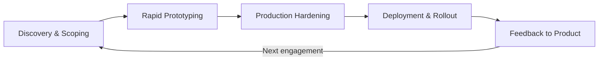
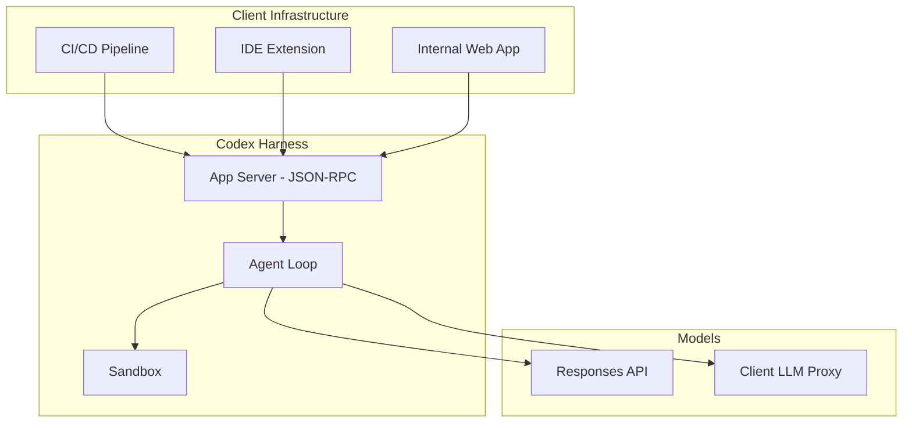

# How to Be a Codex CLI Forward Deployed Engineer


The forward deployed engineer (FDE) has become the most sought-after role in AI-native companies. Job postings for the position grew 800–1,000% through 2025[^1], and in 2026, organisations like OpenAI, Anthropic, and Palantir continue to hire aggressively[^2]. For engineers who have mastered Codex CLI, the FDE path offers a natural career escalation — combining deep tool expertise with client-facing delivery in high-stakes enterprise environments.

This article examines what it means to specialise as a Codex CLI FDE: the workflows, the technical stack, and the career mechanics.

## What a Forward Deployed Engineer Actually Does

An FDE embeds directly with enterprise customers to ship custom, production-grade solutions. OpenAI's own FDE job descriptions specify that candidates will "lead complex end-to-end deployments of frontier models in production alongside OpenAI's most strategic customers"[^3]. Unlike a traditional software engineer building product features behind a PM layer, an FDE owns the full lifecycle:



The critical distinction is **ownership scope**. A solutions architect designs and demos pre-sale. A core engineer ships features for all users. An FDE builds and deploys the final solution for a specific customer, post-sale, and remains accountable for its production stability[^1].

## The Codex CLI FDE Technical Stack

An FDE specialising in Codex CLI needs to operate across three layers: the CLI itself, the harness/integration layer, and the enterprise infrastructure layer.

### Layer 1: Codex CLI Mastery

At minimum, an FDE must be fluent in the full configuration surface. Codex CLI's `config.toml` hierarchy — global (`~/.codex/config.toml`), project-scoped (`.codex/config.toml`), and enterprise-managed (`requirements.toml`) — is the foundation of every deployment[^4].

Key configuration areas an FDE works with daily:

```toml
# Custom model provider for client's LLM proxy
model = "gpt-5.1"
model_provider = "client-proxy"

[model_providers.client-proxy]
name = "Client LLM Gateway"
base_url = "https://llm-proxy.client.internal"
env_key = "CLIENT_API_KEY"
wire_api = "responses"

# Enterprise sandbox policy
sandbox_mode = "workspace-write"

[sandbox_workspace_write]
writable_roots = ["/home/developer/project"]
network_access = true
```

The `approval_policy` system — with granular controls for `sandbox_approval`, `mcp_elicitations`, `skill_approval`, and `request_permissions` — lets FDEs tune the autonomy level to match each client's security posture[^4]. Enterprise clients behind TLS-inspecting proxies require custom CA certificate configuration via `SSL_CERT_FILE` and related environment variables[^5].

### Layer 2: Custom Harness Construction

The Codex app server exposes a JSON-RPC protocol that lets external tools drive the same agent loop used by the CLI and VS Code extension[^6]. For FDEs, this is the integration point where Codex becomes part of a client's existing toolchain.

Common harness patterns an FDE builds:



The Python SDK enables programmatic access for embedding Codex into automation workflows, CI pipelines, and custom tooling[^5]. An FDE building a client integration typically wires the app server into the client's deployment pipeline, configures model routing through their LLM proxy, and sets up the hooks system for audit logging.

### Layer 3: Enterprise Infrastructure

This is where 80% of the actual FDE work happens[^1]. Getting a demo working is straightforward; navigating corporate SSO, network policies, compliance requirements, and production credentials is the real challenge.

Enterprise deployment concerns an FDE handles:

| Concern | Codex CLI Mechanism | FDE Responsibility |
|---------|--------------------|--------------------|
| Authentication | ChatGPT device-code sign-in or API key auth[^5] | Integrate with client IdP, configure `forced_login_method` and `forced_chatgpt_workspace_id`[^4] |
| Network security | Configurable domain allowlists/denylists, SOCKS5 proxy support[^4] | Map client firewall rules to `allowed_domains`, configure egress policies |
| Audit & compliance | Hooks system, OpenTelemetry export[^4] | Wire into client SIEM, configure `otel` exporters with TLS certs |
| Cost management | Pay-as-you-go Codex seats for Business/Enterprise[^5] | Model token budgets, `model_reasoning_effort` tuning |
| Device management | `requirements.toml` for managed machines[^4] | Work with client MDM to distribute configuration profiles |

The `requirements.toml` mechanism is particularly important — it lets an organisation enforce constraints such as disallowing `approval_policy = "never"` or `sandbox_mode = "danger-full-access"`, ensuring that individual developers cannot bypass security policies[^4].

## A Day in the Life

A typical FDE engagement follows a compressed timeline. Where a traditional project might take quarters, an FDE ships in weeks.

**Week 1 — Discovery**: Embed with the client engineering team. Map their existing development workflow. Identify where Codex CLI slots in — code generation, test authoring, migration automation, documentation. Set up a proof-of-concept with their model provider and network configuration.

**Week 2 — Prototype**: Build an AGENTS.md constitution tailored to their codebase conventions. Configure domain-expert agents in `.codex/agents/` for their specific stack. Wire the app server into their CI pipeline for automated code review or test generation. Demo to stakeholders.

**Week 3–4 — Production hardening**: Lock down sandbox policies via `requirements.toml`. Configure OpenTelemetry export to their observability stack. Set up the hooks system for compliance audit trails. Load-test the app server under realistic concurrency. Train their team on prompt engineering patterns.

**Ongoing — Feedback loop**: Channel field insights back to the core product team. Identify feature gaps that affect multiple enterprise clients. Propose configuration additions or SDK improvements.

## Skills Beyond the Terminal

OpenAI's FDE postings require 7+ years of full-stack engineering experience, with customer-facing experience "highly desirable"[^3]. The role demands travel — up to 50% for the NYC position[^3]. Compensation at OpenAI and Anthropic ranges from $350K to $550K total compensation at mid-to-senior levels[^1].

The skills profile is T-shaped[^1]:

- **Vertical depth**: Codex CLI internals, Responses API, model behaviour, sandbox architecture, TOML configuration surface
- **Horizontal breadth**: Customer empathy, problem decomposition in ambiguous environments, rapid prototyping under pressure, product sense for identifying patterns across clients

Technical interviewing for FDE roles typically includes a decomposition case study — receiving an ambiguous real-world problem and structuring a solution iteratively, not just solving a LeetCode problem[^1]. Palantir pioneered this format, and it has become industry-standard for FDE hiring[^1].

## From Codex User to FDE: The Career Path

The strongest FDE candidates come from backgrounds that combine building and deploying[^1]:

1. **Early-stage startup engineers** — accustomed to wearing multiple hats and shipping under pressure
2. **Solutions architects who build PoCs** — already comfortable in client-facing technical contexts
3. **Platform/DevOps engineers** — experienced with the infrastructure layer that consumes most FDE time
4. **Power users of AI coding tools** — deep familiarity with Codex CLI, Claude Code, or similar agentic tools

The progression typically runs: power user → internal champion (rolling out Codex CLI within your own organisation) → FDE candidate. Building a portfolio of custom harness integrations, AGENTS.md configurations, and enterprise deployment case studies is the most direct path[^7].

## The Integration Wall

The FDE role exists because of what the industry calls the "integration wall"[^1] — the gap between a powerful platform and an enterprise-ready deployment. Codex CLI is a sophisticated tool with a deep configuration surface, but every enterprise has unique network policies, compliance requirements, model provider preferences, and development workflows.

No amount of documentation closes that gap entirely. Someone has to sit with the client, understand their constraints, and build the bridge. That someone is the FDE.

## Citations

[^1]: [Tech's secret weapon: The complete 2026 guide to the forward deployed engineer](https://hashnode.com/blog/a-complete-2026-guide-to-the-forward-deployed-engineer)

[^2]: [Forward-Deployed Engineers: AI's Key Role in 2026 — AI Daily](https://www.ai-daily.news/articles/forward-deployed-engineers-ais-key-role-in-2026)

[^3]: [Forward Deployed Engineer (FDE) - NYC — OpenAI Careers](https://openai.com/careers/forward-deployed-engineer-(fde)-nyc-new-york-city/)

[^4]: [Configuration Reference — Codex CLI, OpenAI Developers](https://developers.openai.com/codex/config-reference)

[^5]: [OpenAI Codex CLI ships v0.116.0 with enterprise features — Augment Code](https://www.augmentcode.com/learn/openai-codex-cli-enterprise)

[^6]: [Unlocking the Codex harness: how we built the App Server — OpenAI](https://openai.com/index/unlocking-the-codex-harness/)

[^7]: [Forward Deployed Engineer (FDE): The Essential 2026 Guide — Rocketlane](https://www.rocketlane.com/blogs/forward-deployed-engineer)
