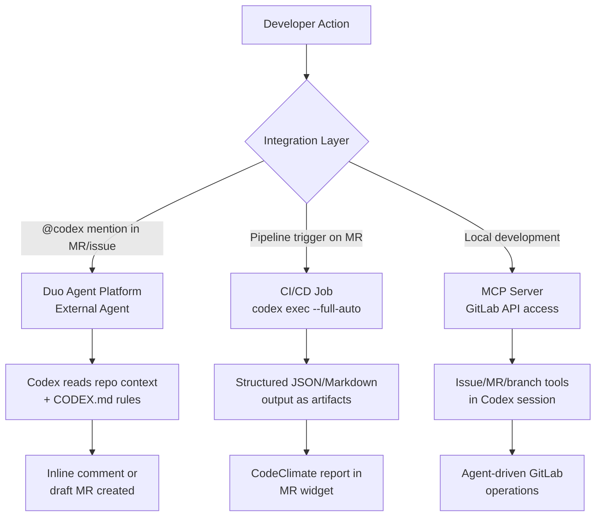
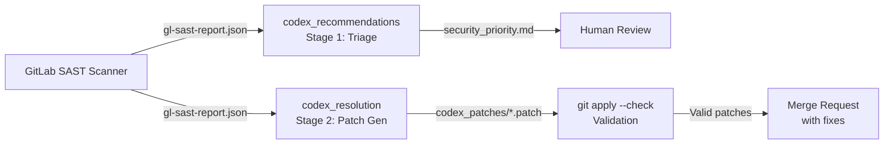

# Codex CLI on GitLab: Duo Agent Platform, CI/CD Pipelines, and MCP Integration


---

While Codex CLI's GitHub integration has received extensive coverage — from `openai/codex-action` to issue assignment via Copilot — GitLab teams have been building their own integration story. That story now has three distinct layers: the **Duo Agent Platform** for mention-driven automation, **CI/CD pipeline jobs** using `codex exec` for structured analysis, and **MCP server connections** for real-time repository access. This article covers all three, with production-ready configuration for each.

## The Three Integration Layers

Before diving into configuration, it helps to understand where each layer fits in a GitLab workflow.



Each layer serves a different need: Duo for ad-hoc delegation, CI/CD for systematic analysis on every merge request, and MCP for interactive agent sessions that need GitLab API access.

## Layer 1: Duo Agent Platform — External Agents

GitLab's Duo Agent Platform reached general availability on 15 January 2026[^1], bringing first-class support for external AI agents — including Codex CLI — directly into the GitLab workflow. Premium and Ultimate customers on GitLab 18.8+ (both SaaS and self-managed) can enable the Codex agent through the AI Catalog[^2].

### How It Works

When a developer mentions `@codex` (or the configured service account) in an issue comment or merge request discussion, GitLab triggers the external agent[^3]. The agent:

1. Reads the repository tree and surrounding context
2. Loads project-specific rules from `CODEX.md` at the repository root
3. Decides whether code changes, review feedback, or clarification is needed
4. Responds inline with either a ready-to-merge change or a comment

The trigger mechanisms are[^3]:

| Trigger | Where | What Happens |
|---|---|---|
| **Mention** | Issue or MR comment | Agent analyses context and responds |
| **Assignment** | Issue or MR assignee | Agent works the issue autonomously |
| **Reviewer assignment** | MR reviewer | Agent performs code review |

### Configuration

The Codex agent uses GitLab-managed credentials through the AI Gateway, so there is no separate `OPENAI_API_KEY` to configure[^2]. Administrators add the agent via **Settings → AI Catalog → GitLab-managed external agents → Add to AI Catalog**[^2].

For self-managed instances, the external agent configuration requires the gateway token injection[^4]:

```yaml
# External agent configuration (admin-level)
injectGatewayToken: true
```

This automatically provides `AI_FLOW_AI_GATEWAY_TOKEN` and `AI_FLOW_AI_GATEWAY_HEADERS` environment variables to the agent runtime[^4].

### CODEX.md: The Project Rules File

All project-specific rules — style, testing, security policies — come from `CODEX.md` at the repository root[^5]. This is distinct from `AGENTS.md` used by the CLI directly; GitLab's integration reads `CODEX.md` specifically. A minimal example:

```markdown
# Project Rules

## Code Style
- Use TypeScript strict mode
- All functions must have JSDoc comments
- Prefer `const` over `let`

## Testing
- Every new function needs a unit test
- Run `npm test` before proposing changes
- Minimum 80% branch coverage

## Security
- Never commit secrets or API keys
- Use parameterised queries for all database access
- Validate all user input at the controller boundary
```

### Current Limitations

The Duo Agent Platform integration is still maturing. As of April 2026, the `@codex` mention workflow runs Codex in the background and responds asynchronously — there is no interactive steering[^3]. The agent creates merge requests linked back to the originating issue but cannot yet trigger downstream pipelines automatically[^5]. ⚠️ The exact latency and token limits for Duo-triggered Codex sessions are not publicly documented.

## Layer 2: CI/CD Pipeline Integration with codex exec

For systematic, repeatable analysis on every merge request, embedding `codex exec` directly into `.gitlab-ci.yml` is the more mature approach. The official OpenAI Cookbook published a comprehensive guide to this pattern in March 2026[^6].

### Code Quality Reports

The core pattern runs `codex exec --full-auto` with a structured prompt that generates GitLab-compliant CodeClimate JSON. The output appears directly in the merge request widget alongside native GitLab code quality results.

```yaml
stages:
  - codex

default:
  image: node:24

codex_review:
  stage: codex
  variables:
    CODEX_QA_PATH: "gl-code-quality-report.json"
    CODEX_RAW_LOG: "artifacts/codex-raw.log"
  rules:
    - if: '$CI_PIPELINE_SOURCE == "merge_request_event"'
      when: on_success
    - when: never
  script:
    - npm -g i @openai/codex@latest
    - FILE_LIST="$(git ls-files | sed 's/^/- /')"
    - |
      codex exec --full-auto "Review this repository and output a GitLab Code Quality report in CodeClimate JSON format.
      OUTPUT MUST BE A SINGLE JSON ARRAY between markers:
      === BEGIN_CODE_QUALITY_JSON ===
      <JSON ARRAY>
      === END_CODE_QUALITY_JSON ===
      Each issue: description, check_name, fingerprint, severity, location with path and lines.begin.
      Only report issues in: ${FILE_LIST}" \
        | tee "${CODEX_RAW_LOG}" >/dev/null
    - |
      sed -E 's/\x1B\[[0-9;]*[A-Za-z]//g' "${CODEX_RAW_LOG}" \
        | awk '/BEGIN_CODE_QUALITY_JSON/{grab=1;next}/END_CODE_QUALITY_JSON/{grab=0}grab' \
        > "${CODEX_QA_PATH}"
    - 'node -e "JSON.parse(require(\"fs\").readFileSync(\"${CODEX_QA_PATH}\",\"utf8\"))" || echo "[]" > "${CODEX_QA_PATH}"'
  artifacts:
    reports:
      codequality: gl-code-quality-report.json
    paths:
      - artifacts/
    expire_in: 14 days
```

The marker-based extraction pattern (`=== BEGIN_... ===` / `=== END_... ===`) is critical for reliability[^6]. LLM output is inherently variable; the markers give the pipeline a deterministic extraction boundary. The ANSI escape stripping (`sed -E 's/\x1B\[[0-9;]*[A-Za-z]//g'`) handles terminal colour codes that `codex exec` may emit[^6].

### Security Remediation Pipeline

The cookbook's second pattern is more ambitious: a two-stage pipeline where Codex first triages SAST findings, then generates validated patches for high/critical vulnerabilities[^6].



The remediation stage iterates over each high/critical vulnerability, constructs a per-finding prompt, and validates the generated diff with `git apply --check` before storing it as a `.patch` artefact[^6]. Invalid patches are discarded automatically — only clean-applying fixes survive.

Key design decisions in this pattern:

- **Severity whitelisting**: Only `high` and `critical` findings trigger remediation, avoiding wasted tokens on informational findings[^6]
- **Per-vulnerability isolation**: Each finding gets its own `codex exec` invocation, preventing cross-contamination between fixes[^6]
- **Unified diff validation**: `git apply --check` runs before any patch is stored, ensuring no broken diffs reach reviewers[^6]

### Authentication in CI/CD

Authentication uses masked CI/CD variables. Store `OPENAI_API_KEY` as a protected, masked variable in **Settings → CI/CD → Variables**[^6]. For self-managed instances using Azure OpenAI instead, configure the `CODEX_MODEL` and endpoint variables accordingly.

```yaml
variables:
  OPENAI_API_KEY: $OPENAI_API_KEY
  CODEX_MODEL: "gpt-5.4"  # or your preferred model
```

### Cost Control

Each `codex exec` invocation in CI/CD consumes API tokens. For cost management:

- Use `gpt-5.4-mini` for triage/quality jobs and reserve `gpt-5.4` for remediation[^7]
- Set `--model` explicitly in the `codex exec` command to avoid inheriting a more expensive default
- Monitor token usage via the `postTaskComplete` hook pattern or OpenTelemetry[^8]

## Layer 3: GitLab MCP Server Integration

For interactive Codex sessions that need to read issues, manage merge requests, or create branches on GitLab, the MCP integration provides structured API access.

### GitLab's Native MCP Server

GitLab ships its own MCP server[^9] that exposes repository, issue, merge request, and pipeline tools. Configure it in your Codex `config.toml`:

```toml
[mcp_servers.gitlab]
command = "codex"
args = ["mcp", "add", "--url", "https://gitlab.example.com/api/v4/mcp"]
```

Or add it directly via the CLI[^9]:

```bash
codex mcp add --url "https://gitlab.example.com/api/v4/mcp"
```

### Composio's GitLab MCP

For teams wanting a managed MCP endpoint that bundles GitLab alongside other services, Composio provides a Tool Router that dynamically loads GitLab tools based on the task[^10]:

```toml
[mcp_servers.composio]
url = "https://connect.composio.dev/mcp"
http_headers = { "x-api-key" = "${COMPOSIO_API_KEY}" }
```

This gives Codex access to GitLab operations — creating projects, managing issues, handling branches, and triggering pipelines — through a single MCP endpoint that also supports other integrations[^10].

### Practical MCP Use Case: Issue Triage

With the GitLab MCP server configured, you can run an issue triage workflow locally:

```bash
codex exec --full-auto \
  "Read the open issues labelled 'needs-triage' in this project. \
   For each, add a priority label (P1/P2/P3) based on severity \
   and add a comment summarising the issue and suggested next steps."
```

The MCP server handles the GitLab API calls — listing issues, adding labels, posting comments — while Codex handles the reasoning and decision-making.

## Choosing the Right Layer

| Criterion | Duo Agent Platform | CI/CD Pipeline | MCP Server |
|---|---|---|---|
| **Trigger** | `@codex` mention | MR/pipeline event | Manual/scripted |
| **Output** | Inline comments, draft MRs | Artefacts, reports | GitLab API operations |
| **Authentication** | GitLab-managed | API key variable | API key + token |
| **Cost visibility** | Bundled in GitLab Credits[^1] | Direct API billing | Direct API billing |
| **Best for** | Ad-hoc delegation | Systematic analysis | Interactive workflows |
| **Maturity** | GA (Jan 2026) | Production-ready | Stable |

For most teams, the recommended approach is: **Duo for ad-hoc requests**, **CI/CD for every-MR analysis**, and **MCP for local development workflows** that need GitLab context.

## Enterprise Considerations

### Self-Managed Deployment

Self-managed GitLab instances (18.8+) can enable external agents through the AI Catalog[^2]. The key requirement is network connectivity to the AI Gateway — or, for air-gapped environments, routing through Azure OpenAI endpoints configured as custom model providers in the Codex `config.toml`[^11].

### Audit Trail

All three integration layers produce audit evidence:

- **Duo**: GitLab tracks agent interactions as system events
- **CI/CD**: `codex exec` produces JSONL rollout files stored as pipeline artefacts
- **MCP**: Standard MCP request/response logging via `RUST_LOG=codex_core::mcp=debug`

### GitLab vs GitHub: Integration Comparison

| Feature | GitHub (codex-action) | GitLab (CI/CD + Duo) |
|---|---|---|
| **Native agent** | Copilot issue assignment | Duo Agent Platform |
| **CI/CD** | `openai/codex-action` | `codex exec` in `.gitlab-ci.yml` |
| **Code quality** | PR checks | CodeClimate artefact in MR widget |
| **Security** | Dependabot + Codex Security | SAST + Codex remediation pipeline |
| **MCP** | GitHub MCP server | GitLab MCP server |

The GitLab integration requires more manual configuration than GitHub's first-party action, but offers equivalent capabilities once set up. The CI/CD pipeline approach is particularly powerful because GitLab's artefact system natively understands CodeClimate JSON, making Codex quality findings appear in the same MR widget as native GitLab scanners[^6].

## Citations

[^1]: GitLab Inc., "GitLab Announces the General Availability of GitLab Duo Agent Platform," 15 January 2026. <https://ir.gitlab.com/news/news-details/2026/GitLab-Announces-the-General-Availability-of-GitLab-Duo-Agent-Platform/default.aspx>

[^2]: GitLab Docs, "External agents." <https://docs.gitlab.com/user/duo_agent_platform/agents/external/>

[^3]: GitLab Docs, "External agent configuration examples." <https://docs.gitlab.com/user/duo_agent_platform/agents/external_examples/>

[^4]: GitLab Docs, "AI Catalog." <https://docs.gitlab.com/user/duo_agent_platform/ai_catalog/>

[^5]: GitLab.org, "Product Requirements — Claude Code and OpenAI Codex CLI Integration for GitLab CI/CD (#557820)." <https://gitlab.com/gitlab-org/gitlab/-/issues/557820>

[^6]: OpenAI Cookbook, "Automating Code Quality and Security Fixes with Codex CLI on GitLab." <https://developers.openai.com/cookbook/examples/codex/secure_quality_gitlab>

[^7]: OpenAI Developers, "Models." <https://developers.openai.com/api/docs/models>

[^8]: OpenAI Developers, "Codex CLI Features." <https://developers.openai.com/codex/cli/features>

[^9]: GitLab Docs, "GitLab MCP server." <https://docs.gitlab.com/user/gitlab_duo/model_context_protocol/mcp_server/>

[^10]: Composio, "How to integrate Gitlab MCP with Codex." <https://composio.dev/toolkits/gitlab/framework/codex>

[^11]: OpenAI Developers, "Codex Configuration Reference." <https://developers.openai.com/codex/config-reference>
