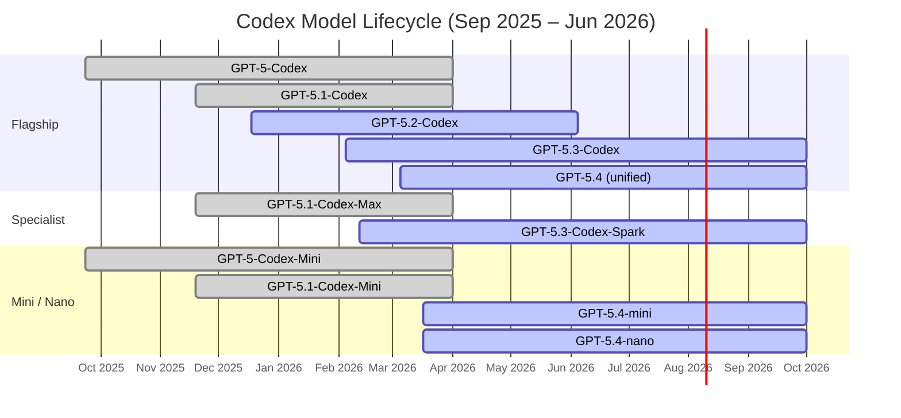
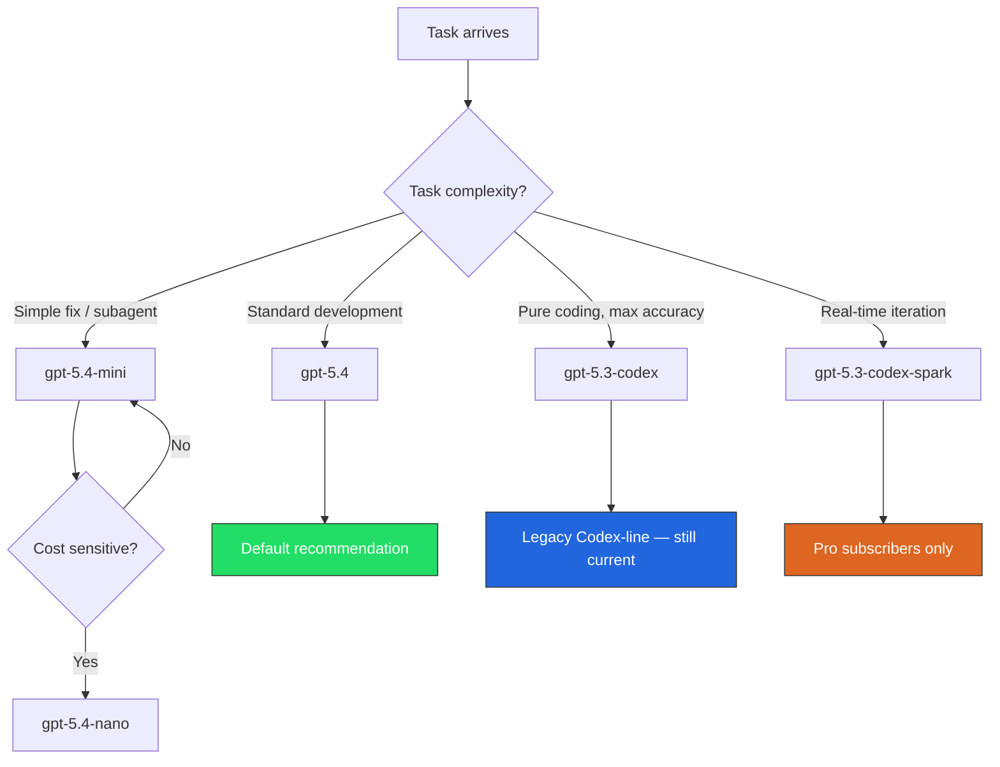

# Codex CLI Model Lifecycle: Navigating Deprecations, Migrations, and the GPT-5.x Transition


---

OpenAI's model release cadence has accelerated dramatically. In the eight months since the original GPT-5-Codex launched in September 2025, we have seen five major Codex-optimised model generations — and three deprecation waves.[^1][^2] If you maintain Codex CLI configurations across teams, CI pipelines, or custom harnesses, the churn is real. This article maps the full model timeline, explains the deprecation mechanics, and provides a practical migration playbook for the April 2026 landscape.

## The Codex Model Timeline

The following timeline captures every Codex-optimised model release and its current status.



### Key dates

| Model | Released | Deprecated | Replacement |
|---|---|---|---|
| GPT-5-Codex | 23 Sep 2025[^1] | 1 Apr 2026[^3] | gpt-5.3-codex |
| GPT-5.1-Codex | 19 Nov 2025[^4] | 1 Apr 2026[^3] | gpt-5.3-codex |
| GPT-5.1-Codex-Max | 19 Nov 2025[^4] | 1 Apr 2026[^3] | gpt-5.3-codex |
| GPT-5.1-Codex-Mini | 19 Nov 2025[^4] | 1 Apr 2026[^3] | gpt-5.4-mini |
| GPT-5-Codex-Mini | 23 Sep 2025[^1] | 1 Apr 2026[^3] | gpt-5.4-mini |
| GPT-5.2-Codex | 18 Dec 2025[^5] | 5 Jun 2026[^6] | gpt-5.3-codex |
| GPT-5.3-Codex | 5 Feb 2026[^2] | Current | — |
| GPT-5.3-Codex-Spark | 12 Feb 2026[^7] | Research preview | — |
| GPT-5.4 | 5 Mar 2026[^8] | Current (recommended) | — |
| GPT-5.4-mini | 17 Mar 2026[^9] | Current | — |
| GPT-5.4-nano | 17 Mar 2026[^9] | Current | — |

The April 1 deprecation wiped out the entire GPT-5.0 and GPT-5.1 Codex family in a single sweep.[^3] The next deprecation wave — GPT-5.2-Codex on 5 June 2026 — is less than two months away.[^6]

## What Happens When a Model Is Deprecated

When OpenAI deprecates a Codex model, the behaviour depends on your access method:

1. **ChatGPT-authenticated users** (the default for Codex CLI): the model silently disappears from the picker. If your `config.toml` still references it, Codex falls back to the current default model.[^10]

2. **API key users**: requests to a deprecated model return an error. There is no automatic fallback — your pipeline breaks.

3. **GitHub Copilot users**: deprecated models are removed from all Copilot experiences including Chat, inline edits, and agent modes. Enterprise administrators must enable replacement models through Copilot settings policies.[^3]

4. **Azure OpenAI / Microsoft Foundry**: Azure maintains its own retirement schedule which may lag behind or precede OpenAI's by several weeks.[^11]

## The config.toml Migration Mechanism

Codex CLI includes a built-in migration map for model names. When a deprecated model is referenced in configuration, Codex can recognise the old name and suggest or apply a replacement.[^12]

```toml
# ~/.codex/config.toml — before migration
model = "gpt-5.1-codex"
```

After the April 1 deprecation, this configuration will either fall back to the default or fail, depending on your authentication method. The fix is straightforward:

```toml
# ~/.codex/config.toml — after migration
model = "gpt-5.4"
```

### The recommended model stack (April 2026)

For most workflows, OpenAI now recommends `gpt-5.4` as the default.[^10] Here is the current recommended stack:

```toml
# ~/.codex/config.toml

# Primary model — GPT-5.4 unifies coding + reasoning + computer use
model = "gpt-5.4"

# Review model — match or exceed your primary
review_model = "gpt-5.4"

# Reasoning effort — adjust per task complexity
model_reasoning_effort = "high"
plan_mode_reasoning_effort = "xhigh"
```

## Profile-Based Model Management

The profiles system (experimental, March 2026) is the cleanest way to manage multiple model configurations and prepare for deprecation waves.[^13] Define profiles that isolate model choices, so a single deprecation requires only one line change per affected profile.

```toml
# ~/.codex/config.toml

# Default profile
model = "gpt-5.4"

[profiles.fast]
model = "gpt-5.4-mini"
model_reasoning_effort = "low"

[profiles.deep]
model = "gpt-5.4"
model_reasoning_effort = "xhigh"
plan_mode_reasoning_effort = "xhigh"

[profiles.spark]
model = "gpt-5.3-codex-spark"
model_reasoning_effort = "medium"

[profiles.legacy-52]
# ⚠️ Retiring 5 June 2026 — migrate to gpt-5.3-codex or gpt-5.4
model = "gpt-5.2-codex"
```

Switch profiles on the command line:

```bash
# Quick task with mini
codex --profile fast "add error handling to parse_config"

# Deep architectural review
codex --profile deep "review the authentication module for security issues"

# Real-time iteration with Spark
codex --profile spark "refactor this function step by step"
```

## The GPT-5.4 Unification

GPT-5.4, released 5 March 2026, represents a significant architectural shift.[^8] It is the first mainline reasoning model to incorporate the frontier coding capabilities previously exclusive to the Codex-specific model line. In practical terms:

- **GPT-5.3-Codex** remains the best pure coding model, scoring highest on SWE-bench Verified[^2]
- **GPT-5.4** matches or exceeds GPT-5.3-Codex on coding while adding native computer use (75% OSWorld), stronger reasoning, and 1M token extended context[^8][^14]
- **GPT-5.4-mini** delivers 54.4% on SWE-Bench Pro at 30% of the credit consumption of the flagship — purpose-built for subagents[^9]



The question on many developers' minds — raised publicly by Simon Willison — is whether the Codex model line will merge entirely into the mainline GPT series.[^15] The introduction of `gpt-5-codex` and `gpt-5-codex-mini` as unified model identifiers in late March 2026 suggests the answer is yes.[^16]

### Breaking: April 7 Model Picker Changes (ChatGPT Auth)

On April 7, 2026, OpenAI announced significant model availability changes for **ChatGPT-authenticated** Codex users:

- **Immediately (April 7):** The model picker stops displaying `gpt-5.2-codex`, `gpt-5.1-codex-mini`, `gpt-5.1-codex-max`, `gpt-5.1-codex`, `gpt-5.1`, and `gpt-5`
- **April 14:** These models are **fully removed** for ChatGPT sign-in users
- **Surviving models:** `gpt-5.4` (recommended default), `gpt-5.4-mini`, `gpt-5.3-codex`, and `gpt-5.3-codex-spark` (ChatGPT Pro only)

API-key authenticated users can still access any API-supported model or configure a custom model provider. This effectively forces the migration to the GPT-5.4 generation for the majority of individual developers who authenticate via ChatGPT rather than API keys.

**Action required:** If your team or CI/CD pipelines use ChatGPT authentication with any of the removed models, migrate to `gpt-5.4` (or `gpt-5.3-codex` for pure coding tasks) before April 14.

## Subagent Model Configuration for Multi-Agent Workflows

Deprecations hit hardest in multi-agent configurations where different agents may reference different models. With the April 2026 changes, audit every agent TOML file in `.codex/agents/`:

```toml
# .codex/agents/reviewer.toml — BEFORE (broken after April 1)
model = "gpt-5.1-codex-max"
model_reasoning_effort = "xhigh"

# .codex/agents/reviewer.toml — AFTER
model = "gpt-5.4"
model_reasoning_effort = "xhigh"
```

```toml
# .codex/agents/worker.toml — BEFORE (broken after April 1)
model = "gpt-5.1-codex-mini"
model_reasoning_effort = "medium"

# .codex/agents/worker.toml — AFTER
model = "gpt-5.4-mini"
model_reasoning_effort = "medium"
```

For the `[agents]` section controlling subagent defaults:

```toml
[agents]
max_threads = 4
max_depth = 2
# Subagent model — use mini for cost efficiency
# Previously gpt-5.1-codex-mini, now:
model = "gpt-5.4-mini"
```

## CI/CD Pipeline Migration

Pipelines using `codex exec` with explicit model flags are the most fragile. A deprecated model causes an immediate hard failure in CI.

### Defensive pattern: environment variable indirection

```bash
# .github/workflows/codex-review.yml
env:
  CODEX_MODEL: "gpt-5.4"
  CODEX_SUBAGENT_MODEL: "gpt-5.4-mini"

steps:
  - name: Run Codex review
    run: |
      codex exec \
        -c model="${CODEX_MODEL}" \
        -c review_model="${CODEX_MODEL}" \
        "Review all changed files for security issues"
```

When the next deprecation arrives, update a single environment variable rather than hunting through workflow files.

### Defensive pattern: profile-based CI

```toml
# .codex/config.toml (committed to repo)
[profiles.ci]
model = "gpt-5.4"
model_reasoning_effort = "high"
approval_policy = "full-auto"
sandbox_mode = "locked-network"
```

```bash
codex exec --profile ci "run the test suite and fix failures"
```

## The June 2026 Deprecation: Preparing Now

GPT-5.2-Codex retires on 5 June 2026.[^6] If you or your team still reference `gpt-5.2-codex` anywhere, here is a migration checklist:

1. **Audit all config files**: `grep -r "gpt-5.2" ~/.codex/ .codex/ .codex/agents/`
2. **Check CI/CD**: search workflow files for hardcoded model strings
3. **Update AGENTS.md**: if any agent instructions reference specific model names, update them
4. **Test with the replacement**: switch to `gpt-5.3-codex` or `gpt-5.4` and verify your workflows produce equivalent output
5. **Update custom harnesses**: any code using the Responses API with explicit model parameters needs updating
6. **Notify the team**: if you use project-scoped `.codex/config.toml`, push the model change as a PR

```bash
# Quick audit across a monorepo
grep -rn "gpt-5\.\(1\|2\)" \
  ~/.codex/config.toml \
  .codex/ \
  .codex/agents/ \
  .github/workflows/ \
  2>/dev/null
```

## Azure OpenAI Considerations

Azure OpenAI maintains a separate retirement schedule through Microsoft Foundry.[^11] Key differences:

- Azure deployments use deployment names, not model IDs — a deprecation requires redeploying, not just changing a string
- Azure retirements may lag behind OpenAI's by weeks
- The `api-version` query parameter in your `[model_providers]` block must match the deployment's API version

```toml
[model_providers.azure]
base_url = "https://your-resource.openai.azure.com/openai"
wire_api = "responses"

[model_providers.azure.query_params]
api-version = "2026-03-01-preview"
```

⚠️ Azure Entra ID token authentication with Codex CLI has a known limitation (issue #13241) — static API keys remain more reliable for automated workflows.

## Best Practices for Model Lifecycle Management

1. **Never hardcode model names in scripts** — use config.toml profiles or environment variables
2. **Pin to the recommended model** (`gpt-5.4`) unless you have a specific reason not to
3. **Subscribe to the changelog** at [developers.openai.com/codex/changelog](https://developers.openai.com/codex/changelog) and the [GitHub Changelog](https://github.blog/changelog/) for deprecation notices
4. **Test model changes in a branch** before rolling out to the team
5. **Use the `codex exec` structured output** (`--output-schema`) to detect regressions when switching models
6. **Keep subagent models one tier below the primary** — `gpt-5.4-mini` for subagents, `gpt-5.4` for the orchestrator
7. **Set calendar reminders** for announced deprecation dates — the June 5 GPT-5.2 retirement is next

## What Is Next

The model identifier consolidation — with `gpt-5-codex` and `gpt-5-codex-mini` appearing as unified aliases in late March[^16] — suggests OpenAI may move toward rolling model identifiers that always point to the latest Codex-optimised model. If this happens, explicit version pinning would become opt-in rather than the default, significantly reducing deprecation churn.

Until then, treat model lifecycle management as a first-class operational concern. The eight-month pattern is clear: new Codex models arrive every 6–10 weeks, and old ones retire within 4–5 months. Plan accordingly.

---

## Citations

[^1]: [GPT-5-Codex Model documentation](https://developers.openai.com/api/docs/models/gpt-5-codex) — OpenAI API reference, September 2025
[^2]: [Introducing GPT-5.3-Codex](https://openai.com/index/introducing-gpt-5-3-codex/) — OpenAI blog, 5 February 2026
[^3]: [GPT-5.1 Codex, GPT-5.1-Codex-Max, and GPT-5.1-Codex-Mini deprecated](https://github.blog/changelog/2026-04-03-gpt-5-1-codex-gpt-5-1-codex-max-and-gpt-5-1-codex-mini-deprecated/) — GitHub Changelog, 3 April 2026
[^4]: [Building more with GPT-5.1-Codex-Max](https://openai.com/index/gpt-5-1-codex-max/) — OpenAI blog, 19 November 2025
[^5]: [Introducing GPT-5.2-Codex](https://openai.com/index/introducing-gpt-5-2-codex/) — OpenAI blog, 18 December 2025
[^6]: [Retiring GPT-4o and older models](https://openai.com/index/retiring-gpt-4o-and-older-models/) — OpenAI blog, February 2026; GPT-5.2 Thinking retires 5 June 2026
[^7]: [Codex CLI Changelog — Codex-Spark research preview](https://developers.openai.com/codex/changelog) — OpenAI Developers, February 2026
[^8]: [Introducing GPT-5.4](https://openai.com/index/introducing-gpt-5-4/) — OpenAI blog, 5 March 2026
[^9]: [Introducing GPT-5.4 mini and nano](https://openai.com/index/introducing-gpt-5-4-mini-and-nano/) — OpenAI blog, 17 March 2026
[^10]: [Codex Models documentation](https://developers.openai.com/codex/models) — OpenAI Developers, current
[^11]: [Azure OpenAI Model Retirements](https://learn.microsoft.com/en-us/azure/foundry/openai/concepts/model-retirements) — Microsoft Learn, current
[^12]: [Codex Configuration Reference](https://developers.openai.com/codex/config-reference) — OpenAI Developers, current
[^13]: [Codex Sample Configuration](https://developers.openai.com/codex/config-sample) — OpenAI Developers, current
[^14]: [GPT-5.4 Complete Guide 2026](https://www.nxcode.io/resources/news/gpt-5-4-complete-guide-features-pricing-models-2026) — NxCode, March 2026
[^15]: [GPT-5.4 discussion — Simon Willison's question on Codex model line merger](https://openai.com/index/introducing-gpt-5-4/) — referenced in community discussion, March 2026
[^16]: [gpt-5-codex: The New Codex Flagship and What It Means for Your Workflow](https://danielvaughan.com/codex-resources/articles/2026-03-30-gpt-5-codex-new-flagship-model-guide/) — Daniel Vaughan / Codex Resources, 30 March 2026
