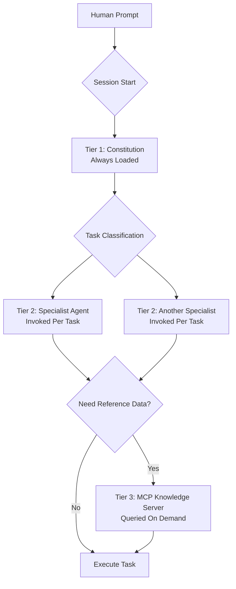
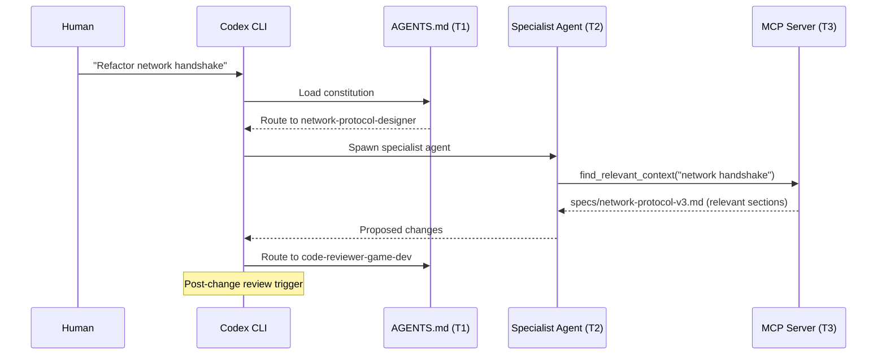
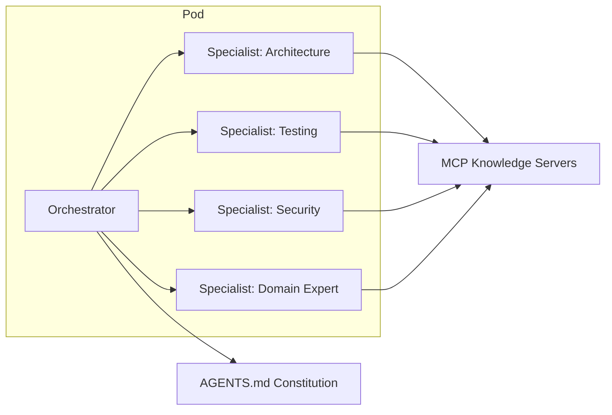

# Codified Context: The Three-Tier Knowledge Architecture for AI Coding Agents


---

Dumping everything into a single `AGENTS.md` file works until it doesn't. At some point—typically around 20,000 lines of codebase—you hit the context wall: the constitution grows unwieldy, the agent forgets domain nuances, and you find yourself re-explaining the same architectural constraints every session. Aristidis Vasilopoulos's February 2026 paper, *Codified Context: Infrastructure for AI Agents in a Complex Codebase* [^1], offers a rigorous, empirically-validated alternative: a three-tier knowledge architecture that maps cleanly onto Codex CLI's existing primitives.

This article unpacks the paper's findings, maps them to Codex CLI's current feature set, and provides concrete implementation patterns.

## The Three-Tier Model

The core insight is straightforward: not all context is equal. Some knowledge must be present in every session (hot memory), some is needed only for specific task types (warm, specialist knowledge), and some is referenced rarely but must be queryable on demand (cold memory). The paper formalises this into three tiers [^1]:



| Tier | Role | Codex CLI Mapping | Files | Lines | % of Codebase |
|------|------|-------------------|-------|-------|---------------|
| T1 | Constitution (Hot Memory) | `AGENTS.md` | 1 | ~660 | 0.6% |
| T2 | Specialist Agents (Warm) | `.codex/agents/*.toml` | 19 | ~9,300 | 8.6% |
| T3 | Knowledge Base (Cold Memory) | MCP knowledge servers | 34 | ~16,250 | 15.0% |
| **Total** | | | **54** | **~26,200** | **24.2%** |

The metrics come from a real 108,000-line C# distributed system tracked across 283 development sessions and 2,801 human prompts [^1]. Crucially, Vasilopoulos warns that the 24.2% context infrastructure ratio reflects this project's complexity and domain—it is not a universal target [^1].

## Tier 1: The Constitution (AGENTS.md)

The constitution is the only file that loads into every session. It defines non-negotiable rules: coding standards, architectural boundaries, forbidden patterns, and the trigger table that routes tasks to specialist agents.

In Codex CLI, this maps directly to `AGENTS.md` [^2]. Since February 2026, AGENTS.md is an open standard under the Linux Foundation's Agentic AI Foundation, readable by Codex, Cursor, Copilot, Amp, Windsurf, and Gemini CLI [^3]. Codex loads AGENTS.md from both `~/.codex/` (global) and per-directory (repo-scoped), with closer files taking precedence [^2].

A well-structured constitution for a tiered architecture includes the trigger table directly:

```markdown
# AGENTS.md

## Routing Rules

When the task involves **network protocols or sync logic**, delegate to
the `network-protocol-designer` agent before making changes.

When the task involves **coordinates, camera, or spatial transforms**,
delegate to the `coordinate-wizard` agent.

After any structural change, invoke the `code-reviewer-game-dev` agent
for review.

## Architectural Boundaries

- ECS components MUST NOT hold references to MonoBehaviours
- Network messages MUST be defined in the shared assembly
- All coordinate transforms go through CoordinateService
```

Research by Santos et al. found that well-structured AGENTS.md files correlate with a 29% reduction in median runtime and 17% reduction in output token consumption [^4].

## Tier 2: Specialist Agents

This is where the paper's approach diverges from the "one massive context file" pattern. Rather than cramming domain knowledge into the constitution, each specialist area gets its own agent definition with focused expertise.

In Codex CLI, custom agents live in `.codex/agents/` (project-scoped) or `~/.codex/agents/` (personal) as TOML files [^5]. Subagents and custom agents reached GA on 16 March 2026 [^6].

```toml
# .codex/agents/network-protocol-designer.toml
name = "network-protocol-designer"
model = "GPT-5.4"
model_reasoning_effort = "high"
sandbox_mode = "read-only"

[instructions]
content = """
You are the network protocol specialist for ProjectX.
Key constraints:
- All messages use the NetworkMessage base class
- Serialisation uses MessagePack, never JSON
- Maximum message size: 512 bytes
- Tick rate: 20Hz server, 60Hz client interpolation
- See specs/network-protocol-v3.md for the full wire format
"""
```

The paper's 108K-line project used 19 specialist agents. Across 757 classifiable agent invocations, 432 (57%) went to project-specific specialists rather than built-in tool agents [^1]. The most frequently invoked were the code reviewer (154 invocations) and the network-protocol-designer (85 invocations) [^1].

### The Trigger Table Pattern

The paper formalises task routing through a trigger table—a mapping from signals in the human prompt to the appropriate specialist [^1]:

| Trigger Phase | Signal | Agent |
|---------------|--------|-------|
| Pre-change | Network, sync | network-protocol-designer |
| Pre-change | Coordinates, camera | coordinate-wizard |
| Pre-change | Abilities end-to-end | ability-designer |
| Post-change | Architecture, design | systems-designer |
| Post-change | ECS or network files | code-reviewer-game-dev |

In practice, you encode this in your AGENTS.md (Tier 1) and rely on the model to follow the routing. Note that Codex CLI does not currently auto-spawn custom subagents—explicit delegation prompts are required [^5]. There is an open issue (#14161) regarding `[[skills.config]]` in agent TOML being ignored for sub-agents [^7].

## Tier 3: MCP Knowledge Servers

Cold memory—specification documents, API references, wire format definitions—lives behind MCP (Model Context Protocol) servers. These are queried on demand rather than loaded into every session, keeping the base context window lean.

Codex CLI treats MCP as a first-class citizen [^8]. Configuration lives in `.codex/config.toml`:

```toml
# .codex/config.toml
[mcp_servers.knowledge-base]
type = "stdio"
command = "node"
args = ["./mcp-servers/knowledge-retriever/index.js"]

[mcp_servers.specs-server]
type = "http"
url = "http://localhost:3001/mcp"
```

MCP servers are managed via `codex mcp add`, `codex mcp list`, and `codex mcp login` [^8]. Servers launch automatically when a session starts and support both STDIO and streaming HTTP transports [^8].

The paper's companion repository provides a reference MCP retrieval server that exposes two key tools [^9]:

- `find_relevant_context(task)` — returns matching specification fragments
- `suggest_agent(task)` — recommends the appropriate Tier 2 specialist



## Practical Implementation

### Bootstrapping the Architecture

The companion repository includes three factory agents for bootstrapping the tier infrastructure in an existing project [^9]:

1. **Constitution Generator** — analyses the codebase and drafts an initial AGENTS.md
2. **Agent Extractor** — identifies domain clusters and generates specialist TOML files
3. **Knowledge Indexer** — catalogues specification documents for MCP serving

### Maintenance Budget

The paper reports a maintenance overhead of approximately 1–2 hours per week: a biweekly review pass of 30–45 minutes each [^1]. Meta-infrastructure prompts—those specifically about building and maintaining the knowledge architecture itself—accounted for just 4.3% of substantive prompts [^1].

### Prompt Efficiency

A striking finding: over 80% of human prompts in the study were 100 words or fewer [^1]. The tiered architecture front-loads context so thoroughly that terse prompts suffice. This aligns with the broader principle that good context engineering reduces prompt engineering effort.

## Connecting to the Agentic Pod Pattern

The three-tier model maps naturally onto the emerging agentic pod architecture, where multiple AI agents collaborate on a shared codebase:



Each pod member is effectively a Tier 2 specialist, the shared constitution (Tier 1) ensures consistency, and MCP servers (Tier 3) provide the shared reference library. The Codex CLI subagent system supports spawning specialists in parallel and collecting results [^6], making this pattern directly implementable today.

## Current Model Considerations

When configuring Tier 2 agents, note the current model landscape. As of April 2026, **GPT-5.4** is the recommended default model, combining coding, reasoning, and native computer use [^10]. The GPT-5.1-Codex family was deprecated on 3 April 2026 [^11]. GPT-5.3-Codex and GPT-5.2-Codex remain available for specific use cases [^10]. Authentication now primarily uses "Sign in with ChatGPT" rather than API keys [^10].

## Key Takeaways

1. **Separate hot, warm, and cold context** — not everything belongs in AGENTS.md
2. **The trigger table is the glue** — encode routing rules in Tier 1, domain knowledge in Tier 2
3. **MCP servers keep the context window lean** — query specifications on demand, don't pre-load them
4. **57% specialist usage** validates the investment in domain-specific agents [^1]
5. **1–2 hours per week** is a realistic maintenance budget for a complex project [^1]
6. **24.2% is not a target** — measure your own ratio and adjust to your project's needs

The paper's companion repository at [github.com/arisvas4/codified-context-infrastructure](https://github.com/arisvas4/codified-context-infrastructure) provides a complete reference implementation [^9].

## Citations

[^1]: Vasilopoulos, A. (2026). "Codified Context: Infrastructure for AI Agents in a Complex Codebase." arXiv:2602.20478v1. [https://arxiv.org/abs/2602.20478](https://arxiv.org/abs/2602.20478)

[^2]: OpenAI. "Codex CLI — AGENTS.md Guide." [https://developers.openai.com/codex/guides/agents-md](https://developers.openai.com/codex/guides/agents-md)

[^3]: Linux Foundation Agentic AI Foundation. AGENTS.md open standard. Referenced in: "AGENTS.md: The Open Standard for Cross-Tool AI Agent Portability." [https://developers.openai.com/codex/guides/agents-md](https://developers.openai.com/codex/guides/agents-md)

[^4]: Santos, R. et al. Referenced in Substack analysis: "Scaling your coding agent's context beyond a single AGENTS.md-file." [https://ursula8sciform.substack.com/p/scaling-your-coding-agents-context](https://ursula8sciform.substack.com/p/scaling-your-coding-agents-context)

[^5]: OpenAI. "Codex CLI — Subagents." [https://developers.openai.com/codex/subagents](https://developers.openai.com/codex/subagents)

[^6]: Simon Willison. "Codex Subagents." 16 March 2026. [https://simonwillison.net/2026/Mar/16/codex-subagents/](https://simonwillison.net/2026/Mar/16/codex-subagents/)

[^7]: GitHub issue #14161 — `[[skills.config]]` in agent TOML ignored for sub-agents. [https://github.com/openai/codex/issues/14161](https://github.com/openai/codex/issues/14161)

[^8]: OpenAI. "Codex CLI — MCP Integration." [https://developers.openai.com/codex/mcp](https://developers.openai.com/codex/mcp)

[^9]: Vasilopoulos, A. Codified Context Infrastructure — companion repository. [https://github.com/arisvas4/codified-context-infrastructure](https://github.com/arisvas4/codified-context-infrastructure)

[^10]: OpenAI. "Codex CLI — Models." [https://developers.openai.com/codex/models](https://developers.openai.com/codex/models)

[^11]: GitHub Blog. "GPT-5.1-Codex, GPT-5.1-Codex-Max, and GPT-5.1-Codex-Mini deprecated." 3 April 2026. [https://github.blog/changelog/2026-04-03-gpt-5-1-codex-gpt-5-1-codex-max-and-gpt-5-1-codex-mini-deprecated/](https://github.blog/changelog/2026-04-03-gpt-5-1-codex-gpt-5-1-codex-max-and-gpt-5-1-codex-mini-deprecated/)
