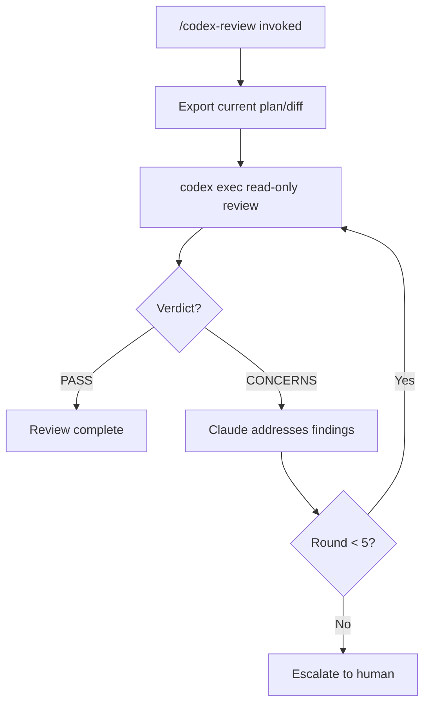
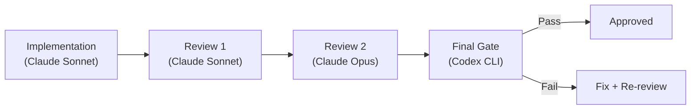
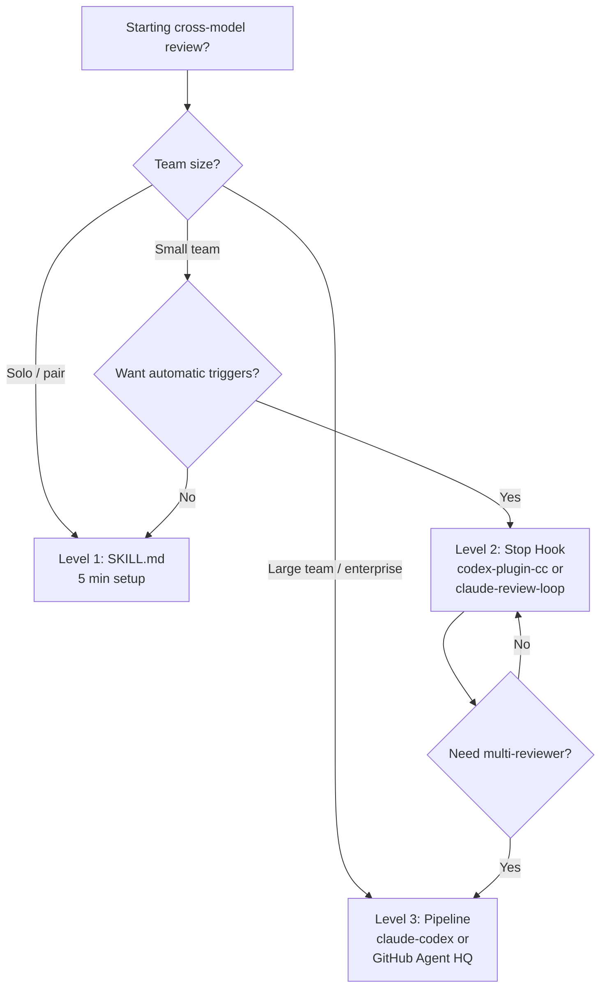

# Automating the Cross-Model Review Loop: Three Levels from SKILL.md to Multi-AI Pipeline

**Date:** 2026-04-07
**Tags:** cross-model-review, review-loop, automation, skill-md, stop-hook, multi-ai-pipeline, quality-gate, agentic-pod, codex-plugin-cc

---

The cross-model review pattern — where one AI writes code and a structurally different AI reviews it — has become a core quality practice in agentic development. Claude Code and Codex CLI have different training distributions and different blind spots, making their disagreements genuinely informative[^1]. By late March 2026, the ecosystem offers three distinct automation tiers, each trading setup complexity for hands-off operation. This article walks through all three, with concrete configuration and the security caveats you need to understand before deploying them.

## Why Cross-Model Review Works

Single-model review suffers from sycophancy bias: the same system that wrote the code tends to approve it[^2]. Cross-provider review sidesteps this because Claude and GPT-5.x have fundamentally different failure modes. When both models flag the same issue, confidence is high. When only one flags it, that disagreement is the signal worth investigating — the "two doctors, same patient" heuristic[^1].

The standard execution path uses `codex exec` in non-interactive mode with a read-only sandbox, ensuring the reviewer cannot modify the codebase it is assessing[^3]:

```bash
codex exec -m gpt-5.3-codex -s read-only "Review the following diff for bugs, security issues, and style violations: $(git diff HEAD~1)"
```

## Level 1: SKILL.md — Manual Trigger, Minimal Setup

A SKILL.md file is a single Markdown document placed in `.claude/skills/` that any LLM agent can parse[^1]. This is the lowest-friction entry point: no plugins, no hooks, no external dependencies beyond a working `codex` binary.

### Directory Structure

```
.claude/
  skills/
    codex-review/
      SKILL.md
```

### The Review Loop

The SKILL.md defines a `/codex-review` slash command that executes a sequential fix loop:



Each round uses a UUID-bound session ID for concurrency safety, and the review runs under `--sandbox read-only` to enforce immutability[^1]. The key `codex exec` invocations:

```bash
# Initial review
codex exec -m gpt-5.3-codex -s read-only \
  "Review this plan against the codebase. Respond PASS or CONCERNS with details."

# Re-review after fixes (resume session for context continuity)
codex exec resume <session-id> \
  "Re-review the updated plan. Previous concerns were: ..."
```

### Level 1.5: Fresh-Session Audit

A refinement worth adopting early: after the fix loop converges, spawn a fresh Codex session for a final audit[^1]. This eliminates context bias from the iterative conversation and catches systemic issues the loop might have normalised. The audit uses a distinct verdict format — `AUDIT: PASS` or `AUDIT: CONCERNS` — to differentiate it from loop rounds.

**When to use Level 1:** Solo developers or small teams wanting to validate the cross-model approach before investing in automation infrastructure. Setup time is under five minutes.

## Level 2: Stop Hook Plugins — Automatic Trigger

Level 2 eliminates the manual `/codex-review` invocation by hooking into Codex CLI's lifecycle system. When Claude Code attempts to complete a turn, a Stop hook intercepts the exit and triggers a Codex review automatically[^4].

### How Codex Hooks Work

Hooks are defined in `hooks.json` at user level (`~/.codex/hooks.json`) or repository level (`<repo>/.codex/hooks.json`)[^5]. The Stop hook fires at conversation turn completion:

```json
{
  "hooks": {
    "Stop": [
      {
        "hooks": [
          {
            "type": "command",
            "command": ".claude-plugin/hooks/stop-hook.sh",
            "statusMessage": "Running cross-model review...",
            "timeout": 900
          }
        ]
      }
    ]
  }
}
```

The hook communicates its decision via exit codes[^5]:

- **Exit 0** with JSON `{"decision": "block", "reason": "..."}` — blocks the stop, feeds the reason back as a continuation prompt
- **Exit 0** without blocking JSON — permits the stop
- **Exit 2** — blocks; reads reason from stderr

### Option A: codex-plugin-cc (Official)

OpenAI released `codex-plugin-cc` on 30 March 2026[^6], providing a single-command review gate:

```bash
# Install
/plugin marketplace add openai/codex-plugin-cc
/plugin install codex@openai-codex
/codex:setup

# Enable automatic review gate
/codex:setup --enable-review-gate
```

When enabled, every Claude Code turn completion triggers a targeted Codex review. If issues are found, the stop is blocked and Claude addresses the findings before the turn can end[^6]. The plugin also exposes manual commands:

| Command | Purpose |
|---------|---------|
| `/codex:review --base main` | Diff review against a branch |
| `/codex:adversarial-review` | Devil's advocate design challenge |
| `/codex:rescue --background` | Delegate a task to Codex asynchronously |

⚠️ **Cost warning:** The review gate can create long-running loops that rapidly consume usage limits. OpenAI's own documentation recommends enabling it only under human supervision[^6].

### Option B: claude-review-loop (Community)

The `claude-review-loop` plugin by Hamel Husain takes a more opinionated approach, spawning up to four parallel Codex sub-agents based on project type[^7]:

| Sub-Agent | Trigger | Focus |
|-----------|---------|-------|
| Diff Review | Always | Code quality, tests, OWASP Top 10 |
| Holistic Review | Always | Architecture, documentation |
| Next.js Review | `next.config.*` present | App Router, Server Components, caching |
| UX Review | Frontend code detected | Browser E2E via agent-browser, accessibility |

```bash
# Install
/plugin marketplace add hamelsmu/claude-review-loop
/plugin install review-loop@hamel-review
```

Codex deduplicates findings across agents and writes consolidated output to `reviews/review-<id>.md`[^7]. State is tracked in `.claude/review-loop.local.md` (gitignored).

### Security: The bypass-sandbox Default

Both community plugins default to `--dangerously-bypass-approvals-and-sandbox` for Codex execution[^7]. This is necessary because the review agents need file-system read access, but it means Codex runs without sandbox constraints. Override this with:

```bash
export REVIEW_LOOP_CODEX_FLAGS="--sandbox read-only"
```

For `codex-plugin-cc`, the official plugin uses the Codex app server which applies its own sandbox policy, making this less of a concern[^6].

### Preventing Infinite Loops

A critical implementation detail: your stop hook must check a `stop_hook_active` flag before spawning another review[^1]. Without this guard, the review's own completion triggers another stop hook, creating an infinite loop:

```bash
#!/bin/bash
STATE_FILE=".claude/review-loop.local.md"
if grep -q "stop_hook_active: true" "$STATE_FILE" 2>/dev/null; then
  exit 0  # Permit stop — we're already in a review cycle
fi
```

## Level 3: Multi-AI Pipeline Governance

Level 3 moves beyond a single reviewer to orchestrated multi-model pipelines where different AI systems handle distinct quality dimensions.

### claude-codex: Sequential Review Chain

The `claude-codex` plugin (Z-M-Huang) implements a three-reviewer pipeline[^8]:



Each reviewer independently validates against OWASP Top 10 vulnerabilities[^8]. The pipeline enforces sequential dependencies via `blockedBy` constraints — Review 2 cannot start until Review 1 approves. If any reviewer requests changes, a fix task and re-review are automatically created.

```bash
# Feature development with full pipeline
/claude-codex:multi-ai Add rate limiting to the authentication endpoint

# Bug fix with dual root-cause analysis
/claude-codex:bug-fix Session tokens not invalidated on password change
```

Configuration controls iteration limits[^8]:

- Plan review loop: 10 iterations maximum
- Code review loop: 15 iterations maximum
- Auto-resolve attempts: 3 retries before pausing for human input

⚠️ Note: This repository was archived on 22 February 2026; development continues at `Z-M-Huang/vcp/plugins/dev-buddy`[^8].

### GitHub Agent HQ: Platform-Level Integration

GitHub's Agent HQ, in public preview since February 2026, achieves platform-level cross-model integration[^1]. From a single issue, you can launch Copilot, Claude Code, and Codex agents simultaneously, comparing their outputs. This requires Copilot Pro+ or Enterprise licensing.

### Mapping to Agentic Pod Roles

The three levels map naturally to agentic pod structures[^1]:

| Level | Pod Role Equivalent | Team Size |
|-------|-------------------|-----------|
| Level 1 (SKILL.md) | Solo developer self-review | 1–2 |
| Level 2 (Stop Hook) | Quality Engineer in the loop | 3–8 |
| Level 3 (Pipeline) | Full pod with dedicated QA | 8+ |

## Choosing Your Level



Start with Level 1 to validate that cross-model review catches real issues in your codebase. Promote to Level 2 when you find yourself routinely forgetting to invoke the review. Graduate to Level 3 when your team needs formalised quality gates with audit trails.

## Practical Recommendations

1. **Always enforce read-only sandbox** for review agents. A reviewer that can modify code is a reviewer that can mask its own findings.
2. **Set explicit timeouts.** The default 900-second timeout for stop hooks is generous; most reviews complete in under 60 seconds. Reduce to 120 seconds to fail fast on stuck sessions.
3. **Monitor token consumption.** Level 2 and 3 multiply your API usage significantly. Use `--model gpt-5.4-mini` for routine reviews and reserve full models for adversarial passes[^6].
4. **Git-ignore review state files.** Both `.claude/review-loop.local.md` and `.task/` directories contain transient state that should not enter version control.
5. **Pin your reviewer model.** Use explicit model identifiers in configuration rather than aliases to avoid unexpected behaviour when model defaults change.

## Citations

[^1]: SmartScope, "Automating the Claude Code × Codex Review Loop — Three Levels," March 2026. [https://smartscope.blog/en/blog/claude-code-codex-review-loop-automation-2026/](https://smartscope.blog/en/blog/claude-code-codex-review-loop-automation-2026/)

[^2]: MindStudio, "What Is the OpenAI Codex Plugin for Claude Code? How Cross-Provider AI Review Works," 2026. [https://www.mindstudio.ai/blog/openai-codex-plugin-claude-code-cross-provider-review](https://www.mindstudio.ai/blog/openai-codex-plugin-claude-code-cross-provider-review)

[^3]: OpenAI, "Agent approvals & security – Codex," 2026. [https://developers.openai.com/codex/agent-approvals-security](https://developers.openai.com/codex/agent-approvals-security)

[^4]: OpenAI, "Introducing Codex Plugin for Claude Code," OpenAI Developer Community, March 2026. [https://community.openai.com/t/introducing-codex-plugin-for-claude-code/1378186](https://community.openai.com/t/introducing-codex-plugin-for-claude-code/1378186)

[^5]: OpenAI, "Hooks – Codex," OpenAI Developers, 2026. [https://developers.openai.com/codex/hooks](https://developers.openai.com/codex/hooks)

[^6]: OpenAI, "codex-plugin-cc," GitHub, March 2026. [https://github.com/openai/codex-plugin-cc](https://github.com/openai/codex-plugin-cc)

[^7]: Hamel Husain, "claude-review-loop," GitHub, 2026. [https://github.com/hamelsmu/claude-review-loop](https://github.com/hamelsmu/claude-review-loop)

[^8]: Z-M-Huang, "claude-codex: Multi-AI orchestration plugin," GitHub, 2026. [https://github.com/Z-M-Huang/claude-codex](https://github.com/Z-M-Huang/claude-codex)
