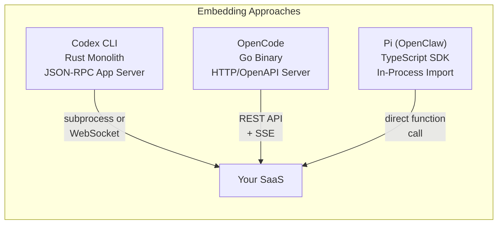
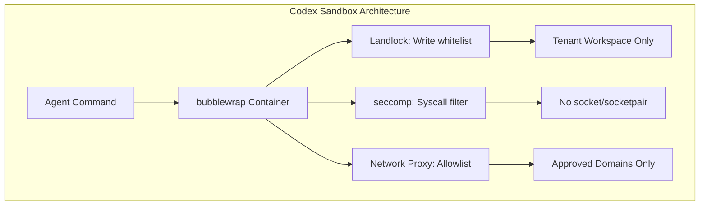
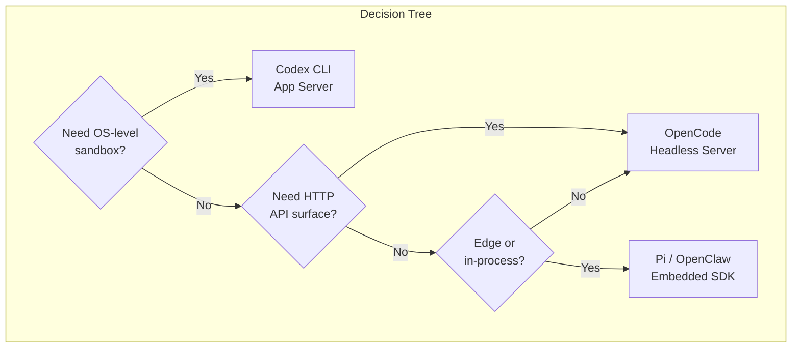

# Embedding AI Agents in SaaS: Codex CLI vs OpenCode vs Pi for Multi-Tenant Harnesses


---

The conversation around AI coding agents has shifted decisively from "which agent is smartest" to "which agent can I embed in my product." Kleinloog's Q2 2026 landscape analysis of CLI-based agents[^1] frames the core question: if you're building a multi-tenant SaaS that needs an embedded coding agent, which runtime architecture best fits your constraints?

This article compares the three most architecturally distinct candidates — OpenAI's **Codex CLI**, Anomaly's **OpenCode**, and OpenClaw's **Pi** — across the dimensions that matter for production SaaS: orchestrability, session isolation, security sandboxing, and deployment flexibility.

## The Architectural Spectrum

Each tool occupies a fundamentally different position on the embedding spectrum:



- **Codex CLI** exposes a JSON-RPC app-server over stdio or WebSocket[^2]. Your harness spawns or connects to a Codex process, communicates via bidirectional JSONL, and relies on OS-level sandboxing for isolation.
- **OpenCode** runs a headless HTTP server with a full OpenAPI 3.1 specification[^3]. Clients interact via REST endpoints and server-sent events (SSE), with SQLite-backed session persistence[^4].
- **Pi** is designed for direct in-process embedding via `createAgentSession()`[^5]. No IPC, no HTTP — your application imports the SDK and drives the agent loop programmatically.

## Session Management: Three Models Compared

Session management is where these architectures diverge most sharply for multi-tenant use cases.

### Codex CLI: Thread-per-Tenant via App Server

The Codex app-server's thread manager spins up one core session per thread[^2]. For multi-tenant isolation, you set a per-tenant `CODEX_HOME` environment variable to segregate configuration and state directories[^6]:

```bash
# Isolate tenant state via CODEX_HOME
CODEX_HOME=/data/tenants/acme codex --app-server
```

The Python SDK wraps both the `codex exec` JSONL path and the persistent app-server JSON-RPC path[^7], giving you two integration modes:

```python
from codex_sdk import CodexAppServer

server = CodexAppServer(
    codex_home="/data/tenants/acme",
    model="o3"
)
response = await server.send_message("Refactor the auth module")
```

Session state lives on the filesystem as JSON, with the app-server managing lifecycle. This is robust but requires process-per-tenant or careful `CODEX_HOME` partitioning.

### OpenCode: SQLite + HTTP = Stateless Orchestration

OpenCode's `opencode serve` command starts a headless server on port 4096 by default[^3], exposing session CRUD, messaging, and file operations via REST:

```bash
opencode serve --port 4096 --hostname 0.0.0.0
```

The TypeScript SDK provides typed access to all operations[^8]:

```typescript
import { createOpencode } from "@opencode-ai/sdk";

const { client } = await createOpencode({ port: 4096 });
const session = await client.session.create({});
await client.session.message(session.id, {
  prompt: "Add rate limiting to the API gateway"
});
```

All sessions share a single SQLite database using WAL mode[^4], with session forking via `Session.fork()` that clones messages with new ULIDs whilst preserving parent relationships[^9]. This is particularly powerful for multi-tenant SaaS: fork a base configuration session per tenant, then branch conversations independently.

The dual-layer storage architecture — SQLite for structured data, file-based storage for large blobs — keeps the database lean whilst handling large code contexts[^4].

### Pi: Zero-IPC In-Memory Sessions

Pi eliminates the network boundary entirely. OpenClaw's integration calls `createAgentSession()` directly[^5]:

```typescript
import { createAgentSession } from "pi-coding-agent";

const { session } = await createAgentSession({
  cwd: "/workspace/tenant-acme",
  model: "claude-sonnet-4-20250514",
  tools: tenantToolSet,
  customTools: [auditLogger, complianceChecker],
  sessionManager,
  settingsManager
});

await session.prompt("Implement the billing webhook handler", {
  images: screenshots
});
```

Events flow through `subscribeEmbeddedPiSession()`, dispatching `message_start`, `message_update`, `message_end`, and tool execution events without polling[^5]. Sessions persist as JSONL files with tree structure, and auto-compaction triggers on context overflow[^10].

For edge deployment — Raspberry Pi, Mac mini appliances, containerised microservices — this zero-IPC architecture eliminates subprocess management overhead entirely[^11].

## Security Sandboxing

### Codex CLI: OS-Level Isolation

Codex CLI's sandbox is its strongest differentiator for SaaS embedding. On Linux, it combines Landlock LSM for filesystem access control with seccomp-BPF for syscall filtering[^12]. Since v0.115.0, the default Linux sandbox uses bubblewrap (`bwrap`) with a managed proxy that enables controlled network access whilst blocking Unix socket creation to prevent sandbox escape[^12].



On macOS, Apple's Seatbelt framework provides equivalent kernel-level restrictions[^12]. This is genuine OS-level isolation without the overhead of full containerisation — critical when you need per-tenant sandboxing at scale.

### OpenCode: Application-Level Trust

OpenCode relies on application-level controls rather than OS sandboxing. The server supports HTTP Basic authentication via `OPENCODE_SERVER_PASSWORD`[^3], and file operations are scoped to the project directory. However, there's no Landlock-equivalent syscall filtering — the agent process has the same filesystem access as the user running it.

For multi-tenant SaaS, you'd need to layer your own containerisation (Docker, Firecracker) around each OpenCode instance, or run one server per tenant with appropriate OS-level isolation.

### Pi: Inherited from Host

Pi inherits whatever isolation its host process provides. Since it runs in-process, sandboxing is your responsibility. OpenClaw manages this through custom tool injection per channel and auth profile rotation[^5], but filesystem and network isolation must come from the container or VM layer.

## Multi-Tenant Data Isolation

| Dimension | Codex CLI | OpenCode | Pi (OpenClaw) |
|---|---|---|---|
| **Session storage** | JSON files per `CODEX_HOME` | Shared SQLite (WAL mode) | JSONL files with tree structure |
| **Tenant isolation** | `CODEX_HOME` env var | Session-level within shared DB | In-memory, per-instantiation |
| **State forking** | Not native | `Session.fork()` with ULID mapping | Manual via `SessionManager` |
| **Concurrent tenants** | Process-per-tenant or env isolation | Single server, many sessions | Many `AgentSession` instances |
| **Air-gap capable** | Yes (local models via proxy) | Yes (local providers) | Yes (edge-optimised) |
| **SDK language** | Python, Elixir[^13] | TypeScript[^8] | TypeScript[^5] |

## Deployment Patterns for Production SaaS

### Pattern 1: Codex CLI as Managed Subprocess

Best for platforms requiring strict security boundaries per tenant. Spawn a Codex app-server per tenant with isolated `CODEX_HOME`, communicate via JSON-RPC over stdio, and rely on Landlock/seccomp for filesystem and syscall isolation.

**Trade-offs:** Higher memory footprint per tenant (~150-200 MB per process), but strongest isolation guarantees. The Rust monolith architecture means predictable resource usage without GC pauses[^14].

### Pattern 2: OpenCode as Shared HTTP Service

Best for platforms where session isolation (not OS-level sandboxing) suffices. Run one or a few OpenCode servers behind a load balancer, use session IDs to partition tenant conversations, and leverage SQLite's WAL mode for concurrent access.

**Trade-offs:** Lower per-tenant overhead, excellent session management primitives (forking, branching), but you own the sandboxing layer. The 139K GitHub stars and active community[^15] mean rapid issue resolution.

### Pattern 3: Pi as Embedded Runtime

Best for edge deployments, desktop applications, or architectures where subprocess spawning is constrained (serverless, WebAssembly). Import the SDK, instantiate `AgentSession` per request, and handle lifecycle in-process.

**Trade-offs:** Lowest latency (no IPC overhead), most flexible tool injection, but you inherit all security responsibility. Ideal for scenarios where the host environment is already sandboxed[^11].



## Air-Gap Deployment

All three support air-gapped environments, but through different mechanisms:

- **Codex CLI** routes through its network proxy allowlist, supporting custom CA certificates via `SSL_CERT_FILE` for enterprise proxy chains[^14].
- **OpenCode** supports local model providers natively — point it at an on-premises vLLM or Ollama instance and it works without internet access[^3].
- **Pi/OpenClaw** implements stale cache offline fallback, gracefully degrading when cloud providers are unreachable[^16]. The embedded architecture means the orchestration layer runs entirely locally; only the LLM inference requires network access (or a local model).

## Recommendations

**Choose Codex CLI** when your SaaS handles untrusted code execution and you need per-tenant security guarantees without managing containers. The Landlock/seccomp sandbox is production-hardened and the JSON-RPC protocol is designed for backward compatibility[^2].

**Choose OpenCode** when you need the richest session management primitives — forking, branching, concurrent access — and can provide your own containerisation layer. The OpenAPI surface makes it trivially integrable with any HTTP client in any language.

**Choose Pi** when you're building for the edge, embedding in desktop apps, or operating in environments where subprocess spawning is impractical. The zero-IPC architecture delivers the lowest latency and most flexible tool injection, at the cost of inheriting all isolation responsibility.

The 2026 agent harness landscape[^17] has moved beyond "can we embed an agent?" to "which embedding architecture matches our operational constraints?" These three tools represent genuinely different answers to that question.

## Citations

[^1]: Kleinloog, "The Complete Landscape of CLI-Based AI Coding Agents," Q2 2026. <https://www.kleinloog.ch/articles/the-5-ai-coding-agents-worth-embedding-in-your-saas/the-complete-landscape-of-cli-based-ai-coding-agents.pdf>

[^2]: OpenAI, "App Server – Codex CLI," OpenAI Developers, 2026. <https://developers.openai.com/codex/app-server>

[^3]: OpenCode, "Server Documentation," opencode.ai, 2026. <https://opencode.ai/docs/server/>

[^4]: DeepWiki, "Storage and Database – sst/opencode," 2026. <https://deepwiki.com/sst/opencode/2.9-storage-and-database>

[^5]: OpenClaw, "Pi Integration Architecture," docs.openclaw.ai, 2026. <https://docs.openclaw.ai/pi>

[^6]: InfoQ, "OpenAI Publishes Codex App Server Architecture for Unifying AI Agent Surfaces," February 2026. <https://www.infoq.com/news/2026/02/opanai-codex-app-server/>

[^7]: PyPI, "codex-sdk-python," 2026. <https://pypi.org/project/codex-sdk-python/>

[^8]: OpenCode, "SDK Documentation," opencode.ai, 2026. <https://opencode.ai/docs/sdk/>

[^9]: BSWEN, "OpenCode CLI Features That Claude Code Doesn't Have: Forking, Reverting, and Session Copying," April 2026. <https://docs.bswen.com/blog/2026-04-04-opencode-session-features/>

[^10]: Armin Ronacher, "Pi: The Minimal Agent Within OpenClaw," lucumr.pocoo.org, January 2026. <https://lucumr.pocoo.org/2026/1/31/pi/>

[^11]: Raspberry Pi, "Turn your Raspberry Pi into an AI agent with OpenClaw," raspberrypi.com, 2026. <https://www.raspberrypi.com/news/turn-your-raspberry-pi-into-an-ai-agent-with-openclaw/>

[^12]: Pierce Freeman, "A deep dive on agent sandboxes," pierce.dev, 2026. <https://pierce.dev/notes/a-deep-dive-on-agent-sandboxes>

[^13]: nshkrdotcom, "OpenAI Codex SDK written in Elixir," GitHub, 2026. <https://github.com/nshkrdotcom/codex_sdk>

[^14]: Augment Code, "OpenAI Codex CLI ships v0.116.0 with enterprise features," March 2026. <https://www.augmentcode.com/learn/openai-codex-cli-enterprise>

[^15]: GitHub, "opencode-ai/opencode," April 2026. <https://github.com/opencode-ai/opencode>

[^16]: OpenClaw Blog, "Beyond the Cloud: Running OpenClaw on Mac mini, Raspberry Pi, and Intel AI PCs," 2026. <https://openclaws.io/blog/openclaw-hardware-ecosystem-2026>

[^17]: Philipp Schmid, "The importance of Agent Harness in 2026," philschmid.de, 2026. <https://www.philschmid.de/agent-harness-2026>
