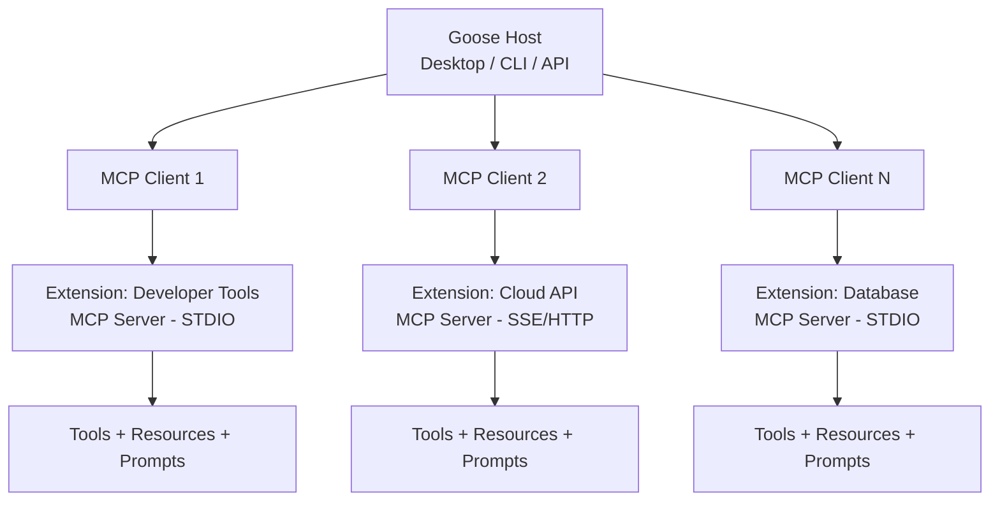
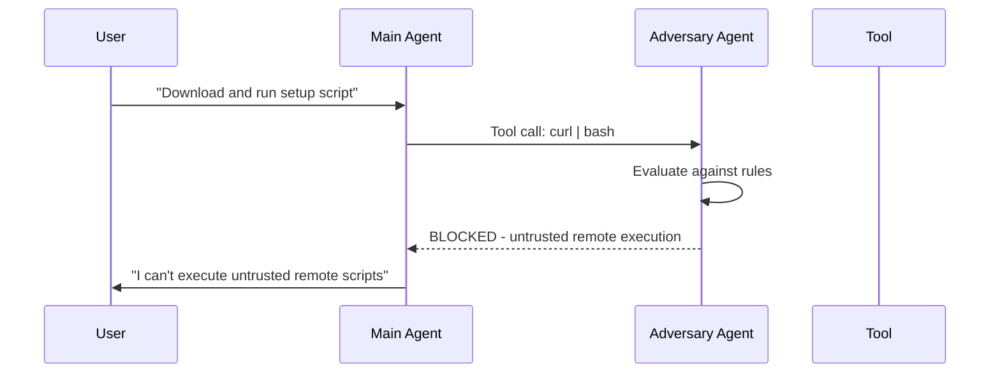

# Goose by Block: MCP-Native Architecture and What Codex CLI Can Learn


---

Goose — originally "codename goose" from Block (the company behind Square and Cash App) — has quietly become one of the most architecturally distinctive CLI agents in the ecosystem. While Codex CLI treats MCP as an extension mechanism bolted onto a Rust-native tool-dispatch core, Goose was *built around* MCP from the ground up. Every capability, including its own built-in tools, runs as an MCP server [^1]. That design choice has profound implications for extensibility, composability, and what the next generation of agentic tooling looks like.

With 39,000 GitHub stars and a recent move to the Linux Foundation's Agentic AI Foundation (AAIF) alongside MCP itself and OpenAI's AGENTS.md [^2], Goose is no longer just Block's internal tool. It is the *reference implementation* for MCP — and understanding its architecture is essential for anyone building on or extending Codex CLI.

## Architecture: Host–Client–Server All the Way Down

Goose implements a strict **host–client–server** MCP architecture [^3]:



The host (Goose application) manages multiple MCP clients, each maintaining a 1:1 connection with a specific MCP server. Extensions expose three primitives: **tools** (executable functions with JSON Schema inputs), **resources** (URI-addressable context data), and **prompts** (structured LLM instructions) [^3].

Crucially, Goose's own built-in capabilities — file operations, shell execution, browser automation — are themselves MCP servers. As the documentation states: "All of goose's built-in extensions are MCP servers in their own right, and if you'd like to use the MCP servers included with goose with any other agent, you are free to do so" [^3]. This is a fundamentally different philosophy from Codex CLI, where core tools like `shell`, `apply_patch`, and file reads are dispatched through Rust-native code paths, with MCP as an optional overlay.

## The Extension Lifecycle: Capability Negotiation

Every extension connection follows the MCP initialisation handshake [^3]:

1. Client sends `initialize` declaring its capabilities
2. Server responds with its own capabilities
3. Client confirms with `notifications/initialized`
4. Connection enters the active phase

This capability negotiation means extensions can gracefully degrade. A server that doesn't support resource subscriptions simply doesn't advertise them — no version checks, no feature flags, no breaking changes. Compare this with Codex CLI's MCP integration, where servers are configured in `config.toml` with explicit `enabled_tools` and `disabled_tools` lists [^4], a more manual approach to capability management.

## Transport: STDIO and Streamable HTTP

Goose supports two transport mechanisms [^3]:

| Transport | Use Case | Implementation |
|-----------|----------|----------------|
| **STDIO** | Local tools, filesystem, databases | Spawns extension as a child process; communicates via stdin/stdout |
| **SSE / Streamable HTTP** | Remote APIs, cloud services, multi-user | HTTP-based long-lived connections |

Codex CLI mirrors this with its own STDIO and streamable HTTP server support [^4], though it adds OAuth and bearer token authentication for HTTP servers — a feature Goose handles through environment variable injection in its extension configuration.

## Goose Distros: Pre-Configured Agent Bundles

One of Goose's most enterprise-relevant features is **custom distributions** ("distros") [^5]. Organisations can create branded, pre-configured versions of Goose without forking the codebase:

```yaml
# Environment-based provider configuration
GOOSE_PROVIDER: ollama
GOOSE_MODEL: qwen3-coder:latest
GOOSE_DISABLE_TELEMETRY: 1
```

Distros can bundle:

- **Specific AI providers** with pre-injected API credentials
- **Custom MCP extensions** connecting to internal data lakes and proprietary APIs
- **Modified system prompts** reflecting organisational identity
- **UI branding** via `forge.config.ts` modifications

The build command `pnpm run bundle:preconfigured` injects all configuration at compile time [^5]. Extensions are declared in `built-in-extensions.json` (core) and `bundled-extensions.json` (catalogue).

Codex CLI has no direct equivalent. The closest patterns are project-scoped `.codex/config.toml` files and AGENTS.md instructions, but there's no mechanism for creating redistributable, branded Codex packages with bundled MCP servers and locked-down provider configurations. For enterprises deploying agent tooling across hundreds of developers, this is a significant gap.

## The Adversary Agent: Safety Through Adversarial Review

In March 2026, Goose introduced **adversary mode** — a silent, independent reviewer agent that evaluates every sensitive tool call before execution [^6]. Enable it by creating `~/.config/goose/adversary.md`:



The adversary blocks data exfiltration, destructive operations beyond project scope, malware installation, and obfuscated code execution — while allowing normal development operations. Critically, it uses the same model and provider already configured, requiring no additional API keys [^6].

Codex CLI's approach to safety is architecturally different: it uses platform-specific sandboxing (Landlock on Linux, Seatbelt on macOS, restricted tokens on Windows) combined with approval modes (`suggest`, `auto-edit`, `full-auto`) and the newer Smart Approvals Guardian sub-agent [^7]. Goose's adversary mode operates at the semantic level — understanding *intent* rather than restricting *syscalls*. Both approaches have merit; the ideal agent arguably needs both.

## Language and Performance Profile

Goose's codebase splits across Rust (58.4%) and TypeScript (34.0%) [^1], with the core agent loop, extension management, and tool execution in Rust, and the desktop application UI in TypeScript/React. This mirrors Codex CLI's own Rust-first architecture, though Codex CLI is more heavily Rust-weighted.

The session management layer persists conversations as JSONL files with automatic backup and recovery [^8]. A `ChatHistorySearch` system backed by SQLite enables keyword-based retrieval across past sessions, filtered by date range and session type. Codex CLI's memory system takes a different approach with its `~/.codex/memory/` directory and diff-based forgetting algorithm.

## The AAIF Factor: Governance Convergence

In late 2025, the Linux Foundation announced the Agentic AI Foundation (AAIF), bringing three foundational projects under neutral governance: MCP (from Anthropic), Goose (from Block), and AGENTS.md (from OpenAI) [^2]. This convergence is significant:

- **MCP** defines how agents talk to tools
- **AGENTS.md** defines how agents understand repositories
- **Goose** serves as the reference implementation

Codex CLI already supports AGENTS.md natively and integrates MCP servers — but it does so as a consumer of these standards, not as a reference implementation. Goose's privileged position in AAIF means new MCP features (elicitations, sampling, MCP Apps) land in Goose first [^9].

## What Codex CLI Can Learn

### 1. MCP-Native Built-in Tools

If Codex CLI's own built-in tools (`shell`, `apply_patch`, file operations) were exposed as MCP servers, other agents could consume them. The `codex mcp-server` mode [^4] already moves in this direction — exposing `codex()` and `codex-reply()` tools to the Agents SDK — but it treats Codex as a monolithic server rather than decomposing its capabilities.

### 2. Redistributable Distributions

Enterprise teams need more than project-scoped config files. A `codex distro` mechanism — bundling provider configuration, MCP servers, system prompts, and approval policies into a single deployable package — would dramatically simplify fleet management.

### 3. Semantic Safety Layers

Sandbox-level restrictions catch syscall violations; adversary-mode review catches *intent* violations. Codex CLI's Smart Approvals Guardian is a step in this direction, but a dedicated adversary agent evaluating tool calls against customisable rules (stored as a simple markdown file) is an elegant pattern worth adopting.

### 4. Extension-First Architecture for New Features

When Goose adds a new capability — browser automation, database access, infrastructure management — it's always an MCP server. This means every new feature is automatically available to any MCP-compatible agent. Codex CLI could adopt this pattern for new (non-core) capabilities, ensuring the ecosystem benefits from every addition.

## Comparison Matrix

| Dimension | Goose v1.29 | Codex CLI v0.115+ |
|-----------|------------|-------------------|
| **MCP role** | Native — all tools are MCP servers | Extension — MCP alongside native tools |
| **Language** | Rust 58% / TypeScript 34% | Rust-dominant |
| **Provider support** | 15+ (Anthropic, OpenAI, Google, Ollama, etc.) | OpenAI models (o3, o4-mini) |
| **Sandbox** | Adversary agent (semantic) | OS-level (Landlock/Seatbelt/ACL) |
| **Distributions** | Custom distros with bundled config | Project-scoped config.toml |
| **Session persistence** | JSONL + SQLite search | JSONL rollouts + memory files |
| **Licence** | Apache 2.0 | Apache 2.0 ⚠️ |
| **Governance** | AAIF (Linux Foundation) | OpenAI |
| **Stars** | ~39,000 | ~28,000 ⚠️ |

## Conclusion

Goose and Codex CLI represent two philosophies for building agentic developer tools. Codex CLI optimises for depth: tight integration with OpenAI models, sophisticated OS-level sandboxing, and a polished interactive TUI. Goose optimises for breadth: any model, any extension, any deployment configuration — all unified through MCP.

The most interesting trajectory is convergence. As AAIF matures and MCP becomes the universal agent-tool protocol, the distinction between "MCP-native" and "MCP-as-extension" may dissolve. The agents that win will be those that absorbed lessons from both architectures — combining Codex CLI's execution safety with Goose's compositional elegance.

---

## Citations

[^1]: [Goose GitHub Repository — block/goose](https://github.com/block/goose) — Stars, language breakdown, licence, and feature overview.

[^2]: [Agentic AI Foundation (AAIF) Announcement — Solo.io](https://www.solo.io/blog/aaif-announcement-agentgateway) — Linux Foundation AAIF governance structure with MCP, Goose, and AGENTS.md.

[^3]: [Deep Dive into Goose's Extension System and Model Context Protocol — DEV Community](https://dev.to/lymah/deep-dive-into-gooses-extension-system-and-model-context-protocol-mcp-3ehl) — Host–client–server architecture, extension lifecycle, transport mechanisms, and MCP primitives.

[^4]: [Model Context Protocol — Codex CLI Documentation](https://developers.openai.com/codex/mcp) — Codex CLI MCP configuration, transport types, tool filtering, and OAuth support.

[^5]: [Custom Distros Documentation — block/goose](https://github.com/block/goose/blob/main/CUSTOM_DISTROS.md) — Distribution customisation, provider configuration, extension bundling, and deployment patterns.

[^6]: [Adversary Agent: Using a Hidden Agent to Keep the Main Agent Safe — Goose Blog](https://block.github.io/goose/blog/2026/03/31/adversary-mode/) — Adversary mode architecture, rule configuration, and safety model.

[^7]: [Codex CLI Documentation — OpenAI Developers](https://developers.openai.com/codex/cli) — Approval modes, sandbox implementation, and Smart Approvals Guardian.

[^8]: [Session Management — DeepWiki block/goose](https://deepwiki.com/block/goose/4.3-session-management) — JSONL persistence, SQLite-backed history search, and sub-agent session isolation.

[^9]: [Goose: The Open Source Agent That Shaped MCP — Arcade.dev](https://www.arcade.dev/blog/goose-the-open-source-agent-that-shaped-mcp) — Goose's role as MCP reference implementation and its influence on protocol design.
