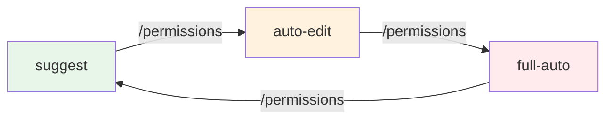
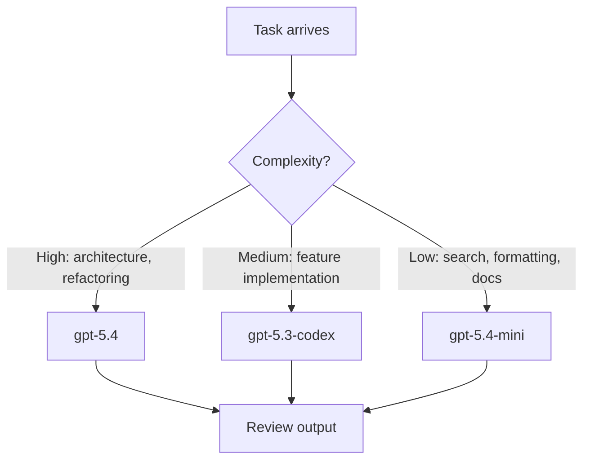
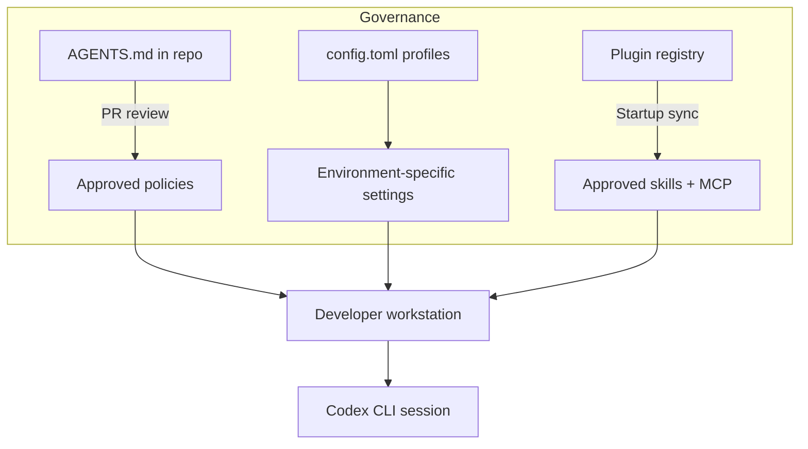

# Learning Plan for Becoming a Codex CLI Expert


---

Codex CLI has grown from a prototype terminal assistant into a full agentic coding platform — sub-agents, skills, MCP integrations, worktrees, cloud tasks, and an enterprise governance model[^1]. The surface area is large enough that a structured learning plan pays for itself quickly. This guide maps a four-phase path from first install to production-grade orchestration, with concrete exercises and milestones at each level. The entire plan fits inside two weeks — most developers reach confident daily use within the first few days.

## Phase 1 — Foundations (Day 1–2)

The goal is a working installation, confident navigation of the TUI, and an intuitive feel for the approval model.

### 1.1 Installation and Authentication

Install via npm (or the Windows installer if you are on Windows, which reached full feature parity in March 2026[^2]):

```bash
npm install -g @openai/codex
codex login          # OAuth or API key
codex --version      # confirm 0.118.x or later
```

Verify your default model. As of April 2026 the recommended default is `gpt-5.4`, which combines the coding strength of `gpt-5.3-codex` with stronger reasoning and native computer use[^3].

### 1.2 The Approval Model

Codex CLI's security posture rests on three approval modes[^4]:

| Mode | File edits | Shell commands | Network | Best for |
|------|-----------|---------------|---------|----------|
| `suggest` (default) | Approval required | Approval required | Blocked | Learning, auditing |
| `auto-edit` | Auto-applied | Approval required | Blocked | Day-to-day development |
| `full-auto` | Auto-applied | Auto-executed | Available | CI/CD, automation |

Switch at launch or mid-session:

```bash
codex --approval-mode auto-edit
# or inside the TUI:
/permissions
```

The sandbox layer underneath (`read-only`, `workspace-write`, `danger-full-access`) is orthogonal to approval mode[^5]. Understanding both dimensions is the first genuine milestone.

### 1.3 First Exercises

1. **Explain a file** — open a repository you know well, run `codex` in `suggest` mode, and ask it to explain a complex module. Observe how it reads files.
2. **Fix a bug** — switch to `auto-edit`, paste a stack trace, and let Codex propose a patch. Review the diff before accepting.
3. **Run tests** — use `/permissions` to switch to `full-auto` inside the session and ask Codex to run the test suite and fix any failures.



**Milestone:** You can install Codex, authenticate, switch between approval modes, and explain the sandbox/approval matrix to a colleague.

---

## Phase 2 — Configuration and Context (Day 3–4)

The goal is to make Codex consistently useful by giving it durable project knowledge and personalised defaults.

### 2.1 config.toml

Codex reads `~/.codex/config.toml` for persistent settings[^6]. A sensible starter:

```toml
model = "gpt-5.4"
approval_mode = "auto-edit"

[history]
persistence = "across-sessions"

[project_doc]
max_bytes = 65536
fallback_filenames = ["TEAM_GUIDE.md", ".agents.md"]
```

Profiles let you maintain separate configurations per client or project:

```bash
codex --profile enterprise-client
```

### 2.2 AGENTS.md — Your Constitution

AGENTS.md is Codex's instruction discovery system[^7]. It follows a three-tier hierarchy:

1. **Global** — `~/.codex/AGENTS.md` (or `AGENTS.override.md` for highest priority)
2. **Repository root** — checked into version control with the team
3. **Subdirectory** — progressively more specific guidance, concatenated from root downward

Files are merged until `project_doc_max_bytes` (32 KiB by default) is reached[^7]. A minimal project-level example:

```markdown
# AGENTS.md

## Language & Style
- TypeScript with strict mode; no `any` types
- Prefer `pnpm` over `npm`
- British English in comments and documentation

## Testing
- Every public function needs a unit test
- Use Vitest, not Jest

## Restrictions
- Never modify `package-lock.json` directly
- Do not install new dependencies without asking
```

Verify what loaded:

```bash
codex --ask-for-approval never "Summarise the current instructions."
```

### 2.3 Exercise: Build Your AGENTS.md Stack

1. Create a global `~/.codex/AGENTS.md` with your personal coding preferences.
2. Add a repository-level `AGENTS.md` with project conventions.
3. Add a subdirectory `AGENTS.override.md` in a module that has stricter rules (e.g. no external network calls in a security module).
4. Run the verification command and confirm all three layers appear.

**Milestone:** You have a `config.toml` with sensible defaults, a layered AGENTS.md stack, and can explain the merge order.

---

## Phase 3 — Intermediate Patterns (Day 5–8)

### 3.1 MCP Integration

Model Context Protocol connects Codex to external tools and data sources[^8]. Two transport types are supported:

**STDIO** — local processes, configured via CLI or config.toml:

```bash
codex mcp add context7 -- npx -y @upstash/context7-mcp
```

**Streaming HTTP** — remote servers with bearer token authentication:

```toml
[mcp_servers.docs-server]
url = "https://docs.internal.co/mcp"
bearer_token_env_var = "DOCS_MCP_TOKEN"
tool_timeout_sec = 30
```

Use `/mcp` in the TUI to inspect active servers. Use `enabled_tools` and `disabled_tools` to control which tools from a server are exposed[^8].

For OAuth-enabled servers:

```bash
codex mcp login docs-server
```

### 3.2 Skills

A skill packages instructions, resources, and optional scripts so Codex can follow a workflow reliably[^9]. The minimum structure:

```
.agents/skills/lint-fix/
├── SKILL.md
└── agents/
    └── openai.yaml   # optional: UI metadata, tool deps
```

The `SKILL.md` front matter:

```markdown
---
name: lint-fix
description: Fix all ESLint errors in staged files
---

1. Run `npx eslint --fix $(git diff --cached --name-only)`
2. Stage the fixed files
3. Report remaining unfixable errors
```

Skills are discovered from four scopes: repository (`.agents/skills/`), user (`$HOME/.agents/skills`), admin (`/etc/codex/skills`), and built-in[^9]. Use `$skill-creator` to scaffold new skills interactively.

Invoke explicitly with `/skills` or `$skill-name`, or let Codex match implicitly based on task description.

### 3.3 Model Selection Strategy

Not every task needs `gpt-5.4`. A practical model allocation[^3]:



Switch mid-session with `/model` — no restart needed[^3].

### 3.4 Exercises

1. **MCP** — connect a documentation MCP server and ask Codex to answer questions using it.
2. **Skills** — create a skill that runs your team's code review checklist and packages results into a PR comment.
3. **Model switching** — use `gpt-5.4-mini` for a codebase search task, then switch to `gpt-5.4` for a refactoring task, and compare cost and quality.

**Milestone:** You have at least one MCP server connected, one custom skill, and a model selection heuristic you can articulate.

---

## Phase 4 — Advanced Orchestration (Day 9–14)

### 4.1 Sub-Agents and Worktrees

Sub-agents let you parallelise larger tasks[^10]. Since version 0.117.0, sub-agents use readable path-based addresses like `/root/agent_a` with structured messaging[^11].

Worktrees isolate each agent in its own Git branch, so multiple agents can modify the same repository without conflicts[^10]. The desktop app handles worktree lifecycle automatically; from the CLI you manage it via `/agent` commands.

A practical pattern: use `gpt-5.4` as a planning coordinator that delegates narrower subtasks (file review, test writing, documentation) to `gpt-5.4-mini` sub-agents running in parallel worktrees.

### 4.2 CI/CD Integration

`codex exec` is the non-interactive mode designed for pipelines[^12]:

```bash
# In a GitHub Actions workflow
codex exec --full-auto --model gpt-5.4-mini \
  "Review this PR diff and post a summary comment" \
  < <(gh pr diff $PR_NUMBER)
```

As of 0.118.0, `codex exec` supports prompt-plus-stdin workflows, so you can pipe input and still pass a separate prompt[^11].

For scheduled maintenance:

```yaml
# .github/workflows/codex-sweep.yml
name: Weekly dependency sweep
on:
  schedule:
    - cron: '0 9 * * 1'
jobs:
  sweep:
    runs-on: ubuntu-latest
    steps:
      - uses: actions/checkout@v4
      - run: npm i -g @openai/codex
      - run: |
          codex exec --full-auto \
            "Update outdated dependencies, run tests, \
             and open a PR if everything passes"
```

### 4.3 Enterprise Governance

For teams, governance comes through version-controlled configuration[^13]:

- **AGENTS.md in source control** — policy changes go through PR review, providing an audit trail
- **Profiles** — `codex --profile production` loads a locked-down config with `suggest` mode and `read-only` sandbox
- **Plugins** — since 0.117.0, plugins are first-class with product-scoped syncing at startup[^11], enabling centralised distribution of approved skills and MCP servers



### 4.4 Exercises

1. **Sub-agents** — set up a planning agent that delegates test writing to three sub-agents working in parallel worktrees.
2. **CI/CD** — add a GitHub Actions workflow that uses `codex exec` to auto-review PRs.
3. **Enterprise config** — create two profiles (`dev` and `production`) with different approval modes and model selections.

**Milestone:** You can orchestrate multi-agent workflows, integrate Codex into CI/CD pipelines, and explain your governance model.

---

## Mastery Checklist

Use this as a self-assessment. Tick each item when you can demonstrate it confidently:

| Level | Skill | ✓ |
|-------|-------|---|
| Foundation | Install, authenticate, explain approval × sandbox matrix | ☐ |
| Foundation | Navigate the TUI, use `/permissions`, attach images | ☐ |
| Configuration | Maintain a layered AGENTS.md stack | ☐ |
| Configuration | Customise `config.toml` with profiles | ☐ |
| Intermediate | Connect and manage MCP servers | ☐ |
| Intermediate | Create and distribute custom skills | ☐ |
| Intermediate | Select models by task complexity | ☐ |
| Advanced | Orchestrate sub-agents in parallel worktrees | ☐ |
| Advanced | Integrate `codex exec` into CI/CD pipelines | ☐ |
| Advanced | Implement enterprise governance with profiles and plugins | ☐ |

## Recommended Reading Order

If you are working through Daniel's Codex CLI knowledge base, this learning plan maps to the following article sequence:

1. Installation and first steps → *Getting Started* articles
2. AGENTS.md deep dive → *Codified Context: Three-Tier Knowledge Architecture*
3. MCP integration → *MCP configuration* articles
4. Skills → *Agent Skills* articles
5. Competitive context → *Codex CLI Competitive Position April 2026*
6. Advanced internals → *How the Codex CLI Agentic Loop Works*

---

## Citations

[^1]: [Codex CLI official documentation — OpenAI Developers](https://developers.openai.com/codex/cli)
[^2]: [Codex CLI changelog — Windows launch March 2026](https://developers.openai.com/codex/changelog)
[^3]: [Codex CLI features — model selection and gpt-5.4](https://developers.openai.com/codex/cli/features)
[^4]: [Codex CLI command reference — approval modes](https://developers.openai.com/codex/cli/reference)
[^5]: [How to Configure Approval and Sandbox Modes — Inventive HQ](https://inventivehq.com/knowledge-base/openai/how-to-configure-sandbox-modes)
[^6]: [Codex configuration reference](https://developers.openai.com/codex/config-reference)
[^7]: [Custom instructions with AGENTS.md — OpenAI Developers](https://developers.openai.com/codex/guides/agents-md)
[^8]: [Model Context Protocol — Codex | OpenAI Developers](https://developers.openai.com/codex/mcp)
[^9]: [Agent Skills — Codex | OpenAI Developers](https://developers.openai.com/codex/skills)
[^10]: [The Codex App Super Guide 2026 — Kingy AI](https://kingy.ai/ai/the-codex-app-super-guide-2026-from-hello-world-to-worktrees-skills-mcp-ci-and-enterprise-governance/)
[^11]: [Codex CLI changelog — v0.117.0 and v0.118.0](https://developers.openai.com/codex/changelog)
[^12]: [Best practices — Codex | OpenAI Developers](https://developers.openai.com/codex/learn/best-practices)
[^13]: [Agentic Coding Harnesses: Enterprise Guide — Big Hat Group](https://www.bighatgroup.com/blog/agentic-coding-harnesses-claude-code-codex-gemini-enterprise-guide/)
