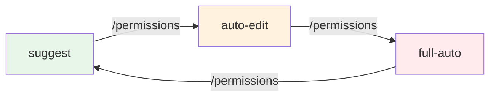
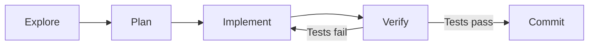
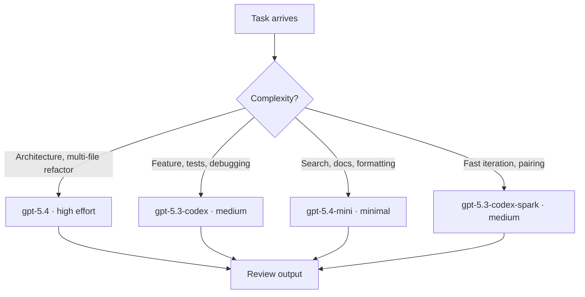
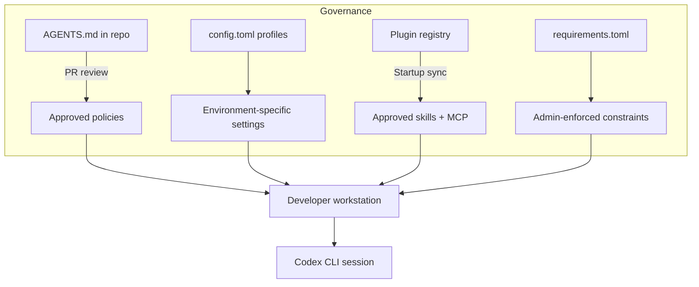

# Learning Plan for Becoming a Codex CLI Expert


---

Codex CLI is not a chatbot that writes code. It is an agentic coding harness — a system that reads your files, runs commands, makes changes, and works through problems autonomously while you watch, redirect, or step away[^1]. Learning to use it well is less about memorising commands and more about developing a new engineering discipline: knowing when to specify precisely and when to let the agent explore, when to intervene and when to trust the sandbox, when to invest in durable context and when to clear the slate and start fresh.

This guide maps a five-phase path from first install to production-grade orchestration. The entire plan fits inside two weeks. Most developers reach confident daily use within the first few days; the later phases are about compounding that confidence into reliable, scalable workflows. Each phase closes with concrete exercises and a milestone you can demonstrate to a colleague.

The structure draws on lessons from across the agentic coding ecosystem — including Anthropic's "explore, plan, implement, commit" workflow for Claude Code[^2], MIT's Missing Semester lecture on agentic coding[^3], and the Plan-Execute-Verify loop that has emerged as the standard professional methodology[^4]. The principles are universal; the implementation here is Codex CLI through and through.

---

## The One Constraint That Governs Everything

Before diving into phases, understand the single constraint that shapes every best practice in this guide: **the context window fills up fast, and performance degrades as it fills**[^2].

Codex CLI's context window holds your entire conversation — every message you send, every file Codex reads, every command output it processes. A single debugging session can consume tens of thousands of tokens. When context fills, the model starts losing track of earlier instructions and making more mistakes.

Every technique in this guide — from clearing sessions between tasks to delegating investigation to sub-agents to encoding knowledge in AGENTS.md — is ultimately a strategy for keeping the context window lean and focused. If you remember nothing else, remember this: **manage context aggressively, and everything else follows**.

---

## Phase 1 — First Contact (Day 1)

**Goal:** A working installation, confident navigation of the TUI, and an intuitive feel for the two-dimensional security model.

### 1.1 Installation and Authentication

Install via npm, Homebrew, or the Windows installer (which reached full feature parity in March 2026[^5]):

```bash
npm install -g @openai/codex      # or: brew install openai-codex
codex login                        # OAuth browser flow or API key
codex --version                    # confirm 0.118.x or later
```

Verify your default model. As of April 2026 the recommended default is `gpt-5.4`, which combines the coding strength of `gpt-5.3-codex` with stronger reasoning and native computer use[^6].

### 1.2 The Two-Dimensional Security Model

Codex CLI's security posture rests on two orthogonal dimensions: **approval mode** and **sandbox level**[^7]. Understanding both is your first real milestone.

**Approval modes** control what requires your explicit sign-off:

| Mode | File edits | Shell commands | Network | Best for |
|------|-----------|---------------|---------|----------|
| `suggest` (default) | Approval required | Approval required | Blocked | Learning, auditing |
| `auto-edit` | Auto-applied | Approval required | Blocked | Day-to-day development |
| `full-auto` | Auto-applied | Auto-executed | Available | CI/CD, trusted automation |

**Sandbox levels** control what the agent *can* access, regardless of approval:

| Level | Filesystem | Network | Use case |
|-------|-----------|---------|----------|
| `read-only` | Read anywhere, write nowhere | Blocked | Safe exploration |
| `workspace-write` | Write within project only | Blocked | Normal development |
| `danger-full-access` | Unrestricted | Available | System administration |

Switch either dimension at launch or mid-session:

```bash
codex --approval-mode auto-edit
# or inside the TUI:
/permissions
```

The key insight: `auto-edit` with `workspace-write` is the sweet spot for daily work. You get flow (no approval popups for file edits) with safety (shell commands still need a nod, and nothing touches files outside your project).



### 1.3 Your First Three Tasks

Do these in order. Each one teaches a different interaction pattern.

**Task 1 — Explain.** Open a repository you know well. Run `codex` in `suggest` mode. Ask it to explain a complex module. Watch how it reads files, follows imports, and builds understanding. This is the equivalent of asking a senior engineer "how does this work?" — and it is one of the highest-value uses of any agentic tool[^2].

**Task 2 — Fix.** Switch to `auto-edit`. Paste a real stack trace or error message. Let Codex propose a patch. Review the diff before accepting. Notice how it reads the surrounding code to understand context before editing.

**Task 3 — Test and iterate.** Switch to `full-auto` with `/permissions`. Ask Codex to run the test suite and fix any failures. This is your first taste of the agentic loop: Codex runs a command, reads the output, decides what to do next, and acts — without waiting for you. Observe how it self-corrects.

### 1.4 The Mental Model Shift

MIT's Missing Semester lecture captures the right framing: treat the agent "like a manager of an intern — the intern will do the nitty-gritty work, but will require guidance"[^3]. You are not typing code. You are defining intent, setting boundaries, and reviewing output. The faster you internalise this shift, the faster you progress.

**Milestone:** You can install Codex, authenticate, switch between approval modes, explain the sandbox/approval matrix, and complete a fix-and-test cycle without manual coding.

---

## Phase 2 — Durable Context (Day 2–3)

**Goal:** Make Codex consistently useful by giving it durable project knowledge, personalised defaults, and a structured prompting discipline.

### 2.1 config.toml — Your Persistent Defaults

Codex reads `~/.codex/config.toml` for settings that persist across every session[^8]. A sensible starter:

```toml
model = "gpt-5.4"
approval_mode = "auto-edit"

[history]
persistence = "across-sessions"

[project_doc]
max_bytes = 65536
fallback_filenames = ["TEAM_GUIDE.md", ".agents.md"]
```

Profiles let you maintain separate configurations per client, project, or risk level:

```bash
codex --profile enterprise-client   # locked-down settings
codex --profile side-project        # relaxed, full-auto
```

### 2.2 AGENTS.md — Your Constitution

AGENTS.md is the single most important file in your Codex workflow. It is the instruction discovery system that tells the agent who you are, what your codebase expects, and what rules must never be broken[^9]. Anthropic's equivalent (CLAUDE.md) follows the same pattern, and their advice applies equally: "For each line, ask: would removing this cause the agent to make mistakes? If not, cut it"[^2].

Codex discovers AGENTS.md in a three-tier hierarchy, concatenating files from root downward until `project_doc_max_bytes` (32 KiB) is reached[^9]:

1. **Global** — `~/.codex/AGENTS.md` (personal defaults) or `AGENTS.override.md` (highest priority)
2. **Repository root** — checked into version control, shared with the team
3. **Subdirectory** — progressively more specific guidance for modules, services, or packages

```markdown
# AGENTS.md (repository root)

## Language & Style
- TypeScript with strict mode; no `any` types
- Prefer `pnpm` over `npm`
- British English in comments and documentation

## Build & Test
- `pnpm test` runs Vitest; always run after changes
- `pnpm lint` for ESLint; fix before committing
- Every public function needs a unit test

## Restrictions
- Never modify `pnpm-lock.yaml` directly
- Do not install new dependencies without asking
- Do not use `console.log` — use the project logger
```

Verify what loaded:

```bash
codex --ask-for-approval never "Summarise the current instructions."
```

Check the logs at `~/.codex/log/codex-tui.log` for the full audit trail of which files were discovered and in what order.

**Anti-pattern warning:** A bloated AGENTS.md causes the agent to ignore your actual instructions because important rules get lost in the noise. Keep it under 100 lines. If the agent already does something correctly without the instruction, delete the instruction[^2].

### 2.3 Structured Prompting — The Four-Element Prompt

Codex's official best practices recommend structuring every non-trivial request with four elements[^1]:

1. **Goal** — what you want to achieve
2. **Context** — relevant files, constraints, existing patterns
3. **Constraints** — what the agent must not do
4. **Done when** — how the agent verifies success

| Before | After |
|--------|-------|
| "add tests for auth" | "Write Vitest tests for `src/auth/tokenRefresh.ts` covering the edge case where the refresh token is expired. Don't mock the token store — use the in-memory test adapter in `test/helpers/`. Done when `pnpm test -- --grep tokenRefresh` passes." |
| "fix the login bug" | "Users report login fails after session timeout. Check `src/auth/`, especially the refresh flow. Write a failing test that reproduces the timeout, then fix it. Done when the new test passes and `pnpm test` is green." |

This discipline pays compound interest. Clear prompts mean fewer corrections, shorter sessions, and less context wasted on failed approaches.

### 2.4 The Explore-Plan-Implement Loop

This is the workflow pattern that both Codex and Claude Code converge on[^1][^2]. For any task bigger than a one-line fix:



**Explore** — Use plan mode or `suggest` mode to let Codex read the codebase and answer questions without making changes. "Read `src/auth/` and explain how we handle token refresh."

**Plan** — Ask for an implementation plan before any code is written. "I want to add OAuth. What files need to change? What's the session flow? Write a plan."

**Implement** — Switch to `auto-edit` and let Codex execute the plan. "Implement the OAuth flow from your plan. Write tests for the callback handler."

**Verify** — This is where most beginners underinvest. The single highest-leverage thing you can do is give the agent a way to verify its own work[^2] — tests, linters, type-checkers, screenshot comparisons. Without verification criteria, you become the only feedback loop, and every mistake requires your attention.

### 2.5 Exercise: Build Your Context Stack

1. Create `~/.codex/AGENTS.md` with your personal coding preferences (language, style, preferred tools).
2. Add a repository-level `AGENTS.md` with project conventions and build commands.
3. Add a subdirectory `AGENTS.override.md` in a security-sensitive module with stricter rules.
4. Run the verification command and confirm all three layers appear.
5. Complete a feature using the explore-plan-implement loop. Observe how much less correction is needed compared to Phase 1.

**Milestone:** You have a `config.toml` with profiles, a layered AGENTS.md stack, and can articulate the four-element prompt structure. You use the explore-plan-implement loop by default.

---

## Phase 3 — The Extension Stack (Day 4–7)

**Goal:** Connect Codex to external tools, create reusable workflows, automate guardrails, and develop a cost-conscious model selection strategy.

### 3.1 MCP — Connecting to the Outside World

Model Context Protocol gives Codex access to tools and data sources beyond the filesystem[^10]. Two transport types are supported:

**STDIO** — local processes, zero configuration friction:

```bash
codex mcp add context7 -- npx -y @upstash/context7-mcp
codex mcp add github -- gh mcp
```

**Streaming HTTP** — remote servers with authentication:

```toml
[mcp_servers.docs-server]
url = "https://docs.internal.co/mcp"
bearer_token_env_var = "DOCS_MCP_TOKEN"
tool_timeout_sec = 30
```

Use `/mcp` in the TUI to inspect active servers. Control tool exposure with `enabled_tools` and `disabled_tools`[^10]. For OAuth-enabled servers: `codex mcp login docs-server`.

MCP is context-efficient — it gives Codex access to information without pre-loading it into the context window. This matters as your workflows grow more complex.

### 3.2 Skills — Reusable Workflows

A skill packages instructions, resources, and optional scripts so Codex can follow a workflow reliably[^11]. Where AGENTS.md provides always-on guidance, skills provide on-demand expertise that loads only when relevant — keeping your context window lean.

The minimum structure:

```
.agents/skills/lint-fix/
├── SKILL.md
└── agents/
    └── openai.yaml   # optional: UI metadata, tool deps
```

A practical `SKILL.md`:

```markdown
---
name: lint-fix
description: Fix all ESLint errors in staged files. Use when asked to lint, fix lint errors, or prepare files for commit.
---

1. Run `npx eslint --fix $(git diff --cached --name-only --diff-filter=d)`
2. Stage the fixed files with `git add`
3. Run `npx eslint $(git diff --cached --name-only --diff-filter=d)` to check for remaining errors
4. Report unfixable errors with file and line number
```

Skills are discovered from four scopes: repository (`.agents/skills/`), user (`$HOME/.agents/skills`), admin (`/etc/codex/skills`), and built-in[^11]. Invoke explicitly with `/skills` or `$skill-name`, or let Codex match implicitly based on your task description. The description field is critical — write it with clear scope and boundaries so implicit matching is reliable.

Use `$skill-creator` to scaffold new skills interactively, or browse the marketplace with `/skills`.

### 3.3 Hooks — Deterministic Guardrails

Where AGENTS.md is advisory ("please run lint before committing"), hooks are deterministic ("lint *will* run after every file edit, no exceptions")[^12]. They inject scripts into Codex's agentic loop at precise lifecycle points.

Enable hooks in `config.toml`:

```toml
codex_hooks = true
```

Configure in `~/.codex/hooks.json` or `<repo>/.codex/hooks.json`:

```json
{
  "hooks": [
    {
      "event": "PostToolUse",
      "matcher": { "tool_name": "write" },
      "command": "npx eslint --fix $CODEX_FILE_PATH",
      "timeout": 30
    },
    {
      "event": "UserPromptSubmit",
      "command": "python3 .codex/validate-prompt.py"
    }
  ]
}
```

The five lifecycle events[^12]:

| Event | When it fires | Common use |
|-------|--------------|------------|
| `SessionStart` | Session opens or resumes | Load project context, check env vars |
| `UserPromptSubmit` | You press Enter | Validate prompts, inject context |
| `PreToolUse` | Before a command runs | Block dangerous commands, audit |
| `PostToolUse` | After a command completes | Auto-lint, log results |
| `Stop` | Agent finishes a turn | Summarise, trigger CI |

Hooks and AGENTS.md serve different purposes. Use AGENTS.md for guidance the agent should consider. Use hooks for actions that must happen every time, with zero exceptions.

### 3.4 Model Selection Strategy

Not every task needs your most capable (and most expensive) model. A practical allocation[^6]:

| Complexity | Model | Reasoning effort | Use case |
|-----------|-------|-----------------|----------|
| High | `gpt-5.4` | `high` or `xhigh` | Architecture, complex refactoring, security review |
| Medium | `gpt-5.3-codex` | `medium` | Feature implementation, test writing |
| Low | `gpt-5.4-mini` | `low` or `minimal` | Search, formatting, documentation, boilerplate |
| Speed-critical | `gpt-5.3-codex-spark` | `medium` | Real-time pairing, rapid iteration |



Switch mid-session with `/model` — no restart needed. Encode your default allocation in profiles:

```toml
# ~/.codex/config.toml
[profiles.fast]
model = "gpt-5.3-codex-spark"
model_reasoning_effort = "medium"

[profiles.careful]
model = "gpt-5.4"
model_reasoning_effort = "high"
```

### 3.5 Session Management — Protecting Your Context

This is where the "one constraint" from the introduction becomes practical. Long sessions accumulate irrelevant context that degrades performance. Manage aggressively:

- **`/clear`** — Reset between unrelated tasks. This is the single most underused command.
- **`/compact`** — Summarise the current conversation to free space. Add focus: `/compact Focus on the API changes`.
- **`Esc`** — Stop the agent mid-action. Context is preserved; redirect immediately.
- **`Esc` + `Esc`** — Open the rewind menu. Restore conversation, code, or both to any previous checkpoint.
- **`/fork`** — Branch the conversation while preserving history.
- **One thread per task** — Don't ask about authentication, then switch to CSS, then go back to auth. Start fresh.

The anti-pattern Anthropic calls "the kitchen sink session" — starting with one task, asking something unrelated, going back to the first task — is the most common source of degraded output[^2]. When you catch yourself doing this, `/clear`.

### 3.6 Exercises

1. **MCP** — Connect a documentation MCP server (try Context7 or the GitHub CLI MCP). Ask Codex to answer a question using the external tool.
2. **Skills** — Create a skill that runs your team's code review checklist and packages results into a PR comment.
3. **Hooks** — Set up a `PostToolUse` hook that auto-lints any file Codex writes.
4. **Model switching** — Complete a task using `gpt-5.4-mini` for exploration, then switch to `gpt-5.4` for implementation. Compare cost and quality.
5. **Context hygiene** — Complete three unrelated tasks in one sitting, using `/clear` between each. Notice how the third task is as good as the first.

**Milestone:** You have at least one MCP server connected, one custom skill, one active hook, a model selection heuristic you can articulate, and a habit of clearing context between tasks.

---

## Phase 4 — Orchestration and Automation (Day 8–11)

**Goal:** Move from single-agent interactive use to multi-agent orchestration, CI/CD integration, and autonomous workflows.

### 4.1 Sub-Agents — Parallel Execution Without Context Pollution

Sub-agents are one of the most powerful tools available, precisely because of the context constraint[^2]. When Codex investigates a codebase, it reads files — and every file read consumes your context. Sub-agents run in separate context windows and report back summaries.

Since version 0.117.0, sub-agents use readable path-based addresses like `/root/agent_a` with structured inter-agent messaging[^13]. Three built-in agent types are available:

| Agent | Purpose | Typical model |
|-------|---------|---------------|
| `default` | General-purpose fallback | Inherits parent |
| `worker` | Implementation-focused execution | `gpt-5.3-codex` |
| `explorer` | Read-heavy codebase analysis | `gpt-5.4-mini` |

Define custom agents in TOML:

```toml
# .codex/agents/security-reviewer.toml
name = "security-reviewer"
description = "Reviews code for security vulnerabilities"
developer_instructions = """
You are a senior security engineer. Review code for:
- Injection vulnerabilities (SQL, XSS, command injection)
- Authentication and authorization flaws
- Secrets or credentials in code
Provide specific line references and suggested fixes.
"""
model = "gpt-5.4"
```

Global controls manage concurrency: `agents.max_threads` (default 6) and `agents.max_depth` (default 1, preventing recursive delegation)[^13].

**The coordinator pattern:** Use `gpt-5.4` as a planning coordinator that delegates narrower subtasks to `gpt-5.4-mini` sub-agents:

```
Use an explorer sub-agent to understand how our payment processing works.
Then use three worker sub-agents in parallel to:
1. Add input validation to the checkout flow
2. Write integration tests for the payment webhook
3. Update the API documentation
```

### 4.2 Worktrees — Isolation at Scale

Worktrees isolate each agent in its own Git branch, so multiple agents can modify the same repository without conflicts[^14]. The desktop app handles worktree lifecycle automatically; from the CLI, manage via `/agent` commands.

The combination of sub-agents and worktrees enables the "agent swarm" pattern: multiple agents working on related tasks simultaneously, each in an isolated branch, with a coordinator merging results.

### 4.3 CI/CD Integration with codex exec

`codex exec` is the non-interactive mode designed for pipelines[^1]:

```bash
# PR review in GitHub Actions
codex exec --full-auto --model gpt-5.4-mini \
  "Review this PR diff and post a summary comment" \
  < <(gh pr diff $PR_NUMBER)
```

As of v0.118.0, `codex exec` supports prompt-plus-stdin workflows and `--output-schema` for structured JSON output[^5]:

```bash
# Structured output for downstream processing
codex exec --full-auto --json --output-schema '{"type":"object","properties":{"summary":{"type":"string"},"risk":{"type":"string"}}}' \
  "Analyse this code change for security risks" < diff.patch
```

For scheduled automation:

```yaml
# .github/workflows/codex-sweep.yml
name: Weekly dependency sweep
on:
  schedule:
    - cron: '0 9 * * 1'
jobs:
  sweep:
    runs-on: ubuntu-latest
    steps:
      - uses: actions/checkout@v4
      - run: npm i -g @openai/codex
      - run: |
          codex exec --full-auto \
            "Update outdated dependencies, run tests, \
             and open a PR if everything passes"
```

For batch processing, `spawn_agents_on_csv` processes similar tasks at scale — one worker per row[^13]:

```bash
codex exec --full-auto \
  "Process each row in tasks.csv: migrate the file from React to Vue"
```

### 4.4 The Verify-Everything Discipline

As you automate more, verification becomes the bottleneck — not generation[^4]. Establish quality gates at every level:

- **Unit tests** — every feature implementation must include tests and run them
- **Type-checking** — `tsc --noEmit` or equivalent after every code change
- **Linting** — enforce via hooks, not AGENTS.md instructions
- **Review** — use a fresh session (or a dedicated sub-agent) to review code. A fresh context won't be biased toward code it just wrote[^2]
- **Kill criteria** — if Codex is stuck for 3+ iterations on the same error, intervene. Don't let it burn tokens on rabbit holes[^4]

### 4.5 Exercises

1. **Sub-agents** — Use an explorer sub-agent to investigate a part of your codebase, then use the findings to implement a feature. Compare the context usage vs doing everything in one session.
2. **Worktrees** — Set up a planning agent that delegates test writing to three sub-agents working in parallel worktrees.
3. **CI/CD** — Add a GitHub Actions workflow that uses `codex exec` to auto-review PRs and post comments.
4. **Batch processing** — Create a CSV of 10 files that need a similar change. Use `spawn_agents_on_csv` to process them in parallel.

**Milestone:** You can orchestrate multi-agent workflows, run codex exec in CI/CD, use sub-agents to protect context, and explain your verification strategy.

---

## Phase 5 — Mastery (Day 12–14)

**Goal:** Enterprise governance, cost management, building systems that build systems, and developing the intuition that no guide can fully capture.

### 5.1 Enterprise Governance

For teams, governance comes through version-controlled configuration[^15]:

- **AGENTS.md in source control** — policy changes go through PR review, providing an audit trail
- **Profiles** — `codex --profile production` loads a locked-down config with `suggest` mode and `read-only` sandbox
- **Plugins** — since v0.117.0, plugins are first-class with product-scoped syncing at startup[^5], enabling centralised distribution of approved skills, hooks, and MCP servers
- **Managed policies** — `requirements.toml` for admin-enforced constraints that individual users cannot override



### 5.2 Cost Management

Token costs compound with automation. Build cost awareness into your workflow[^6]:

- **Monitor** — `/status` shows current session token usage. Set `max_tokens_per_session` as a circuit-breaker.
- **Route** — Use profiles to assign cheaper models to routine tasks. A 5-engineer team using orchestrator/worker model routing costs ~$245/month vs ~$800/month with a single high-end model for everything.
- **Compact** — `/compact` is a financial tool, not just a context tool. It reduces token accumulation in long sessions.
- **Log** — Use a `postTaskComplete` hook to log token usage per task for monthly cost attribution.
- **Delegate** — Sub-agents using `gpt-5.4-mini` cost ~4× less than running everything through `gpt-5.4`.

### 5.3 The Agentic Layer — Building Systems That Build Systems

The final progression is from "developer using an agent" to "developer building agent systems"[^4]. This means:

- **Skills as institutional knowledge** — your team's best practices encoded as discoverable, invocable workflows rather than tribal knowledge
- **Hooks as policy enforcement** — compliance, security, and quality gates that can never be skipped
- **Sub-agent topologies** — purpose-built agent teams for recurring complex tasks (review swarms, migration factories, documentation generators)
- **Scheduled automation** — `codex exec` in cron jobs or CI for maintenance tasks that run without human initiation

The shift MIT describes as moving from "writing code" to "managing agents that write code"[^3] is really about moving from imperative to declarative engineering. You declare what good looks like (in AGENTS.md, skills, hooks, and verification criteria), and the agent figures out how to produce it.

### 5.4 Developing Intuition

The patterns in this guide are starting points. Over time you will develop intuitions that no guide can capture[^2]:

- When to be specific and when to be open-ended
- When to plan carefully and when to let the agent explore
- When to clear context and when to let it accumulate
- When to intervene and when to trust the loop
- When a vague prompt is exactly right because you want to see how the agent interprets the problem

Pay attention to what works. When Codex produces great output, notice what you did — the prompt structure, the context you provided, the mode you were in. When it struggles, ask why. Was the context too noisy? The prompt too vague? The task too big for one pass?

### 5.5 Exercises

1. **Governance** — Create two profiles (`dev` and `production`) with different approval modes, sandbox levels, and model selections.
2. **Cost tracking** — Set up a `postTaskComplete` hook that logs model, token count, and task description to a CSV.
3. **Agent system** — Build a complete automated workflow: a skill that accepts a GitHub issue number, uses sub-agents to investigate, implement, test, and create a PR — with hooks enforcing lint and type-check at every step.

**Milestone:** You can implement enterprise governance, explain your cost model, and design multi-agent systems that run reliably without constant supervision.

---

## Mastery Checklist

Use this as a self-assessment. Tick each item when you can demonstrate it confidently:

| Phase | Skill | ✓ |
|-------|-------|---|
| 1 · First Contact | Install, authenticate, explain the approval × sandbox matrix | ☐ |
| 1 · First Contact | Navigate the TUI, use `/permissions`, complete a fix-and-test cycle | ☐ |
| 2 · Durable Context | Maintain a layered AGENTS.md stack and verify discovery order | ☐ |
| 2 · Durable Context | Write four-element prompts and use the explore-plan-implement loop | ☐ |
| 2 · Durable Context | Customise `config.toml` with profiles for different contexts | ☐ |
| 3 · Extension Stack | Connect and manage MCP servers (STDIO and HTTP) | ☐ |
| 3 · Extension Stack | Create, distribute, and implicitly trigger custom skills | ☐ |
| 3 · Extension Stack | Configure hooks for deterministic guardrails | ☐ |
| 3 · Extension Stack | Select models by task complexity and articulate the cost trade-off | ☐ |
| 3 · Extension Stack | Manage context aggressively (`/clear`, `/compact`, `/fork`) | ☐ |
| 4 · Orchestration | Delegate to sub-agents to protect main context | ☐ |
| 4 · Orchestration | Orchestrate parallel agents in worktrees | ☐ |
| 4 · Orchestration | Integrate `codex exec` into CI/CD pipelines | ☐ |
| 4 · Orchestration | Use batch processing for large-scale changes | ☐ |
| 5 · Mastery | Implement enterprise governance with profiles, plugins, and policies | ☐ |
| 5 · Mastery | Track and optimise token costs across a team | ☐ |
| 5 · Mastery | Design multi-agent systems that run without constant supervision | ☐ |

## Common Failure Patterns

Recognising these early saves hours[^2]:

| Pattern | Symptom | Fix |
|---------|---------|-----|
| **Kitchen sink session** | One task, then unrelated question, then back to first task | `/clear` between unrelated tasks |
| **Correction spiral** | Agent wrong → correct → still wrong → correct again | After 2 failed corrections, `/clear` and write a better initial prompt |
| **AGENTS.md bloat** | Agent ignores instructions, misses important rules | Prune ruthlessly. Under 100 lines. Delete anything the agent does correctly without being told |
| **Trust-then-verify gap** | Plausible-looking code that doesn't handle edge cases | Always provide verification (tests, linters, screenshots). If you can't verify it, don't ship it |
| **Infinite exploration** | Ask agent to "investigate" without scope. It reads 200 files | Scope investigations narrowly or use sub-agents so exploration doesn't consume main context |
| **Premature automation** | Automating a workflow before it's manually reliable | Get the workflow right interactively first. Only then encode it as a skill or CI pipeline |

## Recommended Reading Order

If you are working through the Codex CLI knowledge base, this learning plan maps to the following article sequence:

1. **Phase 1** → *Getting Started* articles, *Codex CLI in 2026: What's New*
2. **Phase 2** → *Codified Context: Three-Tier Knowledge Architecture*, *Best practices* articles
3. **Phase 3** → *MCP configuration*, *Agent Skills*, *Hooks*, *Model Selection*, *Context Window Management*
4. **Phase 4** → *Subagents: TOML Format and Parallelism*, *Multi-Agent Orchestration Patterns*, *Multi-Agent Production Patterns*
5. **Phase 5** → *Enterprise Compliance*, *Cost Management*, *How the Codex CLI Agentic Loop Works*

For competitive context at any phase: *Codex CLI Competitive Position April 2026*, *Codex CLI vs Claude Code*.

---

## Citations

[^1]: [Codex CLI best practices — OpenAI Developers](https://developers.openai.com/codex/learn/best-practices)

[^2]: [Best Practices for Claude Code — Anthropic](https://code.claude.com/docs/en/best-practices)

[^3]: [Agentic Coding — MIT Missing Semester 2026](https://missing.csail.mit.edu/2026/agentic-coding/)

[^4]: [Agentic Engineering: The Complete Guide — NxCode](https://www.nxcode.io/resources/news/agentic-engineering-complete-guide-vibe-coding-ai-agents-2026)

[^5]: [Codex CLI changelog — v0.117.0 and v0.118.0](https://developers.openai.com/codex/changelog)

[^6]: [Codex CLI features — model selection and gpt-5.4](https://developers.openai.com/codex/cli/features)

[^7]: [Codex CLI command reference — approval modes](https://developers.openai.com/codex/cli/reference)

[^8]: [Codex configuration reference](https://developers.openai.com/codex/config-reference)

[^9]: [Custom instructions with AGENTS.md — OpenAI Developers](https://developers.openai.com/codex/guides/agents-md)

[^10]: [Model Context Protocol — Codex | OpenAI Developers](https://developers.openai.com/codex/mcp)

[^11]: [Agent Skills — Codex | OpenAI Developers](https://developers.openai.com/codex/skills)

[^12]: [Hooks — Codex | OpenAI Developers](https://developers.openai.com/codex/hooks)

[^13]: [Subagents — Codex | OpenAI Developers](https://developers.openai.com/codex/subagents)

[^14]: [The Codex App Super Guide 2026 — Kingy AI](https://kingy.ai/ai/the-codex-app-super-guide-2026-from-hello-world-to-worktrees-skills-mcp-ci-and-enterprise-governance/)

[^15]: [Agentic Coding Harnesses: Enterprise Guide — Big Hat Group](https://www.bighatgroup.com/blog/agentic-coding-harnesses-claude-code-codex-gemini-enterprise-guide/)
