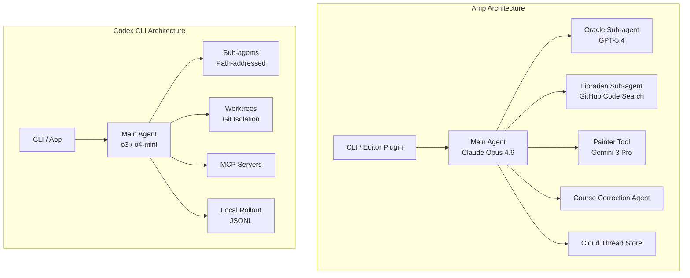
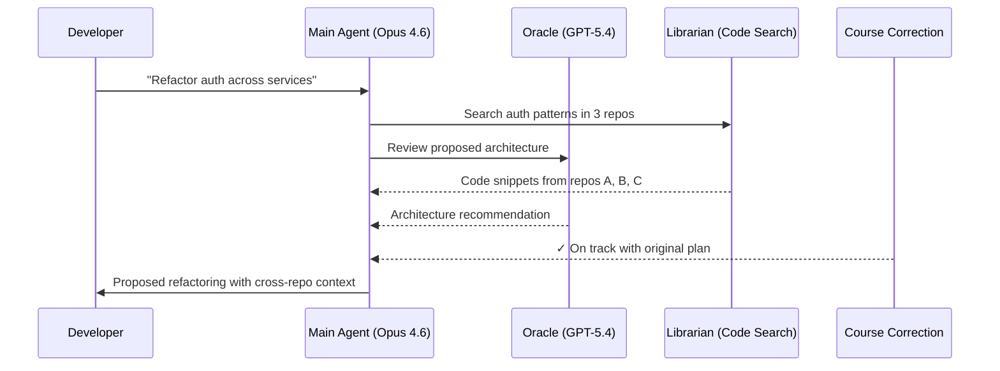
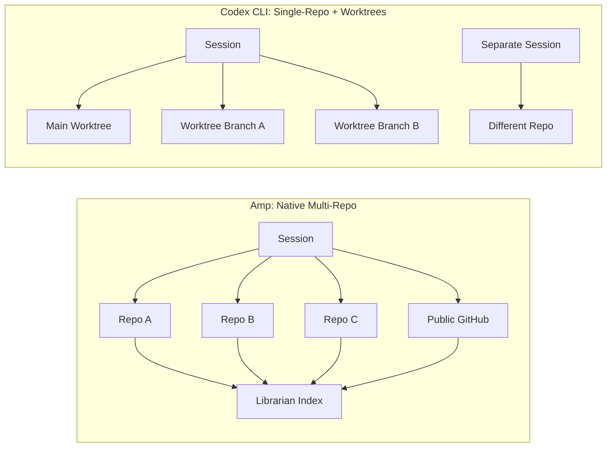

# Sourcegraph Amp: The Multi-Repo AI Orchestrator Codex CLI Doesn't Compete With (Yet)


---

In December 2025, Sourcegraph spun Amp out as a fully independent company, with co-founder Quinn Slack taking the CEO role at Amp Inc.[^1] Less than a year after its May 2025 launch, the tool had attracted enough traction — and enough differentiation from Sourcegraph's code-search platform — to warrant its own entity backed by Craft, Redpoint, Sequoia, Goldcrest, and a16z[^1]. The strategic rationale was stark: Sourcegraph is "mission-critical AI infrastructure" for enterprises; Amp needs to "remain on the frontier, exploring what's possible with models and tools and agents"[^1].

What makes Amp interesting to Codex CLI practitioners is not that it's a rival — it isn't, architecturally — but that it has built several capabilities around multi-repository awareness, persistent cloud threads, and automatic model routing that Codex CLI is only beginning to approach via worktrees and sub-agents. This article dissects where Amp excels, where Codex CLI is stronger, and what each camp can learn from the other.

## Architecture at a Glance

Amp is a TypeScript-based agent distributed as an npm package (`@sourcegraph/amp`)[^2] with first-class CLI and editor integrations (VS Code, Cursor, Windsurf, JetBrains, Neovim, Zed)[^3]. Configuration follows a workspace-then-user hierarchy through `.amp/settings.json` files, with enterprise managed settings at system-level paths[^3].

Codex CLI, by contrast, is a Rust monolith with a Python SDK, using Landlock/Seatbelt/ACL sandboxing and a JSON-RPC app-server protocol[^4]. Its configuration lives in `~/.codex/config.toml` and project-level `codex.toml`.



## The Three Execution Modes

Amp routes work through three modes, each tuned for a different cost-latency-quality tradeoff[^3]:

| Mode | Primary Model | Use Case |
|------|--------------|----------|
| **Smart** | Claude Opus 4.6 (up to 300k input tokens) | Unconstrained state-of-the-art reasoning |
| **Rush** | Faster, cheaper models | Well-defined, small-scope tasks |
| **Deep** | GPT-5.4 with extended thinking (deep², deep³) | Complex multi-step architectural problems |

Switching between modes is a keystroke away (`Ctrl+S` or `Ctrl+O` command palette)[^3]. A hidden `large` mode also exists for power users[^3].

Codex CLI offers a simpler model: you choose your model (`o3`, `o4-mini`, or a compatible provider) and your approval mode (`suggest`, `auto-edit`, `full-auto`). There's no automatic model routing — you're the router.

## Sub-Agents: Specialised Parallelism

Amp's sub-agent architecture is where it pulls ahead of most CLI agents. Three specialist agents run alongside the main Claude Opus 4.6 thread[^3][^5]:

**Oracle** — powered by GPT-5.4, handles architectural analysis, debugging guidance, and code review. The main agent can invoke Oracle autonomously when it detects a complex decision point, or you can explicitly request it ("ask the Oracle")[^5].

**Librarian** — a code-search agent backed by Sourcegraph's proprietary index. It can search and read files across all public GitHub repositories and, with OAuth configuration, your private repos[^3]. This is Amp's killer feature: cross-repository research without leaving your session.

**Painter** — uses Gemini 3 Pro Image for generating UI mockups, icons, and image editing, accepting up to three reference images via `@`-mentions[^3].

A **Course Correction Agent** monitors the main agent's progress in parallel, validating adherence to the original plan and preventing task divergence[^5].



Codex CLI's sub-agents, by contrast, are general-purpose. Since early 2026, they use readable path-based addresses like `/root/agent_a` with structured inter-agent messaging[^6]. But they share the same model, lack specialisation, and — critically — cannot search across repositories. Each sub-agent operates in isolation with its own context window[^6].

## Threads: Cloud-Persistent Context

Amp's thread system is architecturally distinct from anything in the Codex CLI ecosystem. Every conversation is a **Thread** that syncs to `ampcode.com`, with visibility controls ranging from private to public-searchable[^3]. Threads record:

- All prompts and file modifications with diff statistics
- Tool usage metrics
- Execution metadata
- Model costs

The **handoff command** transitions work to a new focused thread while preserving context linkage[^3]. Threads can be referenced by URL (`https://ampcode.com/threads/T-{id}`) or by ID (`@T-{id}`) within other sessions[^3]. For teams, this means a senior developer can debug a colleague's thread asynchronously — a workflow Codex CLI simply cannot replicate with its local JSONL rollouts.

Codex CLI's thread model is fundamentally local. The Codex App introduced worktree-based threads where each thread gets an isolated Git worktree[^7], but session state doesn't persist to the cloud or support team-wide sharing.

## Multi-Repository: The Core Divergence

This is where the philosophical gap is widest.

**Amp's approach**: The Librarian sub-agent provides seamless cross-repo code search and file reading without leaving the current session[^3]. It leverages Sourcegraph's code intelligence infrastructure — the same technology that powers enterprise-scale code search across thousands of repositories. You configure GitHub OAuth in settings, and the Librarian can search your entire organisation's codebase[^3]. Bitbucket Enterprise is also supported via personal access tokens[^3].

**Codex CLI's approach**: Multi-repo support remains an open feature request (GitHub issue #11956)[^8]. The current workaround is worktrees for parallel work within a single repo, or manually opening separate projects. The sub-agent v2 architecture provides path-based addressing and structured messaging[^6], but there's no built-in mechanism for agents to search or read files from other repositories.



## AGENTS.md: Convergent Configuration

Both tools have converged on AGENTS.md as the repository-level instruction file, though Amp calls it out more explicitly. Amp searches for `AGENTS.md`, `AGENT.md`, or `CLAUDE.md` (as fallback) in the working directory and parent directories up to `$HOME`[^3]. It supports YAML frontmatter with glob patterns for file-type-specific guidance:

```yaml
---
globs:
  - '**/*.ts'
  - '**/*.tsx'
---
Follow these TypeScript conventions...
```

File `@`-mentions within AGENTS.md pull in additional context: `See @doc/style.md and @specs/**/*.md`[^3].

Codex CLI's `AGENTS.md` support follows the same broad pattern, reinforcing the cross-platform convergence tracked by the agentskills.io initiative[^9].

## Permission Models Compared

Amp's permission system is notably granular. Rules use tool-name and argument matching with four action types: `allow`, `reject`, `ask`, and `delegate`[^3]. The `delegate` action is unique — it consults an external programme via environment variables, enabling enterprise policy engines:

```json
{
  "tool": "Bash",
  "matches": { "cmd": "*rm -rf*" },
  "action": "reject"
}
```

Codex CLI's approval modes (`suggest`, `auto-edit`, `full-auto`) are coarser-grained but backed by OS-level sandboxing (Landlock on Linux, Seatbelt on macOS)[^4], which Amp lacks entirely.

## Where Codex CLI Is Stronger

It would be a mistake to read this as a case for switching. Codex CLI retains significant advantages:

1. **OS-level sandboxing** — Landlock/Seatbelt/ACL provides defence-in-depth that Amp's permission rules cannot match[^4].
2. **Air-gap deployment** — Codex CLI works offline with local models; Amp requires cloud connectivity for threads, Librarian, and model routing[^3].
3. **Open source** — Apache 2.0 licence with full source visibility. Amp is proprietary[^1].
4. **Cost transparency** — Codex CLI uses your own API keys with no platform markup. Amp claims "no markup" but enterprise pricing carries a 50% premium[^3].
5. **Deterministic execution** — Single-model, single-agent simplicity makes Codex CLI sessions easier to reason about and debug.

## Where Amp Excels

1. **Cross-repository intelligence** — The Librarian's ability to search and read across repositories is genuinely transformative for microservice architectures.
2. **Team collaboration** — Cloud-persistent, shareable threads with visibility controls enable asynchronous code review workflows.
3. **Automatic model routing** — Smart/Rush/Deep modes with specialised sub-agents (Oracle, Librarian, Painter) remove model-selection cognitive load.
4. **Streaming JSON output** — The `--stream-json` flag with stdin/stdout JSON messaging enables sophisticated CI/CD pipeline integration[^3].
5. **Skills and Toolboxes** — Amp's skills system (SKILL.md with MCP bundles) and Toolboxes (simple scripts instead of full MCP servers) lower the extensibility barrier[^3].

## What Codex CLI Could Learn

The gap most worth closing is **multi-repo awareness**. Codex CLI's MCP architecture already provides the extension point — a dedicated MCP server wrapping Sourcegraph's code search API (or a simpler `git clone` + index approach) could provide Librarian-like capabilities without architectural changes.

Cloud-persistent threads are a harder lift, requiring infrastructure Codex CLI deliberately avoids. But a middle ground — exporting session state to a shared store (S3, Git, or a team server) — would unlock the async collaboration patterns that make Amp's threads valuable.

Automatic model routing is achievable today via wrapper scripts, but first-class support for "use model X for reasoning, model Y for code generation" would reduce the manual overhead that Codex CLI's single-model approach demands.

## The Strategic Picture

Amp and Codex CLI are not competing for the same users today. Amp targets teams that want managed, cloud-connected, multi-model orchestration with enterprise compliance. Codex CLI targets developers who want local-first, open-source, sandbox-hardened autonomy with full control over their model provider.

The convergence point is multi-repo orchestration. When Codex CLI ships native cross-repository support — and the open feature request suggests it's a matter of when, not if[^8] — the comparison will shift from "different categories" to "different philosophies." Until then, Amp occupies a capability niche that no open-source CLI agent has filled.

---

## Citations

[^1]: Sourcegraph Blog, "Why Sourcegraph and Amp Are Becoming Independent Companies," December 2025. [https://sourcegraph.com/blog/why-sourcegraph-and-amp-are-becoming-independent-companies](https://sourcegraph.com/blog/why-sourcegraph-and-amp-are-becoming-independent-companies)

[^2]: npm, "@sourcegraph/amp." [https://www.npmjs.com/package/@sourcegraph/amp](https://www.npmjs.com/package/@sourcegraph/amp)

[^3]: Amp, "Owner's Manual," 2026. [https://ampcode.com/manual](https://ampcode.com/manual)

[^4]: OpenAI Developers, "Codex CLI." [https://developers.openai.com/codex/cli](https://developers.openai.com/codex/cli)

[^5]: Amp, "Coding Agent Platform," 2026. [https://ampcode.com/](https://ampcode.com/)

[^6]: OpenAI Developers, "Codex Subagents." [https://developers.openai.com/codex/subagents](https://developers.openai.com/codex/subagents)

[^7]: OpenAI Developers, "Codex App Worktrees." [https://developers.openai.com/codex/app/worktrees](https://developers.openai.com/codex/app/worktrees)

[^8]: GitHub, "Multi-repo support · Issue #11956 · openai/codex." [https://github.com/openai/codex/issues/11956](https://github.com/openai/codex/issues/11956)

[^9]: agentskills.io, "Cross-Platform Agent Portability." ⚠️ No direct URL confirmed; based on community reports of AGENTS.md convergence across tools.
