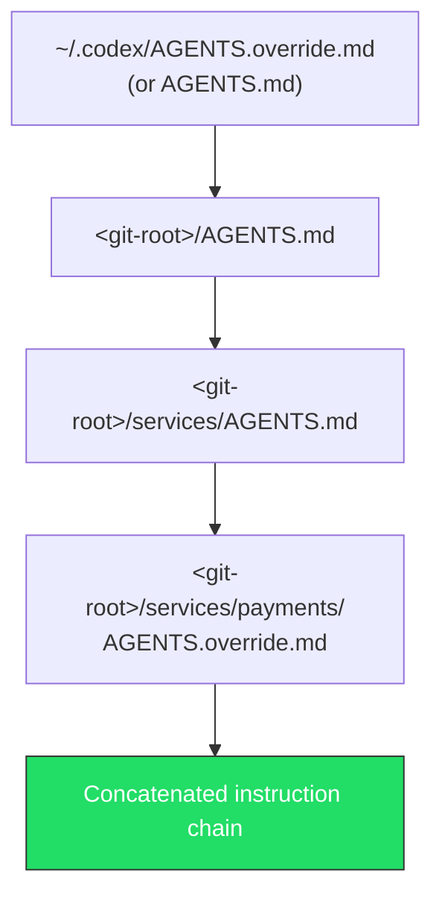

# Bootstrapping AGENTS.md: Scaffold Generation, Override Files and Chain Verification


---

Every Codex CLI session begins by assembling an instruction chain from `AGENTS.md` files scattered across your directory tree[^1]. Getting this chain right — from initial scaffolding through override layering to verification — determines whether Codex operates as a well-calibrated team member or a loose cannon. This article covers the full lifecycle: generating your first `AGENTS.md` with `/init`, layering overrides for operational modes like release freezes, verifying the effective instruction chain, and applying scaffold patterns for monorepos, microservices and data projects.

## The Instruction Chain: How Codex Discovers Files

Codex builds its instruction chain once per run (in the TUI, once per launched session)[^1]. The discovery follows a strict precedence hierarchy:

1. **Global scope** — `~/.codex/AGENTS.override.md` if it exists, otherwise `~/.codex/AGENTS.md`. Only the first non-empty file at this level is used[^2].
2. **Project scope** — Starting at the Git root, Codex walks down to your current working directory. At each level it checks for `AGENTS.override.md`, then `AGENTS.md`, then any names listed in `project_doc_fallback_filenames`[^2].
3. **Concatenation** — Discovered files are joined with blank lines, root-to-current. Files closer to the working directory appear later in the combined prompt, effectively overriding earlier guidance[^1].



Codex skips empty files and stops adding content once the combined size reaches `project_doc_max_bytes` (32 KiB by default)[^2]. If your instructions are being truncated, you will not receive a warning — the chain is simply capped.

## Scaffolding with `/init`

The `/init` slash command generates an `AGENTS.md` scaffold in your current directory[^3]. Run it in the TUI:

```bash
/init
```

Codex analyses your project structure — detecting language, build tools, test frameworks and linting configuration — then produces a tailored scaffold[^3]. A typical output for a Python FastAPI project:

```markdown
## Build, Test, and Development Commands
- Install deps: `pip install -r requirements.txt`
- Lint: `python3 -m ruff check .` (auto-fix: `--fix`)
- Format: `python3 -m ruff format .`
- Tests: `python3 -m pytest -v`
- Coverage: `python3 -m pytest --cov=app --cov-report=term-missing`

## Coding Style & Naming Conventions
- Python 3.11+. Type hints on all functions.
- Ruff enforced: 88-char lines, double quotes.

## Commit & Pull Request Guidelines
- Conventional Commits: `feat:`, `fix:`, `docs:`, `refactor:`
- Small, focused commits.
- PRs must include: description, test plan, screenshots for UI changes.

## Security
- Never commit secrets. Use `.env` for local config.
- Validate all external API calls with proper error handling.
```

After generation, review the scaffold carefully. The `/init` output is a starting point — you will want to add project-specific closure definitions ("done" means tests pass, lint clean, no regressions), escalation procedures for blocking scenarios, and task-organised sections[^4].

### What to Include (and What Not To)

**Do include:**

- Exact build, test, lint and format commands with flags
- Task-organised sections (Coding, Review, Release, Debug)
- Clear closure definitions
- Escalation procedures for blocking scenarios

**Do not include:**

- Entire style guides pasted verbatim without execution rules
- Ambiguous directives ("be careful", "optimise where possible")
- Contradictory priorities
- Prose documentation — `AGENTS.md` is not a README replacement[^4]

## Override Files for Operational Modes

`AGENTS.override.md` at any directory level replaces the standard `AGENTS.md` at that scope[^2]. This mechanism is designed for temporary operational constraints without requiring you to delete or modify the base file.

### Release Freeze

During a release freeze, drop an override at the project root:

```markdown
<!-- AGENTS.override.md -->
## Release Freeze — Active Until 2026-04-15

- NO new features. Bug fixes only.
- All changes require sign-off from the release manager.
- Do not modify package versions or dependency locks.
- Run the full regression suite before any commit:
  `make test-regression`
```

### Incident Mode

For production incidents, a tighter override:

```markdown
<!-- AGENTS.override.md -->
## Incident Mode — SEV1 Active

- All changes must be reviewed by on-call engineer.
- Limit scope to the affected service only.
- No refactoring, no dependency updates.
- Rollback is preferred over forward-fix unless root cause is confirmed.
- Log every change in #incident-channel.
```

### Subsystem Overrides

Override files work at any directory depth. A payments service might carry its own `AGENTS.override.md` enforcing stricter rules — PCI compliance constraints, mandatory security review — while the rest of the monorepo operates under standard guidance[^5].

To restore normal operation, simply delete or rename the override file. Codex will fall back to the standard `AGENTS.md` on the next session[^2].

## Configuration Knobs in `config.toml`

Several `config.toml` settings control how Codex discovers and processes instruction files:

```toml
# Custom fallback filenames — checked after AGENTS.override.md and AGENTS.md
project_doc_fallback_filenames = ["TEAM_GUIDE.md", ".agents.md"]

# Maximum combined instruction chain size (default: 32768 = 32 KiB)
project_doc_max_bytes = 65536    # 64 KiB for larger projects

# Project root detection markers
project_root_markers = [".git"]
```

The `project_doc_fallback_filenames` setting is useful for teams migrating from other tools — you might recognise `.cursor/rules` or `CLAUDE.md` as fallbacks during transition[^2]. The `CODEX_HOME` environment variable overrides the default `~/.codex` location, which is useful for CI environments or project-specific automation users[^1].

## Verifying the Instruction Chain

Codex does not expose the assembled instruction chain directly in the UI. Use these techniques to verify what the agent actually sees:

### Method 1: Ask Codex to Summarise

```bash
codex --ask-for-approval never "Summarise your current instructions"
```

This runs a one-shot session where Codex reports the effective instruction chain[^4]. If instructions are missing or truncated, you will see it in the summary.

### Method 2: TUI Status Commands

Within the TUI, `/status` shows the current workspace root and configuration state, while `/config` prints effective configuration values and their sources[^4].

### Method 3: Log Inspection

Session logs under `~/.codex/log/codex-tui.log` contain audit trails of loaded instruction sources[^4]. For automated verification in CI:

```bash
codex exec --json "List every AGENTS.md file in your instruction chain" \
  | jq -r '.content'
```

### Method 4: Deliberate Testing

Create a canary instruction in a nested `AGENTS.md`:

```markdown
## Canary
If asked about the canary, respond: "Canary active at services/payments level."
```

Then ask Codex about the canary. If the response matches, that file is in the chain.

## Scaffold Patterns for Common Architectures

### Monorepo Pattern

OpenAI reportedly uses 88 `AGENTS.md` files across their internal monorepo[^6], giving per-package instructions where needed. The pattern:

```
repo/
├── AGENTS.md                    # Global: CI commands, commit conventions, PR template
├── packages/
│   ├── AGENTS.md                # Shared package rules: versioning, publish workflow
│   ├── ui/
│   │   └── AGENTS.md            # React conventions, Storybook commands, a11y rules
│   ├── api/
│   │   └── AGENTS.md            # REST conventions, OpenAPI validation, migration commands
│   └── shared/
│       └── AGENTS.md            # No breaking changes without semver major bump
```

The root `AGENTS.md` establishes universal rules. Each package adds specifics. The closest file to the working directory takes precedence[^6].

### Microservices Pattern

For polyglot microservices, each service carries its own `AGENTS.md` with language-specific tooling:

```
services/
├── AGENTS.md                    # Cross-service rules: gRPC conventions, proto lint
├── user-service/
│   └── AGENTS.md                # Go: `go test ./...`, `golangci-lint run`
├── billing-service/
│   └── AGENTS.md                # Python: `pytest`, `ruff check`, PCI compliance notes
└── notification-service/
    └── AGENTS.md                # TypeScript: `npm test`, `eslint .`
```

### Data Project Pattern

Data projects benefit from pipeline-specific instructions:

```
data-platform/
├── AGENTS.md                    # Airflow conventions, data quality standards
├── pipelines/
│   └── AGENTS.md                # DAG testing: `pytest tests/dags/`, no production credentials
├── models/
│   └── AGENTS.md                # dbt: `dbt test`, `dbt docs generate`, naming conventions
└── notebooks/
    └── AGENTS.md                # Exploratory only — never deploy from notebooks
```

## Cross-Tool Compatibility

`AGENTS.md` is not a Codex-only format. It is an open standard governed by the Agentic AI Foundation under the Linux Foundation[^7], supported by over 25 AI coding agents including Claude Code, Cursor, GitHub Copilot, Devin, Amp, Jules, Gemini CLI and others[^7]. A well-structured `AGENTS.md` is a write-once investment that works across your entire tool chain.

## Common Pitfalls

1. **Exceeding `project_doc_max_bytes`** — Instructions are silently truncated. If your monorepo scaffold exceeds 32 KiB combined, raise the limit or split instructions into more granular directory-level files.
2. **Stale overrides** — A forgotten `AGENTS.override.md` from last month's incident will continue suppressing your base instructions. Treat overrides as temporary and remove them when the operational mode ends.
3. **No restart after changes** — Codex loads instructions once per session. Editing `AGENTS.md` mid-session has no effect; restart the TUI or start a new `codex exec` run[^1].
4. **Contradictory layering** — If a subdirectory `AGENTS.md` contradicts the root, the subdirectory wins by position (it appears later in the chain). Be intentional about which rules are meant to be overridable.

## Citations

[^1]: [Custom instructions with AGENTS.md – Codex | OpenAI Developers](https://developers.openai.com/codex/guides/agents-md)
[^2]: [Codex CLI: The Definitive Technical Reference – Blake Crosley](https://blakecrosley.com/guides/codex)
[^3]: [Slash commands in Codex CLI | OpenAI Developers](https://developers.openai.com/codex/cli/slash-commands)
[^4]: [Shipyard | Codex CLI Cheatsheet: config, commands, AGENTS.md, + best practices](https://shipyard.build/blog/codex-cli-cheat-sheet/)
[^5]: [Steering AI Agents in Monorepos with AGENTS.md – DEV Community](https://dev.to/datadog-frontend-dev/steering-ai-agents-in-monorepos-with-agentsmd-13g0)
[^6]: [Scaling AI-Assisted Development: How Scaffolding Solved My Monorepo Chaos – Vuong Ngo](https://medium.com/@vuongngo/scaling-ai-assisted-development-how-scaffolding-solved-my-monorepo-chaos-4838fb3b4dd6)
[^7]: [AGENTS.md – Open Standard for AI Agent Instructions](https://agents.md/)
