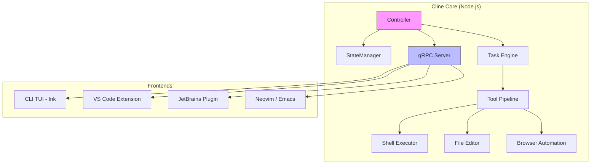
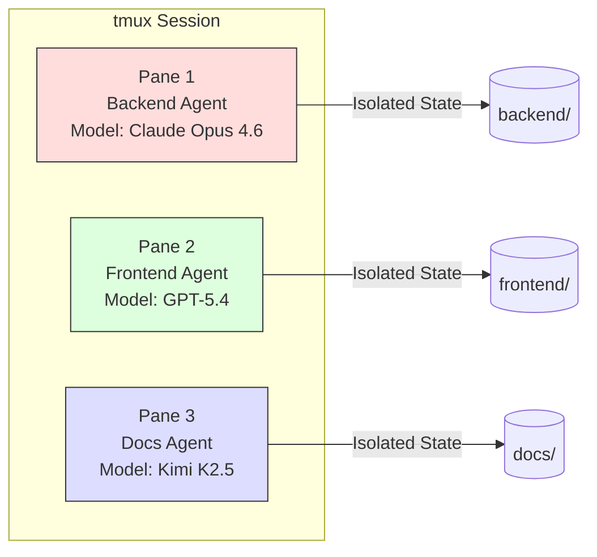

# Cline CLI 2.0: The YOLO-Mode Automation Engine for CI/CD Pipelines


---

Cline CLI 2.0, released on 14 February 2026[^1], reframes the popular VS Code coding agent as a first-class terminal citizen. With over 58,000 GitHub stars, 5 million installs across platforms, and an Apache 2.0 licence[^2], Cline has become one of the most widely adopted open-source coding agents. Version 2.0 adds headless execution, newline-delimited JSON output, command-permission guardrails, and parallel-agent orchestration — turning Cline into a composable building block for CI/CD pipelines.

This article dissects the headless architecture, compares it with Codex CLI's `exec` mode, and provides production-ready patterns for embedding Cline in automated workflows.

## Architecture: Cline Core and the gRPC Decoupling

Cline 2.0 is built on a decoupled architecture separating the agentic core from the presentation layer[^3]. Cline Core runs as a standalone Node.js process exposing a gRPC API. Clients — the VS Code extension, the TUI, JetBrains plugins, Neovim integrations — all connect as gRPC clients[^4].



This design means you can attach multiple frontends to a running task simultaneously, pass tasks between surfaces over the network, and embed Cline Core into custom harnesses without touching the UI layer[^3].

## YOLO Mode: Full Autonomy in One Flag

The `-y` (or `--yolo`) flag is the gateway to headless operation. It auto-approves every action — file writes, shell commands, browser interactions, MCP tool calls, and Plan-to-Act mode transitions — without prompting[^5].

```bash
# Autonomous code review from CI
git diff origin/main | cline -y "Review these changes for security issues"

# Generate release notes from commit history
git log v2.0..v2.1 --oneline | cline -y "Write release notes in Keep-a-Changelog format"

# Fix failing tests autonomously
cline -y --timeout 300 "Run the test suite, fix any failures, and re-run until green"
```

When `-y` is active, Cline skips the interactive Ink-based TUI entirely and streams plain text to stdout[^1]. This makes it behave like any standard Unix tool — pipeable, redirectable, and composable with `jq`, `awk`, or downstream processes.

### TTY Detection and Auto-Headless

Even without `-y`, Cline auto-detects non-interactive environments. If no TTY is connected to stdin or stdout — the typical case inside GitHub Actions, GitLab CI runners, or Docker containers — it falls back to headless mode automatically[^6]. The `selectOutputMode()` function checks TTY status and skips `ink.render()` when no interactive terminal is present.

## Structured Output with `--json`

For machine consumption, the `--json` flag streams newline-delimited JSON (nd-JSON), one object per line[^7]:

```bash
cline --json -y "Generate unit tests for src/auth/" | jq '.text'
```

Each JSON object follows this schema:

```json
{
  "type": "say",
  "text": "Created test file src/auth/login.test.ts",
  "ts": 1760501486669,
  "say": "tool",
  "partial": false,
  "reasoning": "The auth module lacks test coverage..."
}
```

Key fields include `type` (`say` or `ask`), `say`/`ask` subtypes (`text`, `tool`, `followup`, `completion_result`), a `partial` flag for streaming deltas, and optional `reasoning` when extended thinking is enabled[^7]. The final object carries `"say": "completion_result"` — your signal to extract the output and proceed.

## Command Permissions: Guardrails for Autonomous Execution

Running an agent with blanket autonomy in production demands guardrails. Cline addresses this with the `CLINE_COMMAND_PERMISSIONS` environment variable, which accepts a JSON structure defining allowlists and denylists[^8]:

```bash
export CLINE_COMMAND_PERMISSIONS='{
  "allow": ["npm test", "npm run *", "git *", "jest *"],
  "deny": ["rm -rf *", "sudo *", "curl *"],
  "allowRedirects": false
}'
```

The rules are evaluated as follows:

1. **Deny takes precedence** — any command matching a deny pattern is blocked regardless of allow rules
2. **Allow restricts** — if an allow array is present, only matching commands may execute
3. **Redirects are opt-in** — shell redirects (`>`, `>>`, `<`) are blocked by default unless `allowRedirects` is explicitly `true`[^8]

This is a meaningful improvement over Codex CLI's approval framework, which operates at the tool-call level with approval IDs rather than at the shell-command level with glob patterns. For CI/CD, command-level granularity is arguably more practical — you know exactly which binaries the agent can invoke.

## Parallel Agents via tmux Isolation

Cline CLI instances are fully isolated — each maintains its own conversation, model configuration, and execution context[^1]. There is no shared state between instances, making tmux-based parallelism straightforward:

```bash
#!/bin/bash
# Run three agents in parallel across separate worktrees
tmux new-session -d -s agents

tmux send-keys -t agents "cd backend && cline -y 'Refactor the database layer to use connection pooling'" Enter
tmux split-window -h -t agents
tmux send-keys -t agents "cd frontend && cline -y 'Update all API calls to use the new v2 endpoints'" Enter
tmux split-window -v -t agents
tmux send-keys -t agents "cd docs && cline -y 'Regenerate API documentation from OpenAPI spec'" Enter

tmux attach -t agents
```

Each pane operates independently. One agent refactoring your database layer whilst another updates API documentation on a different branch — no coordination overhead, no context leakage[^1].



The `--config` flag extends this further — point each instance at a different configuration directory to use separate API keys, model selections, and permission profiles per agent[^7].

## CI/CD Integration Patterns

### GitHub Actions

```yaml
name: AI Code Review
on: [pull_request]

jobs:
  review:
    runs-on: ubuntu-latest
    steps:
      - uses: actions/checkout@v4
        with:
          fetch-depth: 0
      - run: npm install -g cline
      - name: Run Cline review
        env:
          ANTHROPIC_API_KEY: ${{ secrets.ANTHROPIC_KEY }}
          CLINE_COMMAND_PERMISSIONS: '{"allow": ["git *", "cat *"], "deny": ["rm *"]}'
        run: |
          git diff origin/main...HEAD | \
            cline -y --timeout 120 --json \
              "Review this diff for bugs, security issues, and style violations" \
            | jq -r 'select(.say == "completion_result") | .text' \
            > review.md
      - uses: actions/upload-artifact@v4
        with:
          name: review
          path: review.md
```

### Shell Script Pipeline

```bash
#!/bin/bash
set -euo pipefail

# Chain agents: analyse → fix → verify
ANALYSIS=$(cline -y --json "Analyse src/ for performance bottlenecks" \
  | jq -r 'select(.say == "completion_result") | .text')

echo "$ANALYSIS" | cline -y "Apply these performance fixes"

cline -y --timeout 180 "Run the benchmark suite and confirm no regressions"
```

## Comparison with Codex CLI Exec Mode

Both Cline and Codex CLI offer headless execution, but the designs reflect different philosophies:

| Capability | Cline CLI 2.0 | Codex CLI `exec` |
|---|---|---|
| **Autonomy flag** | `-y` / `--yolo` | `--full-auto` / `--yolo` |
| **Structured output** | `--json` (nd-JSON) | JSONL rollout files |
| **Command guardrails** | `CLINE_COMMAND_PERMISSIONS` env var | Permission profiles + approval IDs |
| **Parallel execution** | tmux isolation (manual) | Worktree-based (built-in) |
| **Sandbox** | Command permissions only | OS-level (Landlock/Seatbelt) |
| **Architecture** | Node.js + gRPC | Rust monolith |
| **Stdin piping** | Native (`cat file \| cline -y "prompt"`) | Via `codex exec -q "prompt"` |
| **Task resumption** | `--continue` / `-T <task-id>` | Session restore from JSONL |
| **Timeout** | `--timeout <seconds>` | Built-in turn limits |

The most significant architectural difference is sandboxing. Codex CLI enforces OS-level isolation via Landlock LSM on Linux and Seatbelt profiles on macOS[^9], restricting filesystem and network access at the syscall level. Cline relies on command-pattern matching — effective for known-good command sets but bypassable if an allowed command has unexpected side effects. For high-trust CI environments with locked-down runners, Cline's approach is pragmatic. For untrusted contexts, Codex CLI's kernel-level sandbox provides stronger guarantees.

Cline's gRPC architecture gives it an edge in extensibility — you can build custom frontends, attach multiple observers to a running task, and orchestrate agents programmatically without forking the codebase[^3]. Codex CLI's Rust monolith trades that flexibility for raw performance and tighter security boundaries.

## Configuration for CI Environments

Authentication in headless mode follows a priority chain[^6]:

1. **Environment variables** — `ANTHROPIC_API_KEY`, `OPENAI_API_KEY`, `GOOGLE_API_KEY`
2. **Shared config** — `~/.cline/data/secrets.json` (synced with VS Code extension)
3. **`CLINE_DIR`** — override the entire config directory for isolated setups

```bash
# Minimal CI configuration
export ANTHROPIC_API_KEY="$YOUR_KEY"
export CLINE_DIR="/tmp/cline-ci"
export CLINE_COMMAND_PERMISSIONS='{"allow": ["npm *", "git *"], "deny": ["sudo *"]}'

cline -y -m claude-sonnet-4-5 --timeout 300 "Run tests and fix failures"
```

⚠️ OAuth-based authentication (ChatGPT login flow) is unsupported in headless mode — API keys are mandatory for CI/CD[^6].

## Limitations

- **Browser automation unavailable** in headless mode — requires a display server, so visual debugging workflows cannot run in standard CI runners[^6]
- **No OS-level sandbox** — security relies entirely on `CLINE_COMMAND_PERMISSIONS` and runner-level isolation
- **Model routing is manual** — unlike Sourcegraph Amp's automatic model routing across execution modes, Cline requires explicit `-m` flags per instance
- **No built-in worktree management** — parallel branch work requires manual git worktree setup, whereas Codex CLI handles this natively

## When to Choose Cline Over Codex CLI for Automation

Cline CLI 2.0 excels when your pipeline needs:

- **Provider flexibility** — switch between Anthropic, OpenAI, Gemini, Bedrock, Ollama, and others via a single `--model` flag
- **Lightweight integration** — `npm install -g cline` and an API key; no Rust toolchain, no sandbox kernel modules
- **Custom orchestration** — the gRPC API lets you build bespoke agent coordination without shell scripting
- **Existing Cline investment** — shared config between VS Code extension and CLI means zero additional setup for teams already using Cline

Codex CLI remains the stronger choice for security-sensitive automation (OS-level sandboxing), OpenAI-ecosystem integration, and built-in worktree-based parallelism.

## Citations

[^1]: [Introducing Cline CLI 2.0: from sidebar to the terminal](https://cline.bot/blog/introducing-cline-cli-2-0) — Cline Blog, February 2026

[^2]: [Cline GitHub Repository](https://github.com/cline/cline) — 58K+ stars, Apache 2.0 licence, 5M+ installs

[^3]: [Cline CLI & My Undying Love of Cline Core](https://cline.bot/blog/cline-cli-my-undying-love-of-cline-core) — Cline Blog, architecture deep dive

[^4]: [Cline gRPC Communication System](https://deepwiki.com/cline/cline/6.1-grpc-communication-system) — DeepWiki architectural analysis

[^5]: [YOLO Mode Documentation](https://docs.cline.bot/features/yolo-mode) — Official Cline documentation

[^6]: [CLI Headless Mode and CI/CD](https://deepwiki.com/cline/cline/12.4-cli-headless-mode-and-cicd) — DeepWiki technical reference

[^7]: [Cline CLI Reference](https://docs.cline.bot/cline-cli/cli-reference) — Official CLI command reference

[^8]: [Cline CLI Commands and Options](https://deepwiki.com/cline/cline/12.2-cli-commands-and-options) — DeepWiki, including CLINE_COMMAND_PERMISSIONS specification

[^9]: [Codex CLI Non-interactive Mode](https://developers.openai.com/codex/noninteractive) — OpenAI Developers documentation
