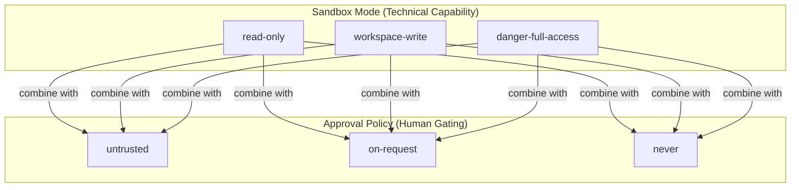
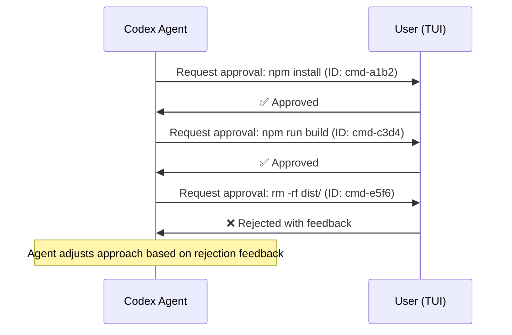
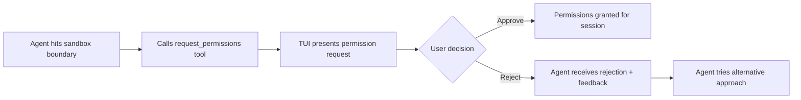

# Codex CLI Approval Framework: Permission Profiles, Approval IDs and Runtime Rules


Codex CLI's security model rests on two independent axes: the **sandbox** (what the agent *can* do at the OS level) and the **approval policy** (when it must *ask* before doing it). Understanding how these axes compose — and the newer features layered on top — is essential for anyone running Codex in production, CI pipelines, or team environments.

This article dissects the approval framework from first principles through to the Smart Approvals guardian subagent introduced in v0.115.0.

## The Two-Axis Security Model

Every Codex session operates at the intersection of a sandbox mode and an approval policy. They are orthogonal: you can combine any sandbox level with any approval strictness[^1].



### Sandbox Modes

| Mode | Filesystem | Network | Use Case |
|------|-----------|---------|----------|
| `read-only` | Read everywhere, write nowhere | Blocked | Code review, auditing |
| `workspace-write` | Read/write in workspace + `/tmp` | Blocked by default | Daily development (default) |
| `danger-full-access` | Full machine access | Enabled | Pre-isolated VMs only |

Protected paths (`.git/`, `.agents/`, `.codex/`) remain read-only even in `workspace-write` mode[^1].

### Approval Policies

| Policy | Behaviour | Typical Scenario |
|--------|-----------|-----------------|
| `untrusted` | Prompts for almost everything except safe reads | Unfamiliar repositories |
| `on-request` | Auto-approves within sandbox boundaries; prompts for boundary violations | Default interactive work |
| `never` | No prompts whatsoever | CI/CD automation |

The previously available `on-failure` policy is now deprecated; use `on-request` for interactive sessions or `never` for non-interactive pipelines[^2].

## Configuration: config.toml and CLI Flags

Both axes are configured in `~/.codex/config.toml` or overridden per invocation via CLI flags.

```toml
# ~/.codex/config.toml
sandbox_mode = "workspace-write"
approval_policy = "on-request"

[sandbox_workspace_write]
network_access = false
exclude_tmpdir_env_var = false
exclude_slash_tmp = false
writable_roots = ["/Users/dvaughan/.pyenv/shims"]
```

CLI equivalents:

```bash
# Explicit flags
codex --sandbox workspace-write --ask-for-approval on-request "refactor the auth module"

# Shorthand
codex -s workspace-write -a on-request "refactor the auth module"

# Inline config overrides (TOML-formatted values)
codex -c sandbox_workspace_write.network_access=true "fetch latest deps"
```

The `--full-auto` convenience flag expands to `--sandbox workspace-write --ask-for-approval on-request`[^2]. **Precedence gotcha**: if you pass `--full-auto --sandbox read-only`, `workspace-write` wins because `--full-auto` takes precedence over the explicit `--sandbox` flag[^3].

## Named Profiles

Profiles let you save named configuration sets and switch between them from the CLI[^4]:

```toml
# ~/.codex/config.toml
model = "o4-mini"
approval_policy = "on-request"
profile = "default"

[profiles.strict]
model = "o3"
model_reasoning_effort = "high"
approval_policy = "untrusted"
sandbox_mode = "read-only"

[profiles.auto]
approval_policy = "never"
sandbox_mode = "workspace-write"

[profiles.review]
model = "o3"
approval_policy = "untrusted"
sandbox_mode = "read-only"
```

```bash
codex --profile strict "audit this PR for security issues"
codex -p auto "fix all lint warnings"
```

Profile values override user-level config but are themselves overridden by explicit CLI flags. The precedence hierarchy is: session overrides → CLI flags → profile → project config → user config → defaults[^4].

## Distinct Approval IDs (v0.104.0+)

Prior to v0.104.0, approving one command in a multi-step shell execution implicitly approved all subsequent commands in the same invocation. Since v0.104.0, Codex assigns **distinct approval IDs** to each command within a multi-step execution[^3]. This means approving `npm install` does not automatically approve the `rm -rf node_modules` that follows in the same shell block.



## Flexible Approval Controls with Rejection Feedback (v0.105.0+)

From v0.105.0, the approval flow supports two key enhancements[^3]:

1. **Extra sandbox permissions**: Rather than requiring a full sandbox mode change, the agent can request specific additional permissions (e.g. write access to a single directory outside the workspace).
2. **Granular rejection with feedback**: When you reject an individual tool call, you can provide a reason. The agent receives the rejection feedback and adjusts its approach accordingly.

## Granular Approval Policies

For fine-grained control, replace the scalar `approval_policy` with a granular object[^1]:

```toml
approval_policy = { granular = {
  sandbox_approval = true,
  rules = true,
  mcp_elicitations = true,
  request_permissions = false,
  skill_approval = false
} }
```

Each key controls a different category of approval prompt:

| Key | Controls |
|-----|----------|
| `sandbox_approval` | Sandbox boundary violation requests |
| `rules` | Execution policy rule triggers |
| `mcp_elicitations` | MCP tool call confirmations |
| `request_permissions` | Runtime permission escalation requests |
| `skill_approval` | Skill/plugin script execution |

Setting a key to `false` auto-rejects that category without prompting, whilst `true` presents the standard approval dialogue[^1].

## Runtime Permission Requests (v0.113.0+)

The built-in `request_permissions` tool allows the model to formally request elevated access mid-session[^3]. When the agent encounters a task requiring access beyond its current sandbox boundaries, it issues a structured permission request through the TUI approval flow:



This mechanism avoids the blunt instrument of switching to `danger-full-access` for tasks that need access to a single additional directory or network endpoint.

## Permission Profile Config Language (v0.113.0+)

Alongside runtime requests, v0.113.0 introduced a declarative permission profile configuration that replaces monolithic sandbox modes with composable, per-resource policies[^3]:

```toml
[permission_profile.filesystem]
read = ["~/Projects", "/usr/local"]
write = ["~/Projects/my-app"]

[permission_profile.network]
allow = ["api.github.com", "registry.npmjs.org"]
deny = ["*"]
```

This is considerably more expressive than the three-tier sandbox model. You can grant write access to specific directories whilst denying network access, or allow connections to specific domains whilst blocking everything else.

The `--add-dir` CLI flag provides a simpler escape hatch for one-off cases, granting write access to additional directories alongside the main workspace[^2]:

```bash
codex --add-dir /tmp/shared-cache "build with shared cache"
```

## Smart Approvals with Guardian Subagent (v0.115.0+)

The most significant addition to the approval framework is the **Smart Approvals** system, which delegates recurring approval decisions to a guardian subagent[^5]. Rather than requiring human approval for every action or disabling approvals entirely with `approval_policy = "never"`, the guardian provides an intelligent middle ground.

### Configuration

```toml
approvals_reviewer = "guardian_subagent"   # default: "user"
```

The `smart_approvals` feature flag in the TUI automatically configures the recommended combination[^5]:

```toml
approval_policy = "on-request"
approvals_reviewer = "guardian_subagent"
sandbox_mode = "workspace-write"
```

### How It Works

The guardian is a carefully prompted reviewer subagent that gathers relevant context and applies a risk-based decision framework before approving or denying each request[^5]. It reviews:

- Shell command execution
- File changes
- Managed-network access requests
- MCP tool invocations
- Delegated/subagent approval flows

Each review produces structured output with a risk assessment:

```json
{
  "status": "approved",
  "riskScore": 2,
  "riskLevel": "low",
  "rationale": "npm install within workspace; no network egress beyond registry"
}
```

The guardian session persists across approvals to reuse prompt cache, but each individual review receives a clean history to prevent prior decisions from contaminating later assessments[^5].

### App-Server Lifecycle Events

For programmatic integration, unstable lifecycle notifications expose guardian state[^5]:

- `item/autoApprovalReview/started`
- `item/autoApprovalReview/completed`

Payloads include `threadId`, `turnId`, `targetItemId`, the `review` object, and an optional `action` summary.

### Legacy Migration

Existing configurations using `guardian_approval = true` are automatically backfilled to `approvals_reviewer = "guardian_subagent"` during upgrade[^5].

## Recommended Combinations

| Scenario | Configuration | Rationale |
|----------|--------------|-----------|
| Daily development | `sandbox: workspace-write` + `approval: on-request` | Safe default; prompts only at boundaries |
| Power user | `sandbox: danger-full-access` + `approval: untrusted` | Maximum capability with maximum oversight |
| CI/CD | `sandbox: workspace-write` + `approval: never` | Automated; sandbox provides the guardrails |
| Smart automation | `sandbox: workspace-write` + `reviewer: guardian_subagent` | AI-gated; reduces approval fatigue |
| Paranoid | `sandbox: read-only` + `approval: untrusted` | Consultative only; no changes without explicit approval |

The `--dangerously-bypass-approvals-and-sandbox` flag (aliased as `--yolo`) disables both axes entirely[^2]. Use it only inside externally hardened environments — never on a developer workstation.

## Testing Sandbox Enforcement

Verify your configuration behaves as expected:

```bash
# macOS
codex sandbox macos --full-auto -- ls /etc/passwd

# Linux
codex sandbox linux --full-auto -- cat /etc/shadow

# General debug
codex debug -- whoami
```

If commands that should be blocked succeed, investigate your sandbox configuration immediately[^3].

## Citations

[^1]: [Agent approvals & security – Codex | OpenAI Developers](https://developers.openai.com/codex/agent-approvals-security)

[^2]: [Command line options – Codex CLI | OpenAI Developers](https://developers.openai.com/codex/cli/reference)

[^3]: [Codex CLI: The Definitive Technical Reference - Blake Crosley](https://blakecrosley.com/guides/codex)

[^4]: [Advanced Configuration – Codex | OpenAI Developers](https://developers.openai.com/codex/config-advanced)

[^5]: [Add Smart Approvals guardian review – GitHub PR #13860](https://github.com/openai/codex/pull/13860)
