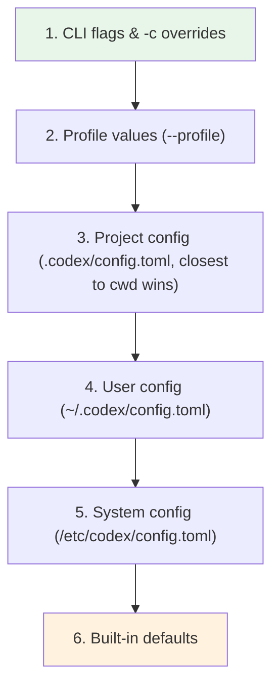
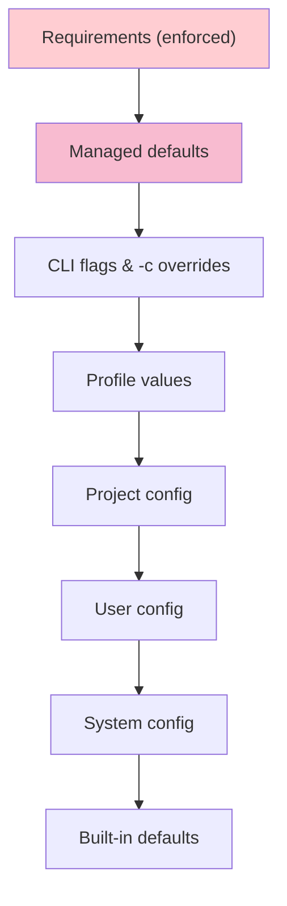

# Codex CLI Configuration Reference: Precedence, All Keys and Inline Overrides


---

Codex CLI's behaviour is governed by a layered configuration system built on TOML files, CLI flags, environment variables, and — in enterprise environments — managed policies pushed via MDM or cloud admin consoles. Understanding the full precedence hierarchy and the complete key surface is essential for teams that need reproducible, auditable agent behaviour across developer workstations, CI runners, and cloud tasks.

This article is the authoritative quick-reference for every configuration layer Codex resolves at startup, every key you can set, and the override mechanisms available at the command line.

## Configuration File Locations

Codex reads TOML configuration from four filesystem locations [^1][^2]:

| Scope | Path | Purpose |
|-------|------|---------|
| **User** | `~/.codex/config.toml` | Personal defaults |
| **Project** | `.codex/config.toml` (relative to repo root, walking towards cwd) | Per-repo overrides |
| **System** | `/etc/codex/config.toml` (Unix only) | Machine-wide defaults |
| **Built-in** | Compiled into the binary | Fallback values |

The `CODEX_HOME` environment variable relocates the user-level directory away from `~/.codex` [^3]. Everything Codex persists — config, credentials, `history.jsonl`, the SQLite state database — lives under this root.

Project-scoped files load **only when the project is trusted**. If you mark a project as untrusted, Codex silently skips every `.codex/config.toml` it finds in the repo tree and falls back to user and system layers [^1].

## The Precedence Hierarchy

Codex assembles its effective configuration by merging layers top-down. The first layer to define a key wins [^1][^2]:



When multiple `.codex/config.toml` files exist in nested directories, the file closest to your working directory takes precedence [^2].

### Enterprise Managed Layers

Organisations using ChatGPT Business, Enterprise, or macOS MDM gain two additional layers that sit **above** the standard hierarchy [^4]:

- **Requirements** (`requirements.toml`) — admin-enforced constraints that users cannot bypass. Precedence: cloud-managed requirements → MDM `requirements_toml_base64` → system `/etc/codex/requirements.toml`.
- **Managed defaults** (`managed_config.toml`) — starting values users may modify during a session, reapplied at next launch. Managed defaults override even CLI `--config` overrides [^4].



## Complete Config Key Reference

The tables below cover every documented key as of April 2026 [^5][^6].

### Model and Reasoning

| Key | Type | Default | Description |
|-----|------|---------|-------------|
| `model` | string | `"gpt-5.4"` | Primary model identifier [^5] |
| `model_provider` | string | `"openai"` | Provider ID (`openai`, `ollama`, `lmstudio`, or custom) |
| `model_reasoning_effort` | string | `"medium"` | Reasoning depth: `minimal`, `low`, `medium`, `high`, `xhigh` |
| `model_reasoning_summary` | string | `"auto"` | Summary verbosity: `auto`, `concise`, `detailed`, `none` |
| `model_verbosity` | string | — | GPT-5 verbosity override: `low`, `medium`, `high` |
| `plan_mode_reasoning_effort` | string | — | Reasoning effort override when in plan mode [^3] |

### Approval and Sandbox

| Key | Type | Default | Description |
|-----|------|---------|-------------|
| `approval_policy` | string | `"untrusted"` | When to pause: `untrusted`, `on-request`, `never` [^5] |
| `sandbox_mode` | string | `"read-only"` | Filesystem access: `read-only`, `workspace-write`, `danger-full-access` |
| `permissions.<name>` | table | — | Named permission profiles with filesystem and network restrictions |

### Agent and Threading

| Key | Type | Default | Description |
|-----|------|---------|-------------|
| `agents.max_threads` | integer | `6` | Concurrent agent worker threads [^5] |
| `agents.max_depth` | integer | `1` | Maximum nesting depth for spawned sub-agents |
| `agents.job_max_runtime_seconds` | integer | `1800` | Per-worker timeout for batch jobs |

### Feature Flags

Feature flags live under the `[features]` table and can be toggled via CLI with `--enable` / `--disable` [^7]:

| Key | Stage | Default | Description |
|-----|-------|---------|-------------|
| `features.multi_agent` | stable | `true` | Agent collaboration tools [^5] |
| `features.unified_exec` | stable | `true` | PTY-backed exec tool (off on Windows) |
| `features.web_search` | stable | `true` | Web search capability |
| `features.undo` | experimental | `false` | Undo support |
| `features.smart_approvals` | experimental | `false` | Guardian reviewer sub-agent |

### Tool Configuration

| Key | Type | Default | Description |
|-----|------|---------|-------------|
| `tools.web_search` | bool / table | `true` | Web search settings; table form accepts `context_size`, `allowed_domains` [^5] |
| `tools.view_image` | bool | `true` | Enable local image attachment |
| `web_search` | string | `"cached"` | Search mode: `"cached"`, `"live"`, `"disabled"` [^1] |

### MCP Servers

MCP server definitions live under `[mcp_servers.<id>]` [^5][^6]:

```toml
[mcp_servers.docs]
transport = "stdio"
command = "npx"
args = ["-y", "@acme/docs-mcp"]
timeout_seconds = 30

[mcp_servers.docs.tools.search]
approval_mode = "approve"
```

HTTP streamable transport, OAuth credentials, and per-tool approval modes are all supported. The `timeout_seconds` key controls how long Codex waits for the server to respond before treating the call as failed [^5].

### TUI and Interface

| Key | Type | Default | Description |
|-----|------|---------|-------------|
| `tui.notifications` | bool / list | `true` | Terminal notification events |
| `tui.theme` | string | — | Syntax highlighting theme override |
| `tui.animations` | bool | `true` | Shimmer and spinner effects |
| `tui.status_line` | string / list | — | Customise footer items or disable entirely |
| `personality` | string | `"friendly"` | Communication style: `"friendly"`, `"pragmatic"`, `"none"` [^1] |

### History and Storage

| Key | Type | Default | Description |
|-----|------|---------|-------------|
| `history.persistence` | string | `"save-all"` | Session transcript saving: `"save-all"`, `"none"` [^5] |
| `history.max_bytes` | integer | — | Cap history file size, dropping oldest entries |
| `sqlite_home` | string | `CODEX_HOME` | Directory for state database and resumable job storage |
| `log_dir` | string | — | Custom log file location [^1] |

### Shell Environment Policy

The `[shell_environment_policy]` section controls which environment variables reach sub-processes [^6]:

```toml
[shell_environment_policy]
inherit = "core"            # "none" | "core" | "all"
exclude = ["AWS_*", "SECRET_*"]
include = ["NODE_ENV", "CI"]

[shell_environment_policy.overrides]
LANG = "en_GB.UTF-8"
```

### Developer and Customisation

| Key | Type | Default | Description |
|-----|------|---------|-------------|
| `developer_instructions` | string | — | Additional instructions injected per session |
| `model_instructions_file` | string | — | Custom replacement for built-in system prompt |
| `compact_prompt` | string | — | Inline override for history compaction logic |
| `project_doc_max_bytes` | integer | `32768` | Max bytes read from `AGENTS.md` [^3] |
| `project_root_markers` | list | `[".git"]` | Files/dirs that signal project root [^6] |

### Custom Model Providers

Define additional providers under `[model_providers.<name>]` [^6]:

```toml
[model_providers.azure]
base_url = "https://my-deployment.openai.azure.com/v1"
env_key = "AZURE_OPENAI_API_KEY"
retry_limit = 3
timeout_seconds = 60
```

Per-provider settings include `base_url`, `env_key`, custom HTTP headers, retry limits, and timeout values. Dynamic bearer token refresh is supported for providers that require short-lived credentials [^2].

### Observability

| Key | Type | Default | Description |
|-----|------|---------|-------------|
| `[otel]` | table | — | OpenTelemetry export configuration [^6] |
| `analytics.enabled` | bool | `true` | Anonymous usage metrics |
| `notify` | string | — | External notification script path for webhooks or desktop alerts |

## Inline Overrides with `-c`

The `-c` / `--config` flag accepts `key=value` pairs using TOML syntax and supports dot notation for nested keys [^7]:

```bash
# Override model for a single run
codex -c model="o4-mini" "refactor auth module"

# Set nested keys
codex -c agents.max_threads=12 -c features.undo=true "batch rename"

# Combine with --profile
codex --profile ci -c sandbox_mode="workspace-write" exec "run tests"
```

Values parse as JSON when possible; otherwise they are treated as literal strings. The flag is repeatable — specify `-c` multiple times to override several keys in one invocation [^7].

## Environment Variables

Key environment variables that influence Codex behaviour [^2][^3][^8]:

| Variable | Purpose |
|----------|---------|
| `CODEX_HOME` | Relocate config/state directory (default `~/.codex`) |
| `CODEX_SQLITE_HOME` | Override SQLite state DB location |
| `OPENAI_API_KEY` | API authentication |
| `OPENAI_BASE_URL` | Custom API endpoint |
| `CODEX_CA_CERTIFICATE` | Path to PEM file with custom root CA certificates |
| `SSL_CERT_FILE` | Fallback CA certificate path |
| `HTTP_PROXY` / `HTTPS_PROXY` | Route traffic through a corporate proxy |

## The Profile System

Profiles let you maintain named configuration presets and switch between them at the command line [^6]:

```toml
# ~/.codex/config.toml

model = "gpt-5.4"

[profiles.ci]
model = "o4-mini"
approval_policy = "never"
sandbox_mode = "workspace-write"
features.web_search = false

[profiles.review]
model = "gpt-5.4"
model_reasoning_effort = "high"
approval_policy = "on-request"
```

Activate a profile with `--profile`:

```bash
codex --profile ci exec "lint and fix"
codex --profile review exec review --base main
```

Profile values slot into the precedence hierarchy between CLI flags and project config, so a `-c` override still wins [^1].

## Debugging Effective Configuration

When configuration behaves unexpectedly, two techniques help:

1. **`codex features`** — lists all feature flags with their resolved values and which layer set them [^7].
2. **Verbose logging** — set `log_dir` and inspect the startup log to see which config files were loaded and in what order.

For enterprise environments, regular audits comparing local `config.toml` against managed requirements catch drift before it causes security policy violations [^4].

## Citations

[^1]: [Config basics – Codex | OpenAI Developers](https://developers.openai.com/codex/config-basic)
[^2]: [Advanced Configuration – Codex | OpenAI Developers](https://developers.openai.com/codex/config-advanced)
[^3]: [codex/docs/config.md at main · openai/codex](https://github.com/openai/codex/blob/main/docs/config.md)
[^4]: [Managed configuration – Codex | OpenAI Developers](https://developers.openai.com/codex/enterprise/managed-configuration)
[^5]: [Configuration Reference – Codex | OpenAI Developers](https://developers.openai.com/codex/config-reference)
[^6]: [Sample Configuration – Codex | OpenAI Developers](https://developers.openai.com/codex/config-sample)
[^7]: [Command line options – Codex CLI | OpenAI Developers](https://developers.openai.com/codex/cli/reference)
[^8]: [Codex CLI Installation Guide 2026 for Enterprise Proxies and Devcontainers](https://crazyrouter.com/en/blog/codex-cli-installation-guide-2026-enterprise-proxy-devcontainers-20260320090756)
