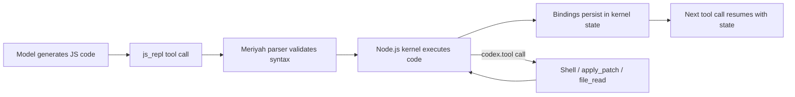
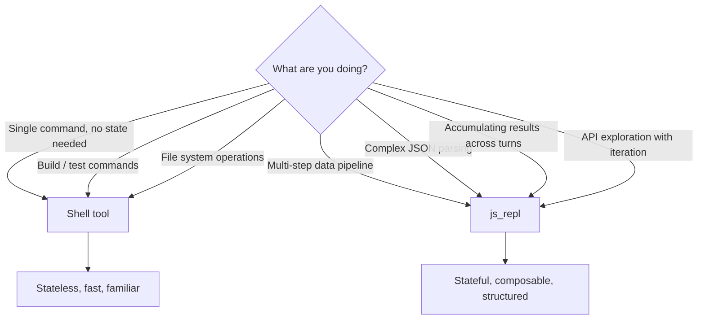

# The Codex CLI JavaScript REPL: Stateful Scripting Inside Your Agent Session


---

The Codex CLI's shell execution model is stateless by design — each `shell` tool call spins up a fresh process, runs a command, and tears down. That works brilliantly for file operations and build commands, but falls apart when you need to accumulate state across multiple reasoning steps: parse a JSON response, filter it, transform it, then feed the result into the next operation. Enter `js_repl` — an experimental, feature-gated JavaScript REPL runtime that maintains a persistent Node.js kernel across tool calls within a single Codex session [^1].

## Enabling the REPL

The feature is gated behind an explicit flag. Add it to your `config.toml`:

```toml
[features]
js_repl = true
```

Alternatively, toggle it during a live session with the `/experimental` slash command in the TUI [^2].

Once enabled, the model's direct tool calls are restricted to `js_repl` and `js_repl_reset` — all other Codex tools (shell execution, file reads, `apply_patch`) remain accessible but are invoked from *inside* JavaScript via `codex.tool()` [^3]. This is a deliberate design choice: the REPL becomes the orchestration layer, and the model writes JavaScript that calls out to existing tools as needed.

### Node.js Requirements

`js_repl` requires **Node.js 22.22.0 or later** [^4]. Since v0.106.0, Codex runs startup compatibility checks and surfaces a clear warning if your Node version is insufficient [^5]. The runtime resolution follows a priority chain:

1. `CODEX_JS_REPL_NODE_PATH` environment variable
2. `js_repl_node_path` setting in `config.toml`
3. System `PATH` lookup

```toml
# Override the Node.js binary path if needed
js_repl_node_path = "/usr/local/bin/node22"
```

## Architecture: A Persistent Kernel with Meriyah

Under the hood, Codex embeds a persistent Node.js kernel with a bundled **Meriyah** parser [^6]. The kernel ships as an embedded asset within the single Rust executable, alongside other bundled resources like the Lark grammar for patch parsing [^7]. This means no external REPL dependencies beyond Node.js itself.



The kernel supports **top-level `await`**, so you can write asynchronous code without wrapping it in an async IIFE [^1]. Each cell execution feeds into the same V8 context, preserving all top-level bindings.

## State Persistence Semantics

The persistence model has carefully defined semantics that go beyond simple variable retention [^1]:

- **Top-level bindings persist** across calls — variables, functions, and classes defined in one cell are available in all subsequent cells
- **Error resilience** — if a cell throws, prior bindings remain available; lexical bindings (`let`, `const`) whose initialisation completed before the throw stay accessible in later calls
- **Hoisted declarations** — `var` and `function` bindings persist only when execution clearly reached their declaration or a supported write site

```javascript
// Cell 1: Parse test results
const results = await codex.tool("shell", {
  command: "npm test --json 2>/dev/null"
});
const parsed = JSON.parse(results.stdout);
const failures = parsed.testResults.filter(r => r.status === "failed");
console.log(`${failures.length} test failures found`);

// Cell 2: 'failures' persists — transform and report
const summary = failures.map(f => ({
  name: f.name,
  duration: f.duration,
  message: f.failureMessages[0]?.slice(0, 200)
}));
console.table(summary);
```

### Resetting State

When state becomes stale or you want a clean slate, the companion `js_repl_reset` tool clears the kernel context entirely [^1]. Since v0.106.0, the reset operation clears in-flight tool calls without blocking, fixing earlier issues where pending `codex.tool()` executions could cause hangs [^8].

## The codex.* Bridge API

The REPL exposes a `codex` namespace providing structured access to the host environment and tool system [^9]:

| Method / Property | Description |
|---|---|
| `codex.tool(name, args?)` | Execute any Codex tool from inside JS — shell, `apply_patch`, file reads, MCP tools |
| `codex.emitImage(imageLike)` | Add an image to the `js_repl` function output for the model to inspect |
| `codex.cwd` | Current working directory of the Codex session |
| `codex.homeDir` | User's home directory path |

`codex.tool()` is the critical piece — it bridges the JavaScript execution context back into the full Codex tool system. When the model needs to run a shell command, read a file, or invoke an MCP-provided tool, it does so through this function rather than issuing a separate tool call [^3].

```javascript
// Use codex.tool() to orchestrate multiple tools from JS
const gitLog = await codex.tool("shell", {
  command: "git log --oneline -20"
});

// Parse in JS, then use the result to drive another tool call
const commits = gitLog.stdout.split("\n").filter(Boolean);
const recentHash = commits[0].split(" ")[0];

const diff = await codex.tool("shell", {
  command: `git diff ${recentHash}~1..${recentHash}`
});

// Process diff entirely in JS
const addedLines = diff.stdout.split("\n").filter(l => l.startsWith("+")).length;
console.log(`Commit ${recentHash}: ${addedLines} lines added`);
```

Since v0.115.0, saved references to `codex.tool()` and `codex.emitImage()` keep working across cells — you can store them in a variable or pass them to a helper function and they will remain valid [^9].

### Image Handling

`codex.emitImage()` accepts image-like data and attaches it to the tool output, enabling visual inspection workflows:

```javascript
const screenshot = await codex.tool("shell", {
  command: "screencapture -x /tmp/capture.png && base64 /tmp/capture.png"
});
codex.emitImage({ base64: screenshot.stdout, mediaType: "image/png" });
```

Supported models can request full-resolution inspection through `codex.emitImage(..., detail: "original")` [^10].

### Importing Local Files

Imported local files run in the same VM context, so they can access `codex.*`, the captured console, and Node-like `import.meta` helpers [^1]. This means you can build up a library of utility scripts in your project and import them into REPL sessions.

## Dynamic Tool Registration

Tools can be registered with `deferLoading: true`, making them callable by `js_repl` via `codex.tool()` while excluding them from the model-facing tool list sent on ordinary turns [^10]. This keeps the model's tool schema clean whilst still allowing the REPL to access extended functionality programmatically.

## When to Use js_repl Over Shell

The REPL is not a replacement for shell execution — it is a complement. Here is where each excels:



**Use `js_repl` when:**

- You need to accumulate and transform data across multiple reasoning steps
- JSON parsing and manipulation would be awkward in shell
- You want to orchestrate multiple tool calls with conditional logic
- Rapid prototyping without the overhead of writing temporary scripts to disk

**Stick with shell when:**

- Running build commands, test suites, or git operations directly
- Simple file system operations
- Commands where the output is consumed directly by the model

## Version History

The feature has evolved rapidly through 2025–2026 [^5][^8][^9]:

| Version | Change |
|---|---|
| v0.100.0 | Initial experimental `js_repl` introduction |
| v0.105.0 | Enhanced error reporting and recovery |
| v0.106.0 | Promoted to `/experimental`; startup compatibility checks; Node.js 22.22.0 minimum enforced |
| v0.115.0 | `codex.cwd` and `codex.homeDir` exposed; saved `codex.tool`/`codex.emitImage` references persist across cells; U+2028/U+2029 hang fix |

## Limitations and Caveats

- **Experimental status** — interfaces and behaviour may change between releases [^2]
- **Node.js 22.22.0+ only** — older Node versions will not work [^4]
- **Tool restriction** — enabling `js_repl` means the model can *only* issue `js_repl` and `js_repl_reset` as direct tool calls; all other tools go through `codex.tool()` [^3]
- **No cross-session persistence** — kernel state is lost when the Codex session ends
- **Sandbox interaction** — `js_repl` executes within the same sandbox constraints as shell commands; filesystem access respects the active permission profile

⚠️ The exact behaviour of `var`/`function` hoisting persistence after partial cell failures may vary between Node.js versions and is not guaranteed to be stable across Codex releases.

## Citations

[^1]: [JavaScript REPL (js_repl) — Codex CLI Documentation](https://fossies.org/linux/codex-rust/docs/js_repl.md)

[^2]: [Features — Codex CLI | OpenAI Developers](https://developers.openai.com/codex/cli/features)

[^3]: [Codex CLI: The Definitive Technical Reference — Blake Crosley](https://blakecrosley.com/guides/codex)

[^4]: [Add feature-gated freeform js_repl core runtime — PR #10674](https://github.com/openai/codex/pull/10674)

[^5]: [Disable js_repl when Node is incompatible at startup — PR #12824](https://github.com/openai/codex/pull/12824)

[^6]: [OpenAI Codex CLI Architecture and Multi-Runtime Agent Patterns — Zylos Research](https://zylos.ai/research/2026-03-26-openai-codex-cli-architecture-multi-runtime-patterns)

[^7]: [openai/codex — GitHub Repository](https://github.com/openai/codex)

[^8]: [Fix: js_repl reset hang by clearing exec tool calls — PR #11932](https://github.com/openai/codex/pull/11932)

[^9]: [Codex by OpenAI — Release Notes April 2026](https://releasebot.io/updates/openai/codex)

[^10]: [Changelog — Codex | OpenAI Developers](https://developers.openai.com/codex/changelog)
