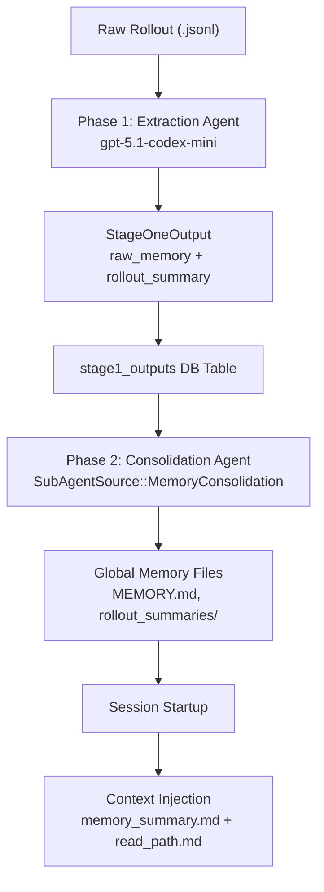
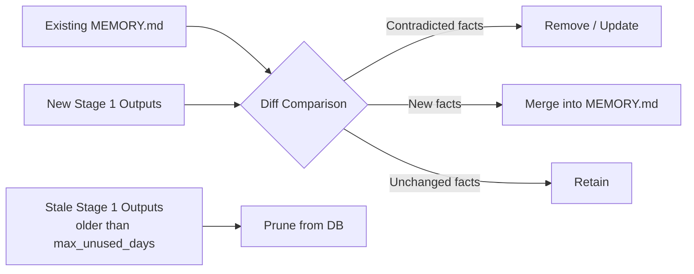

# Codex CLI Memory Internals: Pipelines, Secret Sanitisation and Intelligent Forgetting


---

Codex CLI's memory subsystem is considerably more sophisticated than a flat file of saved notes. Beneath the `/m_update` slash command sits a multi-phase extraction and consolidation pipeline, a secret sanitisation layer, usage-aware retrieval, and a diff-based forgetting algorithm that prunes stale facts automatically. This article dissects each component, drawing on the open-source Rust implementation and official documentation.

## The Two-Phase Memory Pipeline

Memory in Codex CLI operates as a **two-phase pipeline** that transforms raw conversation rollouts into persistent, consolidated knowledge[^1].

### Phase 1: Startup Extraction

When Codex identifies "stale" threads — those updated since their last memory extraction — it spawns lightweight extraction agents using the `gpt-5.1-codex-mini` model[^1]. Each agent processes raw `.jsonl` rollout files and produces a `StageOneOutput` struct containing two fields:

- **`raw_memory`** — detailed Markdown capturing specific facts, decisions, and preferences
- **`rollout_summary`** — a compact recap of the session's key outcomes

Extraction runs in parallel with a default `CONCURRENCY_LIMIT` of 8 jobs[^1]. The system only considers threads within a configurable `max_age_days` window that have been idle for at least `min_rollout_idle_hours`, preventing extraction from active conversations.

### Phase 2: Global Consolidation

A dedicated "Memory Writing Agent" periodically merges individual Phase 1 outputs into global memory files[^1]. Only one consolidation process runs at a time per `codex_home`, enforced through a database lock via `try_claim_global_phase2_job` with a `JOB_KIND_MEMORY_CONSOLIDATE_GLOBAL` entry in the `jobs` table[^1].

Before the consolidation agent runs, the system synchronises the local filesystem with the database using `sync_rollout_summaries_from_memories` and `rebuild_raw_memories_file_from_memories`[^1]. An `input_watermark` tracks which Stage 1 outputs have already been processed, enabling incremental updates rather than full rebuilds.



## Storage Architecture

The memory subsystem stores its artefacts under `~/.codex/memories/` (or wherever `CODEX_HOME` points)[^1][^2]:

| File / Directory | Purpose |
|---|---|
| `memory_summary.md` | High-level navigational summary injected into every prompt |
| `MEMORY.md` | Searchable registry and handbook of aggregated insights |
| `raw_memories.md` | Temporary merge of Phase 1 outputs used as Phase 2 input |
| `rollout_summaries/` | Per-thread recaps with lessons learned and evidence snippets |
| `skills/` | Reusable procedures and scripts (e.g., `SKILL.md`) |

Rollout summary filenames combine the `ThreadId`, a timestamp fragment, and an optional `rollout_slug` via `rollout_summary_file_stem`[^1], ensuring unique, traceable files even across rapid session turnover.

### Context Injection at Startup

During `Session` initialisation, the function `build_memory_tool_developer_instructions` reads `memory_summary.md`, wraps it in the `read_path.md` template, and injects it into the model's developer instructions[^1]. This injection is capped at `MEMORY_TOOL_DEVELOPER_INSTRUCTIONS_SUMMARY_TOKEN_LIMIT` — currently 5,000 tokens — to preserve context window budget for actual work[^1].

The agent can cite specific memory files using `<oai-mem-citation>` blocks referencing file paths and line ranges[^1], providing traceability back to the original learning source.

## Secret Sanitisation

Before any memory is persisted to disc, Codex CLI automatically scans for secrets[^2][^3]. The sanitisation layer detects common credential patterns — API keys, tokens, passwords, connection strings — and strips them before the Markdown is written. This prevents accidental leakage of sensitive material into `~/.codex/memories/`, which could otherwise be read by any process with filesystem access.

The sanitisation operates at the Phase 1 boundary: raw rollouts may contain secrets typed during a session, but the extraction agent's output is scrubbed before being stored in the `stage1_outputs` table or written to disc[^2].

⚠️ The exact regex patterns and detection heuristics used for secret scanning are not publicly documented in the open-source repository at the time of writing. The feature is confirmed to exist[^2][^3], but implementation details beyond "automatic scanning before write" are inferred from behaviour rather than source inspection.

## Diff-Based Forgetting

Introduced in v0.106.0[^2], the diff-based forgetting algorithm addresses memory bloat — the tendency for accumulated facts to grow stale and contradictory over time.

Rather than treating memory as append-only, the consolidation agent in Phase 2 performs differential comparison between:

1. **Existing global memory** (`MEMORY.md` and rollout summaries)
2. **Incoming Stage 1 outputs** (new sessions since the last consolidation)

Facts in the existing memory that are contradicted or superseded by newer information are removed or updated. This mirrors how human memory works — recent experiences overwrite outdated beliefs rather than simply stacking alongside them.

The system also includes a **pruning mechanism**: Stage 1 outputs older than `max_unused_days` that have not been referenced by the consolidation agent are pruned in batches of `PRUNE_BATCH_SIZE`[^1]. This prevents the database from growing unboundedly with historical extractions that have already been folded into the global summary.



## Usage-Aware Memory Selection

Also introduced in v0.106.0[^2], usage-aware selection ensures that frequently referenced memories are prioritised during retrieval. When the agent cites a memory via `<oai-mem-citation>` blocks, the system calls `record_stage1_output_usage` to increment the `usage_count` and update the `last_usage` timestamp in the database[^1].

During Phase 2 consolidation, the agent has access to these usage statistics, allowing it to:

- **Preserve** high-frequency memories even if they are older
- **Deprioritise** rarely accessed facts that may no longer be relevant
- **Surface** recently used memories more prominently in `memory_summary.md`

This creates a natural feedback loop: memories that prove useful in practice survive longer, whilst theoretical knowledge that never gets cited gradually fades.

## Interactive Memory Commands

Codex CLI exposes two slash commands for direct memory manipulation[^2][^4]:

### `/m_update <fact>`

Saves a persistent fact immediately. Examples:

```bash
/m_update always use pytest, never unittest
/m_update this project uses pnpm, not npm
/m_update prefer British English in all documentation
```

These facts bypass the normal Phase 1 extraction pipeline and are written directly to the memory store, making them available from the next session onwards.

### `/m_drop <query>`

Removes memories matching a search query. Useful for correcting outdated preferences or clearing project-specific facts after context switches.

### `codex debug clear-memories`

Introduced in v0.107.0[^2], this command performs a complete reset of all stored memories. It is the nuclear option — useful when switching between entirely unrelated projects or when the memory state has drifted significantly from reality.

```bash
# Reset all memories
codex debug clear-memories

# Verify the reset
ls ~/.codex/memories/
```

## CWD Awareness and Project Isolation

Memory files include working directory context[^2], enabling project-specific recall. When Codex loads memories at session start, it considers the current working directory to surface memories most relevant to the active project.

This means a developer working across multiple repositories will naturally see different memory contexts in each — database schema decisions from the backend repo, component naming conventions from the frontend repo — without manual switching.

## Memory vs AGENTS.md: Separation of Concerns

The memory system and `AGENTS.md` serve complementary but distinct roles[^2][^5]:

| Aspect | Memory (`/m_update`) | AGENTS.md |
|---|---|---|
| **Scope** | Personal, per-developer | Team-shared, per-repository |
| **Persistence** | `~/.codex/memories/` | Checked into version control |
| **Content** | Preferences, learned patterns | Architecture decisions, conventions |
| **Management** | Automatic extraction + slash commands | Manual editing |
| **Override** | Cannot override AGENTS.md | Takes precedence for project rules |

The three-tier `AGENTS.md` hierarchy (global at `~/.codex/AGENTS.md`, project root, subdirectory)[^5] handles team conventions, whilst the memory system captures individual developer preferences and learned workflows. Mixing the two — putting personal preferences in `AGENTS.md` or team rules in memory — creates confusion and potential conflicts.

## Memory in CI/CD: `codex exec` Behaviour

When running non-interactively via `codex exec`, the memory system loads automatically[^2]. This means CI/CD pipelines benefit from accumulated knowledge without requiring instruction repetition in each invocation.

However, there is an important nuance: `codex exec` runs are typically ephemeral and may use a clean `CODEX_HOME`. If you want CI jobs to benefit from persistent memory, you need to either:

1. Mount the `~/.codex/memories/` directory as a persistent volume
2. Use `--no-project-doc` to skip memory loading entirely for deterministic behaviour[^5]

```bash
# CI with persistent memory (mount volume)
codex exec --full-auto "run the test suite and fix failures"

# CI without memory (deterministic)
codex exec --full-auto --no-project-doc "run the test suite"
```

## Configuration Parameters

The memory pipeline exposes several tuning parameters through the Rust source[^1]:

| Parameter | Default | Description |
|---|---|---|
| `max_age_days` | ⚠️ undocumented | Maximum thread age for extraction consideration |
| `min_rollout_idle_hours` | ⚠️ undocumented | Minimum idle time before extraction triggers |
| `max_unused_days` | ⚠️ undocumented | Age threshold for pruning stale Stage 1 outputs |
| `CONCURRENCY_LIMIT` | 8 | Parallel Phase 1 extraction jobs |
| `PRUNE_BATCH_SIZE` | ⚠️ undocumented | Batch size for pruning operations |
| `MEMORY_TOOL_DEVELOPER_INSTRUCTIONS_SUMMARY_TOKEN_LIMIT` | 5,000 | Token cap for injected memory context |

⚠️ Several parameters lack public documentation for their default values. The constants are defined in the Rust source but not exposed in `config.toml` at the time of writing.

## Practical Recommendations

1. **Use `/m_update` deliberately** — save conventions and preferences, not transient facts
2. **Audit periodically** — inspect `~/.codex/memories/MEMORY.md` to verify the consolidation agent's summaries are accurate
3. **Reset when switching domains** — `codex debug clear-memories` before onboarding to an unrelated project prevents cross-contamination
4. **Separate concerns** — team rules belong in `AGENTS.md`, personal preferences in memory
5. **CI determinism** — use `--no-project-doc` in CI pipelines where reproducibility matters more than accumulated knowledge

## Citations

[^1]: [Memory System — DeepWiki / openai/codex](https://deepwiki.com/openai/codex/3.9-memories-system) — Technical architecture documentation derived from the open-source Rust implementation

[^2]: [Codex CLI: The Definitive Technical Reference — Blake Crosley](https://blakecrosley.com/guides/codex) — Comprehensive reference covering memory features by version

[^3]: [OpenAI Codex CLI: Official Description & Setup Guide — SmartScope](https://smartscope.blog/en/generative-ai/chatgpt/openai-codex-cli-comprehensive-guide/) — Updated February 2026, covering secret sanitisation and memory management

[^4]: [Memory & Project Docs — Codex CLI (Mintlify mirror)](https://www.mintlify.com/openai/codex/features/memory) — Official documentation mirror covering memory commands and AGENTS.md

[^5]: [OpenAI Codex CLI Memory Deep Dive — Mervin Praison](https://mer.vin/2025/12/openai-codex-cli-memory-deep-dive/) — December 2025 deep dive covering AGENTS.md hierarchy and memory storage
