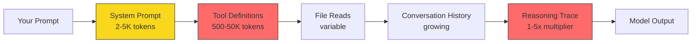
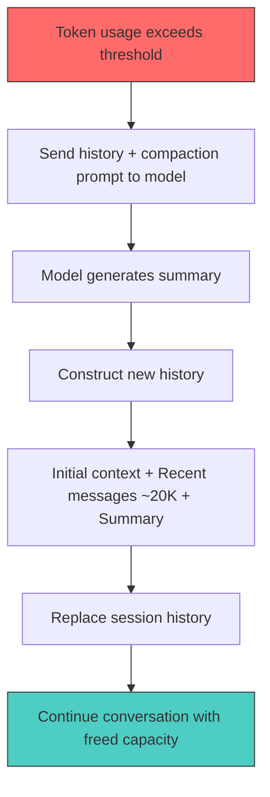

# Codex CLI Performance Optimisation: Token Overhead, Hidden Costs and Tuning Tactics


---

Every Codex CLI session burns tokens. Most developers have a rough sense of the cost—prompts in, completions out—but the reality is more nuanced. System prompts, tool definitions, MCP server schemas, reasoning traces and context compaction all consume tokens invisibly. This article dissects where your tokens actually go and provides concrete tactics for cutting waste without sacrificing output quality.

## Understanding the Token Budget

Each model exposes a different context window, and understanding the effective capacity—after overhead—is the first step to optimisation.

| Model | Input Window | Total Context | Typical Use Case |
|-------|-------------|---------------|------------------|
| GPT-5.4 | 1M | 1M | Flagship; recommended default [^1] |
| GPT-5.4-mini | 400K | 400K | Subagent work; 30% of GPT-5.4 quota [^1] |
| GPT-5.3-Codex | 272K | 400K | Coding specialist [^1] |
| GPT-5.3-Codex-Spark | 128K | 128K | Near-instant iteration; 1,000+ tok/s [^2] |
| GPT-5.1-Codex-Mini | 272K | 400K | Cost-sensitive tasks [^1] |

The input window is what you can send; total context includes the model's reasoning and output tokens. Your *usable* capacity is the input window minus all overhead.

## Where Your Tokens Go

### System Prompt and AGENTS.md

Every API call includes a system prompt composed from Codex's built-in instructions plus any `AGENTS.md` tiers you've defined. This typically costs **2–5K tokens per turn** [^3]. The good news: OpenAI's prompt caching means this payload is loaded once and cached thereafter, so subsequent turns in the same session pay a fraction of the original cost [^3].

### Tool Definitions

Each registered tool—whether built-in or from an MCP server—adds its JSON schema to every request. Built-in tools are relatively lean, but the cost compounds quickly:

- **~500 tokens per registered tool** for built-in Codex tools [^3]
- **~200–500 tokens per connected MCP server** for server-level overhead [^3]
- **~550–1,400 tokens per individual MCP tool definition** [^4]

A typical four-server MCP setup adds roughly 7,000 tokens of overhead per turn [^5]. Heavy configurations with five or more servers can burn **50,000+ tokens before you type your first prompt** [^4].

### File Reads and Attachments

When Codex reads a file—via `@file` references or tool calls—the full content enters the context window. A 500-line module might cost 15K tokens of input [^3]. There is no automatic truncation; if you point Codex at a large file, every byte counts.

### Reasoning Traces

Reasoning effort has a dramatic impact on token consumption. At `xhigh`, Codex uses **3–5× more tokens than `medium`** for the same prompt [^3]. The reasoning tokens are consumed server-side (they don't appear in your visible output), but they count against your quota and billing.



### Background Retries and Compaction Triggers

When a request fails (rate limit, transient error), Codex retries with exponential backoff [^6]. Each retry re-sends the full context. If you're near the compaction threshold, a failed request followed by a retry can trigger compaction mid-conversation—consuming additional tokens for the summarisation call itself.

## Monitoring: Know What You're Spending

### The `/status` Command

The `/status` slash command displays your current model, token usage, git branch and sandbox mode [^3]. Critically, **the token count includes all overhead**, not just your visible messages [^5]. If costs surprise you, `/status` is your first diagnostic.

### The Status Bar

Codex CLI's TUI shows a persistent status line with context usage percentage. Watch this during long sessions—when it climbs past 80%, you're approaching compaction territory.

### Token Usage Breakdown (Requested Feature)

As of April 2026, there is no built-in breakdown showing tokens by source (system prompt vs tools vs history vs reasoning). This has been requested as a feature in GitHub issue #13222 [^7]. Until it ships, you'll need to estimate overhead from your configuration.

## Context Compaction: How It Works

When token usage exceeds `model_auto_compact_token_limit`, Codex triggers automatic history compaction [^6]:

1. The entire conversation history is sent with a dedicated summarisation prompt
2. The model produces a compressed summary
3. A new history is constructed: initial context + recent user messages (up to ~20K tokens) + summary
4. The old history is replaced



### The Quality Trade-Off

Multiple compactions cause cumulative information loss [^6]. Each round discards detail from earlier exchanges. After two or three compactions, the model may lose track of decisions made early in the session. The official documentation explicitly warns that "long conversations and multiple compactions can cause the model to be less accurate" [^6].

### Manual Compaction with `/compact`

You can trigger compaction manually at any time with `/compact`. This is useful when you've finished a phase of work (investigation, say) and want to free tokens before starting implementation. Manual compaction at ~60% context usage gives better results than waiting for the automatic 95% trigger [^8].

## Configuration for Token Control

All settings live in `~/.codex/config.toml` (user-level) or `.codex/config.toml` (project-level).

### Essential Token Management Keys

```toml
# Override model context window (tokens)
model_context_window = 272000

# Trigger auto-compaction at this token count
model_auto_compact_token_limit = 64000

# Budget per tool output (prevents runaway file reads)
tool_output_token_limit = 12000

# Custom compaction prompt for domain-specific summarisation
compact_prompt = "Summarise focusing on architectural decisions and file paths modified"

# Or load from file (experimental)
experimental_compact_prompt_file = "/path/to/compact_prompt.txt"

# Cap history file size
[history]
max_bytes = 5242880
```

Setting `model_auto_compact_token_limit` lower than the default forces earlier compaction. This trades a small summarisation cost for consistently lower context pressure [^9].

### Reasoning Effort Tuning

Match reasoning depth to task complexity rather than using a uniform setting:

```toml
# Default: medium for routine tasks
model_reasoning_effort = "medium"

# Higher effort only in plan mode where it matters
plan_mode_reasoning_effort = "high"

# Suppress reasoning summaries when you don't need explanations
model_reasoning_summary = "none"
```

The `minimal` reasoning level is only available for GPT-5 models [^3]. Reserve `xhigh` for genuinely hard problems—architectural decisions, complex refactors, security audits—where the extra thinking demonstrably improves output.

### Verbosity Control

```toml
# Reduce output verbosity (GPT-5 Responses API)
model_verbosity = "low"
```

Lower verbosity produces terser responses, saving output tokens without affecting the quality of code generation [^9].

## Practical Tuning Tactics

### 1. Audit Your MCP Servers

Every connected MCP server injects its full tool catalogue into every request. Run `/status` and count your active servers. If you have servers you use infrequently, disable them in your configuration and enable them only when needed [^5].

For context: a GitHub MCP server with 93 tools consumes approximately 55,000 tokens per turn [^4]. If you only need basic git operations, the built-in tools or a shell command costs a fraction of that.

### 2. Use Profiles for Different Tasks

Create separate profiles that match task complexity to model and reasoning settings:

```toml
# In a [profile.quick] section
[profile.quick]
model = "gpt-5.4-mini"
model_reasoning_effort = "low"
model_verbosity = "low"

# In a [profile.deep] section
[profile.deep]
model = "gpt-5.4"
model_reasoning_effort = "high"
plan_mode_reasoning_effort = "xhigh"
```

Switch profiles with `codex --profile quick` for routine tasks and `codex --profile deep` for complex work [^9].

### 3. Start Fresh Threads Between Phases

Don't drag investigation context into implementation. After finishing research or debugging, start a new session or use `/clear` to reset. This prevents stale context from consuming tokens during the productive phase [^8].

### 4. Prefer `codex exec` for Automation

The `codex exec` command skips the TUI entirely, reducing overhead in CI/CD pipelines and scripted workflows. Combined with `--model gpt-5.4-mini`, this is the most token-efficient way to run batch operations [^3].

### 5. Leverage Prompt Caching

Prompt caching provides substantial savings on repeated requests. Cached input tokens are billed at roughly **10% of the uncached rate** (e.g., 6.25 credits/1M vs 62.50 credits/1M for GPT-5.4) [^10]. To maximise cache hits:

- Keep your system prompt and `AGENTS.md` stable across sessions
- Avoid unnecessary changes to tool configurations mid-session
- Use `--resume` to continue sessions rather than starting fresh for related work (noting that a cache regression in v2.1.69 has since been fixed) [^5]

### 6. Set `tool_output_token_limit`

Large file reads can blow out your context window in a single turn. Setting `tool_output_token_limit = 12000` caps the tokens stored per tool output [^9], forcing Codex to work with summaries rather than entire files. This is particularly valuable when the model reads log files or large generated outputs.

## Cost Estimation Reference

For API key users on token-based billing, here are representative costs per task at GPT-5.4 rates [^3]:

| Task | Input Tokens | Output Tokens | Approximate Cost |
|------|-------------|---------------|-----------------|
| Explain a 500-line module | ~15K | ~2K | ~$0.25 |
| Refactor auth module (10 files) | ~120K | ~30K | ~$2.25 |
| Full repository audit | ~200K | ~20K | ~$3.00 |

These figures include overhead. Subscription users (Plus at $20/month, Pro at $200/month) pay through message limits rather than per-token, but the same optimisation tactics extend your effective messages per five-hour window [^10].

## The Optimisation Checklist

Before your next long Codex CLI session, run through this:

- [ ] Check MCP server count — disable any you won't use
- [ ] Set `model_reasoning_effort` appropriate to the task
- [ ] Configure `model_auto_compact_token_limit` for early compaction
- [ ] Set `tool_output_token_limit` to prevent runaway file reads
- [ ] Use `/status` periodically to monitor context usage
- [ ] Start fresh threads between distinct work phases
- [ ] Use `codex exec` for scripted/batch operations

Token optimisation in Codex CLI isn't about penny-pinching—it's about maintaining model accuracy by keeping context clean and relevant. A session running at 95% context capacity with three compactions behind it will produce measurably worse output than a fresh session with focused context. Treat your token budget as a quality indicator, not just a cost metric.

## Citations

[^1]: [Codex Models – OpenAI Developers](https://developers.openai.com/codex/models)
[^2]: [OpenAI Codex CLI April 2026 Update – Daily 1 Bite](https://daily1bite.com/en/blog/ai-tools/openai-codex-cli-april-2026-update)
[^3]: [Codex CLI: The Definitive Technical Reference – Blake Crosley](https://blakecrosley.com/guides/codex)
[^4]: [MCP Token Trap: Why Your AI Agent Burns 35x More Tokens Than a CLI – OnlyCLI](https://onlycli.github.io/OnlyCLI/blog/mcp-token-cost-benchmark/)
[^5]: [How to Reduce Codex CLI Token Usage: 7 Proven Optimization Strategies – BSWEN](https://docs.bswen.com/blog/2026-03-02-reduce-codex-cli-token-usage/)
[^6]: [Context Compaction Research: Claude Code, Codex CLI, OpenCode, Amp – GitHub Gist (badlogic)](https://gist.github.com/badlogic/cd2ef65b0697c4dbe2d13fbecb0a0a5f)
[^7]: [Tokens usage breakdown – GitHub Issue #13222](https://github.com/openai/codex/issues/13222)
[^8]: [Why Is My Codex CLI Token Usage Suddenly So High? – BSWEN](https://docs.bswen.com/blog/2026-03-02-codex-cli-token-usage-spike/)
[^9]: [Configuration Reference – Codex CLI – OpenAI Developers](https://developers.openai.com/codex/config-reference)
[^10]: [Pricing – Codex CLI – OpenAI Developers](https://developers.openai.com/codex/pricing)
