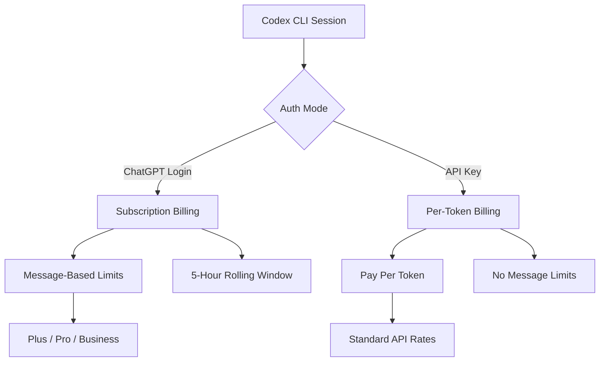
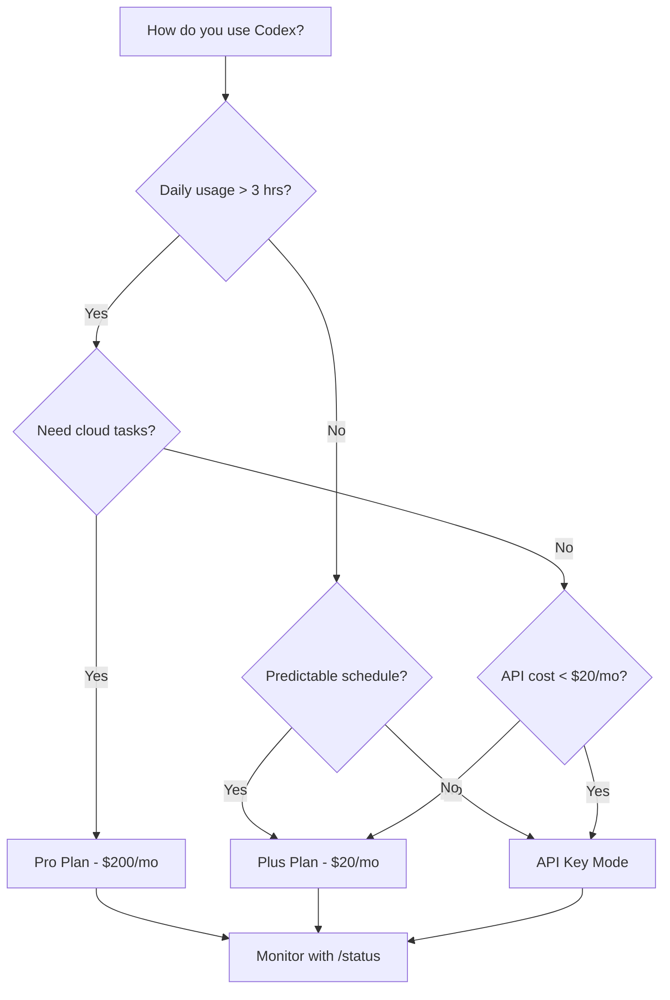

# Codex CLI Token Costs and Billing: A Practical Cost Calculator Guide


---

Every prompt you send through Codex CLI burns tokens — input tokens for context, output tokens for generated code, and (if you're using a reasoning model) internal chain-of-thought tokens that never appear on screen but still hit your bill. Understanding exactly where those tokens go is the difference between a $20/month hobby budget and an eye-watering invoice.

This guide breaks down the billing mechanics, walks through real-world cost examples, and provides concrete optimisation tactics for keeping spend under control.

## Billing Modes: Subscription vs API Key

Codex CLI supports two fundamentally different billing paths [^1]:



**ChatGPT authentication** (the default) draws from your subscription plan's Codex message allowance. You pay a fixed monthly fee and get a rolling allocation of messages per five-hour window [^1].

**API key mode** bills per token at standard OpenAI API rates. You set `CODEX_API_KEY` (or `OPENAI_API_KEY`) in your environment, and every token — input, cached input, and output — is metered against your API account [^2].

The choice matters. For predictable daily usage, subscriptions are almost always cheaper. For sporadic heavy bursts or CI/CD automation, API keys give you uncapped throughput without waiting for message limits to reset.

## Subscription Plans and Codex Limits

As of April 2026, six ChatGPT tiers include Codex access [^3] [^1]:

| Plan | Monthly Cost | Local Messages (5 hr) | Cloud Tasks (5 hr) | Code Reviews/Week |
|------|-------------|----------------------|--------------------|--------------------|
| **Free** | $0 | Limited | — | — |
| **Go** | $8 | Limited | — | — |
| **Plus** | $20 | 33–168 (GPT-5.4) / 45–225 (5.3-Codex) | Limited | 10–25 |
| **Pro** | $200 | 223–1,120 (GPT-5.4) / 300–1,500 (5.3-Codex) | 50–400 | 100–250 |
| **Business** | $25/user | 15–60 (GPT-5.4) / 20–90 (5.3-Codex) | 5–40 | 15–30 |
| **Enterprise** | Custom | Custom | Custom | Custom |

The ranges reflect message complexity: a simple "add a docstring" costs fewer credits than a multi-file refactor [^1]. OpenAI approximates GPT-5.4 local messages at ~7 credits each, GPT-5.3-Codex at ~5 credits, and GPT-5.4-mini at ~2 credits. Cloud tasks average ~34 credits and code reviews ~25 credits [^1].

**Pro tip:** Pro's 6× higher limits and priority processing make it the breakeven choice once you're regularly hitting Plus ceilings — roughly 4+ hours of daily coding [^3].

## API Token Pricing by Model

When using API key mode, you pay per million tokens. The current rates as of April 2026 [^2] [^4]:

| Model | Input (per 1M) | Cached Input (per 1M) | Output (per 1M) | Context Window |
|-------|----------------|----------------------|------------------|----------------|
| **GPT-5.4** | $2.50 | $1.25 | $10.00 | 256K |
| **GPT-5.4-mini** | $0.40 | $0.20 | $1.60 | 128K |
| **GPT-5.3-Codex** | $1.75 | $0.875 | $14.00 | 256K |
| **codex-mini-latest** | $1.50 | $0.75 | $6.00 | — |
| **o3** | $2.00 | — | $8.00 | — |
| **o4-mini** | $1.10 | — | $4.40 | — |

### Reasoning Tokens: The Hidden Cost

Models like o3 and o4-mini generate internal reasoning tokens as part of their chain-of-thought processing. These tokens never appear in the CLI output, but they are billed as output tokens [^5]. A task that produces 500 output tokens visible to you might generate 3,000–5,000 reasoning tokens internally, multiplying the effective output cost by 5–10× .⚠️

This is why reasoning model tasks can be surprisingly expensive. Use `codex --status` mid-session to monitor cumulative token consumption [^1].

### Cached Input Tokens

Codex CLI benefits significantly from prompt caching. When you send repeated or overlapping context (common during iterative development), OpenAI caches the prompt prefix and charges cached input tokens at 50% of the standard input rate [^2] [^4]. On a long session where you're refining the same file, caching can reduce input costs by 30–40%.

## Worked Cost Examples

### Example 1: Generate a CRUD Endpoint

A straightforward "generate a REST endpoint for users with CRUD operations" prompt:

- **Input:** ~2,000 tokens (prompt + file context)
- **Output:** ~4,000 tokens (generated code)

| Model | Input Cost | Output Cost | **Total** |
|-------|-----------|-------------|-----------|
| GPT-5.4 | $0.005 | $0.040 | **$0.045** |
| GPT-5.4-mini | $0.001 | $0.006 | **$0.007** |

Using GPT-5.4-mini for routine scaffolding saves ~85% per request [^4].

### Example 2: Full-Day Intensive Coding Session

Approximately 8 hours of active development — refactoring, writing tests, reviewing PRs:

- **Input:** ~200,000 tokens (cumulative context across turns)
- **Output:** ~150,000 tokens (generated code and explanations)

| Model | Input Cost | Output Cost | **Total** |
|-------|-----------|-------------|-----------|
| GPT-5.4 | $0.50 | $1.50 | **$2.00** |
| GPT-5.4-mini | $0.08 | $0.24 | **$0.32** |

Over 22 working days, that's **$44/month on GPT-5.4** or **$7/month on GPT-5.4-mini** — both cheaper than the Plus subscription if you're disciplined about model selection [^4].

### Example 3: CI Pipeline Code Review

Running `codex exec review --base main` on a 500-line PR:

- **Input:** ~15,000 tokens (diff + repository context)
- **Output:** ~3,000 tokens (review comments)
- **Cost on GPT-5.4:** ~$0.07 per review

At 10 PRs/day across a team, that's roughly **$15/month** — far cheaper than dedicated review tooling [^2].

## Credit-Based Billing for Business and Enterprise

Since April 2026, Business and Enterprise customers use a token-based credit system rather than message counting [^1]:

| Model | Input (cr/1M) | Cached Input (cr/1M) | Output (cr/1M) |
|-------|--------------|---------------------|----------------|
| GPT-5.4 | 62.50 | 6.25 | 375.00 |
| GPT-5.4-mini | 18.75 | 1.875 | 113.00 |
| GPT-5.3-Codex | 43.75 | 4.375 | 350.00 |

Credits are purchased in bulk and consumed based on actual token usage. This gives organisations transparent, auditable billing that maps directly to API pricing conventions [^1].

## Cloud Tasks Bill Differently

Cloud tasks (submitted via `codex cloud exec` or `@Codex` in Slack) run in isolated cloud VMs and consume more resources than local sessions [^1]. Key differences:

- **Higher credit cost:** ~34 credits per cloud task vs ~5–7 for a local message
- **VM overhead:** cloud tasks include compute costs for the sandboxed environment
- **No caching benefit:** each cloud task starts with a fresh context, so you don't benefit from cached input token discounts

For cost-sensitive workflows, prefer local execution and reserve cloud tasks for fire-and-forget automation where the convenience justifies the premium.

## Cost Optimisation Tactics

### 1. Choose the Right Model for the Task

```toml
# ~/.codex/config.toml — default to mini, override per-project
model = "gpt-5.4-mini"
```

Use GPT-5.4-mini or codex-mini-latest for routine tasks (scaffolding, tests, docstrings). Reserve GPT-5.4 or reasoning models for complex architectural work [^6].

### 2. Trim Your Context Window

Every file Codex reads counts as input tokens. Reduce unnecessary context:

```bash
# .codexignore — exclude bulky directories
node_modules/
dist/
*.lock
__pycache__/
.git/
```

A well-maintained `.codexignore` can cut input tokens by 40–60% on large repositories [^6].

### 3. Minimise MCP Server Overhead

Each enabled MCP server injects tool definitions into the system prompt. If you're not actively using a server, disable it:

```toml
# Only enable what you need per-project
[mcp_servers.github]
enabled = true

[mcp_servers.slack]
enabled = false
```

Fewer MCP servers = fewer tokens per turn [^6].

### 4. Use Concise AGENTS.md Files

Nested `AGENTS.md` files in subdirectories let you provide targeted context rather than loading a monolithic project-wide instruction file. Keep each under 2 KiB where possible [^6].

### 5. Leverage Prompt Caching

Structure your workflow to benefit from cached inputs: work iteratively on the same files rather than jumping between unrelated areas of the codebase. The 50% cached input discount compounds over a long session [^2].

### 6. Monitor with /status

Run `/status` periodically during sessions to see cumulative token usage. If you're burning through tokens faster than expected, switch models or narrow scope [^1].

## Decision Flowchart: Which Billing Mode?



For most individual developers, **ChatGPT Plus at $20/month remains the best value** [^4]. You only need to consider API key mode if your usage is either very light (< $15/month in tokens) or very heavy and bursty (CI/CD pipelines, batch processing).

## Summary

| Scenario | Recommended Billing | Estimated Monthly Cost |
|----------|--------------------|-----------------------|
| Casual (< 2 hrs/day) | Plus | $20 |
| Heavy individual (4+ hrs/day) | Pro | $200 |
| Light API automation | API Key + GPT-5.4-mini | $5–15 |
| Team (5 devs, moderate use) | Business | $125–150 |
| CI/CD pipeline reviews | API Key + GPT-5.4 | $15–30 |

Token costs are a lever, not a ceiling. The developers who spend the least per line of useful output are the ones who match the model to the task, keep their context lean, and monitor consumption as a habit rather than an afterthought.

## Citations

[^1]: [Codex Pricing – OpenAI Developers](https://developers.openai.com/codex/pricing)
[^2]: [OpenAI API Pricing](https://developers.openai.com/api/docs/pricing)
[^3]: [ChatGPT Plans – OpenAI](https://chatgpt.com/pricing/)
[^4]: [OpenAI Codex Pricing 2026: API Costs, Token Limits – Flowith Blog](https://flowith.io/blog/openai-codex-pricing-2026-api-costs-token-limits/)
[^5]: [OpenAI o3 Pricing: Every Plan and API Cost Explained – PanelsAI](https://panelsai.com/openai-o3-pricing/)
[^6]: [How to Reduce Codex CLI Token Usage: 7 Proven Optimization Strategies – BSWEN](https://docs.bswen.com/blog/2026-03-02-reduce-codex-cli-token-usage/)
