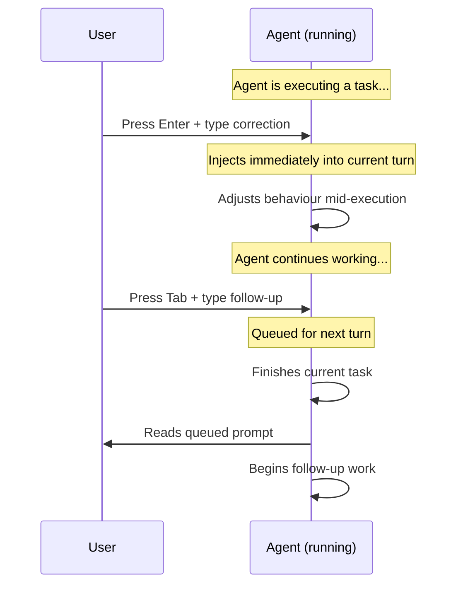

# Codex CLI TUI Shortcuts and Slash Commands: The Complete Reference


Codex CLI's full-screen terminal UI (TUI) is where most interactive work happens. Beneath the chat-style composer sits a dense set of keyboard shortcuts, input modifiers, and slash commands that let you control models, review diffs, manage sessions, and configure the agent — all without leaving the terminal[^1]. This reference catalogues every shortcut and slash command available as of April 2026, organised by function.

## The Composer: Input Shortcuts and Modifiers

The composer is the text-entry area at the bottom of the TUI. Beyond plain text, it supports several input modifiers and keyboard shortcuts that dramatically speed up interaction.

### Keyboard Shortcuts

| Shortcut | Action |
|----------|--------|
| **Enter** | Send the current prompt. During agent execution, injects new instructions into the running turn (steer mode)[^2] |
| **Tab** | During agent execution, queues a follow-up prompt for the next turn rather than interrupting the current one[^2] |
| **Ctrl+G** | Opens the current prompt in your external editor, as defined by the `VISUAL` environment variable (falls back to `EDITOR`)[^3] |
| **Ctrl+L** | Clears the terminal screen without resetting the conversation context[^3] |
| **Ctrl+C** | Cancels the current operation; press twice to quit the session[^4] |
| **Ctrl+D** | Exits Codex CLI; press twice to force quit[^4] |
| **Esc, Esc** | When the composer is empty, double-pressing Escape edits your previous message. Continue pressing to walk back through the transcript[^3] |
| **Up / Down** | Navigate through draft history in the composer. Codex restores prior draft text and image placeholders[^3] |

### Input Modifiers

Three prefix characters transform composer input before it reaches the model:

| Prefix | Purpose | Example |
|--------|---------|---------|
| **@** | Fuzzy file search over the workspace root. Press **Tab** or **Enter** to accept a match and attach the file to the conversation[^3] | `@src/main.rs` |
| **!** | Executes a local shell command outside Codex's sandbox. Output is displayed but not sent to the model[^3] | `!git log --oneline -5` |
| **-i** / **--image** | Attach images via CLI flags at launch, or paste screenshots directly into the composer during a session[^5] | `codex -i mockup.png "Implement this design"` |

```mermaid
flowchart LR
    A[User types in composer] --> B{First character?}
    B -->|@| C[Fuzzy file search]
    B -->|!| D[Local shell exec]
    B -->|/ | E[Slash command popup]
    B -->|text| F[Send to model]
    C -->|Tab/Enter| G[Attach file to context]
    D --> H[Display output locally]
    E --> I[Execute command]
    F -->|Enter| J[Model processes prompt]
```

## Slash Commands: Complete Reference

Type `/` in the composer to open the slash-command popup. Commands are grouped below by function[^1].

### Session Management

| Command | Description |
|---------|-------------|
| `/clear` | Clears the terminal, resets the visible transcript, and starts a fresh chat within the same CLI session[^1] |
| `/new` | Starts a new conversation inside the same session without leaving the terminal[^1] |
| `/resume` | Resumes a saved conversation from your session list[^1] |
| `/fork` | Forks the current conversation into a new thread, preserving the original[^1] |
| `/compact` | Summarises the visible conversation to free tokens while retaining key context[^1] |
| `/copy` | Copies the latest completed Codex output to the system clipboard[^1] |
| `/exit` | Exits the CLI session[^1] |
| `/quit` | Alias for `/exit`[^1] |

### Model and Configuration

| Command | Description |
|---------|-------------|
| `/model` | Opens a picker to choose the active model (e.g. `gpt-5.4`, `gpt-5.3-codex`, `o3`, `o4-mini`) and adjust reasoning effort[^1][^6] |
| `/fast` | Toggles fast mode for GPT-5.4. Accepts `/fast on`, `/fast off`, or `/fast status`[^1] |
| `/permissions` | Opens an approval-preset picker: choose between auto, read-only, or full-access modes mid-session[^1] |
| `/personality` | Changes how Codex communicates (tone, verbosity) without altering system instructions[^1] |
| `/statusline` | Interactively configures which fields appear in the TUI footer status bar and their order[^1] |
| `/theme` | Previews and saves syntax-highlighting colour schemes for code blocks in the TUI[^3] |
| `/experimental` | Toggles experimental features such as subagents on or off[^1] |
| `/debug-config` | Prints configuration layer order and policy sources for debugging precedence issues[^1] |

### Code and Project Tools

| Command | Description |
|---------|-------------|
| `/diff` | Shows the Git diff of the current working tree, including untracked files[^1] |
| `/review` | Launches a code review of your working tree changes. Supports presets: against a base branch, uncommitted changes, or specific commits[^1][^3] |
| `/plan` | Switches to plan mode, optionally with a prompt. The agent produces an execution plan without making changes[^1] |
| `/init` | Generates an `AGENTS.md` scaffold in the current directory, capturing persistent repository instructions[^1] |
| `/mention` | Attaches a file to the conversation for the model to inspect[^1] |

### Agent and Tool Management

| Command | Description |
|---------|-------------|
| `/agent` | Switches the active agent thread when working with spawned subagents[^1] |
| `/ps` | Shows experimental background terminals and their recent output[^1] |
| `/mcp` | Lists all configured Model Context Protocol (MCP) tools available in the session[^1] |
| `/apps` | Browses available apps (connectors) and inserts them into your prompt[^1] |

### Platform and Diagnostics

| Command | Description |
|---------|-------------|
| `/status` | Displays the active model, approval policy, writable roots, and current token usage[^1] |
| `/feedback` | Sends session logs to the Codex maintainers for diagnostics and bug reports[^1] |
| `/logout` | Signs out and clears stored credentials — useful on shared machines[^1] |
| `/sandbox-add-read-dir` | Grants the sandbox read access to additional directories (Windows-specific)[^1] |

## Steer Mode vs Plan Mode: Enter and Tab Mechanics

Understanding the difference between **Enter** and **Tab** during agent execution is essential for effective steering[^2]:



- **Enter** (steer mode): sends your message immediately, interrupting the agent's current work. Use this for urgent corrections — "stop, don't delete that file" or "use the staging database instead"[^2].
- **Tab** (queue mode): holds your prompt until the agent finishes its current turn. Use this for follow-up tasks — "after that, run the test suite" or "then update the changelog"[^2].

## CLI Subcommands for Non-Interactive Use

While not strictly TUI features, these subcommands complement the interactive session and share the same global flags[^7]:

| Subcommand | Purpose |
|------------|---------|
| `codex exec` / `codex e` | Runs Codex non-interactively with a prompt; ideal for CI/CD pipelines[^7] |
| `codex review` | Non-interactive code review against the working tree[^7] |
| `codex resume` | Resumes a previous interactive session from the command line[^7] |
| `codex fork` | Forks a previous session into a new one[^7] |
| `codex apply` / `codex a` | Applies the latest diff from a Cloud task as `git apply`[^7] |
| `codex cloud` | Browses and manages Cloud tasks from the terminal (experimental)[^7] |
| `codex mcp` | Manages MCP server configurations[^7] |
| `codex completion bash\|zsh\|fish` | Generates shell completion scripts[^7] |
| `codex sandbox` | Runs arbitrary commands under the sandbox policy for testing[^7] |

## Global Flags Worth Knowing

These flags apply to the base `codex` command and propagate to subcommands[^7]:

```bash
# Override model for this session
codex -m gpt-5.3-codex "Refactor the auth module"

# Inline config overrides
codex -c model_provider="oss" -c sandbox="workspace-write"

# Attach images at launch
codex -i screenshot.png -i wireframe.png "Implement this UI"

# Load a named profile
codex -p fast-review

# Set approval policy
codex -a never "Run the full test suite"

# Grant additional directory access
codex --add-dir /var/log "Search recent error logs"
```

## Platform Differences

| Feature | macOS | Linux | Windows (WSL) |
|---------|-------|-------|---------------|
| Sandbox engine | Seatbelt[^8] | Landlock + seccomp[^8] | Restricted tokens + ACLs[^8] |
| `/sandbox-add-read-dir` | Not needed | Not needed | Available[^1] |
| `codex app` subcommand | Available | Not available | Not available[^7] |
| Ctrl+G editor | Respects `VISUAL` / `EDITOR` | Respects `VISUAL` / `EDITOR` | Respects `VISUAL` / `EDITOR`[^3] |
| Shell completions | bash, zsh, fish | bash, zsh, fish | bash, zsh (via WSL)[^7] |

## Quick-Reference Card

For daily use, these are the shortcuts worth committing to muscle memory:

| Action | Shortcut |
|--------|----------|
| Attach a file | `@filename` + Tab |
| Run a shell command | `!command` |
| Review changes before committing | `/diff` then `/review` |
| Switch model mid-session | `/model` |
| Free up context window | `/compact` |
| Copy last response | `/copy` |
| Open long prompt in editor | Ctrl+G |
| Correct agent mid-task | Enter + message |
| Queue follow-up work | Tab + message |
| Check token usage | `/status` |

## Citations

[^1]: [Slash commands in Codex CLI — OpenAI Developers](https://developers.openai.com/codex/cli/slash-commands)

[^2]: [Features — Codex CLI — OpenAI Developers](https://developers.openai.com/codex/cli/features)

[^3]: [OpenAI Codex CLI Cheat Sheet — Shortcuts and Commands — ComputingForGeeks](https://computingforgeeks.com/codex-cli-cheat-sheet/)

[^4]: [Codex CLI Cheat Sheet 2026 — Commands & Options — Toolsbase](https://toolsbase.dev/en/reference/codex-commands)

[^5]: [CLI — Codex — OpenAI Developers](https://developers.openai.com/codex/cli)

[^6]: [Command line options — Codex CLI — OpenAI Developers](https://developers.openai.com/codex/cli/reference)

[^7]: [Command line options — Codex CLI — OpenAI Developers](https://developers.openai.com/codex/cli/reference)

[^8]: [GitHub — openai/codex: Lightweight coding agent that runs in your terminal](https://github.com/openai/codex)
