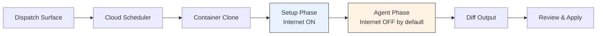
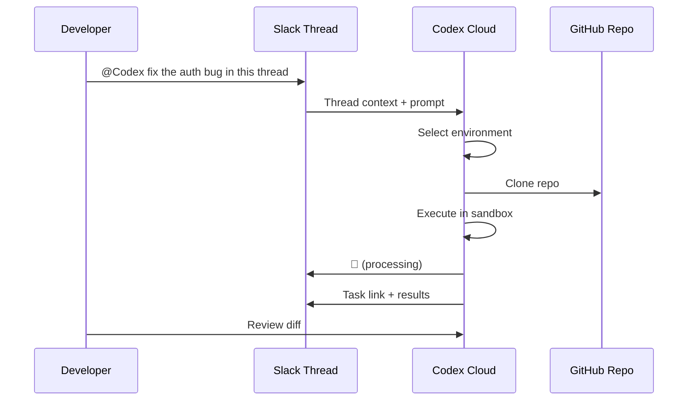
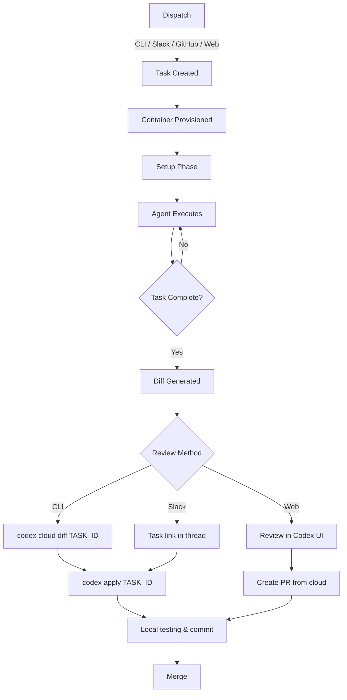

# Codex Cloud Task Application: From Slack Dispatch to Reviewed Diff Merge


---

Codex cloud transforms OpenAI's coding agent from a local terminal companion into an asynchronous task engine. You dispatch work — from the CLI, a Slack thread, or a GitHub issue — and Codex executes it in an isolated cloud sandbox, returning a reviewable diff you can merge locally with a single command. This article traces the complete lifecycle: environment setup, task dispatch via every available surface, execution in the cloud sandbox, diff review, and local application.

## Architecture Overview

Every cloud task follows the same execution pipeline regardless of how it was dispatched.



The dispatch surface can be the CLI (`codex cloud exec`), Slack (`@Codex`), GitHub (`@codex` on an issue or PR), or the Codex web UI [^1]. Regardless of origin, the task lands in the same cloud scheduler, gets assigned a container, and runs through a two-phase execution model.

## Environment Configuration

Before dispatching any cloud task, you need at least one configured environment. Environments live in your [Codex settings](https://chatgpt.com/codex/settings) and define:

- **Repository and branch** — Codex clones your repo and checks out the specified branch (or default branch) at task start [^2]
- **Setup script** — a Bash script that runs with internet access to install dependencies, build toolchains, or configure runtimes
- **Maintenance script** — runs when resuming a cached container to update dependencies after a branch change [^2]
- **Environment variables** — available throughout the entire task duration
- **Secrets** — only available during setup scripts, stripped before agent execution for security [^2]
- **AGENTS.md** — if present in your repo, the agent reads it to discover project-specific lint commands, test runners, and coding conventions [^2]

The default `universal` container image ships with common languages pre-installed. You can pin specific versions of Python, Node.js, and other runtimes through environment settings [^2].

### Cache Behaviour

Codex caches containers for up to 12 hours [^2]. The cache invalidates automatically when you modify setup scripts, maintenance scripts, environment variables, or secrets. For Business and Enterprise workspaces, caches are workspace-wide — a cache reset affects all users with access to that environment [^2].

## Internet Access Configuration

Cloud tasks use a two-phase runtime model with distinct network policies:

| Phase | Internet Access | Purpose |
|-------|----------------|---------|
| Setup | Always ON | Install dependencies, pull packages |
| Agent | OFF by default | Code editing and validation |

You can enable agent-phase internet access per environment with three domain allowlist presets [^3]:

1. **None** — empty allowlist, add domains manually
2. **Common dependencies** — 80+ pre-configured domains covering npm, PyPI, Maven, Docker Hub, GitHub, and other package registries
3. **All (unrestricted)** — permits all domains

For additional security, you can restrict HTTP methods to `GET`, `HEAD`, and `OPTIONS` only, blocking any write operations to external services [^3]. All traffic routes through an HTTP/HTTPS proxy regardless of configuration [^3].

> **Security note:** enabling internet access introduces prompt injection risk. The agent could retrieve and follow instructions from untrusted web content, or potentially exfiltrate code and secrets [^3]. Restrict domains to the minimum necessary and review agent output carefully.

## Dispatching Tasks

### From the CLI

The `codex cloud` command family provides full task management from your terminal [^4]:

```bash
# Interactive picker — browse environments, launch tasks, review results
codex cloud

# Submit a task directly
codex cloud exec --env ENV_ID "Refactor the auth module to use dependency injection"

# Best-of-N: run up to 4 parallel attempts, pick the best result
codex cloud exec --env ENV_ID --attempts 3 "Fix the race condition in worker.go"
```

The `--attempts` flag (1–4) triggers best-of-N execution, where Codex runs multiple independent attempts and surfaces the strongest result [^4]. Environment IDs come from your Codex cloud configuration — use `codex cloud` and press `Ctrl+O` to browse environments, or check the web dashboard [^4].

Authentication uses your existing CLI login. The command exits with a non-zero status if submission fails, making it scriptable for CI pipelines [^4].

### From Slack

The Slack integration turns any channel thread into a task dispatch surface.

**Prerequisites** [^5]:

- ChatGPT Plus, Pro, Business, Enterprise, or Edu plan
- Connected GitHub account
- At least one configured cloud environment
- Slack app installed from [Codex settings](https://chatgpt.com/codex/settings/connectors)
- `@Codex` bot added to the target channel

**Dispatch workflow:**



Mention `@Codex` with your prompt in a channel or thread. You can optionally specify a repository or environment: `@Codex fix the above in openai/codex` [^5]. Codex reacts with 👀 whilst processing and replies with a task link upon completion [^5].

**Environment selection** is automatic — Codex reviews accessible environments and selects the best match for your request. It falls back to your most recently used environment if ambiguous, or asks for clarification if no suitable option exists [^5].

Codex reads earlier messages in the thread for context, so you rarely need to restate background information [^5]. For complex threads, summarise key details in your `@Codex` message to reduce ambiguity [^6].

**Enterprise controls:** administrators can disable thread answers by clearing "Allow Codex Slack app to post answers on task completion" in workspace settings, limiting responses to task links only [^5].

### From GitHub

Mention `@codex` on a GitHub issue or pull request to kick off a cloud task directly from your repository's issue tracker [^1]. Codex picks up the issue context and executes against the configured environment for that repository.

## Cloud Execution

Once dispatched, the task runs through the two-phase model:

1. **Container creation** — Codex creates an isolated container, clones your repository at the specified branch or commit SHA [^2]
2. **Setup phase** — runs your setup script (and maintenance script for cached containers) with internet access [^2]
3. **Agent phase** — Codex edits code, runs terminal commands, and validates changes in a loop. Internet access follows your environment's allowlist configuration [^3]
4. **Output** — on completion, Codex produces a diff showing all file changes

The agent operates entirely within a secure, isolated container [^7]. It cannot access your host system, unrelated data, or external services (unless internet access is explicitly enabled). This isolation is fundamental to the security model — the agent can only interact with the code explicitly provided via your GitHub repository and pre-installed dependencies [^7].

### Context Preservation

When you kick off a cloud task from a local IDE session, Codex creates a new cloud thread that carries over the existing thread context, including any plan you have discussed and local source changes [^8]. This enables a powerful pattern: design locally where code context is immediate, then delegate the long implementation to a cloud task that runs in parallel whilst you continue other work.

## Reviewing and Applying Results

### Listing and Inspecting Tasks

```bash
# List recent tasks (plain text)
codex cloud list

# Filter by environment, JSON output for scripting
codex cloud list --env ENV_ID --json --limit 10

# Check status of a specific task
codex cloud status TASK_ID
```

The JSON output includes a `tasks` array where each task contains `id`, `url`, `title`, `status`, `updated_at`, `environment_id`, `environment_label`, `summary`, `is_review`, and `attempt_total` [^4]. The optional `cursor` field enables pagination for large result sets.

### Viewing Diffs

```bash
# View the diff for a completed task
codex cloud diff TASK_ID
```

This outputs the standard unified diff format, suitable for piping into review tools or applying manually.

### Applying Diffs Locally

The `codex apply` command (aliased as `codex a`) applies a cloud task's diff to your local working tree [^4]:

```bash
codex apply TASK_ID
```

This runs `git apply` under the hood. It prints patched files on success and exits non-zero if the apply fails due to conflicts [^4]. If your local branch has diverged significantly from the cloud task's base, you may need to rebase or resolve conflicts manually before applying.

### Creating Pull Requests

You can also create a PR directly from the cloud task results without pulling changes locally first [^8]. This is particularly useful for tasks dispatched from Slack or GitHub issues, where the reviewer may not be the person who dispatched the task.

## The Full Lifecycle

Bringing it all together, here is the complete task lifecycle from dispatch to merge:



## Cost and Latency Considerations

Cloud tasks incur token costs based on the model used and the complexity of the task. The `--attempts` flag multiplies cost linearly — three attempts cost roughly three times a single attempt [^4]. ⚠️ Exact per-task pricing is not publicly documented at the time of writing; costs are deducted from your ChatGPT plan's usage allocation.

OpenAI has invested heavily in reducing cloud task latency, with median completion times for new tasks and follow-ups reduced by 90% through container caching [^9]. The 12-hour cache window means that sequential tasks against the same environment benefit from warm containers, whilst the first task of the day may take longer due to cold start.

## Cloud vs Local: When to Use Each

| Scenario | Recommended Surface |
|----------|-------------------|
| Quick exploratory edit | Local CLI |
| Long-running refactor | Cloud task |
| Bug triage from Slack thread | Slack dispatch |
| CI-triggered code review | GitHub `@codex` mention |
| Parallel implementation of multiple features | Multiple cloud tasks |
| Sensitive code requiring manual oversight | Local CLI with `suggest` mode |

The key insight from OpenAI's workflow documentation is to treat cloud Codex like a teammate: design carefully with local context where inspection is quick, then outsource the long implementation to a cloud task [^8]. The cloud excels at parallelism — you can dispatch multiple tasks simultaneously and review diffs as they complete, whilst your local session remains free for interactive work.

## Citations

[^1]: [Web – Codex | OpenAI Developers](https://developers.openai.com/codex/cloud)

[^2]: [Cloud environments – Codex web | OpenAI Developers](https://developers.openai.com/codex/cloud/environments)

[^3]: [Internet Access – Codex cloud | OpenAI Developers](https://developers.openai.com/codex/cloud/internet-access)

[^4]: [Command line options – Codex CLI | OpenAI Developers](https://developers.openai.com/codex/cli/reference)

[^5]: [Use Codex in Slack | OpenAI Developers](https://developers.openai.com/codex/integrations/slack)

[^6]: [Kick off coding tasks from Slack | Codex use cases](https://developers.openai.com/codex/use-cases/slack-coding-tasks)

[^7]: [Introducing Codex | OpenAI](https://openai.com/index/introducing-codex/)

[^8]: [Workflows – Codex | OpenAI Developers](https://developers.openai.com/codex/workflows)

[^9]: [Codex is now generally available | OpenAI](https://openai.com/index/codex-now-generally-available/)
