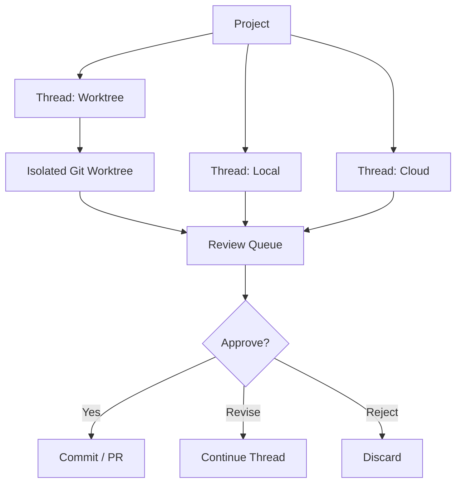
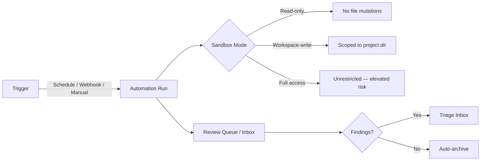

# Mastering the Codex Desktop App: Automations, Triggers and the Review Queue

---

The Codex Desktop app, launched on 2 February 2026 for macOS[^1], is not simply a GUI wrapper around the CLI. It is a purpose-built command centre for running multiple coding agents in parallel, with built-in worktree isolation, a structured review queue, and — its most distinctive feature — automations that let Codex work unprompted on a schedule. Windows support followed on 4 March 2026 (app v26.304) with a native PowerShell sandbox, full feature parity including skills, automations, and worktrees, without requiring WSL[^2].

This article covers the power features that separate the Desktop app from CLI-only workflows: automations, worktree isolation, the review queue, and the orchestration primitives that tie them together.

## Architecture: Projects, Threads and Execution Modes

The Desktop app organises work around **projects** — each one maps to a directory on disk, functioning like a CLI session scoped to a specific codebase[^3]. Within a project you create **threads**, each of which represents a discrete task or conversation.

When creating a thread, you choose an execution mode[^3]:

- **Local** — the agent works directly in the project directory, just like the CLI.
- **Worktree** — changes are isolated in a dedicated Git worktree.
- **Cloud** — execution happens remotely in a configured cloud sandbox.

The choice of mode determines how the agent's file mutations are contained and how review flows work downstream.

## Worktree Isolation in Depth

Parallel agents break things when they share a working directory. The Desktop app leans on Git worktrees to solve this — each agent thread gets its own checkout of the repository, with its own `HEAD` and index, whilst sharing the underlying object store[^4].

### How Worktree Threads Work

1. Select **Worktree** in the new-thread composer.
2. Choose a starting branch (main, a feature branch, or the current branch with uncommitted changes).
3. Codex creates a Git worktree in detached `HEAD` state, stored under `$CODEX_HOME/worktrees`[^4].
4. Optionally, a **local environment** setup script runs to install dependencies and copy environment files[^4].

The performance characteristics are compelling: worktree creation takes roughly 0.8 seconds, with approximately 120 MB disk overhead per worktree (working files only — history is shared). Five parallel independent tasks completed in 14 minutes versus 42 minutes sequentially, with zero merge conflicts when tasks do not overlap[^5].

### The Untracked Files Gotcha

Worktrees check out tracked files only. Dependencies in `.gitignore` — `node_modules`, `.venv`, `dist`, `.env` — will not exist in a fresh worktree[^5]. The recommended solution is a setup script (e.g. `.codex/setup.sh`) that installs dependencies and copies environment files. Alternatively, on macOS with APFS, copy-on-write filesystem clones offer near-instant duplication.

### Managed vs Permanent Worktrees

Codex manages two categories of worktree[^4]:

- **Codex-managed worktrees** — lightweight, disposable, typically dedicated to a single thread. Codex retains the 15 most recent by default (adjustable in settings) and deletes them when associated threads are archived or disk limits are exceeded.
- **Permanent worktrees** — long-lived, created manually from the project menu, supporting multiple threads without automatic deletion.

Pinned conversations, active threads, and permanent worktrees are protected from cleanup. Snapshots preserve work before deletion, allowing restoration if needed.

### Thread Handoff

The **Hand off** feature lets you move threads between Local and Worktree execution. Codex handles the required Git operations automatically, though files in `.gitignore` will not transfer[^4]. Each thread maintains its association with the original worktree if handed back later.

## Automations: Scheduled Agent Tasks

Automations are the Desktop app's most distinctive capability — they let Codex run tasks on a recurring schedule without manual prompting[^6]. At OpenAI, the team uses automations for daily issue triage, CI failure summaries, release briefs, and bug hunts[^1].

### Creating an Automation

1. Open a project and click the **Automations** tab in the sidebar, or navigate to `codex://automations`[^7].
2. Define a trigger: **schedule** (cron-style recurring), **webhook**, or **manual**[^6].
3. Write the prompt describing the task.
4. Select execution mode — local or worktree. For automations, worktree isolation is strongly recommended since the agent operates without supervision[^6].
5. Optionally select a **model** and **reasoning effort** (adjustable per automation since app v26.312)[^8].
6. Attach skills using `$skill-name` syntax for tasks requiring external tool access[^6].

### Sandbox Modes for Automations

Since automations run unattended, sandboxing is critical[^6]:

| Mode | Behaviour |
|------|-----------|
| **Read-only** | Tool calls fail if modifications, network access, or app interactions are required |
| **Workspace-write** | Prevents modifications outside the workspace, blocks network access and app interactions |
| **Full access** | The agent can modify files, run commands, and access the network without prompting — use with caution |

Administrators can enforce sandbox constraints via `requirements.toml`, including disallowing `approval_policy = "never"` or constraining sandbox modes to prevent teams from running unattended automations with full access[^6].

### Testing Before Scheduling

Best practice: always test the automation prompt manually in a regular thread first. Verify the behaviour, review the diffs, and confirm the agent stays within the intended sandbox boundaries before scheduling[^6].

### Cloud-Based Triggers (Roadmap)

OpenAI has announced plans to extend automations with cloud-based triggers — for example, "on GitHub push after midnight" — effectively turning Codex into a SaaS DevOps tool that runs continuously without the desktop app being open[^1].

## The Review Queue

Every automation run and worktree thread funnels into the review queue. This is the human-in-the-loop control surface that prevents autonomous agents from shipping unchecked changes.

### How It Works

When an automation finishes, its output lands in the **Triage** section of the sidebar[^6]. Runs with findings appear as inbox items, filterable by all runs or unread only. Runs with no results are automatically archived.

From the review queue, you can:

- **Review the diff** — the app shows a Git diff of all changes with inline commenting[^3].
- **Approve** — stage, commit, and optionally push or create a pull request directly from the app.
- **Revise** — continue the thread with additional instructions to refine the result.
- **Reject** — discard the changes entirely.

The pattern mirrors what Linear's agent implementation demonstrates at scale: the issue tracker assigns work, each task spawns its own worktree thread, and the human reviews the diff before merge[^5]. The bottleneck shifts from agent execution speed to review bandwidth.

## Keyboard Shortcuts and Composer Features

The Desktop app's composer goes beyond basic prompting[^7]:

| Shortcut | Action |
|----------|--------|
| `Cmd + N` / `Cmd + Shift + O` | New thread |
| `Cmd + Shift + P` / `Cmd + K` | Command menu |
| `Cmd + B` | Toggle sidebar |
| `Cmd + J` | Toggle terminal |
| `Cmd + Shift + [` / `]` | Navigate between threads |
| `Ctrl + M` (hold) | Voice dictation |

In the composer itself:

- Type `@` to open fuzzy file search over the workspace root.
- Type `$` to invoke a skill explicitly.
- Press `Enter` while the agent is running to inject new instructions into the current turn.
- Press `Tab` to queue a follow-up prompt for the next turn[^8].

The `/review` slash command starts code review mode for uncommitted changes or comparison against a base branch[^7]. The `/plan-mode` command enables multi-step planning before execution.

## MCP Integration

The Desktop app, CLI, and IDE Extension share Model Context Protocol settings[^3]. If you have already configured MCP servers in one surface, they are automatically adopted by the others. New servers can be configured from the MCP section in the app's settings, or invoked with the `/mcp` slash command to view connected servers[^7].

## IDE Extension Sync

The Desktop app and IDE Extension automatically synchronise when both target the same project[^3]. Auto-context tracking ensures the agent sees the same files regardless of which surface you are using. This, combined with session sync across CLI and Desktop (covered in the companion article on cross-surface session sync), means you can start a task on the CLI, continue it in the Desktop app, and review the results in your IDE — all on the same thread.

## CLI vs Desktop: When to Use What

| Use case | CLI | Desktop |
|----------|-----|---------|
| Quick one-off task | ✅ Best | Overhead |
| Parallel multi-task | Manual worktrees | ✅ Built-in |
| Scheduled automations | Not supported | ✅ Native |
| CI/CD pipelines | ✅ `codex exec` | Not applicable |
| Review queue | External tooling | ✅ Built-in |
| Voice prompting | Not available | ✅ `Ctrl+M` |
| Headless / SSH | ✅ Only option | Not available |

The Desktop app is not a replacement for the CLI — it is a complementary surface optimised for parallel, supervised, and automated workflows. The CLI remains the right choice for scripting, CI/CD, and remote server work.

## Citations

[^1]: [Introducing the Codex app — OpenAI](https://openai.com/index/introducing-the-codex-app/)
[^2]: [The Codex app is now on Windows — OpenAI Developer Community](https://community.openai.com/t/the-codex-app-is-now-on-windows/1375704)
[^3]: [Features — Codex app — OpenAI Developers](https://developers.openai.com/codex/app/features)
[^4]: [Worktrees — Codex app — OpenAI Developers](https://developers.openai.com/codex/app/worktrees)
[^5]: [Codex App Worktrees Explained — Verdent Guides](https://www.verdent.ai/guides/codex-app-worktrees-explained)
[^6]: [Automations — Codex app — OpenAI Developers](https://developers.openai.com/codex/app/automations)
[^7]: [Commands — Codex app — OpenAI Developers](https://developers.openai.com/codex/app/commands)
[^8]: [Choose default reasoning level for Automations — OpenAI Developer Community](https://community.openai.com/t/choose-default-reasoning-level-for-automations/1374015)
