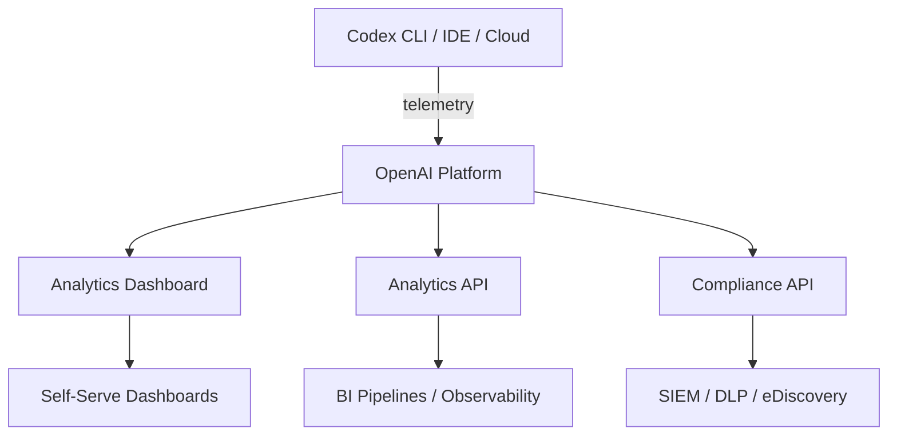
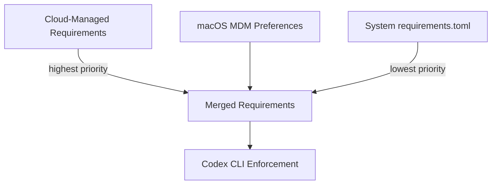
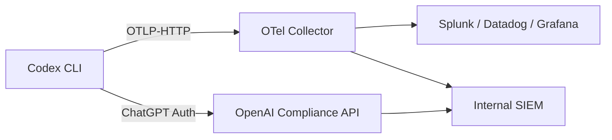

# Codex Enterprise Compliance: Audit Logs, Team Cost Budgets and the Admin Dashboard


Running Codex CLI across a fifty-person engineering department is a different proposition from a solo developer experimenting in a side project. Regulated industries need audit trails, finance teams need cost visibility, and security teams need policy enforcement that developers cannot simply override. This article walks through the enterprise compliance surface that OpenAI has built around Codex — the Compliance API, the Analytics Dashboard, managed configuration via `requirements.toml`, and the cost budget tooling — and shows how they map onto real-world governance requirements.

## The Three Pillars of Codex Governance

OpenAI structures Codex enterprise observability around three complementary tools [^1]:

1. **Analytics Dashboard** — a self-serve web interface for adoption metrics and code review activity.
2. **Analytics API** — a programmatic, cursor-paginated endpoint for feeding data into BI pipelines.
3. **Compliance API** — an export mechanism for detailed conversation logs, designed for integration with eDiscovery, DLP, and SIEM systems.



Most organisations will use all three: the dashboard for quick daily checks, the API for automated reporting, and the Compliance API for audit trails that satisfy external auditors [^1].

## The Compliance API: Audit Logs for Regulated Environments

The Compliance API exports detailed activity logs covering every Codex interaction [^1]. Each log record includes:

- The prompt text sent to Codex and the response generated
- Workspace identifier, user identifier, and timestamp
- Model identifier (e.g. `gpt-5.3-codex`, `gpt-5.3-codex-spark`)
- Token usage and request metadata

Records are retained for up to 30 days for ChatGPT-authenticated usage [^1]. The API uses two primary event types — `CODEX_LOG` and `CODEX_SECURITY_LOG` — which can be filtered when querying [^2].

### What the Compliance API Does Not Include

It deliberately omits lines of code generated, acceptance rates, and code quality metrics [^1]. This is a design decision: the API captures *what was asked and answered*, not *what the developer did with the answer*. For code-level auditing, you would combine Compliance API logs with your existing git history and CI/CD audit trails.

### SIEM Integration Pattern

A typical integration fetches available log files, then downloads and ingests them into your SIEM:

```bash
# List available Codex compliance log files
curl -s https://api.openai.com/v1/compliance/codex/logs \
  -H "Authorization: Bearer $OPENAI_COMPLIANCE_KEY" \
  -H "Content-Type: application/json" | jq '.files[]'

# Download a specific log file for SIEM ingestion
curl -s https://api.openai.com/v1/compliance/codex/logs/{file_id}/content \
  -H "Authorization: Bearer $OPENAI_COMPLIANCE_KEY" > codex_audit.jsonl
```

The Compliance API requires a dedicated API key with specific read/delete permissions, scoped separately from analytics keys [^2].

## OpenAI's Compliance Certifications

Enterprise adoption in regulated industries hinges on platform certifications. As of early 2026, OpenAI maintains [^3][^4]:

- **SOC 2 Type 2** — covering Security, Availability, Confidentiality, and Privacy for the API Platform, ChatGPT Enterprise, ChatGPT Edu, and ChatGPT Team. The most recent report covers January–June 2025.
- **ISO/IEC 27001:2022 and ISO/IEC 27701:2019** — for information security and privacy management systems supporting the API, ChatGPT Enterprise, and ChatGPT Edu.
- **ISO 27017 and 27018** — cloud security and PII protection in public clouds.
- **HIPAA** — supported via a Business Associate Agreement (BAA) available through sales-managed procurement for ChatGPT Enterprise customers [^4].
- **GDPR, CCPA, and FERPA** — supported through Data Processing Addendums [^4].

For Codex specifically, local surfaces (CLI, desktop app, IDE extension) operate with zero data retention — code stays on the developer's machine and is processed within the local sandbox [^2][^5]. Cloud tasks run in isolated containers with encryption at rest (AES-256) and in transit (TLS 1.2+) [^2].

## The Analytics Dashboard and API

The Analytics Dashboard surfaces adoption and impact metrics across all Codex surfaces [^1]:

- **Daily active users** broken down by surface (CLI, IDE, Cloud, Code Review)
- **Code review activity** including PR counts, comment counts, and severity distributions
- **Cloud task metrics** and user engagement trends
- **Session and message counts** per user

Data can be exported as CSV or JSON for offline analysis [^1].

The Analytics API provides the same data programmatically with time-series daily metrics, optional per-user breakdowns, and cursor-based pagination [^1]. Common use cases include engineering observability dashboards, leadership adoption reports, and usage governance monitoring.

API keys for analytics require the `codex.enterprise.analytics.read` scope, which must be requested from OpenAI support [^2].

## Team Cost Budgets and Allocation

Codex pricing operates on a tiered model [^6]:

| Plan | Price | Key Features |
|------|-------|-------------|
| Plus | $20/month | CLI, IDE, web, iOS; GPT-5.4 and GPT-5.3-Codex |
| Pro | $200/month | 6× higher limits; GPT-5.3-Codex-Spark; priority processing |
| Business | Pay as you go | SAML SSO, MFA, workspace controls, larger cloud VMs |
| Enterprise | Custom | SCIM, EKM, RBAC, audit logs, data residency, dedicated support |

Enterprise customers use a credits pool allocated at the organisation level [^6]. Administrators can set spending limits across teams and departments, providing granular budget controls and usage tracking. The Analytics API's per-user breakdowns feed directly into cost attribution, allowing finance teams to charge back Codex usage to individual cost centres.

⚠️ OpenAI does not publicly document the specific API endpoints or UI flows for setting team-level budget caps. The budget management tooling is available within the Enterprise admin console but detailed documentation appears to be gated behind Enterprise onboarding.

## Managed Configuration: `requirements.toml`

The most powerful enterprise control mechanism is `requirements.toml` — a TOML file that enforces security-sensitive settings that individual developers cannot override [^7]. This is the mechanism through which security teams ensure that Codex CLI behaviour is consistent across the entire organisation.

### Core Constraint Fields

```toml
# Restrict approval policies to the two most restrictive modes
allowed_approval_policies = ["untrusted", "on-request"]

# Constrain sandbox to read-only or workspace-write (no full access)
allowed_sandbox_modes = ["read-only", "workspace-write"]

# Allow only cached web search (no live fetching)
allowed_web_search_modes = ["cached"]

# Enforce US data residency
enforce_residency = "us"
```

When a developer's local `config.toml` or CLI flags conflict with a requirement, Codex silently falls back to a compliant value and notifies the user [^7].

### MCP Server Allowlisting

Enterprises can restrict which Model Context Protocol servers are permitted:

```toml
[mcp_servers.internal-docs]
identity = { command = "codex-mcp" }

[mcp_servers.approved-remote]
identity = { url = "https://mcp.internal.example.com" }
```

An MCP server activates only when both its name and identity match an approved entry. An empty `[mcp_servers]` table disables all MCP servers entirely [^7].

### Command Rules

Security teams can forbid or gate specific shell commands:

```toml
[rules]
prefix_rules = [
  { pattern = [{ token = "rm" }], decision = "forbidden", justification = "Use git clean instead" },
  { pattern = [{ token = "git" }, { any_of = ["push", "commit"] }], decision = "prompt", justification = "Require human review for git writes" },
]
```

These rules merge with any `.rules` files in the repository, and the most restrictive decision wins [^7].

### Deployment Methods

Requirements reach developer machines through three channels, applied in precedence order [^7]:



1. **Cloud-managed** — configured at [chatgpt.com/codex/settings/managed-configs](https://chatgpt.com/codex/settings/managed-configs), fetched when the developer authenticates with ChatGPT Business/Enterprise. Admins can assign different policies to different user groups [^7].
2. **macOS MDM** — deployed via Jamf Pro, Fleet, Kandji, or equivalent, using base64-encoded TOML payloads under the `com.openai.codex` domain [^7].
3. **System file** — placed at `/etc/codex/requirements.toml` for Linux/macOS environments.

### Managed Defaults vs Requirements

There is an important distinction between `requirements.toml` (constraints users cannot override) and `managed_config.toml` (defaults users *can* change during a session) [^7]. Managed defaults live at `/etc/codex/managed_config.toml` on Unix systems and provide sensible starting points:

```toml
approval_policy = "on-request"
sandbox_mode = "workspace-write"

[sandbox_workspace_write]
network_access = false

[otel]
environment = "prod"
exporter = "otlp-http"
log_user_prompt = false
```

## OpenTelemetry: The Self-Hosted Audit Trail

For organisations that need audit data within their own infrastructure rather than relying solely on OpenAI's Compliance API, Codex supports opt-in OpenTelemetry (OTel) export [^8]. When enabled, Codex emits structured telemetry covering:

- Conversation metadata and API requests
- User prompts (redacted by default — `log_user_prompt = false`)
- Tool approval decisions and tool execution results
- SSE/WebSocket stream activity

This telemetry feeds into standard OTel collectors, meaning it can flow into Datadog, Grafana, Splunk, or any OTLP-compatible backend without touching OpenAI's infrastructure [^8].



The recommended posture is to keep `log_user_prompt = false` unless your data handling policy explicitly permits storing prompt contents, and to route telemetry only to controlled collectors [^8].

## The Admin Setup Checklist

OpenAI's enterprise documentation defines three prerequisite roles before deployment [^2]:

1. **ChatGPT Enterprise workspace owner** — configures Codex settings, enables surfaces, manages RBAC groups.
2. **Security owner** — determines approval policies, sandbox constraints, and network access rules.
3. **Analytics owner** — integrates the Analytics and Compliance APIs into existing data pipelines.

The recommended rollout pattern is to create a dedicated "Codex Admin" RBAC group via SCIM, keep analytics access limited to trusted administrators, and start with `workspace-write` sandbox mode with approvals enabled before considering broader access [^2].

## Practical Recommendations

For teams evaluating Codex CLI for regulated environments:

- **Start with the Compliance API** — even if you do not need it today, establishing the integration pipeline early means you have audit data from day one.
- **Deploy `requirements.toml` via cloud-managed config** before rolling out to developers — it is far easier to start restrictive and relax than to retrofit constraints.
- **Pin OTel settings in managed config** to prevent developers from accidentally disabling telemetry.
- **Combine Compliance API with git history** for a complete audit picture — the API captures the AI interaction; git captures what was actually committed.
- **Use the Analytics API for cost attribution** — per-user token breakdowns feed directly into FinOps tooling.

## Citations

[^1]: [Governance – Codex | OpenAI Developers](https://developers.openai.com/codex/enterprise/governance)
[^2]: [Admin Setup – Codex | OpenAI Developers](https://developers.openai.com/codex/enterprise/admin-setup)
[^3]: [Security and privacy at OpenAI](https://openai.com/security-and-privacy/)
[^4]: [Enterprise privacy at OpenAI](https://openai.com/enterprise-privacy/)
[^5]: [Agent approvals & security – Codex | OpenAI Developers](https://developers.openai.com/codex/agent-approvals-security)
[^6]: [Pricing – Codex | OpenAI Developers](https://developers.openai.com/codex/pricing)
[^7]: [Managed configuration – Codex | OpenAI Developers](https://developers.openai.com/codex/enterprise/managed-configuration)
[^8]: [Codex CLI Features – OpenAI Developers](https://developers.openai.com/codex/cli/features)
