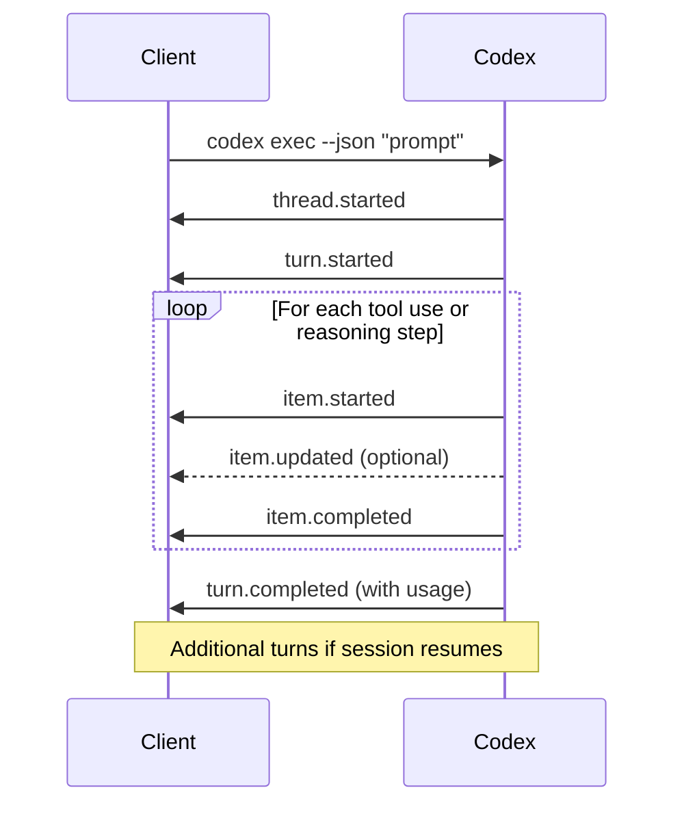

# codex exec JSONL Reference: Every Event Type and the Complete Output Schema


---

The `codex exec` subcommand is the gateway to running Codex CLI in scripts, pipelines, and automation workflows. Pass `--json` and stdout becomes a machine-readable JSONL (newline-delimited JSON) stream — one event per state change, parseable by `jq`, language SDKs, or any line-oriented consumer [^1]. This article is a definitive reference for the event schema, every exec flag, and the patterns that make `codex exec` production-grade.

## The JSONL Event Stream

When you invoke `codex exec --json "your prompt"`, Codex emits a strict sequence of JSON objects to stdout, one per line [^1]. Human-readable progress still flows to stderr, so the two streams remain separable in any shell.

### Event Lifecycle

Every exec run follows a deterministic event ordering:



### Event Types

| Event | Emitted When | Key Fields |
|-------|-------------|------------|
| `thread.started` | Session begins | `thread_id` (UUID) |
| `turn.started` | A new agent turn begins | — |
| `item.started` | A tool call or message begins | `item.id`, `item.type`, `item.status` |
| `item.updated` | Incremental progress on an item | `item.id`, updated fields |
| `item.completed` | A tool call or message finishes | `item.id`, `item.type`, `item.text` or result |
| `turn.completed` | The agent turn finishes | `usage` object |
| `turn.failed` | The turn encountered an error | Error details |
| `error` | Fatal session error | Error message |

### Item Types

The `item.type` field within `item.started` / `item.completed` events classifies the content [^2]:

| Item Type | Description |
|-----------|-------------|
| `agent_message` | The agent's text response |
| `command_execution` | A shell command being run (includes `command` field) |
| `reasoning` | Chain-of-thought when reasoning is enabled |
| `file_change` | A file creation, edit, or deletion |
| `mcp_tool_call` | An MCP server tool invocation |
| `web_search` | A web search action |
| `plan_update` | A plan step being added or updated |

> **⚠️ Schema drift warning:** In earlier versions (pre-v0.44.0), the item type field was named `item_type` and agent messages used the value `assistant_message` rather than `agent_message` [^3]. If you are parsing output from older Codex versions, account for both field names. There is currently no schema version indicator in the event stream.

### Raw JSONL Example

A minimal exec run produces output like this:

```json
{"type":"thread.started","thread_id":"019ce6ce-65fd-7530-8e6b-9ccce0436091"}
{"type":"turn.started"}
{"type":"item.started","item":{"id":"item_0","type":"command_execution","command":"bash -lc ls","status":"in_progress"}}
{"type":"item.completed","item":{"id":"item_0","type":"command_execution","command":"bash -lc ls","status":"completed"}}
{"type":"item.completed","item":{"id":"item_1","type":"agent_message","text":"The repository contains three directories: docs, sdk, and examples."}}
{"type":"turn.completed","usage":{"input_tokens":24763,"cached_input_tokens":24448,"output_tokens":122}}
```

### Token Usage Metadata

The `turn.completed` event always includes a `usage` object [^2]:

| Field | Description |
|-------|-------------|
| `input_tokens` | Total prompt tokens consumed this turn |
| `cached_input_tokens` | Tokens served from the prompt cache |
| `output_tokens` | Completion tokens generated |

Cache hit rates typically exceed 99% for the system prompt on subsequent turns within a session [^2], which is why the `cached_input_tokens` value is usually close to `input_tokens`.

## Reasoning Events

When reasoning is enabled via `model_reasoning_summary=detailed` in your configuration, the JSONL stream includes `reasoning` items before the `agent_message` [^2]. Setting `show_raw_agent_reasoning=true` embeds the full chain-of-thought text directly in the stream:

```json
{"type":"item.completed","item":{"id":"item_0","type":"reasoning","text":"The user wants a list of files. I should run ls to check the directory structure..."}}
{"type":"item.completed","item":{"id":"item_1","type":"agent_message","text":"Here are the files in the repository..."}}
```

This is invaluable for debugging agent behaviour in CI — pipe reasoning events to a separate log file for post-mortem analysis.

## Complete Flags Reference

Every flag accepted by `codex exec` [^4]:

### Core Execution

| Flag | Type | Description |
|------|------|-------------|
| `PROMPT` | string / `-` | Task instruction; use `-` to pipe from stdin |
| `--json` | boolean | Emit JSONL event stream to stdout |
| `-o` / `--output-last-message PATH` | path | Write final agent message to a file |
| `--output-schema PATH` | path | JSON Schema for structured final response |
| `--ephemeral` | boolean | Don't persist session rollout files |

### Automation and Safety

| Flag | Type | Description |
|------|------|-------------|
| `--full-auto` | boolean | `workspace-write` sandbox + `on-request` approvals |
| `-s` / `--sandbox MODE` | enum | `read-only`, `workspace-write`, or `danger-full-access` |
| `--dangerously-bypass-approvals-and-sandbox` / `--yolo` | boolean | No sandbox, no approvals — isolated runners only |

### Workspace Configuration

| Flag | Type | Description |
|------|------|-------------|
| `-C` / `--cd PATH` | path | Set workspace root before execution |
| `--add-dir PATH` | path (repeatable) | Grant write access to additional directories |
| `--skip-git-repo-check` | boolean | Allow running outside a Git repository |

### Model and Configuration

| Flag | Type | Description |
|------|------|-------------|
| `-m` / `--model NAME` | string | Override the configured model |
| `-p` / `--profile NAME` | string | Select a config.toml profile |
| `-c` / `--config KEY=VALUE` | repeatable | Inline configuration override |
| `-i` / `--image PATH` | path (repeatable) | Attach images to the initial message |
| `--color MODE` | enum | `always`, `never`, or `auto` for ANSI output |
| `--oss` | boolean | Use local open-source provider (requires Ollama) |

## Structured Output with `--output-schema`

When your pipeline needs predictable JSON rather than free-text, `--output-schema` constrains the agent's final message to match a JSON Schema [^1]. Combined with `-o`, the validated output lands in a file ready for downstream consumption:

```bash
codex exec "Extract project metadata from the repository" \
  --output-schema ./schema.json \
  -o ./project-metadata.json
```

The schema file follows standard JSON Schema conventions with one requirement inherited from OpenAI's Structured Outputs: every object must include `"additionalProperties": false` [^5]:

```json
{
  "type": "object",
  "properties": {
    "project_name": { "type": "string" },
    "programming_languages": {
      "type": "array",
      "items": { "type": "string" }
    },
    "risk_areas": {
      "type": "array",
      "items": { "type": "string" }
    }
  },
  "required": ["project_name", "programming_languages", "risk_areas"],
  "additionalProperties": false
}
```

When `--json` and `--output-schema` are combined, the schema-constrained response appears as the `text` value inside the final `item.completed` event of type `agent_message` [^2]. The `-o` file receives just the raw text (the JSON string), not the JSONL wrapper.

## Session Resume in Exec Mode

Non-interactive runs support session resumption, letting you chain multi-step workflows across invocations [^1]:

```bash
# First pass: analyse the codebase
codex exec "Review the codebase for race conditions"

# Resume and act on findings
codex exec resume --last "Fix the race conditions you found"

# Or resume a specific session by ID
codex exec resume 019ce6ce-65fd-7530-8e6b-9ccce0436091 "Implement the fixes"
```

Resumed sessions retain the full transcript and plan history, so the agent has complete context from the prior run [^6].

## Code Review Mode

The `/review` command within interactive Codex opens review presets, but `codex exec` can drive reviews non-interactively as well [^6]. The review flow supports three modes:

1. **Against a base branch** — diffs your work against the upstream merge base
2. **Uncommitted changes** — inspects staged and untracked modifications
3. **Custom instructions** — accepts a bespoke review prompt

The recommended model for code review accuracy is `gpt-5.2-codex`, which has received specific training for review tasks [^7].

## CI/CD Authentication

In headless environments, authentication uses the `CODEX_API_KEY` environment variable [^1]:

```bash
CODEX_API_KEY=${{ secrets.OPENAI_API_KEY }} codex exec --json "triage open issues"
```

For GitHub Actions, the recommended approach is to set `CODEX_API_KEY` (or `OPENAI_API_KEY`) as a repository secret and pass it through the `env` block.

## CI Pipeline Patterns

### GitHub Actions: Auto-Fix on CI Failure

A production pattern that watches for CI failures and creates fix PRs automatically [^1]:

```yaml
name: Codex auto-fix on CI failure
on:
  workflow_run:
    workflows: ["CI"]
    types: [completed]
permissions:
  contents: write
  pull-requests: write
jobs:
  auto-fix:
    if: ${{ github.event.workflow_run.conclusion == 'failure' }}
    runs-on: ubuntu-latest
    env:
      OPENAI_API_KEY: ${{ secrets.OPENAI_API_KEY }}
    steps:
      - uses: actions/checkout@v4
        with:
          ref: ${{ github.event.workflow_run.head_sha }}
          fetch-depth: 0
      - uses: actions/setup-node@v4
        with:
          node-version: "20"
      - run: npm i -g @openai/codex
      - run: |
          codex exec --full-auto --sandbox workspace-write \
            "Run the test suite, identify the minimal fix, implement it."
      - run: npm test --silent
      - uses: peter-evans/create-pull-request@v6
        if: success()
        with:
          branch: codex/auto-fix-${{ github.event.workflow_run.run_id }}
          title: "Auto-fix failing CI via Codex"
```

### GitLab CI: Structured Report Extraction

For GitLab pipelines, a marker-based extraction pattern works well when you need CodeClimate-compliant output [^8]:

```bash
codex exec --full-auto \
  "Analyse the codebase for quality issues. OUTPUT MUST BE A SINGLE JSON ARRAY in CodeClimate format." \
  2>/dev/null | tee output.log

# Extract structured content between markers
sed -E 's/\x1B\[[0-9;]*[A-Za-z]//g' output.log | awk '
  /=== BEGIN_CODE_QUALITY_JSON ===/ {grab=1; next}
  /=== END_CODE_QUALITY_JSON ===/   {grab=0}
  grab
' > report.json
```

### Parsing JSONL in Scripts

Process the event stream with `jq` to extract specific data:

```bash
# Extract only the final agent message
codex exec --json "summarise the repo" 2>/dev/null \
  | jq -r 'select(.type == "item.completed" and .item.type == "agent_message") | .item.text'

# Sum total tokens across all turns
codex exec --json "refactor the auth module" 2>/dev/null \
  | jq -s '[.[] | select(.type == "turn.completed") | .usage.input_tokens] | add'

# Extract all commands executed
codex exec --json "fix the tests" 2>/dev/null \
  | jq -r 'select(.type == "item.started" and .item.type == "command_execution") | .item.command'
```

## The Schema Stability Problem

The JSONL output format currently functions as an implicit contract with no versioning mechanism [^3]. Field names have changed between versions (notably `item_type` → `type` and `assistant_message` → `agent_message`), and there is no version indicator in the stream to help consumers detect which schema they are parsing.

The community has proposed three mitigations [^3]:

1. **Formal JSON Schema document** — a published schema kept in sync with the codebase
2. **CI-enforced conformance testing** — automated tests validating output against the schema
3. **Schema versioning** — a version field in events, with backward compatibility guarantees

Until these land, defensive parsing is essential: check for both old and new field names, validate structure before assuming shape, and pin your Codex CLI version in CI lockfiles.

## Citations

[^1]: [Non-interactive mode – Codex | OpenAI Developers](https://developers.openai.com/codex/noninteractive)

[^2]: [Codex CLI exec mode experiments: 81 flag/feature tests with raw outputs – Alex Fazio](https://gist.github.com/alexfazio/359c17d84cb6a5af12bac88fa1db9770)

[^3]: [JSON output mode docs are out of date – GitHub Issue #4776](https://github.com/openai/codex/issues/4776)

[^4]: [Command line options – Codex CLI | OpenAI Developers](https://developers.openai.com/codex/cli/reference)

[^5]: [Structured model outputs | OpenAI API](https://platform.openai.com/docs/guides/structured-outputs)

[^6]: [Features – Codex CLI | OpenAI Developers](https://developers.openai.com/codex/cli/features)

[^7]: [Build Code Review with the Codex SDK | OpenAI Cookbook](https://developers.openai.com/cookbook/examples/codex/build_code_review_with_codex_sdk)

[^8]: [Automating Code Quality and Security Fixes with Codex CLI on GitLab | OpenAI Cookbook](https://developers.openai.com/cookbook/examples/codex/secure_quality_gitlab)
