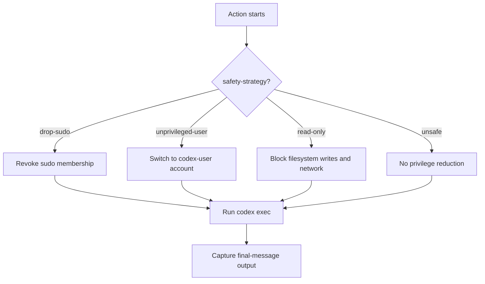
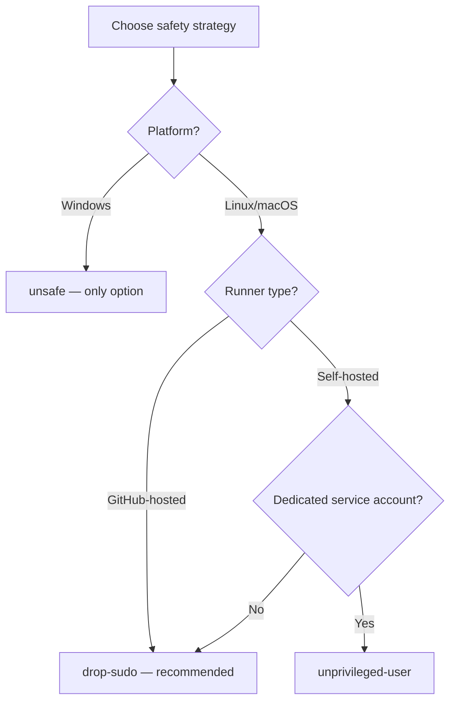

# The Official Codex GitHub Action: Inputs, Outputs and Safe Use on Fork PRs


---

The `openai/codex-action@v1` GitHub Action brings Codex's agentic capabilities into your CI/CD pipelines without requiring manual CLI installation or proxy configuration[^1]. It handles installing the Codex CLI, starting a secure Responses API proxy when you provide an API key, and running `codex exec` under configurable privilege restrictions[^2]. This article is a deep reference covering every input, the single output, each safety strategy, and — critically — patterns for safe use on fork pull requests.

## Why a Dedicated Action?

Running `codex exec` manually in a workflow step works, but the official action solves several operational headaches: it pins CLI versions reproducibly, manages the Responses API proxy lifecycle, enforces privilege reduction before Codex touches your code, and gates execution behind access-control checks[^1]. Think of it as the hardened wrapper you'd eventually build yourself.

## Input Parameters

The action exposes a rich set of inputs. Here is the complete reference as of April 2026[^1][^2]:

### Prompt Configuration

| Input | Description | Default |
|-------|-------------|---------|
| `prompt` | Inline prompt text for the task | `""` |
| `prompt-file` | Path to a file containing the prompt | `""` |

You must provide exactly one of `prompt` or `prompt-file` — setting both causes a validation error[^2].

### Authentication

| Input | Description | Default |
|-------|-------------|---------|
| `openai-api-key` | Secret for the Responses API proxy (OpenAI or Azure) | `""` |
| `responses-api-endpoint` | Override endpoint URL (e.g. Azure OpenAI, must include `/v1/responses` suffix) | `""` |

### Execution Control

| Input | Description | Default |
|-------|-------------|---------|
| `sandbox` | Sandbox mode: `workspace-write`, `read-only`, or `danger-full-access` | `""` (CLI default) |
| `model` | Model for the agent (leave empty for Codex default, currently `gpt-5.4`)[^3] | `""` |
| `effort` | Reasoning effort level | `""` |
| `codex-args` | Extra CLI flags as JSON array or shell string | `""` |
| `codex-version` | Pin a specific `@openai/codex` release | `""` (latest) |
| `codex-home` | Shared Codex home directory for config and MCP setups | `""` |
| `working-directory` | Passed to `codex exec --cd` | `""` |

### Output Capture

| Input | Description | Default |
|-------|-------------|---------|
| `output-file` | Write the final Codex message to this path | `""` |
| `output-schema` | Inline JSON Schema for structured output | `""` |
| `output-schema-file` | Path to a JSON Schema file | `""` |

### Safety and Access Control

| Input | Description | Default |
|-------|-------------|---------|
| `safety-strategy` | Privilege restriction method | `drop-sudo` |
| `codex-user` | Username for `unprivileged-user` strategy | `""` |
| `allow-users` | Additional GitHub usernames permitted to trigger | `""` |
| `allow-bots` | Allow bot accounts to bypass the write-access check | `false` |

## The Single Output

The action exposes one output[^1]:

```yaml
- name: Run Codex
  id: codex
  uses: openai/codex-action@v1
  with:
    openai-api-key: ${{ secrets.OPENAI_API_KEY }}
    prompt: "Review this PR for security issues"

- name: Use the result
  run: echo "${{ steps.codex.outputs.final-message }}"
```

`final-message` contains the last message from `codex exec`. Pair it with `output-file` if you need the full transcript as a build artifact.

## Safety Strategies in Depth

The `safety-strategy` input is the most consequential setting in the action. It controls what privileges Codex retains during execution[^1][^2].



### `drop-sudo` (Default)

Removes the runner user's sudo group membership before invoking Codex[^2]. This is **irreversible for the remainder of the job** — subsequent steps in the same job also lose sudo. On GitHub-hosted Linux runners, the action additionally enables unprivileged user namespaces and clears AppArmor gates[^1].

This is the recommended strategy for most workflows on GitHub-hosted runners.

### `unprivileged-user`

Runs Codex as a dedicated low-privilege account specified via `codex-user`[^2]. Useful on self-hosted runners where you have pre-created service accounts. You may need to fix file ownership on the checkout directory before invoking the action:

```yaml
- uses: actions/checkout@v5
- run: chown -R codex-agent:codex-agent .
- uses: openai/codex-action@v1
  with:
    safety-strategy: unprivileged-user
    codex-user: codex-agent
    openai-api-key: ${{ secrets.OPENAI_API_KEY }}
    prompt: "Fix the failing tests"
```

### `read-only`

Prevents Codex from mutating the filesystem or accessing the network directly[^2]. The API key still flows through the proxy, and — importantly — it remains accessible to process memory inspection. This strategy is therefore **not sufficient on its own** if the runner user retains sudo; an attacker prompt could read `/proc/self/environ` with elevated privileges[^2].

### `unsafe`

No privilege reduction at all. **Required on Windows runners**, where the Linux-specific privilege mechanisms are unavailable[^1]. Use only with fully trusted prompts in controlled environments.

### Strategy Selection Guide



## Safe Use on Fork Pull Requests

Fork PRs are the most dangerous trigger context for any action that holds secrets. By default, `openai/codex-action` enforces that only users with **write access** to the repository can trigger it[^1]. This is the first line of defence.

### The `allow-users` and `allow-bots` Controls

You can expand the trusted set:

```yaml
- uses: openai/codex-action@v1
  with:
    allow-users: "trusted-contributor-1,trusted-contributor-2"
    allow-bots: true
```

**Never set `allow-users: "*"`** — this opens your API key to abuse from any contributor[^2]. Treat the allow-list as a security boundary.

### The `workflow_run` Pattern

The safest approach for fork PRs uses a two-workflow pattern. The first workflow runs on `pull_request` (with read-only `GITHUB_TOKEN` and no secrets). The second triggers on `workflow_run` completion, runs in the context of the base branch, and has access to secrets[^4]:

```yaml
# .github/workflows/codex-review.yml
name: Codex Review

on:
  workflow_run:
    workflows: ["CI"]
    types: [completed]

permissions:
  contents: read
  pull-requests: write

jobs:
  review:
    if: ${{ github.event.workflow_run.conclusion == 'failure' }}
    runs-on: ubuntu-latest
    steps:
      - name: Checkout failing ref
        uses: actions/checkout@v5
        with:
          ref: ${{ github.event.workflow_run.head_sha }}

      - name: Run Codex
        id: codex
        uses: openai/codex-action@v1
        with:
          openai-api-key: ${{ secrets.OPENAI_API_KEY }}
          prompt: "Identify minimal changes to make the failing tests pass"
          sandbox: workspace-write
          safety-strategy: drop-sudo

      - name: Create fix PR
        uses: peter-evans/create-pull-request@v6
        with:
          title: "fix: auto-fix CI failure"
          body: ${{ steps.codex.outputs.final-message }}
```

This pattern ensures fork contributors never have direct access to `OPENAI_API_KEY` while still enabling automated fixes[^4][^5].

## GITHUB_TOKEN Scope Minimisation

Always apply the principle of least privilege to `GITHUB_TOKEN` permissions[^6]:

```yaml
permissions:
  contents: read        # Read repo contents only
  pull-requests: write  # Post review comments
```

For read-only review workflows, you can drop `contents` to `read` entirely. Only grant `contents: write` if Codex needs to push commits (e.g. the auto-fix pattern above)[^4].

## Comparing codex-action with Codex Cloud

Both run Codex remotely, but they serve different use cases:

| Aspect | codex-action | Codex Cloud |
|--------|-------------|-------------|
| **Trigger** | GitHub Events (PR, push, workflow_run) | CLI dispatch or Slack `@Codex` |
| **Execution** | GitHub-hosted or self-hosted runner | OpenAI-managed sandbox |
| **Internet** | Full network by default | Off by default, domain allowlist |
| **Review flow** | PR-based (standard GitHub flow) | `codex diff` / `codex apply` |
| **Cost model** | Your runner minutes + API tokens | OpenAI cloud pricing + API tokens |

Use the action for event-driven automation tightly integrated with GitHub. Use Cloud for ad-hoc tasks dispatched from your terminal or Slack[^1].

## Practical Tips

1. **Store prompts in `.github/codex/prompts/`** for version-controlled, reviewable instructions rather than inline strings[^2].
2. **Pin `codex-version`** in production workflows to avoid unexpected behaviour from CLI updates.
3. **Use `output-schema`** when downstream steps need structured JSON — it validates the response against your schema before surfacing it[^1].
4. **Rotate API keys immediately** if you suspect exposure, particularly after experimenting with `unsafe` or `allow-users` configurations[^2].
5. **Run `codex-action` as the final step** in a job to isolate any state changes it makes from prior steps.

## Citations

[^1]: [GitHub - openai/codex-action](https://github.com/openai/codex-action) — Official repository and README.

[^2]: [GitHub Action – Codex | OpenAI Developers](https://developers.openai.com/codex/github-action) — Official documentation page.

[^3]: [Models – Codex | OpenAI Developers](https://developers.openai.com/codex/models) — Current model availability and defaults.

[^4]: [Use Codex CLI to automatically fix CI failures | OpenAI Cookbook](https://developers.openai.com/cookbook/examples/codex/autofix-github-actions) — Auto-fix workflow pattern.

[^5]: [Non-interactive mode – Codex | OpenAI Developers](https://developers.openai.com/codex/guides/autofix-ci/) — `codex exec` reference and CI patterns.

[^6]: [Secure use reference - GitHub Docs](https://docs.github.com/en/actions/reference/security/secure-use) — GitHub Actions security best practices.
