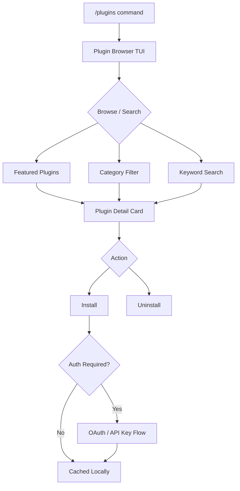
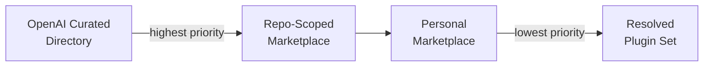
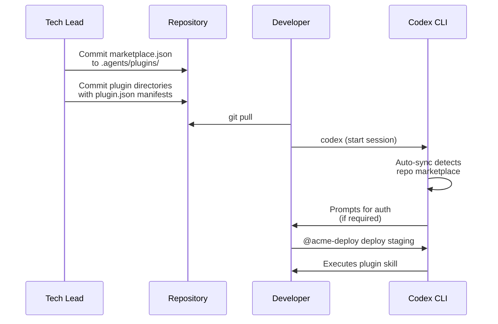

# Codex Plugin Discovery: @Mentions, the In-TUI Browser and Marketplace Navigation


---

On 26 March 2026, Codex v0.117.0 shipped plugins as a first-class workflow[^1]. Skills, MCP server configurations and third-party app integrations — previously scattered across dotfiles and ad-hoc scripts — now ship as installable bundles that Codex can discover, install and surface inside a session. More than twenty launch partners (Slack, Figma, Notion, Sentry and others) published on day one[^2]. This article walks through the discovery and interaction model: how you find plugins, how you invoke them, and how the marketplace hierarchy works under the hood.

## Plugin Anatomy (Refresher)

A plugin is a directory with a required `.codex-plugin/plugin.json` manifest[^3]. Everything else is optional:

```
my-plugin/
├── .codex-plugin/
│   └── plugin.json        # required manifest
├── skills/
│   └── review-pr/
│       └── SKILL.md       # natural-language instructions
├── .app.json              # app / connector mappings
├── .mcp.json              # MCP server definitions
└── assets/                # icons, screenshots
```

The manifest declares three component types[^3]:

| Component | Purpose | Reference field |
|-----------|---------|-----------------|
| **Skills** | Reusable prompt-based instructions | `"skills"` |
| **Apps** | OAuth/API connectors (GitHub, Slack, etc.) | `"apps"` → `.app.json` |
| **MCP Servers** | External tool providers | `"mcpServers"` → `.mcp.json` |

A minimal `plugin.json`:

```json
{
  "name": "my-plugin",
  "version": "0.1.0",
  "description": "A brief summary of what this plugin does",
  "skills": ["./skills"],
  "mcpServers": "./.mcp.json",
  "apps": "./.app.json",
  "interface": {
    "displayName": "My Plugin",
    "shortDescription": "One-liner for the browser",
    "category": "Productivity",
    "capabilities": ["Read", "Write"]
  }
}
```

## Three Ways to Invoke a Plugin

Once a plugin is installed, Codex exposes it through three interaction patterns[^4]:

### 1. @Mention — Explicit Invocation

Type `@plugin-name` (or `@plugin-name/skill-name`) directly in your prompt. This is the precision tool: mentioning a plugin causes its full context — capabilities, tools, configuration — to be injected into the model's context window automatically[^4]. No need to describe what the plugin does; the agent already knows.

```
@gmail Summarise unread threads from the last 24 hours
@sentry List unresolved errors in the payments service tagged critical
@figma Export the onboarding-flow frame as SVG
```

Version 0.117.0 fixed cases where explicit mentions lost context during multi-turn conversations[^1]. If you notice a plugin "forgetting" mid-session, ensure you are running at least v0.117.0.

### 2. Natural Language — Implicit Discovery

Simply describe what you want. If an installed plugin matches, Codex selects the appropriate tools without an explicit mention:

```
Summarise my unread emails from today
```

Codex maps this to the Gmail plugin if installed. This works because the model is made aware of all enabled plugins at session start[^1].

### 3. /plugins — The In-TUI Browser

The `/plugins` command opens an interactive browser inside the terminal[^1]. From here you can:

- Browse featured and categorised plugins
- Search by keyword
- View plugin detail cards (description, capabilities, screenshots)
- Install or uninstall with a single action
- Trigger authentication flows (OAuth, API key) during install



## Marketplace Hierarchy

Not all plugins come from the same place. Codex reads plugin catalogues in a strict priority order[^5][^3]:



### 1. OpenAI Curated Directory

The official directory, maintained by OpenAI, hosts vetted plugins from launch partners[^2]. These appear in the `/plugins` browser under "Featured". The directory is fetched at startup and cached locally.

### 2. Repo-Scoped Marketplace

A `marketplace.json` at `$REPO_ROOT/.agents/plugins/marketplace.json` scopes plugins to a specific repository[^3]. This is the team distribution channel — commit a marketplace manifest and every collaborator gets the same plugin set:

```json
{
  "name": "acme-internal",
  "interface": {
    "displayName": "Acme Engineering Plugins"
  },
  "plugins": [
    {
      "name": "acme-deploy",
      "source": {
        "source": "local",
        "path": "./plugins/acme-deploy"
      },
      "policy": {
        "installation": "AVAILABLE",
        "authentication": "ON_INSTALL"
      },
      "category": "DevOps"
    }
  ]
}
```

### 3. Personal Marketplace

`~/.agents/plugins/marketplace.json` holds plugins scoped to a single developer[^3]. Use this for personal workflow automation or plugins under development.

When a plugin name appears in multiple marketplaces, the highest-priority source wins. This means an organisation can override a curated plugin with a repo-scoped fork if needed.

## Product-Scoped Auto-Sync

Starting with v0.117.0, Codex syncs product-scoped plugins at startup[^1]. The `PluginsManager` performs three steps during session initialisation[^5]:

1. **Resolution** — reads each `marketplace.json` via `resolve_marketplace_plugin` to locate plugin sources
2. **Validation** — checks `MarketplacePluginPolicy` to ensure the plugin is available for the current product surface (CLI, Desktop, VS Code)
3. **Persistence** — installs or updates files into the local `plugins/cache/` directory via `PluginStore`

After sync, `LoadedPlugin` objects are injected into the session. Skills become natural-language instructions, MCP servers register with `McpConnectionManager`, and app connectors enable remote tools[^5].

## Plugin Configuration in config.toml

Individual plugins can be toggled without uninstalling them[^4]:

```toml
[plugins."gmail@openai-curated"]
enabled = false

[plugins."acme-deploy@acme-internal"]
enabled = true
```

The key format is `"plugin-name@marketplace-name"`. Setting `enabled = false` prevents the plugin from loading at session start without removing it from cache.

## Security and Approval Model

Plugin-provided MCP tools default to requiring user approval on each call unless explicitly configured otherwise[^5]. The approval system offers three granularity levels:

- **Single call** — approve once, for this invocation only
- **Session** — approve for the remainder of the current session
- **Persistent** — remember the decision across sessions

The `connectors::app_tool_policy` function determines whether a tool is enabled and what approval level applies[^5]. If an MCP server requires OAuth or API keys, Codex triggers an `McpServerElicitationRequest` — the authentication prompt you see during install or first use[^5].

## CLI Management Commands

Beyond the TUI browser, plugins can be managed from the command line[^6]:

```bash
# Install from the curated directory
codex plugin install @openai/build-web-apps

# Install a local plugin for testing
codex plugin install ./path/to/plugin --local

# List installed plugins
codex plugin list

# Scaffold a new plugin
codex plugin create my-plugin
```

The built-in `@plugin-creator` skill can also scaffold a plugin interactively, generating the `plugin.json` manifest and directory structure[^3].

## Known Issues

At the time of writing, a Cloudflare challenge intermittently blocks the featured-plugins API endpoint from the Desktop app, preventing the marketplace from populating[^7]. The CLI's `/plugins` browser is unaffected when fetching from repo-scoped or personal marketplaces. If you hit a 403 on the curated directory, check the GitHub issue tracker for status updates.

⚠️ Self-serve publishing to the OpenAI curated directory is not yet available — the documentation states it is "coming soon"[^3].

## Practical Workflow: Onboarding a Team

Putting this together, here is a typical flow for rolling out plugins to an engineering team:



1. The tech lead commits a `marketplace.json` and plugin directories to the repo
2. Developers pull and start a Codex session — auto-sync picks up the repo marketplace
3. Authentication prompts fire on first use
4. Developers invoke plugins via `@mention` or natural language

No manual install steps, no Slack messages explaining where to find the config file. The repo is the source of truth.

## Summary

The plugin discovery model in v0.117.0 is built around three layers: the curated directory for vetted integrations, repo-scoped marketplaces for team-specific tooling, and personal marketplaces for individual workflows. The `@mention` syntax gives precise control, `/plugins` provides visual browsing, and auto-sync ensures everyone on a team runs the same plugin set. The main gap remains self-serve publishing — until that ships, custom plugins are distributed through marketplace manifests committed to repositories or personal directories.

## Citations

[^1]: OpenAI, "Codex Changelog — v0.117.0 (2026-03-26)," *OpenAI Developers*, [https://developers.openai.com/codex/changelog](https://developers.openai.com/codex/changelog)

[^2]: WinBuzzer, "OpenAI Launches Plugin Marketplace for Codex with Enterprise Controls," 31 March 2026, [https://winbuzzer.com/2026/03/31/openai-launches-plugin-marketplace-codex-enterprise-controls-xcxwbn/](https://winbuzzer.com/2026/03/31/openai-launches-plugin-marketplace-codex-enterprise-controls-xcxwbn/)

[^3]: OpenAI, "Build plugins – Codex," *OpenAI Developers*, [https://developers.openai.com/codex/plugins/build](https://developers.openai.com/codex/plugins/build)

[^4]: OpenAI, "Plugins – Codex," *OpenAI Developers*, [https://developers.openai.com/codex/plugins](https://developers.openai.com/codex/plugins)

[^5]: DeepWiki, "Plugins System | openai/codex," [https://deepwiki.com/openai/codex/5.11-plugins-system](https://deepwiki.com/openai/codex/5.11-plugins-system)

[^6]: BSWEN, "What Are OpenAI Codex Plugins and How Do They Work?," 27 March 2026, [https://docs.bswen.com/blog/2026-03-27-what-are-openai-codex-plugins/](https://docs.bswen.com/blog/2026-03-27-what-are-openai-codex-plugins/)

[^7]: GitHub, "Codex desktop plugin marketplace unreachable — Cloudflare challenge blocks plugins/featured API, preventing new plugin installs · Issue #16808," [https://github.com/openai/codex/issues/16808](https://github.com/openai/codex/issues/16808)
