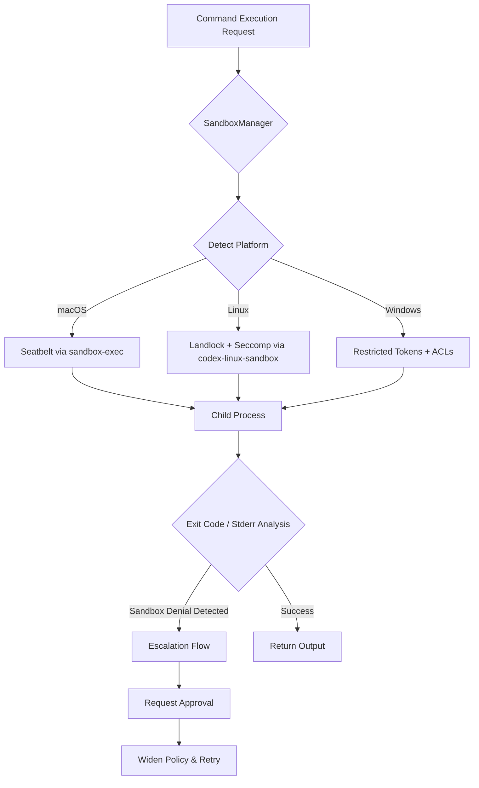
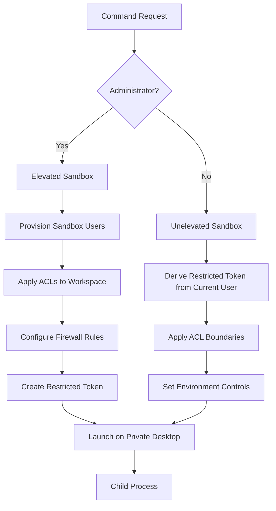

# Inside the Codex Sandbox: Platform-Specific Implementation on macOS, Linux and Windows


---

Codex CLI's sandbox is not a single mechanism — it is three distinct OS-native enforcement layers unified behind one policy abstraction. Understanding what actually happens at the kernel level when you run a command in `workspace-write` mode is essential for debugging failures, auditing security boundaries, and making informed decisions about when `danger-full-access` is genuinely necessary. This article dissects the implementation on each platform.

## The Unified Policy Layer

Every command Codex executes passes through a centralised routing system in `exec.rs`[^1]. A `SandboxPolicy` struct specifies writable roots, network access level, and constraint flags. The `SandboxManager` then translates this abstract policy into platform-specific enforcement before spawning the child process[^2].

Four policy variants drive the system[^3]:

| Mode | Filesystem | Network |
|------|-----------|---------|
| `read-only` | No writes anywhere | Disabled |
| `workspace-write` | Writes to CWD + configured roots | Disabled by default |
| `external-sandbox` | No local enforcement | Assumes containerisation |
| `danger-full-access` | Unrestricted | Unrestricted |

Sandboxing is **opt-out, not opt-in** — the default path always applies enforcement[^1]. The `external-sandbox` mode exists for CI environments where an outer container (Docker, Firecracker) already provides isolation.



## macOS: Seatbelt Profiles

On macOS, Codex leverages Apple's built-in Seatbelt framework through `/usr/bin/sandbox-exec`[^4]. The core logic lives in `codex-rs/core/src/seatbelt.rs` and `codex-rs/sandboxing/src/seatbelt.rs`, with base policies defined in `seatbelt_base_policy.sbpl` and network rules in `seatbelt_network_policy.sbpl`[^3].

### How It Works

The function `spawn_command_under_seatbelt` dynamically generates a Sandbox Profile Language (SBPL) script based on the active policy[^4]. SBPL operates on a **default-deny** model — the generated profile explicitly allows PTYs, basic system calls, and safe sysctls, then injects rules for writable roots[^3].

A critical detail: `.git` and `.codex` directories within writable roots are carved out as **read-only subpaths**, preventing the agent from corrupting git history or its own configuration[^4]. The environment variable `CODEX_SANDBOX=seatbelt` is set during execution to allow child processes to detect sandboxed operation[^4].

### Network Control

Network access is a binary choice in the Seatbelt implementation. When disabled, the profile simply omits network permissions, relying on Seatbelt's default-deny behaviour[^1]. When a `NetworkProxy` is configured, the profile permits loopback traffic to specific proxy ports whilst blocking all other external connections[^4].

### Recent Changes

In v0.117.0, the macOS sandbox builders were consolidated into a unified module (`#15593`), and in v0.118.0, extension profiles were removed as part of a permissions cleanup (`#15918`)[^5].

### Debugging

```bash
codex debug seatbelt -- ls /tmp
```

This runs an arbitrary command through the Seatbelt sandbox, implemented in `codex-rs/cli/src/debug_sandbox.rs`[^4]. Useful for verifying that a specific tool or script will pass enforcement before running it in a real session.

## Linux: Landlock LSM + Seccomp-BPF

The Linux implementation combines two kernel security mechanisms through the `codex-linux-sandbox` helper binary[^1]. This separate process parses a serialised policy, applies restrictions to the current thread, then calls `execvp` to spawn the target command[^3].

### Filesystem Restrictions with Landlock

Landlock (available from kernel 5.13) provides capability-based filesystem access control without requiring root privileges[^6]. The implementation in `codex-rs/linux-sandbox/src/landlock.rs` grants **read access universally** but restricts write operations to explicitly whitelisted directories plus `/dev/null`[^3].

Before applying restrictions, the process calls `prctl(PR_SET_NO_NEW_PRIVS)` to ensure that neither the sandboxed process nor any of its children can gain additional privileges[^4]. A `use_legacy_landlock` flag is maintained for compatibility with older kernels that support earlier Landlock ABI versions[^4].

### Syscall Filtering with Seccomp-BPF

Where Landlock handles filesystem isolation, seccomp-BPF handles network isolation. The filter blocks outbound network syscalls including `connect`, `accept`, `bind`, `listen`, `sendto`, and `sendmsg`[^3]. Crucially, `AF_UNIX` sockets are exempted to preserve local inter-process communication — without this, basic shell operations would break[^1].

### Bubblewrap Integration

On distributions where Landlock is unavailable or insufficient, Codex falls back to Bubblewrap (`bwrap`) for filesystem namespacing[^7]. The system looks for `bwrap` at `/usr/bin/bwrap`; a missing installation triggers startup warnings. On AppArmor-restricted distributions (e.g., Ubuntu 24.04+), you may need:

```bash
sudo sysctl -w kernel.apparmor_restrict_unprivileged_userns=0
```

In v0.118.0, bubblewrap discovery was improved to work reliably on standard multi-entry `PATH` configurations (`#15791`, `#15973`), and compatibility with older `bubblewrap` versions on legacy distributions was enhanced (`#15693`)[^5].

### The /dev Filesystem Fix (v0.105.0)

Prior to v0.105.0, sandboxed commands on Linux lacked access to device nodes, causing failures in tools that expected `/dev/tty`, `/dev/urandom`, or other standard devices[^8]. The fix provisions a minimal `/dev` filesystem inside the sandbox, dramatically improving compatibility with common development tools.

### The Zsh-Fork Bypass Fix (v0.106.0)

A significant security fix in v0.106.0 addressed a code path where zsh's fork-based execution could reconstruct command invocation without preserving sandbox wrappers[^8]. This meant that in `workspace-write` mode, certain zsh fork paths could bypass expected filesystem restrictions — a gap that was closed by ensuring sandbox wrappers are preserved across all shell execution paths (`#12800`)[^9].

### Debugging

```bash
codex debug landlock -- cat /etc/passwd
```

### Sandbox Refactoring (v0.117.0)

The v0.117.0 release extracted Landlock helpers into a dedicated sandboxing module (`#15592`), centralised policy transformations (`#15599`), and unified the sandbox manager (`#15603`)[^5]. Cross-platform `PATH` construction was also fixed to use `OsString` instead of `String` (`#15360`)[^5].

## Windows: Restricted Tokens, ACLs and Firewall Rules

The Windows implementation, managed by the `codex-rs/windows-sandbox-rs` crate, is architecturally the most complex of the three platforms[^4].

### User Provisioning

Codex creates two dedicated local sandbox users[^4]:

- **`CodexSandboxOffline`** — for tools without network access
- **`CodexSandboxOnline`** — for network-enabled tools

The `run_setup_refresh` orchestrator in `setup_orchestrator.rs` manages user creation, ACL assignment, and firewall configuration[^4].

### Elevated vs Unelevated Sandbox

**Elevated sandbox** (preferred): Uses dedicated lower-privilege sandbox users, filesystem permission boundaries via ACLs, Windows Firewall rules for network control, and local policy changes. Requires administrator privileges[^10].

**Unelevated sandbox** (fallback): Runs commands with a restricted Windows token derived from the current user, applies ACL-based filesystem boundaries, and uses environment-level offline controls (`CODEX_SANDBOX_NETWORK_DISABLED=1`) instead of firewall rules[^10].

Both modes employ a **private desktop** for UI isolation[^10].

### Execution Flow

Commands are launched via `create_process_as_user` with a restricted token. The token is created by taking the sandbox user's token and stripping sensitive privileges or adding restricting SIDs[^4]. The code path through `token.rs`, `identity.rs`, and `process.rs` handles token creation, user identity management, and process spawning respectively.



### Network Isolation

Network blocking on Windows has historically been environment-based rather than kernel-level[^3]. However, v0.118.0 introduced OS-level egress rules for proxy-only networking (`#12220`), moving towards parity with the kernel-level enforcement on macOS and Linux[^5].

### Platform Requirements

Windows 11 is recommended; Windows 10 requires full updates with ConPTY support[^10]. Common setup failures stem from UAC denial, blocked user/group creation, or firewall rule restrictions — typically requiring IT team intervention for the necessary logon rights[^10].

## Sandbox Denial Detection and Escalation

When a sandboxed command fails, Codex employs heuristic detection through `is_likely_sandbox_denied`, which analyses both stderr output and exit codes[^4]. The escalation workflow proceeds through three stages:

1. `ToolRuntime` detects failure via exit status or output patterns
2. `escalate_on_failure()` determines whether to request wider permissions
3. The approval system (Guardian subagent or user prompt) authorises a `SandboxOverride`
4. Policy widens: `ReadOnly` → `WorkspaceWrite` → `DangerFullAccess`

This is a heuristic system — sandbox denial detection relies on pattern matching rather than structured error codes[^3]. False negatives are possible, particularly with tools that silently fail when writes are blocked.

## Platform Comparison Matrix

| Capability | macOS (Seatbelt) | Linux (Landlock + Seccomp) | Windows (Tokens + ACLs) |
|-----------|-------------------|---------------------------|------------------------|
| Filesystem enforcement | Kernel (SBPL) | Kernel (Landlock LSM) | User-space (ACLs) |
| Network enforcement | Kernel (SBPL) | Kernel (Seccomp-BPF) | Firewall / Environment |
| Requires root/admin | No | No | Elevated mode: Yes |
| Read restriction | Full disk read | Full disk read | Full disk read |
| Write granularity | Per-path with subpath carveouts | Per-path | Per-path via ACLs |
| Debug command | `codex debug seatbelt` | `codex debug landlock` | `codex debug windows-sandbox` |
| Setup required | None | `bubblewrap` on some distros | User provisioning + policies |

## Key Limitations

Across all platforms, read access **cannot be restricted** — sandboxed processes always have full disk read[^3]. This is a deliberate design choice: most development tools require broad read access, and restricting it would break too many workflows. The security model focuses on preventing unwanted writes and network access rather than information exfiltration.

External-sandbox mode disables all local enforcement entirely[^3], which is appropriate only when a container runtime provides equivalent guarantees.

## Citations

[^1]: [A deep dive on agent sandboxes — Pierce Freeman](https://pierce.dev/notes/a-deep-dive-on-agent-sandboxes)

[^2]: [Sandboxing Implementation — DeepWiki](https://deepwiki.com/openai/codex/5.6-sandboxing-implementation)

[^3]: [Codex sandboxing technical analysis — GitHub Gist (rtzll)](https://gist.github.com/rtzll/8ec03ad8a4cca3ae43ce3db7eb7dcc09)

[^4]: [Sandboxing Implementation — DeepWiki (code paths and architecture)](https://deepwiki.com/openai/codex/5.6-sandboxing-implementation)

[^5]: [Changelog — Codex Developers](https://developers.openai.com/codex/changelog)

[^6]: [Landlock LSM — Linux Kernel documentation](https://docs.kernel.org/security/landlock.html)

[^7]: [Sandboxing — Codex Developers (official docs)](https://developers.openai.com/codex/concepts/sandboxing)

[^8]: [Release 0.106.0 — openai/codex GitHub](https://github.com/openai/codex/releases/tag/rust-v0.106.0)

[^9]: [PR #12800: Fix sandbox envelope for zsh fork execution — openai/codex](https://github.com/openai/codex/pull/12800)

[^10]: [Windows — Codex Developers (official docs)](https://developers.openai.com/codex/windows)
