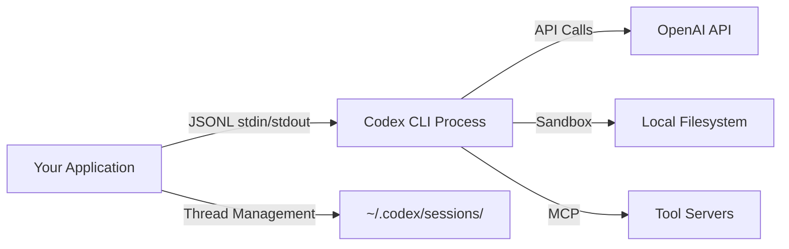
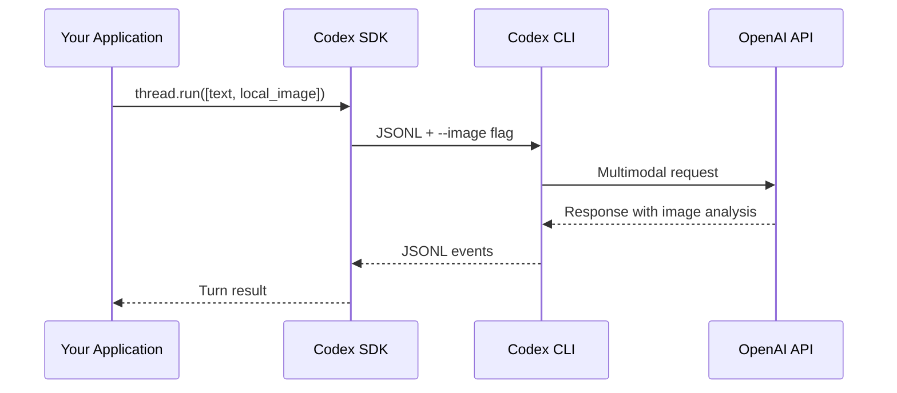

# Codex TypeScript SDK: Streaming, Multimodal Inputs and Per-Thread Configuration


---

The Codex TypeScript SDK (`@openai/codex-sdk`) transforms Codex CLI from an interactive terminal tool into an embeddable agent runtime [^1]. It spawns the Rust-native CLI as a child process, communicating over JSONL via stdin/stdout [^2], and exposes a clean async API for thread management, streaming events, multimodal inputs and structured output validation. This article covers the advanced features that make the SDK suitable for production agent orchestration, CI/CD integration and custom tooling.

## Architecture and Installation

The SDK is a thin wrapper around the native Codex CLI binary. It does not re-implement the agent loop — it delegates entirely to the CLI process, injecting configuration as command-line flags and environment variables [^1].

```bash
npm install @openai/codex-sdk
```

The runtime requirement is Node.js 18+ [^2], though the Promptfoo integration documentation notes Node.js 20.20.0+ or 22.22.0+ for full compatibility [^3].



## Client Initialisation

The `Codex` class accepts global configuration that applies to all threads spawned from it:

```typescript
import { Codex } from "@openai/codex-sdk";

const codex = new Codex({
  apiKey: process.env.CODEX_API_KEY,
  baseUrl: "https://api.openai.com/v1",
  codexPathOverride: "/usr/local/bin/codex",
  env: {
    PATH: process.env.PATH,
    HOME: process.env.HOME,
  },
  config: {
    show_raw_agent_reasoning: true,
    "sandbox_workspace_write.network_access": true,
  },
});
```

The `config` object is flattened into dotted paths and serialised as TOML literals, then passed as repeated `--config key=value` flags to the CLI process [^1]. This means any configuration key supported by `codex.toml` is available programmatically.

## Thread Management and Per-Thread Configuration

Threads are the SDK's unit of conversation. Each thread maps to an independent CLI session with its own context, working directory and sandbox configuration [^1].

### Starting a Thread

```typescript
const thread = codex.startThread({
  workingDirectory: "/home/dev/my-project",
  skipGitRepoCheck: false,
  sandboxMode: "workspace-write",
  model: "gpt-5.3-codex",
  modelReasoningEffort: "medium",
  networkAccessEnabled: true,
  webSearchMode: "cached",
  approvalPolicy: "on-request",
});
```

The `sandboxMode` parameter accepts three values: `read-only` for analysis-only tasks, `workspace-write` (the default) for standard development work, and `danger-full-access` for operations requiring unrestricted filesystem access [^3]. The `modelReasoningEffort` parameter controls how much compute the model spends on reasoning, with levels from `minimal` through to `xhigh` [^3].

### Thread Resumption

Sessions persist under `~/.codex/sessions/`, enabling thread resumption across process restarts [^1]. Since v0.117.0, resumed threads also preserve the original model and reasoning effort settings [^4]:

```typescript
// Resume a previous session
const thread = codex.resumeThread("thread_abc123");
const turn = await thread.run("Continue where we left off");
```

This is particularly useful for long-running CI pipelines or multi-stage workflows where context needs to survive process boundaries.

### Multi-Turn Conversations

Reuse the same thread instance for sequential turns that share context:

```typescript
const thread = codex.startThread({
  workingDirectory: "/home/dev/api-server",
});

const diagnosis = await thread.run("Diagnose the failing integration tests");
console.log(diagnosis.finalResponse);

const fix = await thread.run("Implement the fix you identified");
console.log(fix.finalResponse);
```

Each turn builds on the conversation history of the thread, so the second prompt has full access to the diagnosis context without needing to repeat it.

## Buffered Execution with `run()`

The `run()` method buffers all events internally and returns an aggregated result once the agent completes its turn [^1]:

```typescript
const turn = await thread.run("Refactor the auth module to use JWT");

console.log(turn.finalResponse);  // Agent's text response
console.log(turn.items);          // Array of tool calls, file changes, etc.
console.log(turn.usage);          // Token metrics
```

The `usage` object provides granular token accounting:

```typescript
if (turn.usage) {
  console.log(`Input: ${turn.usage.input_tokens}`);
  console.log(`Cached: ${turn.usage.cached_input_tokens}`);
  console.log(`Output: ${turn.usage.output_tokens}`);
}
```

## Streaming with `runStreamed()`

For real-time progress feedback — essential for interactive UIs and monitoring dashboards — `runStreamed()` returns an async generator of typed events [^1][^2]:

```typescript
const { events } = await thread.runStreamed(
  "Run the test suite and fix any failures"
);

for await (const event of events) {
  switch (event.type) {
    case "thread.started":
      console.log("Thread initialised");
      break;
    case "turn.started":
      console.log("Agent turn begun");
      break;
    case "item.started":
      console.log("New item:", event.item?.type);
      break;
    case "item.updated":
      // Incremental progress on current item
      break;
    case "item.completed":
      console.log("Completed:", event.item);
      break;
    case "turn.completed":
      console.log("Tokens used:", event.usage);
      break;
    case "turn.failed":
      console.error("Turn failed:", event.error);
      break;
    case "error":
      console.error("Stream error:", event.error);
      break;
  }
}
```

### Event Types Reference

The streaming API emits the following event types [^5]:

| Event | Description |
|-------|-------------|
| `thread.started` | Thread initialisation complete |
| `turn.started` | Agent begins processing the prompt |
| `item.started` | A new work item (command, file change, etc.) begins |
| `item.updated` | Incremental progress on the current item |
| `item.completed` | Work item finished — includes the completed item payload |
| `turn.completed` | Agent turn finished — includes `usage` token metrics |
| `turn.failed` | Turn terminated with an error |
| `error` | Stream-level error |

### Item Types

Each completed item carries a `type` field indicating what the agent did [^5]:

- `agent_message` — text response from the model
- `reasoning` — internal chain-of-thought (when `show_raw_agent_reasoning` is enabled)
- `command_execution` — shell command with stdout, stderr and exit code
- `file_change` — file modification with diff
- `mcp_tool_call` — MCP server tool invocation
- `web_search` — web search query and results
- `todo_list` — internal task tracking

## Multimodal Input: Text and Images

The SDK supports multimodal prompts by accepting an array of typed input entries instead of a plain string [^1][^2]. Text entries are concatenated into the prompt, whilst image entries are passed to the CLI via `--image` flags:

```typescript
const turn = await thread.run([
  { type: "text", text: "Review this UI mockup and identify accessibility issues" },
  { type: "local_image", path: "./designs/dashboard-v2.png" },
]);

console.log(turn.finalResponse);
```

Multiple images are supported in a single prompt:

```typescript
const turn = await thread.run([
  { type: "text", text: "Compare these two screenshots and describe the visual differences" },
  { type: "local_image", path: "./before.png" },
  { type: "local_image", path: "./after.png" },
]);
```

Since v0.117.0, image workflows have been enhanced: the `view_image` tool returns image URLs in code mode, generated images are reopenable from the TUI, and image-generation history survives session resume [^4]. This means images produced during a thread persist across `resumeThread()` calls, making multi-session visual workflows viable.



## Structured Output with JSON Schema

For programmatic consumption of agent responses, the `outputSchema` option constrains the model to produce valid JSON matching a provided schema [^1]:

```typescript
const analysisSchema = {
  type: "object",
  properties: {
    summary: { type: "string" },
    risk_level: { type: "string", enum: ["low", "medium", "high", "critical"] },
    affected_files: {
      type: "array",
      items: { type: "string" },
    },
    recommended_action: { type: "string" },
  },
  required: ["summary", "risk_level", "affected_files", "recommended_action"],
  additionalProperties: false,
} as const;

const turn = await thread.run("Analyse the security implications of the latest PR", {
  outputSchema: analysisSchema,
});

const analysis = JSON.parse(turn.finalResponse);
console.log(`Risk: ${analysis.risk_level}`);
```

### Zod Integration

For TypeScript-first workflows, combine Zod schemas with `zod-to-json-schema` for type-safe structured output [^1]:

```typescript
import { z } from "zod";
import { zodToJsonSchema } from "zod-to-json-schema";

const TestReport = z.object({
  passed: z.number(),
  failed: z.number(),
  skipped: z.number(),
  failures: z.array(z.object({
    test: z.string(),
    error: z.string(),
    file: z.string(),
  })),
});

const turn = await thread.run("Run the test suite and report results", {
  outputSchema: zodToJsonSchema(TestReport, { target: "openAi" }),
});

const report = TestReport.parse(JSON.parse(turn.finalResponse));
```

## Cancellation with AbortSignal

Long-running turns can be cancelled using the standard `AbortController` pattern [^5]:

```typescript
const controller = new AbortController();

// Cancel after 60 seconds
setTimeout(() => controller.abort(), 60_000);

try {
  const turn = await thread.run("Migrate the database schema", {
    signal: controller.signal,
  });
} catch (err) {
  if (err.name === "AbortError") {
    console.log("Turn cancelled due to timeout");
  }
}
```

## Practical Patterns

### CI/CD Pipeline Integration

The SDK's combination of structured output and per-thread configuration makes it well-suited for CI pipelines [^1]:

```typescript
const codex = new Codex();
const thread = codex.startThread({
  workingDirectory: process.env.GITHUB_WORKSPACE,
  sandboxMode: "read-only",
  model: "gpt-5.3-codex",
  modelReasoningEffort: "high",
});

const review = await thread.run("Review the staged changes for bugs and security issues", {
  outputSchema: reviewSchema,
});

const result = JSON.parse(review.finalResponse);
if (result.blocking_issues.length > 0) {
  process.exit(1);
}
```

### Streaming Progress to a Web UI

```typescript
import { WebSocketServer } from "ws";

const wss = new WebSocketServer({ port: 8080 });

wss.on("connection", async (ws) => {
  const thread = codex.startThread({
    workingDirectory: "/app/project",
  });

  const { events } = await thread.runStreamed("Implement the feature from JIRA-1234");

  for await (const event of events) {
    ws.send(JSON.stringify({
      type: event.type,
      data: event.type === "item.completed" ? event.item : undefined,
      usage: event.type === "turn.completed" ? event.usage : undefined,
    }));
  }
});
```

### OpenTelemetry Observability

The Promptfoo integration demonstrates that streaming events can be captured as OpenTelemetry spans [^3], enabling distributed tracing across your agent infrastructure. Enable this with the `enable_streaming` configuration when deep observability is required. ⚠️ Note that `deep_tracing` mode (which propagates OTEL context into the CLI itself) is incompatible with thread persistence [^3].

## Current Model Support

As of April 2026, the available models for the SDK are `gpt-5.4`, `gpt-5.4-mini`, `gpt-5.3-codex` and `gpt-5.2`, with ChatGPT Pro users also having access to `gpt-5.3-codex-spark` [^6]. The older `gpt-5.2-codex`, `gpt-5.1-codex-mini` and `gpt-5.1-codex-max` models are being removed from the model picker as of 7 April 2026, with full deprecation on 14 April 2026 [^6].

## Summary

The Codex TypeScript SDK provides the programmatic surface needed to embed Codex agents into production systems. The key capabilities — per-thread configuration for isolation, `runStreamed()` for real-time feedback, multimodal inputs for visual workflows, structured output for machine-readable results, and session persistence for long-running pipelines — collectively make it possible to build sophisticated agent orchestration without reimplementing the agent loop.

---

## Citations

[^1]: [Codex TypeScript SDK README — GitHub](https://github.com/openai/codex/blob/main/sdk/typescript/README.md)
[^2]: [@openai/codex-sdk — npm](https://www.npmjs.com/package/@openai/codex-sdk)
[^3]: [OpenAI Codex SDK — Promptfoo Documentation](https://www.promptfoo.dev/docs/providers/openai-codex-sdk/)
[^4]: [Release v0.117.0 — openai/codex GitHub](https://github.com/openai/codex/releases/tag/rust-v0.117.0)
[^5]: [Codex SDK Usage — OpenAI Developer Documentation](https://www.mintlify.com/openai/codex/sdk/usage)
[^6]: [Codex Changelog — OpenAI Developers](https://developers.openai.com/codex/changelog)
