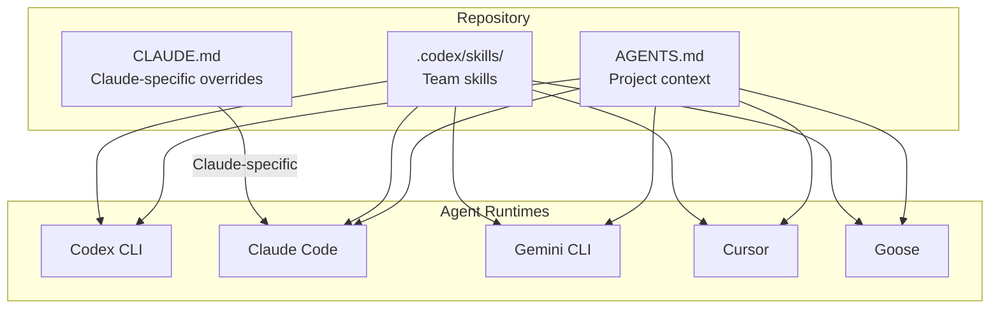
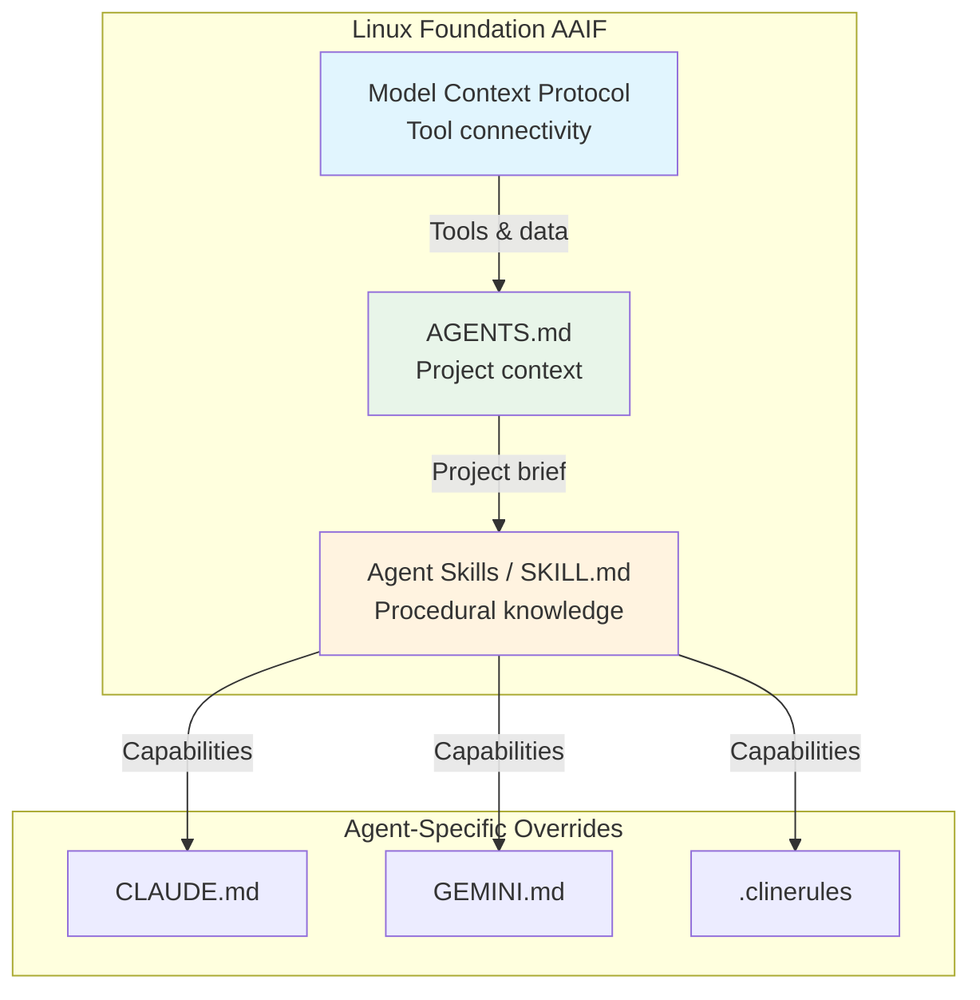

# Cross-Platform Agent Portability: One SKILL.md for Every Runtime


---

The AI coding agent landscape has fragmented into over a dozen serious contenders — each with its own instruction file, its own conventions, and its own idea of how context should be structured. If your team runs Codex CLI for backend work, Claude Code for refactoring, and Cursor for frontend, you've felt the pain: the same instructions duplicated across `AGENTS.md`, `CLAUDE.md`, `.cursorrules`, and `GEMINI.md`.

Two converging standards are fixing this. **AGENTS.md** standardises project-level context. **Agent Skills** (the `SKILL.md` format from agentskills.io) standardises reusable procedural knowledge. Together, they give enterprise teams a write-once-deploy-everywhere pattern for heterogeneous agent fleets.

## The Fragmentation Problem

Each major AI coding agent developed its own repository instruction format [^1]:

| Agent | Instruction File |
|-------|-----------------|
| Codex CLI | `AGENTS.md` |
| Claude Code | `CLAUDE.md` |
| Gemini CLI | `GEMINI.md` |
| Cline | `.clinerules/` |
| Cursor | `.cursor/rules/` |
| GitHub Copilot | `.github/copilot-instructions.md` |

The content across these files is near-identical: build commands, test procedures, coding standards, architectural constraints [^2]. Maintaining six files with the same information is a governance headache — and a drift risk when one gets updated and the others don't.

## AGENTS.md: The Universal Project Brief

AGENTS.md emerged from a collaborative effort led by Sourcegraph and now backed by OpenAI and Google [^3]. It serves as a single, Markdown-based source of project-specific guidance that AI coding agents read before operating on your codebase.

As of April 2026, AGENTS.md is natively supported by Codex CLI, GitHub Copilot, Cursor, Windsurf, Amp, Devin, Goose, and over 20 other tools [^4]. Over 60,000 open-source repositories on GitHub include an `AGENTS.md`, including Apache Airflow (4,263 contributors) and LangFlow (145K stars) [^4].

Critically, AGENTS.md is now stewarded by the **Agentic AI Foundation (AAIF)** under the Linux Foundation, alongside Anthropic's Model Context Protocol (MCP) and Block's Goose [^5]. Platinum members include AWS, Anthropic, Block, Bloomberg, Cloudflare, Google, Microsoft, and OpenAI [^5].



The mental model: `AGENTS.md` is your company policies and procedures — the universal brief. Tool-specific files like `CLAUDE.md` layer on agent-specific preferences on top [^2].

## Agent Skills: Portable Procedural Knowledge

Where `AGENTS.md` describes *what* a project is, Agent Skills describe *how* to do things. Originally developed by Anthropic and released as an open standard [^6], the `SKILL.md` format packages reusable capabilities — domain expertise, multi-step workflows, code generation patterns — into directories that any compatible agent can discover and activate.

### The SKILL.md Format

A skill is a directory containing a `SKILL.md` file with YAML frontmatter plus optional supporting files [^7]:

```
pdf-processing/
├── SKILL.md          # Required: metadata + instructions
├── scripts/          # Optional: executable code
├── references/       # Optional: documentation
└── assets/           # Optional: templates, resources
```

The frontmatter schema is deliberately minimal [^7]:

```yaml
---
name: pdf-processing
description: >
  Extract PDF text, fill forms, merge files.
  Use when handling PDFs.
license: Apache-2.0
compatibility: Requires Python 3.14+ and poppler-utils
metadata:
  author: example-org
  version: "1.0"
allowed-tools: Bash(python:*) Read
---
```

### Schema Constraints

The specification enforces strict naming rules to ensure portability across platforms [^7]:

| Field | Required | Constraints |
|-------|----------|-------------|
| `name` | Yes | Max 64 chars. Lowercase alphanumeric + hyphens only. No leading/trailing/consecutive hyphens. Must match parent directory name. |
| `description` | Yes | Max 1024 chars. Non-empty. No XML angle brackets. |
| `license` | No | Short licence name or reference to bundled file. |
| `compatibility` | No | Max 500 chars. Environment requirements. |
| `metadata` | No | Arbitrary key-value string mapping. |
| `allowed-tools` | No | Space-delimited pre-approved tool list. Experimental. |

### Progressive Disclosure

Skills use a three-tier loading strategy to manage context efficiently [^7]:

1. **Metadata** (~100 tokens): `name` and `description` loaded at startup for all installed skills
2. **Instructions** (<5,000 tokens recommended): Full `SKILL.md` body loaded when the agent activates the skill
3. **Resources** (as needed): Supporting files in `scripts/`, `references/`, `assets/` loaded on demand

This means an agent can have dozens of skills installed without bloating its context window. It reads the full instructions only when it decides a skill is relevant to the current task.

## Adoption: 30+ Agent Products and Counting

The agentskills.io specification is now supported by a remarkable breadth of platforms [^6]:

- **CLI agents**: Codex CLI, Claude Code, Gemini CLI, Goose, OpenCode, Amp, Mistral Vibe
- **IDE agents**: Cursor, VS Code (Copilot), JetBrains Junie, Roo Code, TRAE, Kiro
- **Desktop/cloud**: Emdash, Mux, Ona, Piebald, Factory
- **Platform-specific**: Databricks Genie Code, Snowflake Cortex Code, Firebender (Android)
- **Frameworks**: Spring AI, Laravel Boost, Letta

For Codex CLI specifically, skills can be installed at two scopes [^8]:

```bash
# User-level skills (personal)
~/.codex/skills/my-skill/SKILL.md

# Project-level skills (shared via version control)
.codex/skills/my-skill/SKILL.md
```

Skills are invoked explicitly with `$skill-name` syntax or automatically when the agent determines relevance from the task description [^8].

## Writing a Portable Skill: Practical Example

Here's a complete skill that works across Codex CLI, Claude Code, Gemini CLI, Cursor, and Goose without modification:

```markdown
---
name: db-migration-review
description: >
  Reviews database migration files for safety issues:
  missing rollbacks, data-loss DDL, lock contention risks,
  and index strategy problems. Use when reviewing PRs that
  contain migration files or when asked to check migrations.
license: MIT
metadata:
  author: platform-team
  version: "2.1"
allowed-tools: Bash(git:*) Read Grep
---

# Database Migration Review

## When activated
Review any file matching `**/migrations/**/*.sql` or
`**/migrations/**/*.py` (Django/Alembic).

## Checklist
1. **Rollback safety**: Every `UP` migration must have a
   corresponding `DOWN` that fully reverses the change.
2. **Data-loss DDL**: Flag `DROP TABLE`, `DROP COLUMN`,
   `TRUNCATE` — require explicit confirmation.
3. **Lock contention**: Flag `ALTER TABLE` on tables with
   >1M rows without `CONCURRENTLY` (Postgres) or
   `ALGORITHM=INPLACE` (MySQL).
4. **Index strategy**: New foreign keys must have
   corresponding indexes. Flag missing composite indexes
   on multi-column WHERE clauses.

## Output format
Produce a markdown checklist with pass/fail per item.
Include the specific file and line number for each finding.
```

This skill requires no platform-specific configuration. Every compatible agent reads the same frontmatter, applies the same progressive disclosure, and follows the same instructions.

## The Convergence Trajectory

The standards landscape is settling into a clear layered architecture:



The practical pattern for enterprise teams in 2026:

1. **One `AGENTS.md`** per repository — project context, build commands, coding standards
2. **Shared skills** in `.codex/skills/` or a central skills repository — team workflows, domain expertise, review checklists
3. **Thin tool-specific overrides** in `CLAUDE.md` or `GEMINI.md` only where agent behaviour genuinely diverges

This eliminates the six-file maintenance burden. When your build process changes, you update `AGENTS.md` once. When your review checklist evolves, you update the skill once. Every agent in your fleet picks up the change.

## Validation and Quality

The agentskills.io project provides a reference validation library [^9]:

```bash
# Install the validator
npm install -g @agentskills/skills-ref

# Validate a skill directory
skills-ref validate ./my-skill
```

This checks frontmatter schema compliance, naming conventions, directory structure, and file reference integrity — essential for CI pipelines that gate skill changes.

## What This Means for Codex CLI Users

Codex CLI was an early adopter of both AGENTS.md (as the originating platform) and Agent Skills [^8]. The practical implications:

- **Skills you write for Codex CLI work everywhere** — no porting needed when colleagues use Claude Code or Cursor
- **Community skills are immediately available** — install a skill from the Anthropic skills catalogue or any third-party source and it works in Codex CLI without adaptation
- **Enterprise governance simplifies** — one skill review process, one approval workflow, one versioning strategy across your entire agent fleet

The fragmentation era is ending. The question is no longer "which agent should we standardise on?" but "what skills does our team need?" — and the answer works everywhere.

## Citations

[^1]: [CLAUDE.md, AGENTS.md, and Every AI Config File Explained — DeployHQ](https://www.deployhq.com/blog/ai-coding-config-files-guide)
[^2]: [AGENTS.md vs CLAUDE.md: A Practical Guide for Developers in 2026 — The Prompt Shelf](https://thepromptshelf.dev/blog/agents-md-vs-claude-md/)
[^3]: [Agents.md: An Open Standard for AI Coding Agents — Tessl](https://tessl.io/blog/the-rise-of-agents-md-an-open-standard-and-single-source-of-truth-for-ai-coding-agents/)
[^4]: [AGENTS.md Official Site](https://agents.md/)
[^5]: [Linux Foundation Announces the Formation of the Agentic AI Foundation (AAIF)](https://www.linuxfoundation.org/press/linux-foundation-announces-the-formation-of-the-agentic-ai-foundation)
[^6]: [Agent Skills Overview — agentskills.io](https://agentskills.io/home)
[^7]: [Agent Skills Specification — agentskills.io](https://agentskills.io/specification)
[^8]: [Agent Skills — Codex Developer Documentation](https://developers.openai.com/codex/skills)
[^9]: [Agent Skills Reference Library — GitHub](https://github.com/agentskills/agentskills/tree/main/skills-ref)
