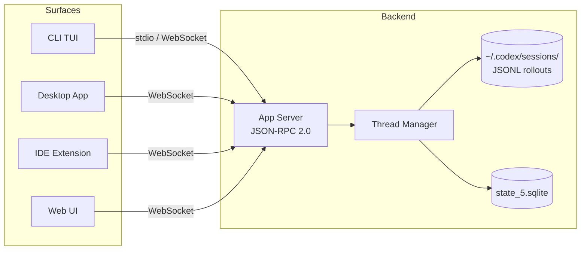
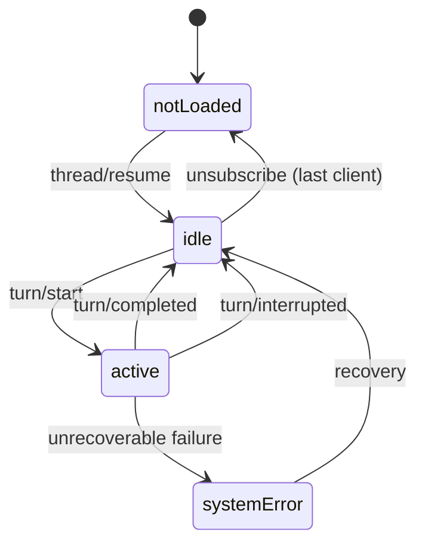

# Cross-Surface Session Sync: Resuming Codex Sessions Across CLI, Desktop and Cloud


---

Codex is no longer a single-surface tool. With the CLI, Desktop app (macOS and Windows), IDE extension and Cloud runtime all sharing a unified backend, sessions have become portable artefacts that travel between interfaces[^1]. This article dissects the session lifecycle — persistence, resumption, forking and cross-surface synchronisation — and shows how to exploit these capabilities in daily workflows.

## The App Server: The Unifying Layer

Every Codex surface — CLI, Desktop, VS Code extension, web — connects to the same **App Server**, a long-lived process exposing a bidirectional JSON-RPC 2.0 API over stdio (newline-delimited JSON) or WebSocket transports[^2][^3].

The App Server owns thread lifecycle. Surfaces are thin clients that subscribe to event streams and render notifications. This separation means a thread started in the CLI can be resumed in the Desktop app without any export/import dance — both connect to the same backend and the same persisted state[^2].



### JSON-RPC Thread Methods

The protocol exposes a clean set of thread operations[^2]:

| Method | Purpose |
|--------|---------|
| `thread/start` | Create a new thread, returns thread ID and metadata |
| `thread/resume` | Reopen a persisted thread, restoring prior context |
| `thread/fork` | Branch a thread's history under a new ID |
| `thread/list` | Paginated listing with cursor, filters by model/source/archived |
| `thread/archive` | Move logs to archived directory |
| `thread/unarchive` | Restore archived thread |
| `thread/read` | Read thread metadata and state |

Multiple clients can subscribe to the same thread simultaneously. The last `thread/unsubscribe` triggers memory unloading[^2].

## Session Storage Architecture

Sessions persist via two coordinated storage layers[^4]:

1. **JSONL Rollout Files** — stored under `~/.codex/sessions/YYYY/MM/DD/` as `.jsonl.zst` compressed archives. Each file contains the complete event stream for a thread and serves as the source of truth for replay[^4].

2. **SQLite State Database** (`state_5.sqlite`) — stores `ThreadMetadata` for efficient querying, listing and pagination without deserialising every rollout file[^4].

The `RolloutRecorder` component writes events to timestamped files, filtering based on persistence policy whilst always preserving critical metadata like `SessionSource` and `ThreadId`[^4].

### What Gets Persisted

Each `RolloutItem` in the JSONL stream captures `ResponseItem` entries — tool outputs, assistant messages, command executions, file changes and approval decisions. On resume, the `ContextManager` replays these entries to reconstruct the model's conversational state[^4].

## Resuming Sessions

### Interactive Resume

The `codex resume` subcommand opens a picker of recent sessions scoped to the current working directory[^5]:

```bash
# Interactive picker (current directory)
codex resume

# All sessions across all directories
codex resume --all

# Skip picker, jump to most recent
codex resume --last

# Target a specific session by ID
codex resume 7f9f9a2e-1b3c-4c7a-9b0e-...

# Most recent from any directory
codex resume --last --all
```

The picker UI uses `ThreadsPage` and `Cursor` for stable SQLite index navigation, with background loading that fetches metadata without blocking the UI thread[^4].

### Non-Interactive Resume with `codex exec`

For CI pipelines and automation, `codex exec resume` continues a session non-interactively with a follow-up prompt[^5][^6]:

```bash
# Resume last session with a new instruction
codex exec resume --last "Fix the race conditions you found"

# Resume a specific session
codex exec resume 7f9f9a2e-... "Implement the plan"

# Resume with image attachment
codex exec resume --last -i screenshot.png "Fix this layout bug"
```

Resumed runs preserve the original transcript, plan history and prior approvals[^5]. Configuration overrides — model, reasoning effort, sandbox settings — can be applied per-resume without altering the original thread configuration[^2].

### Environment Overrides on Resume

Two flags control the filesystem context when resuming[^5]:

- `--cd` — Override the working directory before resuming
- `--add-dir` — Add extra roots for cross-project coordination

## Forking Sessions

Forking creates a new thread that inherits a parent's history whilst leaving the original intact. Codex supports three fork modes[^4]:

| Mode | Behaviour | Thread ID |
|------|-----------|-----------|
| Full History | New thread receives entire parent transcript | New UUID v7 |
| Truncated | History truncated to last N turns via `truncate_rollout_to_last_n_fork_turns` | New UUID v7 |
| Interrupted | Snapshot with `<turn_aborted>` marker appended | New UUID v7 |

### CLI Fork Commands

```bash
# Fork via interactive picker
codex fork

# Fork most recent session
codex fork --last

# Fork a specific session
codex fork 7f9f9a2e-...

# Fork from all directories
codex fork --all
```

### In-Session Forking

Press **Esc twice** with an empty composer to enter transcript editing mode. Continue pressing Esc to walk back through the conversation, then press Enter to fork from that point — creating a branching conversation path[^5].

The `/fork` slash command achieves the same from the TUI composer[^7].

### Sub-Agent Forking

Since v0.107.0, threads can fork into sub-agents. The `AgentControl` system injects specialised context: *"You are the newly spawned agent… use the forked history only as background context"*[^4]. Sub-agents use readable path-based addresses like `/root/agent_a` (v0.117.0)[^8].

## Cross-Surface Synchronisation

### How It Works

Both CLI and Desktop app connect to the App Server as independent clients subscribing to the same thread[^2]. When one surface starts a turn:

1. Both clients receive `turn/started` notifications
2. Incremental `item/agentMessage/delta` events stream to all subscribers
3. `item/commandExecution/requestApproval` requests appear on every subscribed client
4. `turn/completed` signals the end with final status

This enables genuinely parallel workflows — start a long-running task in the Desktop app, monitor its progress from the CLI, and approve file changes from whichever surface is convenient[^2].

### Thread Status Notifications

The `thread/status/changed` notification fires when a loaded thread transitions between states[^2]:



### Project Continuity

The Codex Desktop app automatically discovers past projects worked on via the CLI or IDE extension[^1]. Auto Context and active threads are shared across surfaces, so switching from CLI to Desktop requires no manual import[^1].

### Reconnection Protocol

When a client reconnects after a disconnection[^2]:

1. Client sends `initialize` with `clientInfo.name` and version
2. Client emits `initialized` notification
3. Server rejects all requests before handshake completes
4. Client calls `thread/resume` with the stored thread ID
5. Turn context replays automatically without duplication

## Session Monitoring

### `/status`

Displays current session configuration — active model, approval policy, writable roots, remaining context capacity and the session ID (useful for scripting resume commands)[^7].

### `/ps`

Shows each background terminal's command plus up to three recent non-empty output lines[^7]. Useful for tracking parallel tasks within a session. ⚠️ Note: management of background terminals (kill, prune) remains an area of active development with known limitations[^9].

### `/title`

Sets a terminal title for the current session, making parallel sessions easier to distinguish. Works in both the classic TUI and the app-server TUI (v0.117.0)[^8].

## Practical Patterns

### Pattern 1: CLI Research, Desktop Execution

```bash
# Start research in CLI
codex "Analyse the authentication module for security issues"

# Note the session ID from /status, then resume in Desktop
# for parallel remediation with visual diff review
```

### Pattern 2: Iterative Forking for Design Exploration

```bash
# Initial implementation
codex "Implement the caching layer using Redis"

# Fork to explore an alternative
codex fork --last
codex "Now try the same with Memcached instead"

# Compare both approaches in Desktop's thread list
```

### Pattern 3: CI Resume for Multi-Stage Pipelines

```bash
# Stage 1: Analysis
SESSION=$(codex exec --json "Analyse test failures" | jq -r '.session_id')

# Stage 2: Fix (resuming with full context)
codex exec resume "$SESSION" "Fix all identified issues"
```

## Current Limitations

- **CLI-to-Desktop listing gap**: The Desktop app may not list all local CLI sessions if the app-server was not running when they were created[^10]. Sessions created via the standalone CLI binary without the app-server backend require the app-server to index them on next startup.
- **Ephemeral sessions**: Sessions started with `--ephemeral` in `codex exec` are not persisted and cannot be resumed or synced[^6].
- **Early transport failures**: If a transport failure occurs early enough in a session, no resumable artefacts may be written despite a session ID being displayed[^11].

## Citations

[^1]: [Codex App documentation](https://developers.openai.com/codex/app) — OpenAI Developers, 2026.
[^2]: [App Server documentation](https://developers.openai.com/codex/app-server) — OpenAI Developers, 2026.
[^3]: [Unlocking the Codex harness: how we built the App Server](https://openai.com/index/unlocking-the-codex-harness/) — OpenAI Blog, 2026.
[^4]: [Session Resumption and Forking](https://deepwiki.com/openai/codex/4.4-session-resumption-and-forking) — DeepWiki, 2026.
[^5]: [Codex CLI Features](https://developers.openai.com/codex/cli/features) — OpenAI Developers, 2026.
[^6]: [Codex CLI Command Line Reference](https://developers.openai.com/codex/cli/reference) — OpenAI Developers, 2026.
[^7]: [Slash commands in Codex CLI](https://developers.openai.com/codex/cli/slash-commands) — OpenAI Developers, 2026.
[^8]: [Codex Changelog — v0.117.0](https://developers.openai.com/codex/changelog) — OpenAI Developers, March 2026.
[^9]: [Background tasks keep spinning independently w/o way to kill them — Issue #8656](https://github.com/openai/codex/issues/8656) — GitHub, 2025.
[^10]: [Desktop app stuck in cloud-only mode; local sessions ignored — Issue #10547](https://github.com/openai/codex/issues/10547) — GitHub, 2026.
[^11]: [Codex can print a session ID but fail to persist resumable artefacts — Issue #15870](https://github.com/openai/codex/issues/15870) — GitHub, 2026.
