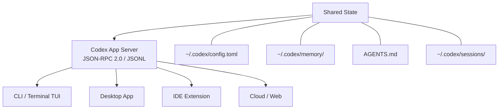
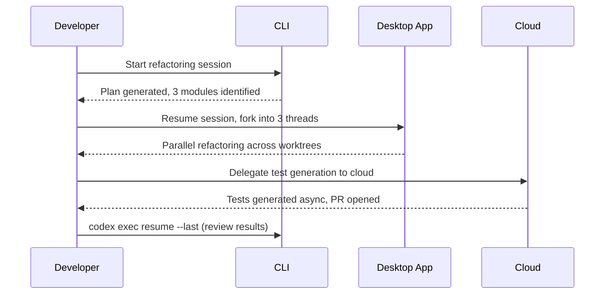
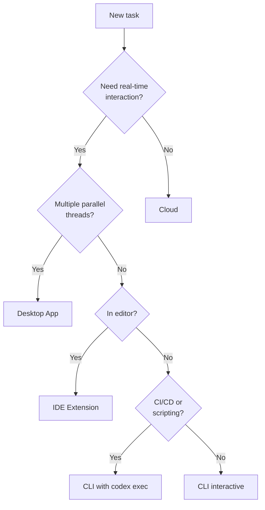

# The Four-Surface Architecture: CLI, Desktop, IDE Extension and Cloud as One System


---

OpenAI ships Codex as a single agent with four points of entry. The CLI, Desktop app, IDE extension and Cloud surface all share the same configuration, memory, AGENTS.md instructions and session state [^1]. Understanding how these surfaces relate — and when to reach for each one — is the key to getting the most from Codex in a professional workflow.

## The Unified Intelligence Layer

All four surfaces communicate through the **Codex App Server**, a bidirectional JSON-RPC 2.0 protocol streamed as JSONL over stdio [^2]. OpenAI published the specification in February 2026 and describes the design as "single agent, multiple ingress" [^3].

The protocol defines three primitives:

| Primitive | Purpose |
|-----------|---------|
| **Thread** | Durable session container — survives restarts, resumable across surfaces |
| **Turn** | A single unit of agent work within a thread |
| **Item** | An atomic event with a lifecycle: `started → delta → completed` |

Every surface — terminal, desktop window, VS Code panel, or cloud container — is simply a different frontend rendering the same stream of Items within Threads.



## Surface 1: The CLI

The open-source Rust-based terminal agent remains the foundational surface [^4]. Install via `npm i -g @openai/codex` or `brew install --cask codex` and you get a full TUI with plan mode, steer mode and configurable approval levels (`suggest`, `auto-edit`, `full-auto`).

The CLI runs locally with OS-level sandbox isolation: Bubblewrap namespace isolation on Linux, Apple Seatbelt on macOS, and restricted tokens with a private desktop on Windows [^5]. Windows support moved from experimental to native with PowerShell and sandbox support as of March 4, 2026 [^6].

**Best for:** quick single-task operations, scripting pipelines, CI/CD integration via `codex exec`, and developers who live in the terminal.

```bash
# Start an interactive session
codex

# Non-interactive execution for CI
codex exec --full-auto --json "Review this PR for security issues"

# Resume a session started on another surface
codex exec resume --last
```

## Surface 2: The Desktop App

Launched in February 2026, the Desktop app is the command centre for parallel agent work [^7]. Start it with `codex app` or install from the Microsoft Store. It is currently available on macOS (Apple Silicon) and Windows, with Linux support forthcoming [^7].

The Desktop app adds capabilities that a single terminal cannot easily provide:

- **Parallel threads** — run multiple agent conversations simultaneously, each with its own Git worktree
- **Integrated terminal per thread** — inspect exactly what the agent is doing without switching windows
- **Diff review and inline commenting** — review proposed changes before accepting
- **Automations** — scheduled background tasks with skills, configured through the UI

**Best for:** large refactoring across multiple modules, managing several agent tasks at once, and teams wanting visual diff review before merging agent output.

## Surface 3: The IDE Extension

The Codex IDE extension is available for VS Code, Cursor, Windsurf and other VS Code-compatible editors via the Visual Studio Marketplace [^8]. Third-party integrations for JetBrains and Xcode are also referenced in the documentation [^1].

The extension shares the same MCP (Model Context Protocol) servers and configuration as the CLI — `~/.codex/config.toml` and project-level `AGENTS.md` apply identically [^8]. From the editor panel you can:

- Start an interactive Codex session scoped to the current workspace
- Delegate tasks directly to Codex Cloud without leaving the editor
- Review and apply file changes inline with the editor's native diff view

**Best for:** developers who prefer to stay in their editor, contextual code generation scoped to the current file or workspace, and quick delegation of tasks to cloud.

## Surface 4: Cloud (Codex Web)

Accessible at [chatgpt.com/codex](https://chatgpt.com/codex), the cloud surface runs tasks asynchronously in isolated containers with your codebase preloaded [^9]. This is fire-and-forget: submit a task description, walk away, and review the results when the agent finishes.

Cloud tasks support:

- **Parallel execution** — submit multiple tasks and let them run concurrently
- **GitHub integration** — use `@codex` mentions on GitHub issues and PRs to trigger cloud tasks [^9]
- **Best-of-N runs** — `codex cloud exec --attempts 3` runs the task multiple times and selects the best result [^10]
- **CLI submission** — `codex cloud exec "migrate to the new API"` from the terminal

**Best for:** long-running migrations, overnight refactors, tasks that do not need real-time supervision, and triggering work from GitHub without opening a terminal.

## Cross-Surface Session Continuity

Sessions persist under `~/.codex/sessions/` and can be resumed on any surface [^1]. A typical workflow might look like this:



The key operations for cross-surface work:

| Operation | What it does |
|-----------|-------------|
| **Resume** | Continue a session on any surface — interactive picker or specific ID |
| **Fork** | Branch a conversation into sub-agents (v0.107.0+) [^11] |
| **Delegate** | Push a task from one surface to another (e.g. IDE → Cloud) |

## Shared Configuration Across Surfaces

All four surfaces read from the same configuration hierarchy:

```
Session overrides → CLI flags → Project config → User config → System config → Defaults
```

The critical shared files:

| File | Purpose |
|------|---------|
| `~/.codex/config.toml` | User-level configuration (model, approval mode, plugins) |
| `.codex/config.toml` | Project-level configuration |
| `AGENTS.md` | Project instructions read by all surfaces |
| `~/.codex/memory/` | Persistent memory shared across sessions and surfaces |

This means setting `model = "o4-mini"` in your user config applies whether you are working from the terminal, the desktop app, or the IDE extension [^1]. Plugins installed via one surface are available on all others as of v0.117.0 [^12].

## Choosing the Right Surface

The decision is situational, not ideological. Here is a practical decision framework:



In practice, most developers settle into a primary surface and use the others for specific scenarios. The architecture ensures this is a matter of preference rather than capability — every surface has access to the same agent intelligence, the same tools, and the same project context.

## What This Means for Teams

For engineering teams, the four-surface model has practical implications:

1. **Onboarding flexibility** — new team members can use whichever surface matches their existing workflow
2. **Consistent AGENTS.md** — project instructions are enforced regardless of which surface a developer uses
3. **Audit trail** — sessions are durable and reviewable, whether initiated from the CLI or the desktop app
4. **CI/CD integration** — `codex exec` in pipelines uses the same agent and configuration as interactive use

The repository currently has 67,782 GitHub stars and is released under the Apache-2.0 licence [^4], with development velocity of 10–15 daily commits as of March 2026 [^5].

## Citations

[^1]: [OpenAI Codex Developer Documentation — CLI](https://developers.openai.com/codex/cli)
[^2]: [InfoQ: OpenAI Publishes Codex App Server Architecture](https://www.infoq.com/news/2026/02/opanai-codex-app-server/) — February 2026
[^3]: [OpenAI Blog: Unlocking the Codex Harness](https://openai.com/index/unlocking-the-codex-harness/)
[^4]: [GitHub: openai/codex](https://github.com/openai/codex) — Apache-2.0 licensed open-source repository
[^5]: [Zylos Research: Codex CLI Architecture and Multi-Runtime Patterns](https://zylos.ai/research/2026-03-26-openai-codex-cli-architecture-multi-runtime-patterns) — March 26, 2026
[^6]: [OpenAI Codex Developer Documentation — Changelog](https://developers.openai.com/codex/changelog) — v0.118.0, March 31, 2026
[^7]: [OpenAI Codex Developer Documentation — Desktop App](https://developers.openai.com/codex/app)
[^8]: [OpenAI Codex Developer Documentation — IDE Extension](https://developers.openai.com/codex/ide)
[^9]: [OpenAI Codex Developer Documentation — Cloud](https://developers.openai.com/codex/cloud)
[^10]: [OpenAI Codex Product Page](https://openai.com/codex/)
[^11]: [OpenAI Community: Introducing the Codex IDE Extension](https://community.openai.com/t/introducing-the-codex-ide-extension/1354930)
[^12]: [Wikipedia: OpenAI Codex (AI agent)](https://en.wikipedia.org/wiki/OpenAI_Codex_(AI_agent))
