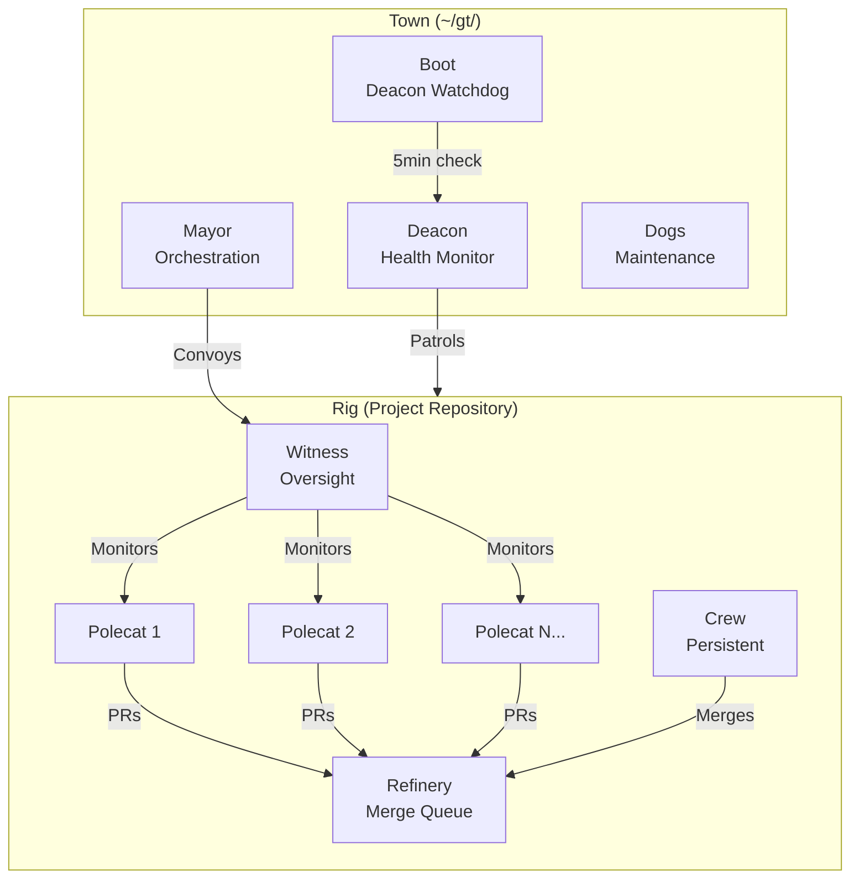
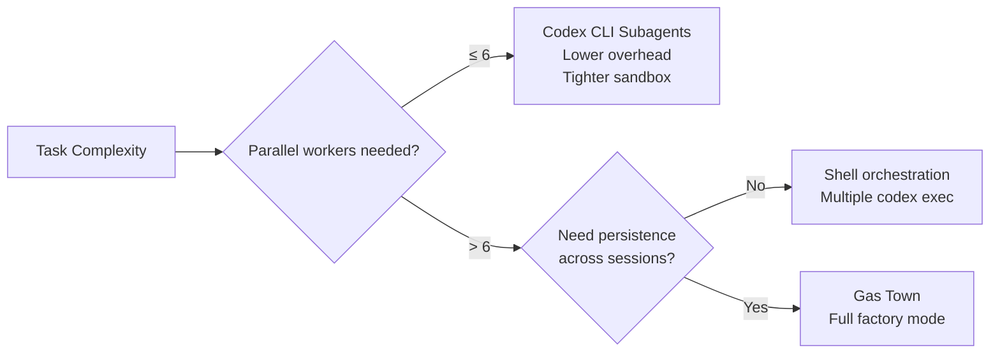

# Gas Town: Steve Yegge's Multi-Agent Factory and What It Means for Codex CLI


---

In January 2026, Steve Yegge open-sourced Gas Town — a Go-based multi-agent workspace manager that orchestrates 20–30 parallel Claude Code instances under a structured hierarchy of specialised roles [^1]. It represents one of the most ambitious attempts yet to move beyond the "one developer, one AI assistant" paradigm into full-scale agent factory operations. For Codex CLI users, Gas Town offers both a glimpse of where multi-agent orchestration is heading and a useful benchmark for evaluating Codex's own subagent system.

## The Factory Metaphor

Gas Town is built around a Mad Max–inspired metaphor that maps neatly onto distributed systems concepts. Rather than presenting itself as a single coding assistant, Gas Town acts as a factory where you speak to the foreman — the **Mayor** — who coordinates as many workers as needed to complete your tasks [^2].

The key insight is that this is *operational parallelism*, not the sequential persona handoff pattern used by frameworks like BMAD or SpecKit. Where those systems simulate an SDLC pipeline (Analyst → PM → Architect → Developer → QA), Gas Town distributes work across isolated agents executing simultaneously [^3]. This distinction matters: sequential handoff optimises for explainability, whilst operational parallelism optimises for throughput.

## Architecture: Seven Roles, Two Tiers

Gas Town's agent hierarchy operates across two tiers: **Town-level** (global coordination) and **Rig-level** (per-repository execution) [^4].

### Town-Level Roles

| Role | Function |
|------|----------|
| **Mayor** | Chief-of-staff agent: initiates Convoys (work orders), coordinates distribution, notifies users |
| **Deacon** | Daemon beacon running continuous Patrol cycles for system health and recovery |
| **Dogs** | Maintenance agents handling cleanup and health checks under Deacon supervision |
| **Boot** | Special Dog that checks the Deacon every 5 minutes — the accountability chain's anchor |

### Rig-Level Roles

| Role | Function |
|------|----------|
| **Polecat** | Worker agents with persistent identity but ephemeral sessions, operating in isolated git worktrees |
| **Refinery** | Manages the merge queue, intelligently handling conflicts before changes reach `main` |
| **Witness** | Patrol agent monitoring Polecats and Refinery, detecting stuck agents and triggering recovery |
| **Crew** | Long-lived named agents maintaining context across sessions for persistent collaboration |



## Beads and Dolt: Git-Backed State That Survives Crashes

Gas Town's persistence layer is built on **Beads** — git-backed atomic work units stored in **Dolt**, an open-source SQL database with Git-like versioning [^5]. A single Dolt SQL server per town serves all databases via MySQL protocol on port 3307, with all agents writing directly to `main` using transaction discipline (`BEGIN` / `DOLT_COMMIT` / `COMMIT` atomically) [^6].

This design solves the fundamental problem of multi-agent state management: agent sessions are ephemeral, but work definitions must be durable. Each Polecat maintains a permanent agent bead, CV chain, and work history that accumulates across assignments [^4]. When an agent crashes or hits a context window limit, the `/handoff` command transfers work state to a fresh session without losing progress.

Key Beads concepts include:

- **MEOW (Molecular Expression of Work)** — decomposing goals into trackable, atomic units agents can execute autonomously [^4]
- **GUPP (Gas Town Universal Propulsion Principle)** — "If there is work on your Hook, YOU MUST RUN IT" — agents proceed without external prompting [^4]
- **Molecules** — durable chained Bead workflows where each step survives agent restarts [^4]
- **Wisps** — ephemeral Beads destroyed after runs, for lightweight transient operations [^4]

## The Wasteland: Scaling Beyond One Machine

As of March 2026, Yegge introduced the **Wasteland** — a trust network enabling thousands of Gas Towns to link together for distributed multi-agent coordination [^7]. This represents the next logical step: from a single-machine agent factory to a networked swarm operating across infrastructure boundaries.

## The Cost Reality

Running Gas Town at full capacity is not cheap. Multiple sources report a token burn rate of approximately **$100 per hour** when operating 12–30 parallel agents [^8][^9]. Yegge himself reportedly exhausted three Claude Code accounts in his launch week [^8]. A full factory setup runs into thousands per month — this is industrial-scale compute, not casual experimentation.

## How Codex CLI Subagents Compare

Codex CLI's subagent system takes a fundamentally different approach: lighter weight, single-vendor, and tightly sandboxed [^10].

### Configuration

Subagent settings live under `[agents]` in `.codex/config.toml`:

```toml
[agents]
max_threads = 6
max_depth = 1
job_max_runtime_seconds = 300
```

Custom agents are defined as individual TOML files in `~/.codex/agents/` or `.codex/agents/`:

```toml
name = "reviewer"
description = "Reviews code for quality and security issues"
developer_instructions = "Focus on OWASP top 10 and performance anti-patterns"
model = "gpt-5.3-codex"
```

### Architectural Differences

| Dimension | Gas Town | Codex CLI Subagents |
|-----------|----------|-------------------|
| **Scale** | 20–30 parallel agents | max_threads = 6 (default) |
| **Depth** | Multi-level hierarchy | max_depth = 1 (single level) |
| **State** | Dolt SQL + Beads persistence | Session-scoped, parent-managed |
| **Addressing** | Named roles + Hook-based queues | Path-based: `/root/agent_a` |
| **Batch** | Convoys with arbitrary Bead chains | `spawn_agents_on_csv` with templated instructions |
| **Isolation** | Separate git worktrees per Polecat | Inherits parent sandbox policies |
| **Model support** | Claude Code, Copilot, Gemini, Codex | OpenAI models only |
| **Merge handling** | Dedicated Refinery agent | Manual or parent-managed |
| **Cost** | ~$100/hr at full capacity | Proportional to thread count |
| **Monitoring** | Witness + Deacon patrol loops | `/agent` command for thread inspection |

### Built-in Roles vs Gas Town Specialisation

Codex CLI ships three built-in agent types — `default`, `worker`, and `explorer` — which can be overridden by custom TOML definitions [^10]. Gas Town's seven roles represent a much more granular separation of concerns, with dedicated agents for merge management (Refinery), health monitoring (Witness/Deacon), and maintenance (Dogs). The trade-off is complexity: Gas Town requires understanding its full role hierarchy before productive use, whilst Codex subagents are immediately accessible.

## When Each Approach Makes Sense



**Choose Codex CLI subagents** when:

- Your task decomposes into 6 or fewer parallel units
- You want tight sandbox isolation with inherited approval policies
- You need deterministic, single-session execution
- Cost control matters — you pay proportionally to thread count

**Choose Gas Town** when:

- You need sustained parallel execution across 10+ agents over hours or days
- Work must survive agent crashes, context exhaustion, and session restarts
- You have a large codebase requiring coordinated multi-repository changes
- You are comfortable with $100+/hr operational costs

**The pragmatic middle ground**: most developers will find Codex CLI's subagent system sufficient for the majority of tasks. Gas Town targets a specific use case — large-scale, sustained, multi-agent operations — that relatively few teams currently need [^3]. As Codex CLI's `max_threads` becomes user-configurable [^11] and external orchestration tools mature, the gap will narrow.

## Lessons for the Codex Ecosystem

Gas Town's architecture highlights several patterns the Codex ecosystem could adopt:

1. **Dedicated merge management** — Gas Town's Refinery role solves the thorny problem of merging parallel agent work. Codex CLI currently leaves this to the parent session or the developer.

2. **Health monitoring as a first-class concern** — The Witness/Deacon/Boot accountability chain ensures stuck agents are detected and recovered. Codex subagents lack equivalent monitoring infrastructure.

3. **Persistent work state** — Beads' survival across crashes is something session-scoped systems cannot replicate without external tooling. This is where complementary tools like NanoClaw (for persistent scheduling) or OpenClaw (for managed local swarms) fill the gap.

4. **Nondeterministic Idempotence** — Gas Town's principle that work definitions specify *outcomes* rather than *exact steps* allows agents to take different paths towards convergent results [^9]. This resilience pattern is worth adopting in any multi-agent workflow.

## Conclusion

Gas Town represents what happens when you take multi-agent orchestration to its logical extreme: a full factory with specialised roles, persistent state, health monitoring, and networked scaling. For most Codex CLI users, it is instructive rather than immediately practical — but its architectural patterns, particularly around merge management, crash recovery, and work decomposition, are directly applicable to how we structure subagent workflows today.

The question is not whether you should replace Codex CLI subagents with Gas Town. It is whether the patterns Gas Town pioneered will eventually become standard features in every terminal coding agent. Given the trajectory of the last four months, that seems increasingly likely.

---

## Citations

[^1]: [Welcome to Gas Town — Steve Yegge, Medium](https://steve-yegge.medium.com/welcome-to-gas-town-4f25ee16dd04)

[^2]: [Gas Town: What Kubernetes for AI Coding Agents Actually Looks Like — Cloud Native Now](https://cloudnativenow.com/features/gas-town-what-kubernetes-for-ai-coding-agents-actually-looks-like/)

[^3]: [GasTown and the Two Kinds of Multi-Agent — Paddo.dev](https://paddo.dev/blog/gastown-two-kinds-of-multi-agent/)

[^4]: [Gas Town Glossary — GitHub](https://github.com/gastownhall/gastown/blob/main/docs/glossary.md)

[^5]: [A Day in Gas Town — DoltHub Blog](https://www.dolthub.com/blog/2026-01-15-a-day-in-gas-town/)

[^6]: [Dolt Storage Architecture — Gas Town Documentation](https://gastown.dev/docs/design/dolt-storage/)

[^7]: [Welcome to the Wasteland: A Thousand Gas Towns — Steve Yegge, Medium](https://steve-yegge.medium.com/welcome-to-the-wasteland-a-thousand-gas-towns-a5eb9bc8dc1f)

[^8]: [Gas Town's Agent Patterns, Design Bottlenecks, and Vibecoding at Scale — Maggie Appleton](https://maggieappleton.com/gastown)

[^9]: [Wrapping My Head Around Gas Town — Justin Abrahms](https://justin.abrah.ms/blog/2026-01-05-wrapping-my-head-around-gas-town.html)

[^10]: [Subagents — Codex CLI Documentation](https://developers.openai.com/codex/subagents)

[^11]: [Allow for >6 Subagents: Make MAX_THREADS Configurable — GitHub Issue #11965](https://github.com/openai/codex/issues/11965)
