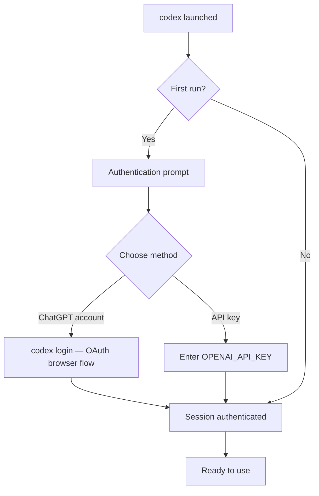
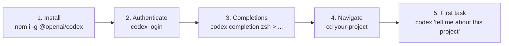

# Installing Codex CLI: Package Managers, Shell Completions and First-Run Setup


---

Getting Codex CLI running on your machine takes under five minutes — but the installation path you choose and the post-install configuration you apply can meaningfully affect your day-to-day experience. This guide covers every supported installation method, shell completion setup for all five supported shells, first-run authentication, and common troubleshooting patterns.

## System Requirements

Codex CLI is a standalone Rust binary distributed via multiple channels. The core requirements are minimal:

| Requirement | Detail |
|---|---|
| **Operating System** | macOS (Intel or Apple Silicon), Linux (x86_64 or arm64), Windows (experimental) [^1] |
| **Node.js** | v22 or later (for npm installation only) [^2] |
| **Network** | HTTPS outbound to `api.openai.com` for authentication and model calls |
| **ChatGPT Plan** | Plus, Pro, Business, Edu, or Enterprise — or an OpenAI API key [^3] |

Windows support remains experimental as of early 2026. OpenAI recommends running Codex inside a WSL workspace for the most stable Windows experience [^1].

## Installation Methods

### npm (Cross-Platform)

The canonical installation path uses npm. This requires Node.js 22+ [^2]:

```bash
npm install -g @openai/codex
```

To upgrade an existing installation:

```bash
npm install -g @openai/codex@latest
```

The npm package is published under the `@openai/codex` scope [^4]. At time of writing the latest stable release series is v0.119.x [^5].

### Homebrew (macOS and Linux)

Homebrew users can install via cask [^6]:

```bash
brew install --cask codex
```

This installs the pre-built binary directly — no Node.js dependency required. Homebrew handles updates through the standard `brew upgrade` mechanism.

### Direct Binary Download (All Platforms)

Pre-built binaries are available from the GitHub releases page for environments where neither npm nor Homebrew is appropriate [^6]:

| Platform | Binary |
|---|---|
| macOS Apple Silicon | `codex-aarch64-apple-darwin.tar.gz` |
| macOS Intel | `codex-x86_64-apple-darwin.tar.gz` |
| Linux x86_64 | `codex-x86_64-unknown-linux-musl.tar.gz` |
| Linux arm64 | `codex-aarch64-unknown-linux-musl.tar.gz` |

After extraction, rename the platform-specific binary to `codex` and place it somewhere on your `PATH`:

```bash
tar xzf codex-aarch64-apple-darwin.tar.gz
mv codex-aarch64-apple-darwin /usr/local/bin/codex
chmod +x /usr/local/bin/codex
```

### winget (Windows)

Windows users can install Codex CLI through winget [^7]:

```powershell
winget install OpenAI.Codex
```

⚠️ The winget package is community-maintained. For the most reliable Windows experience, OpenAI recommends using npm inside WSL2 [^1].

## Verifying the Installation

Confirm everything is working:

```bash
codex --version
```

You should see output like `codex 0.119.0` (or your installed version). If the command is not found, ensure the installation directory is on your `PATH`.

## First-Run Authentication

The first time you launch `codex`, you are prompted to authenticate [^3]. Two paths are available:



### ChatGPT Account (Recommended)

Select **"Sign in with ChatGPT"** when prompted. This opens an OAuth flow in your browser and links your ChatGPT subscription (Plus, Pro, Business, Edu, or Enterprise) to the CLI [^3]. This method unlocks the full feature set including cloud threads.

You can also trigger this explicitly:

```bash
codex login
```

### API Key

For CI environments or users without a ChatGPT subscription, set the `OPENAI_API_KEY` environment variable:

```bash
export OPENAI_API_KEY="sk-..."
```

Or pass it via the login flow when prompted. Note that some features — notably cloud tasks — require ChatGPT account authentication rather than a bare API key [^8].

## Shell Completions

Codex CLI ships with built-in completion generation for five shells [^9]:

```bash
codex completion <SHELL>
```

Where `<SHELL>` is one of: `bash`, `zsh`, `fish`, `powershell`, or `elvish`.

The command writes the completion script to stdout. You pipe it to the appropriate location for your shell.

### Bash

```bash
codex completion bash > /etc/bash_completion.d/codex
```

Or for a per-user setup:

```bash
mkdir -p ~/.local/share/bash-completion/completions
codex completion bash > ~/.local/share/bash-completion/completions/codex
```

### Zsh

```bash
codex completion zsh > "${fpath[1]}/_codex"
```

If you prefer a custom completions directory:

```bash
mkdir -p ~/.zsh/completions
codex completion zsh > ~/.zsh/completions/_codex
```

Then add to `~/.zshrc` before `compinit`:

```zsh
fpath=(~/.zsh/completions $fpath)
autoload -Uz compinit
compinit
```

If you encounter a `command not found: compdef` error, ensure `autoload -Uz compinit && compinit` appears in your `~/.zshrc` before any completion-related lines [^10].

### Fish

```bash
codex completion fish > ~/.config/fish/completions/codex.fish
```

Fish picks up completion files from this directory automatically — no additional configuration needed.

### PowerShell

```powershell
codex completion powershell | Out-File -Encoding utf8 -FilePath "$HOME\Documents\PowerShell\Completions\codex.ps1"
```

Then add to your PowerShell profile (`$PROFILE`):

```powershell
. "$HOME\Documents\PowerShell\Completions\codex.ps1"
```

### Elvish

```bash
codex completion elvish > ~/.config/elvish/lib/codex.elv
```

Then in `~/.config/elvish/rc.elv`:

```elvish
use codex
```

## The Five-Minute Onboarding Path

For developers who want to go from zero to productive as quickly as possible:



1. **Install** — pick the method that suits your platform
2. **Authenticate** — run `codex login` or just `codex` and follow the prompt
3. **Shell completions** — set up tab-completion for your shell (optional but recommended)
4. **Navigate** — `cd` into a Git repository
5. **First task** — ask Codex something about your project

Codex operates within your current working directory context. It is strongly recommended to create a Git checkpoint before your first real task, as Codex can modify your codebase [^8].

## Common Installation Issues

### `npm install` Fails with Permission Errors

Avoid `sudo npm install -g`. Instead, configure npm to use a user-owned directory:

```bash
mkdir -p ~/.npm-global
npm config set prefix '~/.npm-global'
echo 'export PATH="$HOME/.npm-global/bin:$PATH"' >> ~/.bashrc
source ~/.bashrc
```

### Node.js Version Too Old

Codex CLI requires Node.js 22+ when installing via npm [^2]. Use a version manager like `nvm` or `fnm`:

```bash
nvm install 22
nvm use 22
npm install -g @openai/codex
```

### Binary Not Found After Homebrew Install

If `brew install --cask codex` completes but `codex` is not found, check that `/opt/homebrew/bin` (Apple Silicon) or `/usr/local/bin` (Intel) is on your `PATH`.

### Sandbox Verification Fails on Linux

Codex uses Landlock LSM for sandboxing on Linux, which requires kernel 5.13+ [^11]. Verify with:

```bash
codex sandbox --test
```

If sandboxing is unavailable, Codex will warn you and fall back to unrestricted execution.

## Post-Install Configuration

Once installed, Codex reads configuration from `~/.codex/config.toml` (user level) and `.codex/config.toml` (project level) [^12]. A minimal starting configuration:

```toml
# ~/.codex/config.toml
model = "o4-mini"
approval = "on-request"
```

You can override any config value at invocation time with `-c`:

```bash
codex -c model=o3 "refactor this module"
```

For a full configuration reference, see the [Codex config documentation](https://developers.openai.com/codex/config-basic) [^12].

## Citations

[^1]: [CLI – Codex | OpenAI Developers](https://developers.openai.com/codex/cli) — Official CLI page noting macOS/Linux support and experimental Windows status with WSL recommendation.
[^2]: [relax node 22 or newer requirement · Issue #164 · openai/codex](https://github.com/openai/codex/issues/164) — GitHub issue confirming Node.js 22+ requirement for npm installation.
[^3]: [Quickstart – Codex | OpenAI Developers](https://developers.openai.com/codex/quickstart) — Official quickstart covering authentication methods and plan eligibility.
[^4]: [@openai/codex – npm](https://www.npmjs.com/package/@openai/codex) — npm package page for the official Codex CLI package.
[^5]: [openai/codex Releases – GitHub](https://github.com/openai/codex/releases) — GitHub releases page showing v0.119.x as the latest release series (April 2026).
[^6]: [openai/codex – GitHub](https://github.com/openai/codex) — Repository README with Homebrew cask and binary download instructions.
[^7]: [Install Codex CLI with WinGet | winstall](https://winstall.app/apps/OpenAI.Codex) — winget package listing for OpenAI Codex CLI.
[^8]: [Quickstart – Codex | OpenAI Developers](https://developers.openai.com/codex/quickstart) — Quickstart guide noting cloud thread limitations with API key auth and Git checkpoint recommendation.
[^9]: [Command line options – Codex CLI | OpenAI Developers](https://developers.openai.com/codex/cli/reference) — CLI reference documenting the `codex completion` subcommand for bash, zsh, fish, powershell, and elvish.
[^10]: [How to generate Codex shell completions – Simplified Guide](https://www.simplified.guide/codex/shell-completions-generate) — Community guide covering zsh compdef troubleshooting.
[^11]: [Codex CLI Sandbox Platform Implementation](https://danielvaughan.github.io/codex-resources/articles/2026-04-08-codex-sandbox-platform-implementation.html) — Daniel Vaughan's article on Landlock LSM requirements for Linux sandboxing.
[^12]: [Config basics – Codex | OpenAI Developers](https://developers.openai.com/codex/config-basic) — Official configuration documentation covering config.toml locations and keys.
