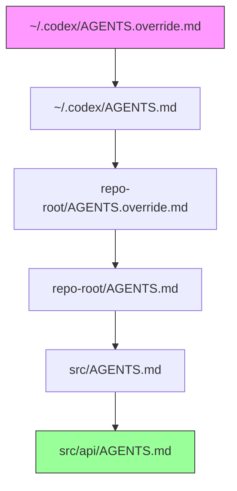
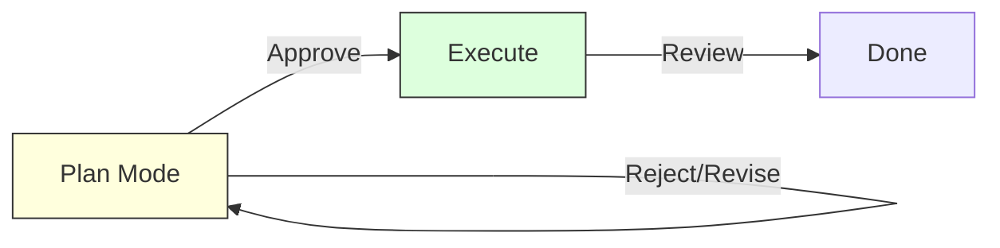

# Migrating to Codex CLI from ChatGPT: From Chat to Agentic Workflows


---

## The Paradigm Shift You Did Not Ask For

If you have spent the last two years refining ChatGPT prompts — crafting custom instructions, building up conversation histories, and learning to coax code out of a chat window — Codex CLI asks you to unlearn most of it. The shift from ChatGPT's conversational interface to Codex CLI's agentic paradigm is not merely a change of surface; it is a fundamentally different model of interaction where the AI executes tasks in your repository rather than generating text for you to copy-paste[^1].

This article maps the conceptual bridge between the two, covering sessions versus chats, how AGENTS.md replaces custom instructions, why sandboxing matters when the agent can execute code, and how to translate ChatGPT-style prompts into effective agentic instructions.

## Conversations vs Sessions: Ephemeral Chat Meets Persistent State

In ChatGPT, a conversation is a linear exchange of messages. You type, the model responds, you refine. The context window is your entire history, and once you close the tab (or hit the token ceiling), the context resets. Memory — introduced in 2024 — adds limited persistence, but it operates at the profile level, not the project level[^2].

Codex CLI sessions are structurally different. A session is a unit of work tied to a specific directory. Codex stores transcripts locally under `~/.codex/sessions/`, and you can resume any previous session with full context intact[^3]:

```bash
# Resume the most recent session
codex resume --last

# Browse all sessions, not just current directory
codex resume --all

# Resume a specific session by ID
codex resume abc123-def456
```

Non-interactive runs support resumption too, which means CI/CD pipelines can pick up where a previous run left off[^3]:

```bash
codex exec resume --last "Continue fixing the failing tests"
```

The key mental shift: **a ChatGPT conversation is disposable; a Codex session is resumable**. You can fork sessions with `codex fork --last` to branch a conversation without losing the original thread[^4]. Think of sessions as git branches for your AI interactions.

## Custom Instructions vs AGENTS.md: From Profile Settings to Project Architecture

ChatGPT's custom instructions are a single text block stored against your account. They apply globally to every conversation — whether you are debugging a Kubernetes manifest or writing a haiku. There is no hierarchy, no project scoping, and no version control[^2].

AGENTS.md is the Codex CLI equivalent, but it operates on an entirely different plane. Instead of a global profile setting, AGENTS.md is a **file in your repository** — versioned, reviewable, and hierarchical[^5].

### Discovery Order

Codex builds an instruction chain at session start by walking the directory tree[^5]:



Files closer to the current working directory take precedence. An `AGENTS.override.md` at any level supersedes the standard `AGENTS.md` at that level. Removing an override file restores inherited guidance automatically[^5].

### What Goes in AGENTS.md

Where ChatGPT custom instructions might say "respond in British English and prefer TypeScript," AGENTS.md encodes **project-level architectural decisions**:

```markdown
# AGENTS.md

## Working Agreements
- All code must pass `npm run lint` before commit
- Use the repository's existing error handling pattern (Result<T, E>)
- Never modify files under `src/generated/`

## Testing Requirements
- Run `npm test` before any PR-related work
- Integration tests live in `tests/integration/` — do not mix with unit tests

## Architecture
- This is a monorepo managed by Turborepo
- Shared types live in `packages/shared-types`
- API routes follow the `/api/v2/` prefix convention
```

This is version-controlled, team-shared, and directory-scoped. A backend team can have different rules from a frontend team within the same repository. The file has a default 32 KiB size limit, configurable via `project_doc_max_bytes`[^5].

### Cross-Tool Compatibility

AGENTS.md is not exclusive to Codex CLI. Cursor and Builder.io also read it, so a single instructions file can govern multiple AI tools. For Claude Code, you would maintain a synced `CLAUDE.md`[^6].

## The Sandbox: Why It Matters When the Agent Executes Code

In ChatGPT, the model generates text. If it produces a flawed `rm -rf /` command, nothing happens until you copy and execute it. Codex CLI is different — **the agent runs commands directly in your environment**[^7]. This is where the sandbox becomes critical.

Codex implements a two-layer protection model combining sandbox mode (technical restrictions) and approval policy (user decision gates)[^7]:

### Sandbox Modes

| Mode | Behaviour |
|------|-----------|
| `read-only` | Agent can browse files but cannot write or execute |
| `workspace-write` | Writes restricted to the active workspace; network disabled |
| `danger-full-access` | Unrestricted — use only in disposable environments |

Platform-specific enforcement ensures these are not merely suggestions: Seatbelt on macOS, bubblewrap/seccomp on Linux, and Windows Sandbox on Windows[^7].

### Approval Policies

| Policy | When Codex Pauses |
|--------|-------------------|
| `untrusted` | All state-mutating commands need approval |
| `on-request` | Only out-of-workspace edits and network access |
| `never` | No prompts (within configured sandbox limits) |
| `granular` | Fine-grained per-category control |

You set these at launch:

```bash
# Conservative: sandbox reads only, approve everything
codex --sandbox read-only --ask-for-approval untrusted "Audit this codebase"

# Productive default: write to workspace, approve network/external
codex --full-auto "Refactor the auth module"

# CI/CD: no interaction, sandboxed writes
codex exec --sandbox workspace-write --ask-for-approval never "Fix lint errors"
```

Protected paths remain read-only even in writable modes: `.git`, `.agents`, and `.codex` directories are off-limits to the agent[^7].

## Plan Mode: The Bridge Between Chat and Execution

If you are accustomed to ChatGPT's "tell me what you would do" pattern, **plan mode** is the closest equivalent in Codex CLI — and likely where you should start[^8].



Toggle plan mode mid-session with `/plan` or `Shift+Tab`[^8]. In plan mode, Codex analyses your codebase and produces a structured plan — but writes nothing. You review, refine, then approve execution. This mirrors the ChatGPT workflow of "generate then copy-paste," but with the crucial difference that execution is a single approval away rather than a manual process.

The three interaction modes map to increasing trust levels[^8]:

- **Plan**: Design only — no file changes, no commands
- **Suggest (auto-edit)**: Codex applies file edits automatically but pauses before shell commands
- **Full auto**: Autonomous execution within sandbox constraints

You can switch between these mid-session with the `/mode` command[^3], which means you can start conservatively and grant more autonomy as you build confidence in the agent's understanding of your codebase.

## Translating ChatGPT Prompts Into Agent Instructions

The prompt engineering that works in ChatGPT often fails in Codex CLI, because you are shifting from **describing desired output** to **specifying a task with constraints**.

### ChatGPT Style (Output-Oriented)

> "Write me a React component that displays a user profile card with the user's name, avatar, and bio. Use Tailwind CSS for styling and TypeScript for type safety."

### Codex CLI Style (Task-Oriented)

> "Create a UserProfileCard component in src/components/ following the existing component patterns in this directory. It should accept name, avatarUrl, and bio props. Use the project's existing Tailwind utility classes and ensure it passes the linter."

The differences are subtle but important:

1. **Reference existing patterns** — the agent can read your codebase, so leverage that
2. **Specify location** — the agent needs to know where to write files
3. **Include verification** — "ensure it passes the linter" gives the agent a success criterion
4. **Omit implementation details** — unlike ChatGPT, the agent can inspect your existing code to infer conventions

For complex tasks, the `@` symbol triggers fuzzy file search in the composer, letting you reference specific files as context[^3]:

```
Refactor @src/api/auth.ts to use the error handling pattern from @src/api/users.ts
```

## Memory: Persistent Context vs Ephemeral History

Codex CLI implements a two-phase memory pipeline that goes well beyond ChatGPT's memory feature[^9]. Phase one extracts key facts from your interactions. Phase two consolidates them using GPT-5.3-Codex with medium reasoning, deduplicating and merging into a coherent summary stored in `memory_summary.md`[^9].

This memory is:

- **Injected at session start**, capped at 5,000 tokens[^9]
- **CWD-aware**, so project-specific memories activate only in relevant directories[^9]
- **Secret-sanitised**, automatically scanning for credentials before writing to disk[^9]
- **Available in non-interactive mode**, meaning `codex exec` in CI benefits from the same context[^9]

The practical difference: ChatGPT might remember that you "prefer TypeScript." Codex CLI remembers that in *this specific repository*, the team uses a custom Result type for error handling, tests run via `pnpm test:integration`, and the deployment target is AWS Lambda with Node.js 22.

## A Migration Checklist

For developers making the transition, here is a practical sequence:

1. **Start with plan mode** — run `codex` and immediately type `/plan` to enter read-only analysis mode[^8]
2. **Create a global AGENTS.md** at `~/.codex/AGENTS.md` with your universal preferences (editor style, language, conventions)[^5]
3. **Add project-level AGENTS.md** files to your repositories with architecture decisions, testing commands, and directory conventions[^5]
4. **Use suggest mode** for your first real tasks — auto-edits with manual approval of commands[^3]
5. **Graduate to full-auto** once you trust the agent's understanding of your codebase, always with `workspace-write` sandbox[^7]
6. **Use `codex resume`** instead of starting fresh conversations — sessions accumulate context that makes the agent more effective over time[^3]

## When to Stay in ChatGPT

Not everything belongs in an agentic workflow. ChatGPT remains the better tool for:

- Exploratory questions ("explain how WebSockets work")
- One-off code snippets with no project context
- Brainstorming and ideation
- Non-code tasks (writing, analysis, research)

Codex CLI excels when the task involves **your codebase**: refactoring, implementing features, fixing bugs, running tests, and managing project-specific workflows. The moment you find yourself copying code from ChatGPT and pasting it into your editor, that is the signal to switch to Codex CLI.

---

## Citations

[^1]: [Introducing Codex — OpenAI](https://openai.com/index/introducing-codex/) — Codex as an agentic coding tool that executes tasks in repositories

[^2]: [Using Codex with your ChatGPT plan — OpenAI Help Center](https://help.openai.com/en/articles/11369540-using-codex-with-your-chatgpt-plan) — ChatGPT and Codex integration, custom instructions scope

[^3]: [Features — Codex CLI — OpenAI Developers](https://developers.openai.com/codex/cli/features) — Sessions, resumption, approval modes, mid-session commands

[^4]: [Command line options — Codex CLI — OpenAI Developers](https://developers.openai.com/codex/cli/reference) — CLI flags, fork command, exec mode, sandbox options

[^5]: [Custom instructions with AGENTS.md — Codex — OpenAI Developers](https://developers.openai.com/codex/guides/agents-md) — AGENTS.md hierarchy, discovery order, override mechanism

[^6]: [Codex vs Claude Code: which is the better AI coding agent? — Builder.io](https://www.builder.io/blog/codex-vs-claude-code) — Cross-tool compatibility of AGENTS.md

[^7]: [Agent approvals & security — Codex — OpenAI Developers](https://developers.openai.com/codex/agent-approvals-security) — Sandbox modes, approval policies, protected paths, platform enforcement

[^8]: [Codex Plan Mode: Stop Code Drift with Plan→Execute — SmartScope](https://smartscope.blog/en/generative-ai/chatgpt/codex-plan-mode-complete-guide/) — Plan mode mechanics, switching modes

[^9]: [OpenAI Codex CLI Memory — Deep Dive — Mervin Praison](https://mer.vin/2025/12/openai-codex-cli-memory-deep-dive/) — Two-phase memory pipeline, consolidation, CWD awareness, secret sanitisation
