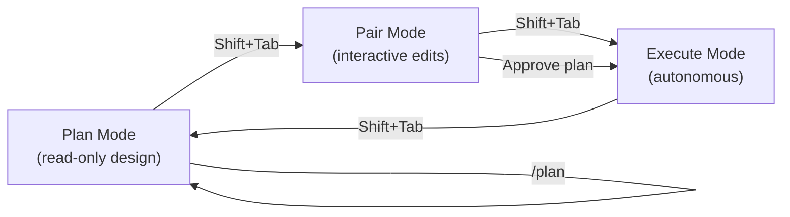
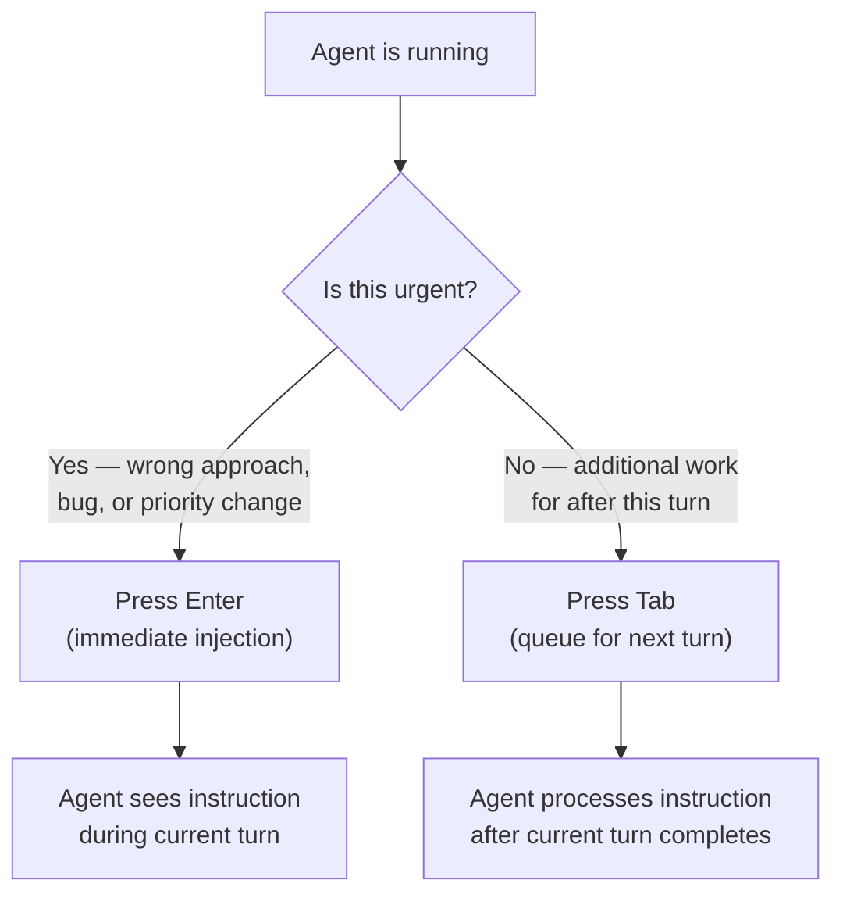
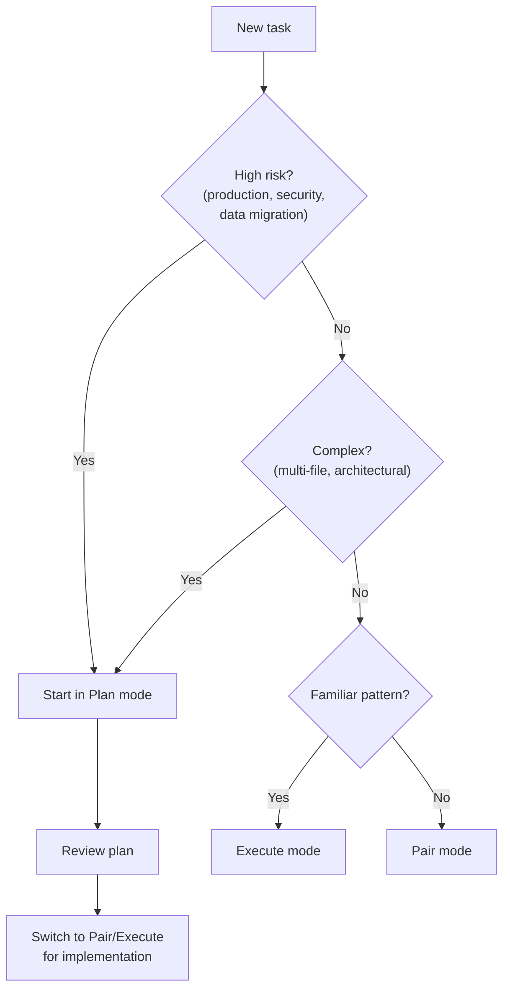

# Plan Mode Mechanics: Enter vs Tab, Syntax Highlighting and Inline Editing


---

Codex CLI's terminal interface has evolved well beyond a simple prompt-and-response loop. Between plan mode, steer mode, and a rich set of TUI enhancements, the CLI now offers a genuinely interactive development experience. This article unpacks the specific mechanics — the keystrokes, the mode transitions, and the visual tooling — that make it all work.

## Collaboration Modes: Plan, Pair and Execute

Since v0.96.0, Codex CLI ships with three collaboration modes enabled by default[^1]. Each mode represents a different level of agent autonomy:

- **Plan** — design only. The model reads files and analyses the codebase, then proposes an implementation plan without writing anything. File mutations are suppressed at the prompt level[^2].
- **Pair** — interactive implementation. The agent reads and writes files, but every change requires your approval before it lands.
- **Execute** — autonomous execution. The agent works through the task independently, applying changes as it goes.

You cycle through them with **Shift+Tab**, or jump directly with the `/plan` slash command[^1]. The current mode is displayed in the TUI footer and via `/status`.

### The Prompt-Level Constraint

An important subtlety: plan mode is enforced at the **prompt level**, not via a runtime sandbox[^2]. The system prompt instructs the model not to write files, but there is no physical block on mutations. For genuinely safety-critical work, combine plan mode with a `git stash` or an isolated branch as a belt-and-braces measure.



## Enter vs Tab: The Steer Mode Mechanics

Steer mode, stable since v0.98.0[^3], is arguably the CLI's most distinctive interaction pattern. Rather than waiting for the agent to finish a turn before providing feedback, you can redirect it mid-execution. Two keys control the timing:

| Key | Behaviour | Use Case |
|-----|-----------|----------|
| **Enter** | Sends instructions **immediately** — the agent sees them during the current turn | Urgent corrections: "Use bcrypt instead of argon2" |
| **Tab** | **Queues** instructions for the next turn — the agent finishes its current work first | Follow-up tasks: "After this, add the migration script" |

This distinction matters. Enter interrupts; Tab appends. Choosing wrong doesn't break anything, but it changes the agent's context window at the point of injection.

### When to Use Each



**Enter** examples:

- The agent is refactoring a module but chose the wrong design pattern — redirect immediately
- You spot a bug in the approach before it propagates further
- Requirements changed mid-task and the current direction is now invalid

**Tab** examples:

- You want tests written after the current implementation finishes
- You'd like the agent to update documentation once it's done with the code
- You want to queue a scope addition without disrupting the current flow

## Syntax Highlighting and the /theme System

Version 0.105.0 introduced syntax highlighting for fenced code blocks and file diffs in the TUI[^4]. The implementation uses **syntect** paired with **two-face**, providing approximately 250 language grammars and 32 bundled themes[^5] — the same engine that powers tools like `bat` and `delta`.

### Configuring Themes

The `/theme` command opens an interactive picker with live preview[^5]. Your selection persists to `~/.codex/config.toml` under the `tui.theme` key:

```toml
[tui]
theme = "Monokai Extended"
```

For custom themes, drop standard `.tmTheme` files into `~/.codex/themes/` and they appear in the picker alongside the bundled options[^4].

### Performance Guardrails

The highlighting engine caps processing at 512 KB or 10,000 lines per block[^5], preventing pathological delays on massive diffs. If a block exceeds these limits, it falls back to plain-text rendering. The total binary size increase from adding syntect was roughly 3 MB — about 1% of the Codex CLI binary[^5].

### Known Limitations

The diff view has a documented issue where background colours defined in `.tmTheme` scope rules for `markup.inserted`, `markup.deleted`, and `markup.changed` are ignored[^6]. The diff view renders with hardcoded red/green backgrounds regardless of theme settings. This is tracked upstream and may be resolved in a future release.

## TUI Commands Reference

Beyond the mode-switching and highlighting features, the TUI includes a set of utility commands that have accumulated across recent releases:

| Command | Description | Notes |
|---------|-------------|-------|
| `/plan` | Switch to plan mode (optionally with an inline prompt) | Accepts `/plan "redesign the API"` |
| `/copy` | Copy the latest completed output to clipboard | Unavailable before first output[^7] |
| `/clear` | Clear the terminal and start a fresh chat | Resets conversation history |
| `/compact` | Summarise conversation to free tokens | Preserves critical context[^7] |
| `/theme` | Open the syntax highlighting theme picker | Live preview, persistent config[^4] |
| `/title` | Set the terminal window title | v0.117.0+[^3] |
| `/status` | Display session config, mode, and token usage | Shows remaining context capacity[^7] |
| `/model` | Switch model and reasoning effort mid-session | No restart required |
| `/permissions` | Adjust approval policy mid-session | Toggle between Auto and Read Only |

### Keyboard Shortcuts

| Shortcut | Action |
|----------|--------|
| **Shift+Tab** | Cycle Plan → Pair → Execute |
| **Ctrl+L** | Clear screen (preserves conversation) |
| **Ctrl+G** | Open prompt in external editor |
| **Ctrl+C** | Cancel current operation (twice to quit) |
| **Esc + Esc** | Edit previous message (when composer is empty) |
| **@** | Fuzzy file search — attach files to context |
| **!** | Execute shell command inline |
| **↑/↓** | Navigate draft history |

Note the distinction between `/clear` and **Ctrl+L**: the slash command resets both the terminal display and the conversation, whilst the keyboard shortcut only clears the visual output[^7].

## Plan Mode in Practice: A Decision Framework

Choosing the right collaboration mode depends on task risk and complexity. Here's a practical framework:



For high-risk or architecturally complex work, start in plan mode. Review the proposed approach, iterate on it with follow-up prompts, then switch to pair or execute mode once the plan is solid. For routine, well-understood tasks — running a familiar refactoring pattern, adding a standard endpoint — execute mode gets out of the way.

The combination of plan-first design and mid-execution steering means you can maintain tight control over the agent's direction without sacrificing the speed of autonomous execution. The key insight: **plan mode sets the direction; steer mode keeps it on course**.

## Citations

[^1]: [Codex Plan Mode: Stop Code Drift with Plan→Execute (2026) — SmartScope](https://smartscope.blog/en/generative-ai/chatgpt/codex-plan-mode-complete-guide/)
[^2]: [Introducing Plan Mode: A Game Changer for Codex CLI Users — Oreate AI Blog](https://www.oreateai.com/blog/introducing-plan-mode-a-game-changer-for-codex-cli-users/4ed2f2870c77e991b6ceb72ce3a258c5)
[^3]: [Codex CLI: The Definitive Technical Reference — Blake Crosley](https://blakecrosley.com/guides/codex)
[^4]: [Features — Codex CLI | OpenAI Developers](https://developers.openai.com/codex/cli/features)
[^5]: [feat(tui): syntax highlighting via syntect with theme picker — GitHub PR #11447](https://github.com/openai/codex/pull/11447)
[^6]: [Codex CLI themes are genuinely unusable — GitHub Issue #12912](https://github.com/openai/codex/issues/12912)
[^7]: [Slash commands in Codex CLI — OpenAI Developers](https://developers.openai.com/codex/cli/slash-commands)
