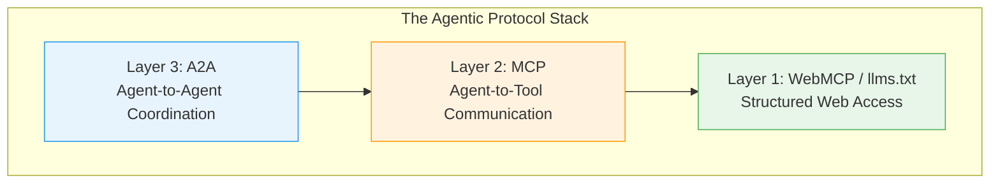
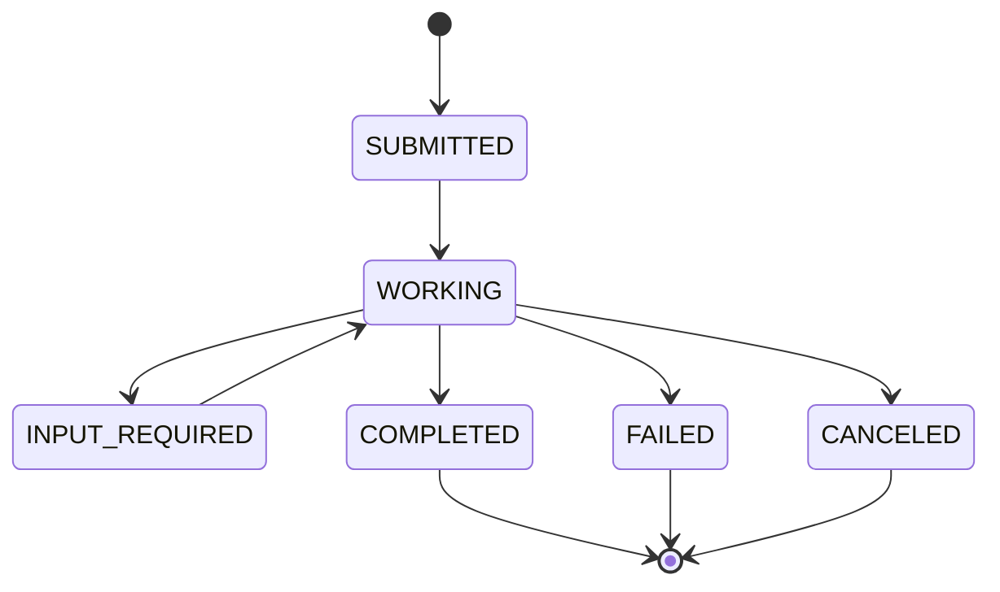
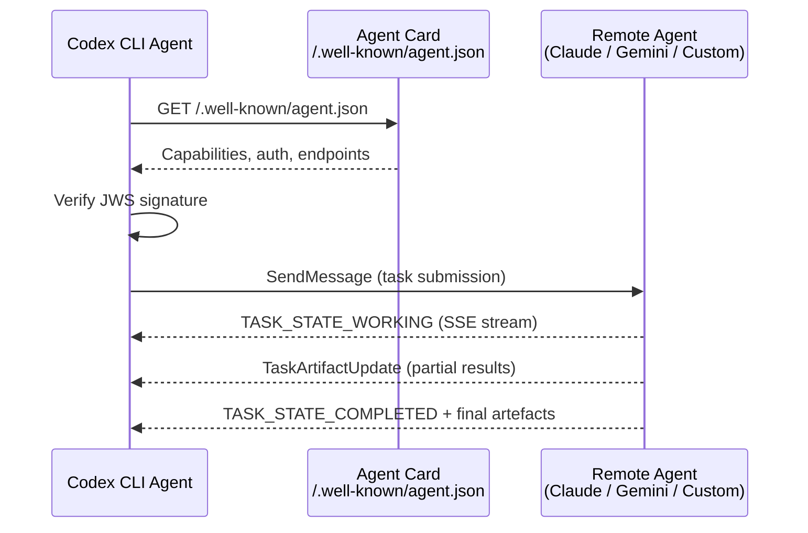

# A2A Meets MCP: The Multi-Agent Protocol Stack and What It Means for Codex


---

Every multi-agent system needs two things: a way for agents to reach tools and data, and a way for agents to reach each other. Until recently, the agentic ecosystem conflated these concerns or left one of them entirely ad hoc. In 2026, two open protocols have crystallised as the canonical answer to each: the **Model Context Protocol (MCP)** for agent-to-tool communication, and the **Agent-to-Agent (A2A)** protocol for inter-agent coordination. Both now sit under the Linux Foundation's Agentic AI Foundation (AAIF), and both matter for Codex CLI users building multi-agent workflows.

## The Protocol Stack: Three Layers

The emerging consensus architecture separates agentic communication into distinct layers, each with a clear responsibility[^1]:



**Layer 1 — WebMCP / llms.txt** provides structured web access, giving agents a machine-readable view of web content. **Layer 2 — MCP** standardises how an individual agent connects to external tools, APIs and data sources. **Layer 3 — A2A** handles how autonomous agents discover, negotiate with and delegate work to each other[^1]. Individual agents maintain their own MCP tool connections whilst coordinating with peer agents through A2A.

## MCP: The Tool Layer

Anthropic introduced MCP in late 2024, and by February 2026 the protocol had crossed 97 million monthly SDK downloads across the Python and TypeScript implementations[^2]. Every major AI provider now supports it: Anthropic, OpenAI, Google, Microsoft and Amazon[^2]. The public registry lists over 5,800 MCP servers covering integrations from GitHub and Slack to PostgreSQL and Stripe[^2].

### Architecture

MCP uses a client-server model with a JSON-RPC 2.0 wire format[^3]. The client (typically an AI agent or host application) connects to a server that exposes four capability types:

- **Resources** — read-only data access
- **Tools** — executable actions the agent can invoke
- **Prompts** — reusable templates for common interactions
- **Sampling** — reverse LLM calls, letting the server request completions from the client[^3]

Transport options include stdio for local processes, Server-Sent Events (SSE) for remote connections, and Streamable HTTP for production deployments[^3].

### The 2026 Roadmap

The MCP maintainers have published a 2026 roadmap focused on four pillars: transport scalability (stateful sessions fighting load balancers), enterprise readiness (audit trails, SSO-integrated auth, gateway behaviour), governance maturation (contributor ladder, delegation model), and refined tool annotations for describing tool behaviour in agentic workflows[^4]. Most enterprise features will land as extensions rather than core spec changes — a deliberate decision to keep the base protocol lightweight[^4].

## A2A: The Coordination Layer

Google launched A2A in April 2025 to solve the problem MCP explicitly does not address: how do autonomous agents from different vendors discover and collaborate with each other without exposing their internal state?[^5] By August 2025, IBM's Agent Communication Protocol (ACP) had merged into A2A, consolidating the space[^2]. In early 2026, A2A reached v1.0 — its first production-ready release[^6].

### Agent Cards and Discovery

A2A's discovery mechanism is the **Agent Card**: a JSON manifest served at `/.well-known/agent.json` that declares an agent's capabilities, supported interaction modalities, authentication requirements and endpoints[^5]. Client agents fetch the card, assess whether the remote agent suits their task, and engage it — all without prior configuration[^2].

In v1.0, Agent Cards gained **JWS signatures** (RFC 7515) with RFC 8785 JSON canonicalisation, providing cryptographic verification of agent identity across organisational boundaries[^6]. This is critical for enterprise deployments where you need to verify that the agent you're delegating to is genuinely operated by the expected party.

### Task Lifecycle

A2A is fundamentally task-oriented. A client agent submits a task to a remote agent, which progresses through a defined state machine[^5]:



Remote agents can process tasks asynchronously, sending status updates and streaming artefacts back via Server-Sent Events[^5]. This long-running task model is fundamentally different from MCP's synchronous request-response cycle — and it's what makes A2A suitable for coordinating agents that may take minutes or hours to complete their work.

### v1.0 Breaking Changes

The jump to v1.0 brought significant changes that signal protocol maturity[^6]:

| Change | Detail |
|--------|--------|
| **Part type unification** | TextPart, FilePart and DataPart collapsed into a single `Part` structure, discriminated by which content field is populated |
| **Enum normalisation** | All enums moved to `SCREAMING_SNAKE_CASE` with type prefixes (e.g. `TASK_STATE_COMPLETED`) |
| **Three transport bindings** | HTTP+JSON, gRPC and JSON-RPC, all with formal equivalence guarantees |
| **Cursor-based pagination** | Replaced offset-based pagination with `nextCursor` fields |
| **Multi-tenancy** | Native `tenant` field on request messages and AgentInterface objects |
| **OAuth modernisation** | Deprecated implicit and password flows; added Device Code flow (RFC 8628) and PKCE (RFC 7636) |

SDKs are available in Python, Go, JavaScript, Java and .NET[^7].

## The AAIF: Neutral Governance

In December 2025, the Linux Foundation formed the Agentic AI Foundation (AAIF) with six platinum co-founders: OpenAI, Anthropic, Google, Microsoft, AWS and Block[^8]. The foundation anchored three initial project contributions: Anthropic's MCP, Block's goose (an open-source agentic framework and MCP reference implementation), and OpenAI's AGENTS.md[^8].

A2A followed in June 2025 when Google donated it to the Linux Foundation[^9]. The practical consequence: both protocols now evolve under the same neutral governance umbrella, with convergence pressure built into the institutional structure. Neither Anthropic nor Google solely controls the specs[^2].

This matters for Codex CLI users because OpenAI is a platinum AAIF member. The organisational commitment to these standards makes it increasingly likely that Codex CLI will deepen its protocol support over time.

## Codex CLI's Current Position

Codex CLI has solid MCP support today. The CLI acts as an MCP client, connecting to both STDIO servers (local processes) and Streamable HTTP servers (remote endpoints)[^10]. Configuration lives in `config.toml` at either the global (`~/.codex/config.toml`) or project level (`.codex/config.toml`), and is shared between the CLI and IDE extension[^10].

```toml
# ~/.codex/config.toml — MCP server configuration

[mcp_servers.github]
command = "npx"
args = ["-y", "@modelcontextprotocol/server-github"]
env = { GITHUB_TOKEN = "ghp_..." }

[mcp_servers.company-tools]
url = "https://tools.example.com/mcp"
bearer_token_env_var = "COMPANY_MCP_TOKEN"
```

Authentication covers static bearer tokens via environment variables and OAuth via `codex mcp login`[^10]. Tool filtering with `enabled_tools` and `disabled_tools` provides fine-grained control over what the agent can access[^10].

### The A2A Gap

Where Codex CLI falls short is the A2A layer. Today, Codex subagents communicate through an internal structured messaging system — parent spawns child, child returns result — with no standard protocol for cross-vendor agent discovery or delegation[^11]. If you want a Codex agent to delegate work to a Claude Code agent, a Gemini agent, or a LangGraph-based specialist, there is no protocol-level way to do it.

This is the gap A2A is designed to fill. With A2A, a Codex agent could:

1. **Discover** a remote specialist agent via its Agent Card at `/.well-known/agent.json`
2. **Verify** the agent's identity through its JWS-signed card
3. **Submit** a task with structured input and receive streaming status updates
4. **Receive** artefacts (code patches, analysis reports, test results) as the remote agent completes work



## What Codex CLI Needs

For Codex CLI to become a first-class citizen in the A2A ecosystem, several capabilities would need to land:

**As an A2A client (delegating to remote agents):**

- Agent Card fetching and JWS signature verification
- Task submission over HTTP+JSON or gRPC bindings
- SSE streaming for long-running task progress
- OAuth/PKCE authentication to remote agents

**As an A2A remote agent (receiving delegated work):**

- Serving an Agent Card at `/.well-known/agent.json` that describes Codex's capabilities
- Accepting incoming task submissions via the A2A protocol
- Reporting task state transitions and streaming artefacts back to callers
- Multi-tenancy support for enterprise deployments

The MCP client role is already solid. The A2A server role — exposing Codex as a callable agent — would be the more transformative addition, letting Codex participate in heterogeneous agent ecosystems orchestrated by any A2A-compatible coordinator.

## Practical Implications for Multi-Agent Workflows

For Codex CLI users building multi-agent systems today, the protocol landscape creates a decision framework:

| Need | Protocol | Codex CLI Support |
|------|----------|-------------------|
| Connect agent to external tools | MCP | ✅ Full support |
| Coordinate Codex subagents | Internal messaging | ✅ Built-in |
| Delegate to non-Codex agents | A2A | ❌ Not yet |
| Expose Codex as a remote agent | A2A | ❌ Not yet |
| Cross-vendor agent discovery | A2A Agent Cards | ❌ Not yet |

In the meantime, workarounds exist. You can bridge the gap with shell-based orchestration (spawning multiple CLI agents with GNU parallel), MCP server wrappers that expose Codex via MCP's tool interface[^12], or external orchestrators like the OpenAI Agents SDK that can invoke `codex exec` as a tool[^13]. None of these provide the structured task lifecycle, streaming progress updates or cryptographic agent verification that A2A offers natively.

## The Convergence Thesis

The institutional structure of the AAIF, with both MCP and A2A under one roof and all major AI vendors as platinum members, creates strong convergence pressure[^8]. The protocols are not competing — they address different layers of the same stack. The question is not whether Codex CLI will support A2A, but when.

Given that OpenAI contributed AGENTS.md as a founding AAIF project and sits on the governing board alongside the A2A stewards, the alignment is clear[^8]. For Codex CLI users, the practical advice is: invest heavily in MCP integrations now (they will remain the tool layer regardless), structure your multi-agent workflows to be protocol-agnostic where possible, and watch the Codex CLI changelog for A2A client support — it would be the single most impactful addition for cross-vendor agent interoperability.

---

## Citations

[^1]: [MCP vs A2A: The Complete Guide to AI Agent Protocols in 2026](https://dev.to/pockit_tools/mcp-vs-a2a-the-complete-guide-to-ai-agent-protocols-in-2026-30li) — DEV Community, 2026

[^2]: [MCP vs A2A: The Complete Guide to AI Agent Protocols in 2026](https://pockit.tools/blog/mcp-vs-a2a-ai-agent-protocols-complete-guide/) — Pockit Blog, 2026

[^3]: [MCP vs A2A Protocol: Differences Explained](https://toolradar.com/blog/mcp-vs-a2a) — Toolradar, 2026

[^4]: [The 2026 MCP Roadmap](https://blog.modelcontextprotocol.io/posts/2026-mcp-roadmap/) — Model Context Protocol Blog, 2026

[^5]: [What Is Agent2Agent (A2A) Protocol?](https://www.ibm.com/think/topics/agent2agent-protocol) — IBM Think, 2026

[^6]: [What's New in v1.0](https://a2a-protocol.org/latest/whats-new-v1/) — A2A Protocol, 2026

[^7]: [A2A Protocol](https://a2a-protocol.org/latest/) — Official A2A documentation

[^8]: [Linux Foundation Announces the Formation of the Agentic AI Foundation (AAIF)](https://www.linuxfoundation.org/press/linux-foundation-announces-the-formation-of-the-agentic-ai-foundation) — Linux Foundation, December 2025

[^9]: [Google Cloud donates A2A to Linux Foundation](https://developers.googleblog.com/en/google-cloud-donates-a2a-to-linux-foundation/) — Google Developers Blog, 2025

[^10]: [Model Context Protocol – Codex](https://developers.openai.com/codex/mcp) — OpenAI Developers, 2026

[^11]: [Subagents – Codex](https://developers.openai.com/codex/subagents) — OpenAI Developers, 2026

[^12]: [Codex CLI MCP Server](https://github.com/tuannvm/codex-mcp-server) — GitHub

[^13]: [Use Codex with the Agents SDK](https://developers.openai.com/codex/guides/agents-sdk) — OpenAI Developers, 2026
