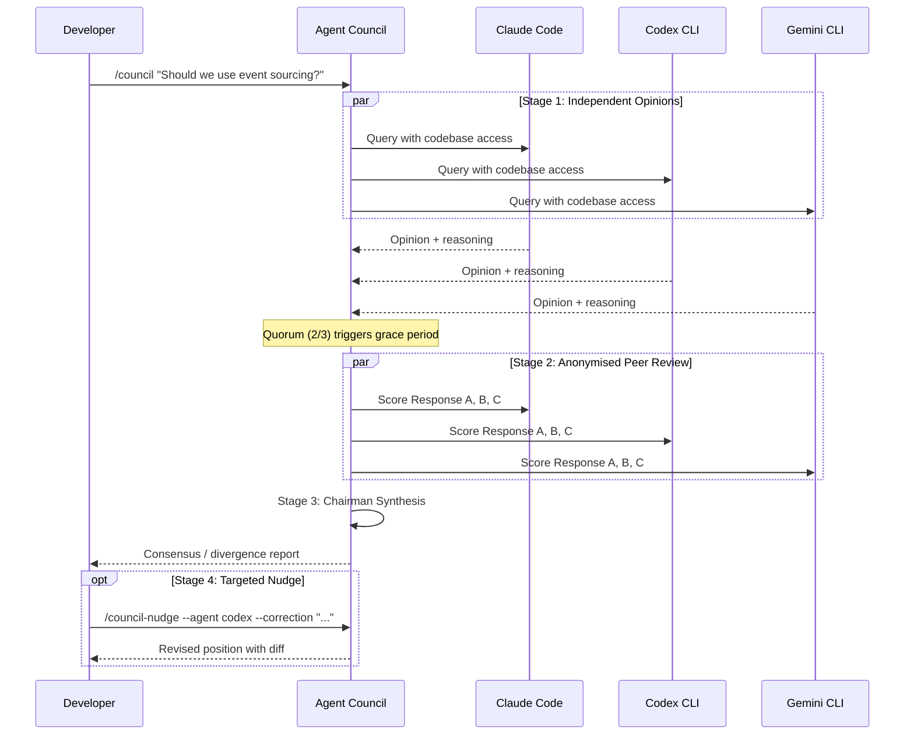
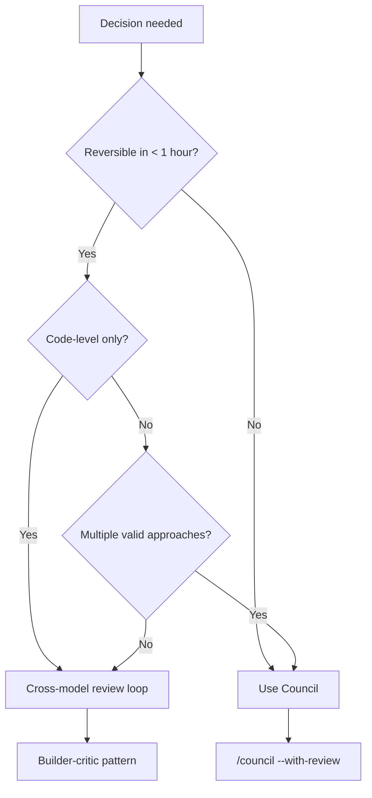

# Agent Council: Cross-Model Deliberation for Architecture Decisions


Cross-model review loops — where one agent writes code and another reviews it — are now a well-established pattern in agentic workflows. But code review is binary: the reviewer either approves or rejects. Architecture decisions are not binary. They involve trade-offs, competing constraints, and context that a single model's perspective cannot fully capture. Agent Council[^1] brings structured multi-perspective deliberation to CLI-based agentic coding, turning the ad hoc practice of querying multiple models into a repeatable, auditable process.

## From Review Loops to Deliberation

The cross-model adversarial review pattern addresses sycophancy bias: a model reviewing its own output will reproduce the same reasoning errors that generated the output[^2]. Having Codex review Claude's commits, or vice versa, catches a meaningful class of bugs that same-model review misses.

But architecture decisions — choosing a database, designing a message schema, selecting an orchestration strategy — require more than a pass/fail verdict. They require weighing trade-offs that different models, with different training data and reasoning biases, will evaluate differently. Agent Council formalises this by implementing Andrej Karpathy's LLM Council concept[^3] for the CLI agent ecosystem, where agents have direct access to your codebase rather than operating on abstract prompts.

## How Agent Council Works

Agent Council is a Claude Code skill (also installable as a standalone tool via npm) that orchestrates a four-stage deliberation process across Claude Code, Codex CLI, and Gemini CLI[^1]. You need at least two of these three installed, plus the Bun runtime.



### Stage 1: Independent Opinions

All available agents receive the question simultaneously and answer in parallel, each with full access to the project's codebase via their native CLI tools — `grep`, `git log`, file reads, dependency inspection[^1]. This is the critical differentiator from Karpathy's original LLM Council, which operates on abstract prompts without codebase grounding[^3]. A council deliberating on your database choice can inspect your current schema, query patterns, and data volumes before forming an opinion.

A quorum of two out of three agents is sufficient to proceed. If one agent times out (defaults: 120 seconds for Claude and Codex, 180 seconds for Gemini), a 30-second grace period runs before the council continues without it[^1].

### Stage 2: Anonymised Peer Review

Each agent's opinion is stripped of attribution and labelled as "Response A", "Response B", "Response C". Every agent then scores each anonymised response on three dimensions: correctness, completeness, and feasibility[^1]. This anonymisation mechanism mirrors the approach in Karpathy's LLM Council, where it prevents models from recognising and favouring their own output[^3] — a known failure mode when models evaluate labelled responses from other providers.

### Stage 3: Chairman Synthesis

The invoking agent (typically Claude Code, since the skill runs inside it) acts as chairman. It receives all opinions, all peer review scores, and synthesises a verdict that explicitly maps out consensus points, areas of divergence, and a confidence assessment for each recommendation[^1].

### Stage 4: Targeted Nudge

After reviewing the synthesis, you can challenge a specific agent's assumptions:

```bash
/council-nudge SESSION_ID --agent codex --correction "Our compliance team requires all PII to remain in eu-west-1"
```

The targeted agent reconsiders its position with the new constraint and produces a before/after diff explaining what changed in its reasoning[^1]. This is not a full re-run — it surgically updates one perspective and lets you see whether the correction shifts the overall consensus.

## Benchmarks: Council vs Single Agent

Agent Council's own benchmarks show councils finding roughly twice the number of relevant considerations compared to a single agent[^1]:

| Scenario | Single Agent | Council | Delta |
|---|---|---|---|
| Database selection | 20% | 60% | +40% |
| Error handling strategy | 0% | 20% | +20% |
| Deployment strategy | 60% | 80% | +20% |
| **Average coverage** | **27%** | **53%** | **+26%** |

These numbers measure the percentage of a predefined checklist of expected considerations that each approach surfaces. The improvement is particularly stark for database selection, where the diversity of model perspectives surfaces trade-offs (write amplification, operational complexity, consistency guarantees) that a single model's training biases may de-prioritise.

⚠️ These benchmarks are self-reported by the project maintainers against a small scenario set. Independent validation on larger, diverse decision corpora would strengthen the claims.

## Session Persistence and Living Decisions

Every deliberation is persisted to `~/.council/{project}/` as structured JSON[^1]:

```
~/.council/my-api/
├── meta.json              # Session metadata
├── stage1/
│   ├── opinion_claude.json
│   ├── opinion_codex.json
│   └── opinion_gemini.json
├── stage2/
│   ├── review_claude.json
│   ├── review_codex.json
│   └── review_gemini.json
├── stage4/
│   └── nudge_codex.json
├── synthesis.json         # Chairman verdict
└── viewer.html            # Self-contained HTML viewer
```

The key commands for working with past sessions:

| Command | Purpose |
|---|---|
| `/council-list` | Browse all past deliberation sessions |
| `/council-replay SESSION_ID` | Replay a session in the terminal |
| `/council-revisit SESSION_ID` | Re-run the same question with current codebase context |
| `/council-outcome SESSION_ID "result"` | Record what you actually decided and what happened |

The `/council-revisit` command is the most architecturally interesting: it re-runs the original question against the current state of the codebase, so you can see whether a decision made three months ago still holds given how the code has evolved[^1]. Combined with `/council-outcome`, this creates an auditable decision log — every architecture choice is a hypothesis with a recorded result.

## When to Use a Council vs a Review Loop

Not every decision warrants a 60–120 second multi-model deliberation. The decision boundary is straightforward:



**Use a cross-model review loop** (the builder-critic pattern) when the decision is a code-level implementation choice with a single correct answer — "is this SQL injection-safe?" or "does this handle the edge case?"

**Use Agent Council** when the decision involves genuine trade-offs between valid approaches — "should we use event sourcing or CRUD?", "PostgreSQL or DynamoDB for this access pattern?", "monorepo or polyrepo for this team structure?" These are the decisions where model diversity produces materially different recommendations, and where the anonymised peer review prevents the anchoring effect of seeing one model's opinion first.

## Integration With the Agentic Pod

In an agentic pod workflow — where multiple agents handle different roles (planner, implementer, reviewer, documenter) — Agent Council slots in as the **decision layer** that sits before implementation begins[^4]. The deliberation output feeds directly into the planner agent's context, giving it not just a recommendation but the full reasoning chain, dissenting opinions, and confidence levels.

This is materially different from having the planner agent simply query three models sequentially. Sequential querying introduces anchoring: the second model's response is influenced by seeing the first model's output. Agent Council's parallel-first, anonymised-review-second architecture structurally prevents this bias[^1][^3].

## Configuration

Configuration lives in `~/.council/config.json`:

```json
{
  "models": {
    "claude": "claude-sonnet-4",
    "codex": "o4-mini",
    "gemini": "gemini-2.5-pro"
  },
  "timeout_ms": {
    "claude": 120000,
    "codex": 120000,
    "gemini": 180000
  },
  "quorum_grace_ms": 30000
}
```

Model versions are configurable per agent, so you can point the council at whichever models your current subscriptions cover[^1]. The zero marginal cost angle is real: if you already have Claude Code, Codex CLI, and Gemini CLI subscriptions, the council uses your existing access with no additional API spend.

## Comparison: Review Loops, Councils, and Full Orchestration

| Capability | Cross-model review | Agent Council | Full orchestration (OMX/Loki) |
|---|---|---|---|
| Decision type | Binary pass/fail | Multi-perspective trade-offs | End-to-end implementation |
| Latency | 10–30s | 60–120s | Minutes to hours |
| Codebase access | Yes | Yes | Yes |
| Anonymised scoring | No | Yes | No |
| Session persistence | No | Yes | Varies |
| Reversibility tracking | No | Yes (`/council-revisit`) | No |
| Agents required | 2 | 2–3 | 1+ (with subagents) |

Agent Council occupies a specific niche: it is not a code generation tool and does not write or modify code[^1]. It deliberates and recommends. The implementation still happens through your existing agentic workflow — Codex CLI in full-auto, Claude Code in auto-edit, or whatever your standard pattern is.

## Getting Started

```bash
# Install as a Claude Code skill
npx cliagent-council

# Or clone and set up manually
git clone https://github.com/yogirk/agent-council.git
cd agent-council
./setup
```

Then, inside a Claude Code session:

```bash
/council "Should we migrate from REST to gRPC for our internal service mesh?"
/council --with-review "What caching strategy for our read-heavy analytics dashboard?"
/council --quick "Monorepo or polyrepo for the new platform team?"
```

The `--quick` flag skips peer review and runs only opinions plus chairman synthesis — useful when you want diverse perspectives but do not need the full scoring matrix[^1].

## Citations

[^1]: yogirk, "agent-council: A skill that convenes a panel of CLI-based AI agents to deliberate on engineering problems," GitHub, 2026. [https://github.com/yogirk/agent-council](https://github.com/yogirk/agent-council)

[^2]: Cross-model adversarial review patterns discussed in "What Is the OpenAI Codex Plugin for Claude Code? How Cross-Provider AI Review Works," MindStudio, 2026. [https://www.mindstudio.ai/blog/openai-codex-plugin-claude-code-cross-provider-review](https://www.mindstudio.ai/blog/openai-codex-plugin-claude-code-cross-provider-review)

[^3]: Andrej Karpathy, "llm-council: LLM Council works together to answer your hardest questions," GitHub, 2025. [https://github.com/karpathy/llm-council](https://github.com/karpathy/llm-council)

[^4]: "Show HN: Multi-agent deliberation plugin for Claude Code," Hacker News discussion, 2026. [https://news.ycombinator.com/item?id=46737053](https://news.ycombinator.com/item?id=46737053)
