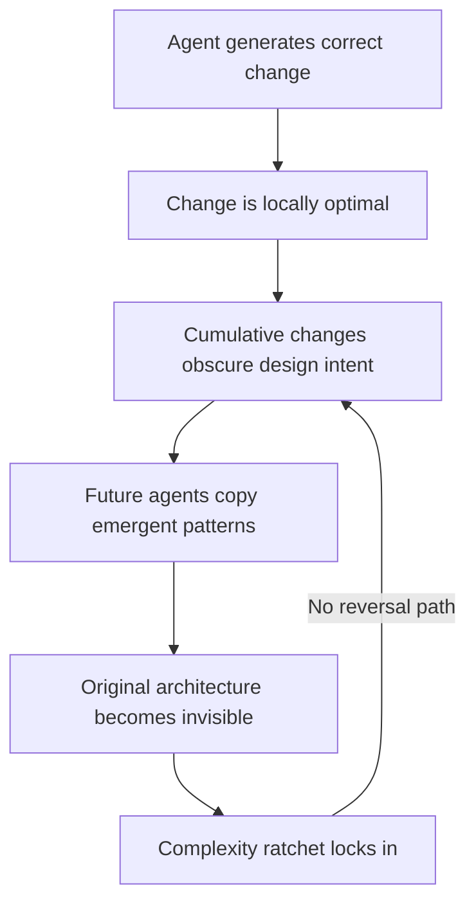
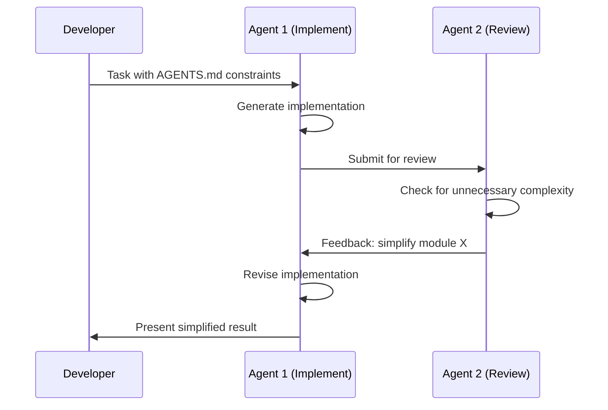

# The AI Complexity Ratchet: Why Agentic Automation Drifts Into the Pit at 200 mph


---

## The Pit Every Developer Knows

You start with tech stack 1. You iterate — each change feels like an improvement. Then one morning you realise version 1 was *way nicer* and you miss its simplicity. Alan Hemmings calls this "the pit": a local optimum of complexity that obscures the original design intent. Before AI, roughly one in four projects drifted there [^1]. With heavy agentic automation, Alan predicts *all* projects will drift there — just at 200 mph instead of slowly.

This is not a new observation. Fred Brooks distinguished between *essential complexity* (the irreducible difficulty of the problem domain) and *accidental complexity* (the mess we create ourselves) [^2]. Coding agents are perhaps the most powerful tool ever created for tackling accidental complexity — but they are also the most powerful tool ever created for *generating* it.

## Why Agents Accelerate the Ratchet

Google's 2025 DORA Report found that while AI adoption (now at 90% of surveyed developers) has a positive relationship with software delivery throughput, it continues to have a *negative* relationship with software delivery stability [^3]. Speed without guardrails produces instability. The report concluded that without robust automated testing, mature version control practices, and fast feedback loops, an increase in change volume leads to instability [^3].

Anthropic's 2026 Agentic Coding Trends Report reinforces this: as task horizons expand from minutes to days or weeks, agents will build full systems autonomously, pausing only for strategic human checkpoints [^4]. That expansion in scope brings coordination complexity that is, as one analysis of Brooks's Law put it, "a mathematical law, not a sociological suggestion" [^5].

The mechanism is straightforward:



Each agent-generated improvement adds code that is correct in isolation but collectively obscures the original design. The agent does not preserve architectural intent — it optimises locally. Future agents then pattern-match against the accumulated complexity rather than the original design, reinforcing the drift [^4].

## The NASCAR Metaphor: When to Lift Off the Throttle

In NASCAR, the fastest drivers know when to lift. Running flat-out into every corner is how you hit the wall. The same applies to agentic coding: `full-auto` mode is the throttle, and approval modes are the brakes.

Codex CLI's approval architecture provides three distinct throttle positions [^6]:

| Mode | Behaviour | Complexity Risk |
|------|-----------|-----------------|
| `suggest` | Every action requires explicit approval | Lowest — human reviews each structural change |
| `auto-edit` | File edits auto-applied; commands need approval | Moderate — edits accumulate without review |
| `full-auto` | Everything executes without confirmation | Highest — maximum ratchet velocity |

The `--full-auto` preset (`-a on-request -s workspace-write`) is the safest autonomous mode: network is blocked by default and the agent stays within the workspace [^6]. But even workspace-scoped autonomy can accumulate structural debt at speed.

The discipline is to use `suggest` mode for any change that affects architecture — module boundaries, API contracts, dependency graphs — and reserve `full-auto` for bounded, well-specified tasks with clear acceptance criteria.

## AGENTS.md as an Architectural Constitution

Codex CLI's AGENTS.md system is the primary defence against architectural drift. It functions as a persistent instruction layer that agents must respect before doing any work [^7].

The three-tier precedence system enforces architectural intent at every level:

1. **Global scope** (`~/.codex/AGENTS.md`) — universal standards across all repositories
2. **Project scope** (repository root) — project-specific architectural constraints
3. **Directory nesting** — service-specific overrides for specialised components

Within each directory, Codex checks `AGENTS.override.md` first, then `AGENTS.md`, then any fallback filenames. The combined instruction payload respects a configurable byte limit (default 32 KiB via `project_doc_max_bytes`) [^7].

A well-written AGENTS.md does not merely list coding standards. It encodes *architectural intent*:

```toml
# Example config.toml referencing AGENTS.md governance
model = "o3"
approval_policy = "on-request"
sandbox_mode = "workspace-write"

[sandbox_workspace_write]
network_access = false
```

```markdown
<!-- AGENTS.md — architectural constitution -->
## Architecture Principles

- This service uses hexagonal architecture. All external dependencies
  are behind ports in `src/ports/`. Never add direct imports from
  infrastructure packages in domain code.
- Maximum module depth is 3 levels. If you need a 4th level, refactor
  the parent module first.
- All new public APIs require an Architecture Decision Record in
  `docs/adr/` before implementation.
```

This is the throttle governor: even in `full-auto` mode, the agent must respect these constraints because AGENTS.md instructions load before any task execution [^7].

## Cross-Model Review Loops: A Second Pair of Eyes

A single agent reviewing its own output is like proofreading your own essay — you see what you intended, not what you wrote. Cross-model review loops address this by having a second model check for unnecessary complexity [^8].

The pattern has matured significantly in early 2026. The standard implementation uses Claude Code for implementation and Codex CLI for review (or vice versa), grounded in benchmark differences that represent a rational division of labour [^8]. One published workflow automates plan review: Claude produces a Markdown planning document, Codex CLI critiques it, Claude ingests the critique, updates the plan, and repeats with a hard cap on iterations [^8].

The goal is not consensus but to catch blind spots and remove complexity before implementation starts [^8].



## The Simplification Sprint

Perhaps the most counter-intuitive pattern for resisting the ratchet is to periodically instruct the agent to *reduce* rather than add. A simplification sprint inverts the normal workflow:

1. **Audit**: Ask the agent to identify code that has grown beyond its original purpose — modules with high cyclomatic complexity, abstractions with single implementations, configuration that duplicates defaults.
2. **Propose removals**: The agent suggests deletions, not additions. Use `suggest` mode here so every removal is human-reviewed.
3. **Verify**: Run the full test suite after each removal. If tests pass, the code was unnecessary.
4. **Document**: Update the relevant ADR to record why the simplification was made.

This is the "lifting off the throttle" moment. Anthropic's trends report found that agent-authored code shows only a 9.1% increase in cyclomatic complexity compared to human-written code [^4] — but that is *per change*. Over hundreds of agent-generated commits, small increments compound into significant drift.

## Early Warning Signs: A Practical Checklist

How do you detect the ratchet before it locks in? Watch for these signals:

- **Rising PR size with stable feature scope** — if PRs grow but features do not, the agent is adding scaffolding you did not request. ⚠️ The 2025 DORA Report noted a 154% increase in PR size correlated with high AI adoption [^3].
- **Duplicated patterns** — the agent introduces a new utility function when an equivalent already exists three directories away.
- **Configuration proliferation** — every new feature adds its own configuration layer rather than extending existing ones.
- **Abstraction without variation** — interfaces with a single implementation, factory methods that construct one type, strategy patterns with one strategy.
- **Decreasing test-to-code ratio** — the agent writes implementation faster than tests, and the gap widens over time.
- **AGENTS.md violations** — if the agent starts working around constraints rather than within them, your architectural constitution needs enforcement, not relaxation.

## When Full Autonomy Makes Sense

This article is not an argument against automation. It is an argument for *appropriate* automation. Full autonomy makes sense when:

- The task has **clear acceptance criteria** and a **bounded scope** (test generation, formatting, dependency updates)
- The codebase has **comprehensive test coverage** that catches regressions automatically
- **AGENTS.md constraints** are well-defined and enforced
- **Cross-model review** is in place for structural changes
- The team runs **regular simplification sprints** to reverse accumulated drift

The ratchet is not inevitable. It is the default outcome when speed is optimised without guardrails. Codex CLI provides the guardrails — approval modes, AGENTS.md, sandbox policies — but they only work if you use them deliberately rather than reaching for `full-auto` out of habit.

---

## Citations

[^1]: Alan Hemmings, discussion on agentic coding complexity drift and the "pit" metaphor, referenced in community discussions on AI-assisted development patterns, 2025–2026.

[^2]: Frederick P. Brooks Jr., *The Mythical Man-Month: Essays on Software Engineering*, Addison-Wesley, 1975. Essential vs. accidental complexity distinction. See also Peter Forret, ["The Mythical Agent-Month: Brooks's Law in the Age of Agentic Software Development"](https://blog.forret.com/2025/2025-10-26/mythical-agent-month/), October 2025; and Codemanship, ["The Mythical Agent-Month"](https://codemanship.wordpress.com/2026/04/06/the-mythical-agent-month/), April 2026.

[^3]: Google, [*2025 DORA State of AI-Assisted Software Development Report*](https://dora.dev/research/2025/dora-report/), 2025. Key findings: 90% AI adoption, positive relationship with throughput but negative relationship with stability.

[^4]: Anthropic, [*2026 Agentic Coding Trends Report*](https://resources.anthropic.com/2026-agentic-coding-trends-report), March 2026. Task horizons expanding from minutes to days; agent-authored code complexity metrics; multi-agent coordination challenges.

[^5]: Murat Demirbas, ["Agentic AI and The Mythical Agent-Month"](http://muratbuffalo.blogspot.com/2026/01/agentic-ai-and-mythical-agent-month.html), January 2026. "Coordination complexity is a mathematical law, not a sociological suggestion."

[^6]: OpenAI, ["Agent Approvals & Security – Codex CLI"](https://developers.openai.com/codex/agent-approvals-security), 2026. Approval policies: `on-request`, `untrusted`, `never`; sandbox modes: `read-only`, `workspace-write`, `danger-full-access`.

[^7]: OpenAI, ["Custom Instructions with AGENTS.md – Codex CLI"](https://developers.openai.com/codex/guides/agents-md), 2026. Three-tier precedence system, 32 KiB default limit, file discovery hierarchy.

[^8]: SmartScope, ["Automating the Claude Code × Codex Review Loop"](https://smartscope.blog/en/blog/claude-code-codex-review-loop-automation-2026/), 2026. Three levels of cross-model review automation: SKILL.md, plugin, and pipeline.
